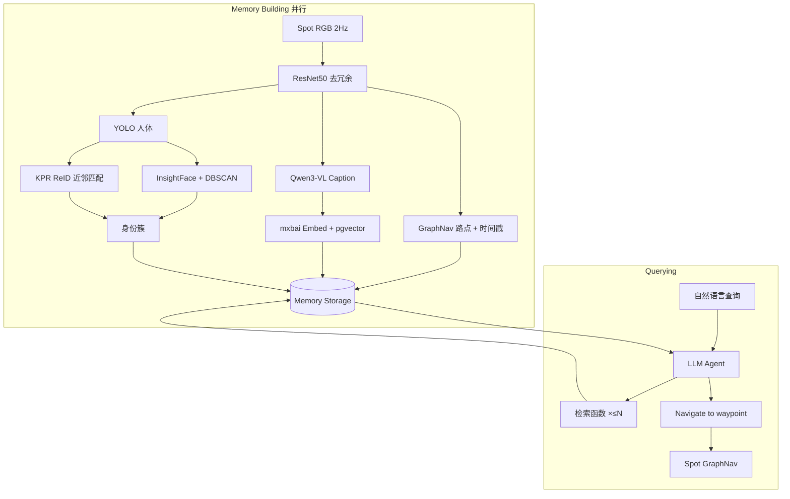
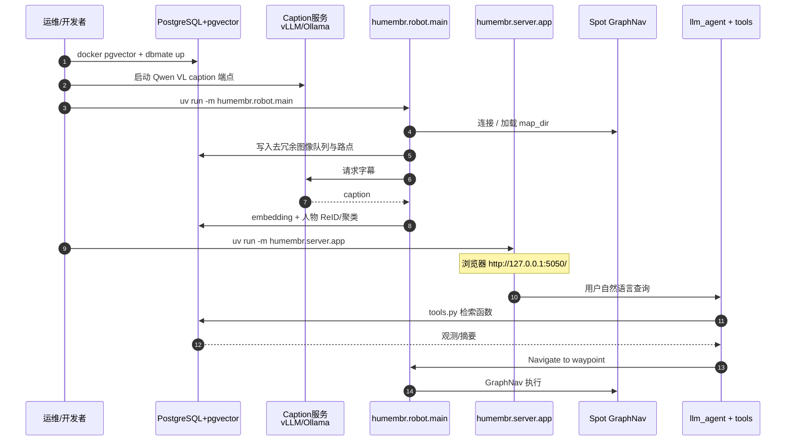

# HUMEMBR（人中心记忆驱动的预测式具身导航）

**HUMEMBR**（*Human-Centered Memory for Embodied Robots* / *Learning Human Routines for Predictive Embodied Navigation*，[arXiv:2606.30404](https://arxiv.org/abs/2606.30404)，IROS 2026，[项目页](https://samirahuber.github.io/humembr/)，[代码](https://github.com/samirahuber/humembr)）来自 **基尔大学（Kiel University）** 与 **乔治梅森大学（George Mason University）**：在办公室等真人日常环境中，为机器人维护 **身份感知、跨多日的人例行记忆**，并与 LLM **函数调用检索** 并行运行，以回答人中心问题并执行「去找某人」类导航。相对把全部字幕塞进上下文的基线，结构化检索在 PersonEQA 上提高准确率并大幅降低 token；真机部署于 Boston Dynamics Spot + GraphNav。

## 一句话定义

**把「谁通常在哪、何时出现」建成可检索的长期记忆，再让 LLM 用工具查库并驱动 Spot 去找人——而不是把多日日志整段塞进上下文。**

## 英文缩写速查

| 缩写 | 英文全称 | 简要说明 |
|------|----------|----------|
| HUMEMBR | Human-Centered Memory for Embodied Robots | 本文人中心长时程记忆 + 导航框架 |
| PersonEQA | Person Embodied Question Answering | 本文提出的人中心具身问答基准（六类题） |
| COBD | Collaborative Office Behavior Dataset | 20 天办公室 Spot 采集数据集 |
| EQA | Embodied Question Answering | 具身问答任务族 |
| ReID | Person Re-Identification | 跨视角/跨日人物再识别 |
| KPR | Keypoint Promptable Re-Identification | 本文全身 ReID 骨干之一 |
| GraphNav | Boston Dynamics GraphNav | Spot 拓扑图导航底层栈 |

## 为什么重要

- **补上「例行」这一维：** 度量地图与场景图擅长空间；多数 EQA / 长时记忆（ReMEmbR、Mind Palace 等）偏物体或回顾式状态，不显式建 **跨日身份 + 日常模式**。
- **预测式导航：** 「Search Nemo」需要从历史例行估计当前最可能路点，而非穷举搜图。
- **工程可部署：** 记忆构建与查询 **并发**；开源栈对齐 Spot SDK、PostgreSQL/pgvector、caption 服务与 Web agent。
- **Token 效率是真指标：** Gemini 版约用全上下文 **17%** token 且总分更高；开源 Qwen 版约用 **2%** token 接近基线总分——长部署时上下文稀释与费用同时被打中。
- **隐私风险显式：** 持续人物例行建模必须按同意与假名化部署，不可当监控产品。

## 核心信息

| 字段 | 内容 |
|------|------|
| 机构 | 基尔大学（Kiel University）；乔治梅森大学（George Mason University） |
| 发表 | IROS 2026（项目页 / BibTeX） |
| arXiv | [2606.30404](https://arxiv.org/abs/2606.30404) |
| 项目页 | <https://samirahuber.github.io/humembr/> |
| 代码 | <https://github.com/samirahuber/humembr> — **已开源**（截至 2026-08-06） |
| 数据 | COBD：**README 标明 private**，公开复现受限 |
| 平台 | Boston Dynamics Spot；GraphNav 路点导航 |
| 推理骨干 | Gemini 3 Flash；Qwen3-VL / Qwen3 Thinking 系列开源对照 |
| 主要基线 | 全字幕上下文（无结构化检索）；消融 –ReID、3-function、caption prompt、function-call limit |

## 核心原理

### 输入 / 输出

| 侧 | 内容 |
|------|------|
| 感知 | Spot 前向拼接 RGB（采集 2 Hz，ResNet50 余弦相似度去冗余） |
| 空间 | GraphNav 路点 ID / 坐标 + 时间戳 |
| 语义 | Qwen3-VL 字幕 → mxbai-embed-large 向量 |
| 身份 | InsightFace 脸嵌入（DBSCAN 锚）+ KPR 全身 ReID（无脸近邻挂靠） |
| 查询 | 自然语言问题或导航指令 |
| 输出 | 答案文本，和/或 `Navigate to waypoint` 执行 |

### 流程总览

### 关键机制（压缩）

1. **紧凑记忆条目：** 仅保留视觉变化足够的帧；每条含图、路点、时间、字幕与 embedding。
2. **两阶段身份：** 有脸 → online DBSCAN；无脸 → ReID 阈值匹配既有簇，平衡误合并与覆盖。
3. **分层检索工具：** 语义 top-n（含时间衰减分）、路点窗口、人物时间线、当日人物集、人物日摘要（LLM 聚合）；可选身份 / 时间过滤。
4. **闭环执行：** agent 迭代取证后调用导航；可选到达后核验目标人物是否在场。

## 源码运行时序图

官方仓 [samirahuber/humembr](https://github.com/samirahuber/humembr) 已提供可运行入口（`uv` + PostgreSQL/pgvector + GraphNav + caption 服务）。对齐 README Quick-start：

复现路径要点：配置 `src/humembr/.env` 与 `config.toml`（`map_dir` / `caption_url` / 机器人 IP）；下载 KPR 权重到 `processing/pretrained`；仅采集可设 `enable_ctrl = false`。PersonEQA 离线评测走 `src/humembr/eval/question/` 与 `interview_agent.py`。**COBD 完整 archive 暂不公开**，公开侧可自采或 restore 自有备份后再 `insert_missing_reid`。

## 工程实践

| 项 | 建议 / 论文与仓库设定 |
|----|----------------------|
| 启动三进程 | `robot.main` + `server.app` + `processing.qwen(_openai)` |
| 记忆库 | pgvector；迁移见 `src/humembr/db/migrations/` |
| 字幕骨干 | 论文主用 Qwen3-VL 235B；部署可用 vLLM FP8 或更小 Ollama 模型 |
| Agent LLM | 真机论文用 Gemini 3 Flash；开源对照 Qwen3-VL-235B |
| 函数调用上限 | 经验约 **10** 次/问最优（Table II） |
| 字幕 prompt | **Interaction-centered** 优于纯手部焦点 / 纯运动感知（Table III） |
| 低层导航 | 交给 GraphNav；HUMEMBR 只选路点与高层推理 |
| 数据边界 | 官方 COBD **private**；见 [仓库归档](../../sources/repos/humembr.md) |
| 隐私 | 同意采集、假名 ID、限制原始日志；勿用于非自愿跟踪 |

## 实验与评测

| 设置 | 结果要点（Table I / IV） |
|------|-------------------------|
| PersonEQA（Gemini + HUMEMBR） | 总准确率 **75.41%**；Spatial **92.31%**；Semantic **81.48%**；~**106k** token/题 |
| 全上下文基线（Gemini） | 总 **67.33%**；Spatial 仅 **34.62%**；~**632k** token/题 |
| Qwen3-VL-235B + HUMEMBR | 总 **66.01%**；~**11.6k** token/题（约基线 **2%**） |
| –ReID | 总降至 **60.49%**；Person / Spatial 明显受损 |
| 仅 3 个核心函数 | 总 **63.04%**；缺日摘要等高层聚合 |
| 真机六任务 | 取件/访客引导等 SR 高；遮挡搜人 SR **50%**；缺席人物可能幻觉 |

## 结论

**HUMEMBR 的关键不是更大的上下文窗口，而是把跨日人物例行建成可工具检索的结构化记忆，再闭环驱动 GraphNav。**

1. **先看 Spatial + Token** — 全上下文在空间题上崩、token 爆炸；结构化检索同时修这两项。
2. **身份链路不可省** — ReID 消融直接伤 Person 与 Spatial；脸锚 + 全身 ReID 是覆盖与精度的折中。
3. **函数深度有甜点** — 调用上限并非越大越好；约 10 次足够，过多会掺噪声。
4. **字幕要写「人–环境交互」** — Interaction-centered caption 优于只盯手或只盯运动。
5. **部署分层清晰** — LLM 选路点；Spot GraphNav 负责几何执行；caption/ReID/DB 是独立服务。
6. **数据与隐私是产品门禁** — COBD 暂私有；例行记忆必须同意与假名化，输出仅作概率估计。
7. **选型边界** — 相对 [Uni-LaViRA](./paper-uni-lavira.md) / [Qwen-RobotNav](./qwen-robot-nav.md) 的仿真 EQA/VLN，本文专攻 **真人多日例行 + 办公室 Spot**；相对 [iCrowdNav](./paper-icrowdnav.md) 的拥挤避让，本文是 **找人/问人** 而非社交绕行。

## 局限与风险

- **数据集未公开：** 无法独立复现 PersonEQA 全表数字；只能跑自有地图/自采日志。
- **感知瓶颈：** 遮挡、背影、逆光导致脸/ReID 失败，真机 First-Visit 与搜人成功率下降。
- **幻觉缺席目标：** 目标人不在场时，模型可能编造历史观测。
- **记忆内容偏 caption：** 缺房间标签等显式空间语义；作者建议未来接 VLM 直读图像。
- **隐私与伦理：** 持续人物建模有监控滥用风险；论文要求同意与最小保留。
- **误区：** 把 HUMEMBR 当成 Nav2/GraphNav 替代品，或当成 R2R 式 VLN——任务是 **人中心 EQA + 例行条件找人**，语言指令接地到拓扑路点，不是 Matterport 离散 VLN 榜。

## 与其他工作对比

| 路线 | 记忆对象 | 时间跨度 | 导航目标 | 开源 |
|------|----------|----------|----------|------|
| 度量地图 / 场景图 | 几何·物体语义 | 偏静态 | 坐标/语义物体 | 成熟栈 |
| ReMEmbR / Mind Palace（论文对照） | 时空/动态物体回顾 | 长时但非例行身份 | 回顾式检索 | 见原工作 |
| [Uni-LaViRA](./paper-uni-lavira.md) | TDM 子目标清单 | 单次任务 | VLN/ObjectNav/EQA/Aerial | 已开源 |
| [Qwen-RobotNav](./qwen-robot-nav.md) | agent notebook（套件侧） | 长时程 EQA demo | 多 mode 导航原语 | 已开源 |
| [iCrowdNav](./paper-icrowdnav.md) | 无长期人物库 | 即时社交 | 坐标目标避障 | 代码待发布 |
| [SRU](./paper-sru-spatially-enhanced-recurrent-memory.md) | RNN 隐式空间 | 单次长程 | 坐标目标 | 已开源 |
| **HUMEMBR（本文）** | **身份感知人例行** | **多日** | **找人 / 人中心问答** | **代码已开源；COBD 私有** |

## 关联页面

- [视觉–语言导航](../tasks/vision-language-navigation.md) — VLN / EQA 任务族边界
- [Uni-LaViRA](./paper-uni-lavira.md) — 统一具身导航 + EQA 的 training-free agent 对照
- [Qwen-RobotNav](./qwen-robot-nav.md) — 通才导航原语与长时程 EQA 对照
- [Qwen-Robot Suite](./qwen-robot-suite.md) — 套件级 EQA / 寻物叙事
- [导航·SLAM·自动驾驶开源栈总览](../overview/navigation-slam-autonomy-stack.md) — GraphNav/Spot 与经典栈分层对照
- [iCrowdNav](./paper-icrowdnav.md) — 人群避让导航（任务不同：绕行 vs 找人）
- [SRU](./paper-sru-spatially-enhanced-recurrent-memory.md) — 无地图长程坐标导航对照
- [导航纵深路线](../../roadmap/depth-navigation.md) — Stage 3/4 学习型与语义导航入口

## 参考来源

- [HUMEMBR 论文摘录（arXiv:2606.30404）](../../sources/papers/humembr_arxiv_2606_30404.md)
- [HUMEMBR 仓库归档](../../sources/repos/humembr.md)
- [HUMEMBR 项目页归档](../../sources/sites/samirahuber-humembr-github-io.md)

## 推荐继续阅读

- [项目页与演示视频](https://samirahuber.github.io/humembr/)
- [GitHub 仓库与 Quick-start](https://github.com/samirahuber/humembr)
- [arXiv PDF](https://arxiv.org/pdf/2606.30404)
