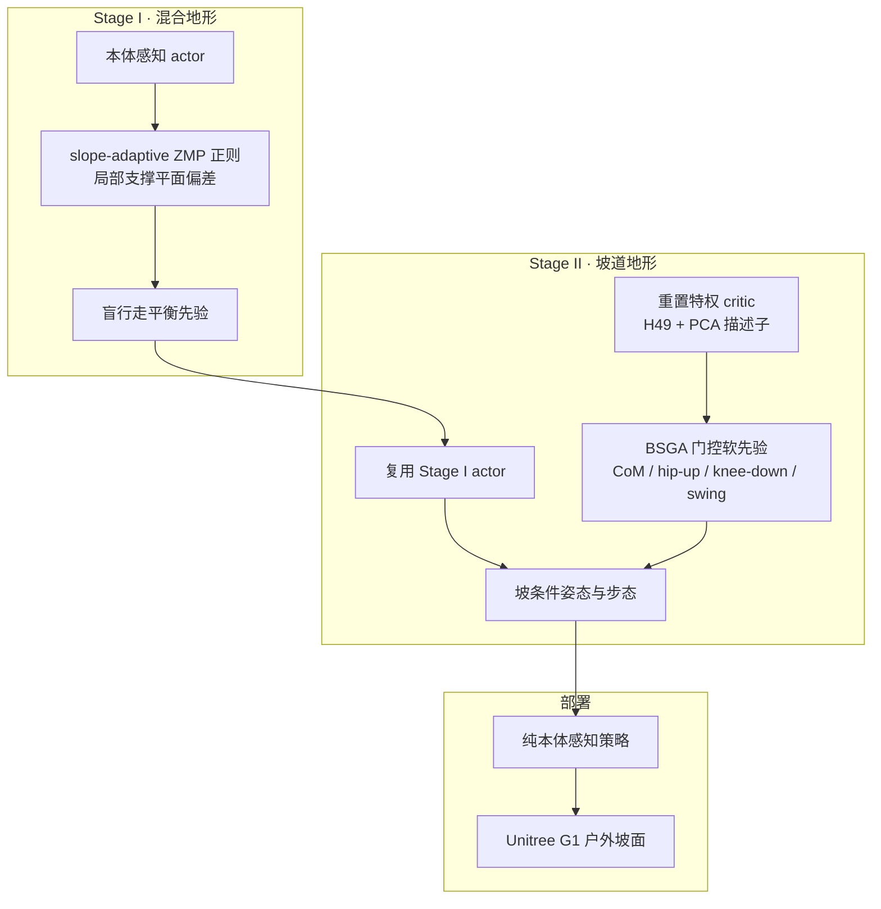

# HumoSlope：极端坡面物理引导生物力学步态适应

**HumoSlope**（*Physics-Guided Biomechanical Gait Adaptation for Humanoid Locomotion on Extreme Sloped Terrains*，南洋理工大学 / 新加坡科技研究局 A*STAR，arXiv:[2607.07830](https://arxiv.org/abs/2607.07830)，2026-07-08）提出面向**连续陡坡**的两阶段物理引导强化学习框架：Stage I 用**局部倾斜支撑平面上的 slope-adaptive ZMP 正则**建立盲行走平衡先验；Stage II 用训练期 **PCA 宏观地形描述子**门控 **BSGA**（Biomechanical Slope Gait Adapter）软先验，抑制低 CoM「Groucho」蹲姿退化并塑造上下坡非对称下肢协调。部署 actor **纯本体感知**，Unitree G1 真机户外草地坡连续穿越至 **62.7%（32.1°）**。

## 一句话定义

**陡坡上别只会蹲着保命——先在坡面坐标系里把 ZMP 拉稳，再用训练期地形描述子把门打开：上坡髋推、下坡膝刹、平地站直。**

## 英文缩写速查

| 缩写 | 英文全称 | 简要说明 |
|------|----------|----------|
| HumoSlope | — | 本文两阶段物理引导人形坡面 locomotion 框架 |
| BSGA | Biomechanical Slope Gait Adapter | Stage II 用 PCA 描述子门控 CoM/步态/摆腿软先验的适配模块 |
| ZMP | Zero Moment Point | 经典足式平衡点；本文在局部支撑平面上评估偏差 |
| CoM | Center of Mass | 质心；通用奖励易诱导持续低 CoM 蹲姿 |
| PCA | Principal Component Analysis | 对高度扫描点提取坡角/横倾等宏观描述子 |
| PPO | Proximal Policy Optimization | 非对称 actor–critic 训练算法 |
| SR | Success Rate | held-out 复合坡道完成率（达 90% 轨长） |
| Sim2Real | Simulation to Real | Isaac Lab 训练后 G1 户外零外感知部署 |

## 核心信息

| 字段 | 内容 |
|------|------|
| 机构 | 南洋理工大学（Nanyang Technological University）、新加坡科技研究局（A*STAR） |
| 作者 | Xuanyu Chen⋆、Mohan Liu⋆、Dengchen Mei、Zhihao Gu、Haitian Zhang、Kaimin Mao、Haiyue Zhu、Shijun Yan、Lin Wang†（⋆共同一作，†通讯） |
| 平台 | Unitree G1（Isaac Lab 仿真 + 户外真机） |
| 训练 | PPO；非对称 actor–critic；RTX 5090 上千并行环境；域随机化 |
| 部署观测 | 基座角速度、投影重力、速度命令、关节状态、动作历史（**无相机/LiDAR**） |
| 仿真极限 | held-out 复合坡道 \(30^\circ\) SR **77.1%**；最大坡度 sweep **36°** |
| 真机极限 | 户外草地坡连续穿越至 **32.1°**（局部测量至 36.4°） |
| 开源状态 | **确认未开源**（截至 2026-07-31：无项目页/GitHub，论文无将开源声明） |

## 为什么重要

- **把「陡坡」从多地形评测里的一项抽成独立物理难题：** 持续重力偏置要求**同时**稳住动态平衡与姿态，而非短时选脚点即可。
- **点名通用奖励的失败模式：** 低 CoM 蹲姿看似稳，实则在平地/缓坡姿态退化、关节过载、并封顶更大坡度——工程上要盯 **姿态诊断** 而不只看存活率。
- **经典 ZMP 进 RL 的关键修正：** 世界水平面参考在陡坡上与真实支撑几何错位；改到**局部支撑平面**是可复用的 reward shaping 原则（见 [LIP / ZMP](../concepts/lip-zmp.md)）。
- **生物力学先验不靠人体轨迹模仿：** 用上下坡关节做功非对称（髋推 / 膝刹）写成**软奖励门控**，部署仍保持盲策略，契合 [Privileged Training](../concepts/privileged-training.md)。
- **相对感知路线的对照：** 在 \(30^\circ\) 复合坡道上，纯本体感知的 HumoSlope 仍显著优于带深度的 Gallant 与 Unitree RL Lab 等本体基线——说明坡专用物理+步态先验可以替代部分在线外感知。

## 方法

| 模块 | 机制 |
|------|------|
| **问题形式** | POMDP；actor 仅 \(\mathcal{O}^{\pi}\) 本体观测；critic 含特权状态、压缩高度扫描 \(\mathcal{H}_{49}\)、\(\boldsymbol{\phi}^{\mathrm{PCA}}_{5}\) |
| **动作** | 关节位置残差目标 → 底层 PD |
| **Stage I ZMP** | 支撑锚点 \(\mathbf{p}_{\mathrm{sa}}\) 按左右接触力加权；平面法向取主支撑脚；\(\mathbf{F}_{\mathrm{app}}=\mathbf{g}-\mathbf{a}_{\mathrm{com}}\) 射线与平面求交得 \(\mathbf{p}_{\mathrm{zmp}}^{\mathrm{ta}}\)；\(r=\exp(-\|\mathbf{p}_{\mathrm{zmp}}^{\mathrm{ta}}-\mathbf{p}_{\mathrm{sa}}\|/\sigma)\) |
| **PCA 描述子** | \(\boldsymbol{\phi}^{\mathrm{PCA}}_{5}=(\theta_{\mathrm{slope}},\theta_{\mathrm{bank}},|\theta_{\mathrm{slope}}|,\mathbbm{1}_{\mathrm{up}},\mathbbm{1}_{\mathrm{down}})\)，排除绝对高度，聚焦朝向 |
| **BSGA 核心奖励** | \(r_{\mathrm{BSGA}}^{\mathrm{core}}=w_{\mathrm{com}}r_{\mathrm{com}}+w_{\mathrm{bio}}r_{\mathrm{bio}}+w_{\mathrm{swing}}r_{\mathrm{swing}}\) |
| **CoM 目标** | \(h_{\mathrm{tgt}}=h_{\mathrm{nom}}\cos(|\theta_{\mathrm{slope}}|)+\rho_{\mathrm{slope}}(b_{\mathrm{up}}\mathbbm{1}_{\mathrm{up}}+b_{\mathrm{down}}\mathbbm{1}_{\mathrm{down}})\) |
| **生物力学分支** | 上坡 \(r_{\mathrm{hip}}\)；下坡 \(r_{\mathrm{down}}=\lambda_{\mathrm{brake}}r_{\mathrm{brake}}+\lambda_{\mathrm{stride}}r_{\mathrm{stride}}\) |
| **摆腿分支** | Stage I rollout 拟合 \(q_{\mathrm{hip,swing}}^{\star}(\theta_{\mathrm{slope}})\)，摆动相软跟踪 |
| **两阶段衔接** | Stage I actor warm-start；Stage II **重置 critic** 以适配新特权观测与奖励；训练地形切到 slope-track |

### 流程总览

### 源码运行时序图

**不适用**（截至 2026-07-31：官方无可运行代码 / 项目页；无法对齐仓库入口绘制运行时序）。

## 工程实践

| 项 | 读法 |
|----|------|
| 平台栈 | Isaac Lab + Unitree G1；基线含 [unitree_rl_lab](./unitree-rl-lab.md)、FastTD3、Gallant（深度） |
| 评测协议 | 35 m held-out 复合坡道（平/上/下/台地 + 光滑/波浪/横倾/粗糙/条纹）；摩擦 \(\mu=\tan(|\theta|)+\Delta\)，\(\Delta\in\{0.3,0.6,0.9\}\) |
| 成功判据 | 到达 31.5 m（90% 轨长）；超时 140 s；命令约 0.5 m/s |
| 诊断指标 | 除 SR / MXD / \(T_{\mathrm{trav}}\) 外，看 CoT、\(\sigma_{\mathrm{yaw}}^{2}\)、\(\bar{h}_{\mathrm{com}}\)、峰值膝力矩——**SR 高但 CoM 低 = 仍在蹲** |
| 复现边界 | **代码未开源**；可先在自有 Isaac Lab 管线复现「局部平面 ZMP + 坡条件 CoM 目标」两项 shaping |

## 实验与评测

| 轴 | 报告口径（以论文为准） |
|----|------------------------|
| **主表（0°–30°）** | Ours 在 \(0^\circ\)–\(20^\circ\) SR≈100% 且 \(T_{\mathrm{trav}}\) 最短；\(30^\circ\) SR **77.1%** / MXD 27.54 m；URL/FastTD3/Gallant 在 \(30^\circ\) 均为 0% SR |
| **最大坡度** | Ours **73%（36°）** vs FastTD3 70%、Gallant 60%、URL 47% |
| **姿态** | 上坡前倾、平地近直立、下坡微后仰；URL 呈持续 Groucho 蹲姿 |
| **消融（20°）** | w/o ZMP → SR 55.6%；w/o BSGA 奖励 → 26.9%；w/o BSGA → 0%；Stage I only → SR 100% 但 \(\bar{h}_{\mathrm{com}}=0.535\)（Full 0.669）且更慢 |
| **真机** | 六类户外地形；草地最陡均值 32.1°；雨后湿滑沥青/波浪坡可走；同策略跨段姿态变化与仿真一致 |

## 结论

**HumoSlope 的真影响指标是「陡坡完成率 + 非蹲姿」：局部平面 ZMP 给可 warm-start 的平衡，BSGA 把门控生物力学软先验写进训练期，才把存活率翻译成可部署的直立坡面步态。**

1. **先修几何再修姿态：** 去掉 slope-adaptive ZMP 后 \(20^\circ\) SR 掉到 55.6%——水平面 ZMP 奖励在陡坡上是系统性偏差，不是小超参。
2. **Stage I 高 SR ≠ 好策略：** Stage I only 满分但 CoM 更低、更慢；必须以 \(\bar{h}_{\mathrm{com}}\)、穿越时间与膝载荷和任务成功率** jointly** 读。
3. **BSGA 是耦合先验：** 去掉整块 BSGA 直接 0% SR；单独去掉奖励先验或 critic 线索也会伤鲁棒性/速度——不要拆成互不相关的三项 bonus。
4. **部署读法：** 真机卖点是**盲连续穿越 32.1° 草地坡**；代价是无法预见坡变，突变/软地面仍危险。
5. **选型对照：** 若已有深度感知栈，仍应用本文作「无感知上限」对照；若坚持本体部署，优先抄局部平面平衡 + 坡条件 CoM/上下肢非对称，而非加厚存活奖励。
6. **开源现实：** 截至入库日无代码——工程落地需自建 Isaac Lab 奖励与两阶段 curriculum，无法直接拉权重复现。

## 局限与风险

- **盲策略时滞：** 坡变只能靠本体反馈事后调整，不适合需要 look-ahead 的突变障碍或高度不规则地形。
- **ZMP 代理近似：** 用点质量表观力与力加权锚点，避开质心角动量与接触斑边界——陡坡大角动量时偏差可能变大。
- **误区：「加 ZMP 奖励就够」。** 消融显示仅 Stage I 会锁进蹲姿；必须有 Stage II 姿态/步态门控。
- **误区：「高 SR 就是好步态」。** 要同时看 CoM 高度与穿越时间。
- **开源：** **确认未开源**；无官方训练/部署入口可复现数字。

## 与其他工作对比

| 维度 | HumoSlope | Unitree RL Lab | Gallant | 经典 LIP/ZMP 规划 |
|------|-----------|----------------|---------|-------------------|
| 坡几何 | **局部支撑平面 ZMP** | 通用 RL 奖励 | 体素/深度感知 | 多为水平面假设 |
| 姿势 | **BSGA 生物力学门控** | 易低 CoM | 感知辅助全身协调 | 显式轨迹/约束 |
| 部署传感 | **纯本体** | 纯本体 | **深度** | 依赖状态估计 |
| 验证 | G1 仿真 36° + 真机 32.1° | 基线对照 | 3D 约束地形 | 经典平坦/缓坡管线 |

## 关联页面

- [Humanoid Locomotion](../tasks/humanoid-locomotion.md) — 人形移动任务总览
- [Terrain Adaptation](../concepts/terrain-adaptation.md) — 地形适应全链路
- [LIP / ZMP](../concepts/lip-zmp.md) — 本文 ZMP 正则的经典理论对照
- [Privileged Training](../concepts/privileged-training.md) — 训练特权 / 部署本体的不对称设定
- [人形运控常见奖励函数分类](../concepts/humanoid-policy-reward-functions.md) — 奖励 shaping 归类
- [unitree_rl_lab](./unitree-rl-lab.md) — 论文主本体感知基线
- [Unitree G1](./unitree-g1.md) — 实验平台
- [Isaac Lab](./isaac-lab.md) — 训练仿真栈
- [PPO](../methods/ppo.md) — 策略优化算法
- [Sim2Real](../concepts/sim2real.md) — 迁移背景

## 参考来源

- [HumoSlope 论文摘录（arXiv:2607.07830）](../../sources/papers/humoslope_arxiv_2607_07830.md)

## 推荐继续阅读

- 论文 PDF：<https://arxiv.org/pdf/2607.07830>
- 论文 HTML：<https://arxiv.org/html/2607.07830v1>
- [LIP / ZMP](../concepts/lip-zmp.md) — 理解「水平面 vs 局部支撑平面」奖励偏差的理论入口
- [unitree_rl_lab](./unitree-rl-lab.md) — 论文对照的官方 Isaac Lab RL 基线
