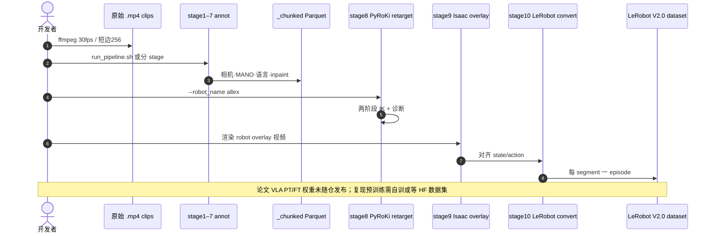

# HuRo：机器人化人类视频能否提供可扩展的 VLA 预训练监督？

**HuRo**（*HuRo: Robotizing Human Videos for Scalable VLA Pretraining*，[arXiv:2609.10706](https://arxiv.org/abs/2609.10706)，CoRL 2026）由 **瑞沃世界（RLWRLD）** 与 **延世大学（Yonsei University）** 提出：用 **机器人化（robotization）流水线** 把异构 egocentric 人类视频转成 **机器人对齐观测 + 重定向动作 + 语言**，构建 **HuRo 数据集**（约 **630K episode、142M 帧**），并在 **ALLEX** 双臂灵巧人形上验证 **VLA 预训练数据规模 ↔ 真机完成率** 的 scaling——其中 **OOD**（空间与视觉 shift）完成率从 **34.9% 提升至 72.2%**。

## 一句话定义

**把日常 egocentric 人视频经标注、动作重定向与视觉叠加，变成 VLA 可端到端预训练的 robot-aligned 观测–动作对，且 OOD 增益随数据规模单调上升。**

## 英文缩写速查

| 缩写 | 英文全称 | 简要说明 |
|------|----------|----------|
| HuRo | Human-video Robotization | 本文数据集与流水线总称 |
| VLA | Vision-Language-Action | 视觉–语言–动作策略 |
| OOD | Out-of-Distribution | 评测中空间/视觉/物体等分布偏移条件 |
| ID | In-Distribution | 与下游微调演示相近的评测条件 |
| IK | Inverse Kinematics | 把手部/末端目标转为关节角（PyRoKi） |
| MANO | hand Model with Articulated and Non-rigid defOrmations | Stage 4 手姿参数化 |
| PT | Pretraining | VLA 在 robotized 数据上的预训练阶段 |

## 为什么重要

- **数据侧回答开放问题：** 先前联合 observation–action robotization 多在 **task-matched** 示范上验证；HuRo 系统检验 **五源异构日常人视频** 能否作为 **可扩展、联合对齐** 的预训练监督。
- **OOD 是主战场：** 扩大 HuRo 预训练对 **Overall（51.5→80.3%）** 与 **ID（68.1→88.4%）** 都有益，但 **OOD（34.9→72.2%）** 增益最大——说明机器人化主要在 **跨场景泛化** 上兑现价值。
- **工程可复现边界清晰：** [GitHub 流水线](https://github.com/3587jjh/HuRo) **已开源**（Apache-2.0，10 stage → LeRobot V2.0）；**预构建 HuRo 语料与 VLA 权重仍待发布**（HF badge：coming soon）。

## 核心信息

| 项 | 内容 |
|----|------|
| **机构** | 瑞沃世界（RLWRLD）；延世大学（Yonsei University） |
| **会议 / arXiv** | CoRL 2026；[2609.10706](https://arxiv.org/abs/2609.10706) |
| **目标机器人** | **ALLEX**（双臂灵巧人形；流水线默认 `configs/allex.yaml`） |
| **HuRo 规模** | **630K** robotized episodes；**142M** frames（≈1,317 h @ 30 fps） |
| **人视频来源** | EgoDex 55%、EgoVerse 27%、Ego4D 10%、Ego10K 6%、EPIC-Kitchens 2% |
| **开源** | **部分开源**：流水线代码 ✓；数据集 / VLA checkpoint ✗（截至 2026-09-22） |

## 核心原理

### 三阶段机器人化（论文 Fig.2）

1. **Human video annotation** — 估计各源缺失的中间量：内参（DroidCalib / AnyCalib）、2D/3D 手（100DoH → HAWOR）、度量重力对齐相机轨迹（DROID-SLAM + MoGe-2 + GeoCalib）、操作 chunk + Qwen3.5 语言。
2. **Action conversion** — PyRoKi **两阶段 IK**：先稀疏帧联合优化 chunk 级相机–机器人外参与关节，再全时序平滑；输出机器人 state/action。
3. **Visual conversion** — 分割去臂（SAM2 + ProPainter inpaint），Isaac Sim 渲染 **ALLEX** 叠加到 clean 场景 → robot-aligned 观测。

### 流程总览

## 源码运行时序图

官方仓库 [3587jjh/HuRo](https://github.com/3587jjh/HuRo) 发布 **10 阶段** 流水线（归档见 [sources/repos/huro.md](../../sources/repos/huro.md)）：

- **最短复现路径：** `setup/README.md` 装依赖 → `./run_pipeline.sh`（默认 `examples/clips/`）→ `examples/load_lerobot.py` 读输出。
- **换 embodiment：** 保留 `_chunked`，仅重跑 stage **8–10** 与对应 `configs/*.yaml`。

## 工程实践

| 项 | 建议 |
|----|------|
| **硬件** | Linux + NVIDIA **≥24 GB** VRAM（CUDA 12.8）；overlay 需 **RT core**，驱动 **≤ R580** |
| **输入视频** | Egocentric；**30 fps**；短边 **256 px**；单 clip **30 s–30 min** |
| **吞吐** | 15 min 源片在 RTX 5090 上全流程约 **8–10×** 片长；选中操作段 **97–98%** 帧入库 |
| **输出格式** | Parquet 中间表 + **LeRobot V2.0**（观测视频 + 关节 state/action + language） |
| **许可注意** | 自有代码 Apache-2.0，但第三方依赖使流水线 **不可商用** |
| **VLA 训练** | 论文用 robotized PT + 少量 ALLEX 真机 FT；公开仓 **不含** 预训练脚本/权重 |

## 实验与评测

### 主 scaling 结果（ALLEX 四项任务，项目页 / abstract）

| 条件 | Overall | ID | OOD |
|------|---------|----|----|
| 少规模 PT → 全量 HuRo PT | **51.5 → 80.3%** | **68.1 → 88.4%** | **34.9 → 72.2%** |

- **读法：** OOD 覆盖 **空间与视觉 shift**；全量 HuRo PT 亦优于文中 **π₀.₅**、**GR00T N1.6** 参照。
- **视觉 robotization：** 同 clip 与同 retargeted action 下，**10% overlay** 优于 **100% no-overlay**（OOD **59.5 vs 55.7%**）。
- **动作监督：** 端到端 **retargeted action PT** 显著优于 **visual-only PT**（Diverse P&amp;P：ID/OOD **61.1/50.0%** vs visual-only 更低且抓取不稳）。

### 消融摘要

| 主题 | 要点 |
|------|------|
| 重定向 | camera-motion-aware **HuRo-EEF+Hand** 优于固定外参 EEF |
| vs 人类域 PT | 同 clip 下 robotized obs/action 的 OOD 优于 Human-HRDT / Human-VITRA |
| 混合来源 | mixed 50% 帧数少于 EgoDex-only 全量，但动词/物体覆盖更广，ID/OOD 更高 |
| vs 生成式 | 0.7M 帧 HuRo 已超过 7.0M 帧 DreamGen I2V+IDM 基线，且 OOD 随规模继续升 |
| 跨 embodiment | ALLEX HuRo PT 可迁移 OpenArm；ALLEX+OpenArm 联合 PT 进一步抬 OOD |

真机任务包括 **Apple P&amp;P、Cup Stacking、Cup-Noodle Handover、Microwave Loading** 与 **Diverse P&amp;P**。

## 局限与风险

- **部分开源：** 可跑 **数据处理**；**630K 预构建 HuRo** 与 **VLA checkpoint** 截至入库日未公开，复现论文 PT 数字需等待或使用自采视频跑流水线。
- **目标 embodiment 绑定：** 主实验与默认配置为 **ALLEX**；迁移到其他机器人需自配 URDF/YAML 并重跑 retarget/overlay。
- **流水线假设：** 发布代码 **不从源数据集读取已有标注**，一律从视频估计——与 EgoDex 等带标数据的原生精度可能有 gap（论文给出与 EgoDex 标注的对照误差表）。
- **商用限制：** 依赖许可禁止商业使用。
- **算力与驱动：** Isaac Sim overlay + 24 GB+ VRAM + 驱动版本上限，部署成本高于纯 2D 视觉 PT 路线。

## 与其他工作对比

- **纯机器人 [VLA](../methods/vla.md) 预训练** — 受真机采集成本限制；HuRo 用 **人类视频机器人化** 扩预训练语料。
- **[SEED-UMI](./paper-seed-umi.md)** — 外骨骼 **一对一** 人–机配对（精度优先）；HuRo **无硬件**，靠流水线改视频（规模优先）。
- **[EgoScale](../methods/egoscale.md)** — 保留 human-centric 观测、强调 wrist/手重定向与 scaling law；HuRo 强调 **联合 visual+action robotization** 与 **OOD** 增益。
- **[IMLE-VLA](./paper-imle-vla.md)** — 优化 VLA **推理侧** 单步采样；HuRo 优化 **数据侧**，可叠加。
- **[人类视频语料对照](../comparisons/humannet-table1-human-video-corpora.md)** — 五源输入与 HuRo 覆盖面对照。

## 结论

**HuRo 证明：把异构 egocentric 人视频机器人化成联合对齐的观测–动作监督，可以规模化提升 VLA 真机表现，且 OOD 是最大受益项（34.9→72.2%）。**

1. **先看数据侧：** 若瓶颈是 **跨场景 OOD** 而非 ID 拟合，优先评估 **robotization + action PT**，而非仅 visual encoder MAE/R3M 类预训练。
2. **视觉与动作要一起做：** 同监督下 **overlay + retargeted action** 优于 no-overlay 或 visual-only；手指级 retarget 在 OOD 上仍有增量。
3. **混合来源 > 单源堆帧：** 动词/物体覆盖比纯 EgoDex 堆量更重要——策展与 **multi-source mix** 应纳入数据计划。
4. **工程入口：** 开源 **10 阶段流水线** 可自建 LeRobot 语料；论文级 **630K HuRo** 与 **VLA 权重** 仍需跟进 HF 发布。
5. **与 SEED-UMI 选型：** 有硬件预算且要 **高精度配对** → SEED-UMI；要 **Internet-scale 人视频** 且可接受估计误差 → HuRo 路线。
6. **部署前核对：** 驱动/VRAM/非商用许可；ALLEX 真机数字 **不可直接外推** 到其他 embodiment，跨本体需重跑 stage 8–10 或参考论文 OpenArm 迁移实验。

## 关联页面

- [VLA（Vision-Language-Action）](../methods/vla.md)
- [动作重定向](../concepts/motion-retargeting.md)
- [Manipulation](../tasks/manipulation.md)
- [14 篇技术地图](../overview/dexterous-wm-humanoid-14-papers-technology-map.md)
- [HumanNet 语料对照](../comparisons/humannet-table1-human-video-corpora.md)
- [SEED-UMI](./paper-seed-umi.md)

## 参考来源

- [huro_arxiv_2609_10706.md](../../sources/papers/huro_arxiv_2609_10706.md)
- [huro 项目页归档](../../sources/sites/huro.md)
- [huro 仓库归档](../../sources/repos/huro.md)
- [wechat 14篇盘点](../../sources/blogs/wechat_embodied_station_14_papers_dexterous_wm_humanoid_2026-09-11.md)
- [arXiv:2609.10706](https://arxiv.org/abs/2609.10706)

## 推荐继续阅读

- [HuRo 项目页](https://3587jjh.github.io/HuRo/)
- [GitHub 流水线](https://github.com/3587jjh/HuRo)
- [arXiv PDF](https://arxiv.org/pdf/2609.10706)
