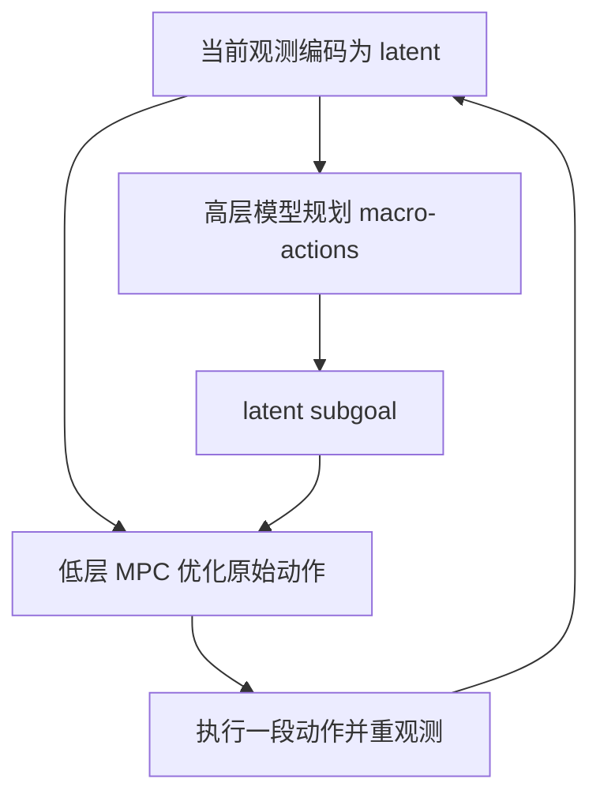

# Hierarchical Planning with Latent World Models（HWM）

**Hierarchical Planning with Latent World Models**（arXiv:2604.03208）提出 HWM：直接在视觉 latent world model 上做分层 MPC。它训练高、低两个时间尺度的状态预测器，共享潜空间；高层用动作片段压缩出的 macro-action 规划较长时程，生成 latent subgoal，低层再以原始动作追踪第一个子目标，并在获得新观测后重新规划。

## 英文缩写速查

| 缩写 | 英文全称 | 简要说明 |
|------|----------|----------|
| HWM | Hierarchical World Model | 本论文提出的分层 latent world model 规划范式 |
| MPC | Model Predictive Control | 每次预测候选动作、执行短段后再次规划 |
| CEM | Cross-Entropy Method | 论文 Franka 与 Push-T 设置中使用的动作序列优化方法 |
| MPPI | Model Predictive Path Integral | 论文迷宫任务使用的采样式轨迹优化方法 |
| OOD | Out-of-Distribution | 测试布局或条件偏离训练分布 |

## 方法结构

低层模型根据当前 latent 与 primitive actions 预测短期状态；高层 action encoder 将一段原始动作压缩成 latent macro-action，再预测长时程 waypoint。高层预测的 latent waypoint 作为低层规划目标。两个尺度都使用预测误差进行模型训练，不依赖专门的层级策略或手工子任务策略。

## 实验与结果

| 任务 | 模型 / 机器人 | 论文报告 |
|------|---------------|----------|
| Franka pick-and-place | 真实 Franka 机械臂；图像目标；V-JEPA 2-AC backbone | 分层方法：杯子 70%、盒子 60%；单层方法对应任务为 0% |
| Drawer manipulation | Franka | 分层方法报告 70%；单层 planner 受多阶段非贪心动作限制 |
| Push-T | 仿真；DINO-WM | 在最长 75 step 设定，成功率从单层 17% 提至分层 61% |
| Maze navigation | MuJoCo PointMaze；PLDM | 对未见更大地图有改善，论文报告较低时域规划计算量 |

论文跨多个设置报告分层规划在相近/更优成功率下最多降低约 3 倍规划计算。表格里的指标依具体任务、试验次数和基线配置，不能视为跨机器人保证。

## 机器人系统解读

HWM 是模型预测控制和学习式状态表示结合的规划栈，不是 VLA 的动作生成头。把它用于其他机器人时至少要确认相机观测、动作接口、规划频率、预测误差、碰撞安全与低层执行器能否追踪目标 latent 对应的真实动作。

论文的真机验证对象是 Franka，不是人形机器人。迁移到 Unitree G1 需要重新验证浮动基座、接触动力学、多关节动作空间与控制延迟，不能直接沿用机械臂成功率。

## 关联页面

- [LeWorldModel](./paper-lewm.md)
- [V-JEPA 2.1](./paper-sa-2603-14482-v-jepa-2-1-unlocking-dense-features-in-video-sel.md)
- [VideoDB JEPA 长文](./article-videodb-jepa-world-models.md)
- [Model-based RL](../methods/model-based-rl.md)
- [Manipulation](../tasks/manipulation.md)

## 参考来源

- [LeWorldModel](./paper-lewm.md) — action-conditioned latent dynamics 代表工作
- [V-JEPA 2.1](./paper-sa-2603-14482-v-jepa-2-1-unlocking-dense-features-in-video-sel.md) — 视频特征 backbone 相关工作
- [VideoDB JEPA 长文](./article-videodb-jepa-world-models.md) — 对 JEPA、动作后果预测与 HWM 的观点型综述
- [项目主页](https://kevinghst.github.io/HWM/)
- [代码仓库](https://github.com/kevinghst/HWM_PLDM)
- [论文来源归档](../../sources/papers/hierarchical_planning_latent_world_models_arxiv_2604_03208.md)
- [arXiv:2604.03208](https://arxiv.org/abs/2604.03208)
