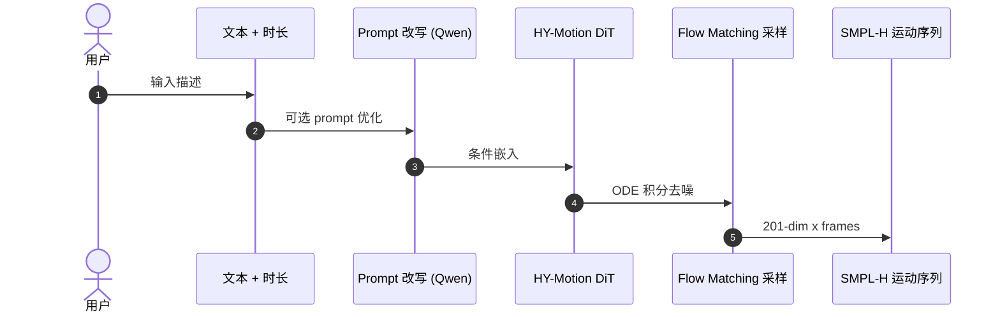

# HY-Motion 1.0

**HY-Motion 1.0: Scaling Flow Matching Models for Text-To-Motion Generation**（Tencent Hunyuan 3D Digital Human Team，[arXiv:2512.23464](https://arxiv.org/abs/2512.23464)）将 **DiT + Flow Matching** 文本驱动 **3D 人体运动** 推到 **十亿参数**，配套 **>3000 h** 预训练与 **DPO / Flow-GRPO** 对齐。方法详解见 [hy-motion-1 方法页](../methods/hy-motion-1.md)。

## 一句话定义

**用大规模 DiT 流匹配把文本 + 时长变成 SMPL-H 运动序列，并以偏好 RL 做语义-物理对齐的 T2M 旗舰模型。**

## 英文缩写速查

| 缩写 | 英文全称 | 简要说明 |
|------|----------|----------|
| T2M | Text-to-Motion | 文本→人体运动生成 |
| DiT | Diffusion Transformer | 扩散/流模型中的 Transformer 骨干 |
| FM | Flow Matching | 连续归一化流训练目标 |
| SMPL-H | SMPL with Hands | 含手部关节的人体模型 |
| DPO | Direct Preference Optimization | 偏好优化（相对 RLHF 更轻） |

## 为什么重要

- **Light-O1 评测对照：** Motion Arena Elo **1078.3** vs Light-O1 **1472.8**；HY-Motion-Bench SSAE **74.7** vs Light-O1 **78.0**（Preview 口径，tech blog）。
- **机器人间接入口：** 文本→人类 motion → **GMR/retarget** → 人形（见 [Gen2Humanoid](./gen2humanoid.md) 等管线）。

## 核心信息

| 字段 | 内容 |
|------|------|
| **机构** | 腾讯混元 3D 数字人团队 |
| **表示** | **201 维/帧** SMPL-H 系（根平移+朝向+关节旋转+局部位置） |
| **数据** | **>3000 h** 预训练 · **~400 h** HQ 微调 |
| **开源** | **已开源** [HY-Motion-1.0](https://github.com/Tencent-Hunyuan/HY-Motion-1.0) + HF 权重 |

## 实验与评测（相对 Light-O1）

| 基准 | HY-Motion 1.0（blog 引用） | Light-O1 Preview |
|------|----------------------------|------------------|
| Motion Arena Elo | 1078.3 | **1472.8** |
| HY-Motion-Bench SSAE | 74.7 | **78.0** |

## 与其他工作对比

| 维度 | HY-Motion 1.0（本页） | [Kimodo](./kimodo.md) | [Light-O1](./light-o1.md) |
|------|------------------------|------------------------|----------------------------|
| 生成目标 | 文本 → **SMPL-H 201 维/帧** 运动序列 | 文本驱动运动生成 | 通用具身模型，Motion Arena 上同场评测 |
| 建模 | 十亿级 **DiT + Flow Matching** | 见其页 | 见其页 |
| 对齐手段 | **DPO / Flow-GRPO** 偏好 RL | — | — |
| 开源 | 权重 + 代码已开源 | 见其页 | 见其页 |

- **逐条对照见专页：** 三者的完整横比沉淀在 [HY-Motion vs GenMo vs Kimodo](../comparisons/hy-motion-vs-genmo-vs-kimodo.md)，本节只给选型入口，不重复其表格。
- **数值可比性：** 本页 Motion Arena Elo **1078.3** 与 HY-Motion-Bench SSAE **74.7** 是 **Light-O1 博客引用的对照值**，不是本库复现；跨榜（Arena Elo vs SSAE）本身也不是同一个量，不能合成一个「谁更强」的结论。
- **与机器人运动的边界：** 输出是 **SMPL-H 人体运动**，不是机器人可执行轨迹；要上人形还需重定向与物理可行性过滤，这一步的代价不体现在本页任何指标里。

## 结论

**HY-Motion 1.0 是「纯文本→人类 kinematic」路线的规模化代表；Light-O1 在相同 human-judgement 基准上报告更高 Elo/SSAE，但任务设定（Preview vs 全身 loco-manip）不完全等同。**

1. **十亿 DiT+FM** 证明 T2M 亦服从 **数据+模型 scale**。
2. **DPO + Flow-GRPO** 把语义/物理偏好压进生成器。
3. **与 Kimodo 对照** 见 [comparison 页](../comparisons/hy-motion-vs-genmo-vs-kimodo.md)。
4. **机器人用法：** 作 **motion prior**，非闭环 robot policy。
5. **开源权重** 可本地跑；与 Light-O1 BFM 栈 **不直接互换**。

## 源码运行时序图

官方 [Tencent-Hunyuan/HY-Motion-1.0](https://github.com/Tencent-Hunyuan/HY-Motion-1.0)（归档 [tencent_hunyuan_hy_motion_1_0.md](../../sources/repos/tencent_hunyuan_hy_motion_1_0.md)）：

## 关联页面

- [hy-motion-1 方法页](../methods/hy-motion-1.md)
- [Kimodo](./kimodo.md) — Motion Arena 锚点 1000 Elo
- [Light-O1](./light-o1.md) — 对照评测引用方

## 参考来源

- [hy_motion_arxiv_2512_23464.md](../../sources/papers/hy_motion_arxiv_2512_23464.md)
- [tencent_hunyuan_hy_motion_1_0.md](../../sources/repos/tencent_hunyuan_hy_motion_1_0.md)
- 论文：<https://arxiv.org/abs/2512.23464>

## 推荐继续阅读

- [HY-Motion GitHub](https://github.com/Tencent-Hunyuan/HY-Motion-1.0)
