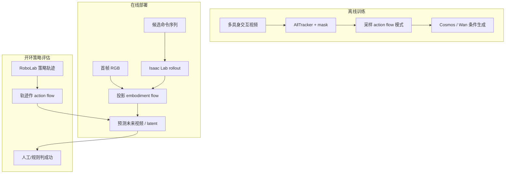

# Hydra-0：Action Flow 通才世界模型

**Hydra-0**（*Action Flow for Generalist World Modeling and Control*，[arXiv:2608.18077](https://arxiv.org/abs/2608.18077)，[项目页](https://nvidia-isaac.github.io/video_to_data/hydra-0/)）由 **英伟达（NVIDIA）**、**布朗大学（Brown University）**、**哥伦比亚大学（Columbia University）** 等提出：用 **action flow**——相机平面上的稀疏轨迹 + 可见性——替代 **具身原生关节/末端命令**，在 **Cosmos 2.5 / Wan2.2** 等视频骨干上实现 **跨人手、夹爪、单臂、双臂** 的统一世界建模，并支持 **开环策略评估** 与 **逆向 object-flow 控制**。

## 一句话定义

**别用各机器人各自的 action space 训 WM——把「命令」变成图像里的像素运动轨迹，同一条件接口接 DROID、Deform360、双臂折叠与 Isaac Lab 投影。**

## 英文缩写速查

| 缩写 | 英文全称 | 简要说明 |
|------|----------|----------|
| WM | World Model | 预测动作后果的生成式模型 |
| EPE | End-Point Error | 轨迹端点/运动误差（论文 gripper/object EPE） |
| IWS | Interactive World Simulator | 六任务 data-efficiency 评测集 |
| PSNR | Peak Signal-to-Noise Ratio | 视频重建质量 |
| FVD | Fréchet Video Distance | 生成分布距离 |
| DI T | Diffusion Transformer | Wan/Cosmos 视频骨干族 |
| RL | Reinforcement Learning | 本文不训 RL 策略；作评估沙盒 |
| RGB | Red-Green-Blue | 条件观测帧 |

## 为什么重要

- **跨具身条件：** 原生 joint / 6D EE 命令绑死训练具身；action flow 在 **观测平面** 表达 motion，可混训 EgoDex 手、DROID 臂、YAM 双臂等。
- **量化增益：** 相对 Cosmos 2.5 native action，**robot EPE −90.4%**、**object EPE −60.2%**（五 held-out 集）。
- **策略评估代理：** RoboLab 五策略开环 replay，与参考成功率 **Pearson r=0.96**（300 episodes）——对齐 [虚拟沙盒路线](../overview/world-models-route-03-virtual-sandbox.md)。
- **逆向模式：** 只给 **desired object flow**（可来自 human demo）→ 预测 robot motion latent → **action readout** → 14-DoF 真机，无需任务专属 robot 专家 demo。
- **数据效率：** 多具身 mid-training 后，IWS 六任务 **0% 任务数据** 仍优于仅 pretrained Wan2.2。

## 核心信息

| 项 | 内容 |
|----|------|
| **机构** | NVIDIA；Brown；Columbia；Harvard（Yilun Du） |
| **骨干** | Cosmos 2.5；Wan2.2 I2V-A14B / TI2V-5B；LightX2V 四步蒸馏 |
| **训练数据** | 过滤 **2,202 h** 多具身交互视频 |
| **部署** | Isaac Lab controller+physics rollout → 几何投影 action flow |
| **开源** | **确认未开源**（2026-08-20 项目页无代码/权重） |

## 核心原理

**Action flow \(\mathcal{F}\)：** \(N\) 点 × \(H\) 步图像坐标 \(\mathbf{x}_{n,t}\) 与可见性 \(m_{n,t}\)。

**训练（video-only）：** AllTracker 稠密轨迹 + grounded embodiment/object mask；每步采样 Embodiment / Object / All / None 之一填充 motion tensor。

**部署（geometry-aware）：** 候选命令序列在 **Isaac Lab** rollout → 链接变换 → 可见表面点经式 (1) 投影；与 ATI/Wan-Move 类轨迹条件兼容但 **运动学接地**。

**逆向 world action model：** 条件改为 **object flow**；DiT latent → MLP action head 解码 executable commands；用成功/失败真机 rollout 配对训练 readout。

### 流程总览

## 源码运行时序图

**不适用**（截至 **2026-08-20**）：无公开训练/推理仓库。发布后应补：video-only flow 构造 → mid-training → IWS/RoboLab 微调 → Isaac Lab 投影推理 → 可选逆向 readout 真机环。

## 工程实践

| 项 | 建议 |
|----|------|
| **何时引用** | 需要 **跨具身 WM** 或 **开环策略排名** 而非闭环节点控制 |
| **开环边界** | 策略 **不被** 生成观测查询；测的是「给定 achieved flow 能否复现结果」 |
| **几何路由** | 部署必须有 sim+标定；纯 video 数据集走 video-only 构造 |
| **蒸馏** | LightX2V 四步 student **16×** 加速；RoboLab 评估仍开环 |
| **与 OSCAR/SC3 对照** | OSCAR 用 2D 骨架；SC3 用逆动力学早停；Hydra 用 **flow 接口 + r=0.96** |

## 局限与风险

- **开环非 prospective：** 未执行命令的策略排名需另设计闭环评估。
- **逆向 grasp ~1 cm 误差**；生成 rollout 接触状态可歧义。
- **DROID object EPE 省略**（ clutter 下 grounding 不可靠）。
- **未开源：** 仅能作方法与榜单坐标；Cosmos/Wan 权重需自训或等发布。
- **Wrist egomotion：** 仅 DROID POC，未系统评测。

## 实验与评测

五 held-out 集（XVLA-Soft-Fold、Deform360、DROID、MolmoAct2、ABC-130k）：action flow 在 PSNR/SSIM/EPE/FID/FVD 全面优于 native Cosmos 2.5 action。RoboLab：**aggregate 26.3% sim vs 26.7% ref**；五策略排序一致；per-episode 一致率 **93%**（κ=0.82）。IWS 六任务：0% 数据 mid-trained 优于 pretrained on LPIPS/EPE/FVD。

## 结论

**Hydra-0 把「动作条件」从各机器人私有空间升到共享视觉 motion 接口，同时给出 r=0.96 级开环评估与可逆 object-flow 控制 POC。**

1. **真影响：action flow 降 EPE** — 相对 native 6D action 大幅降 robot/object motion error。
2. **真影响：RoboLab r=0.96** — 五策略排序与参考一致，可作策略筛选沙盒。
3. **真影响：多具身 mid-training** — 0% 目标任务数据仍有 transfer。
4. **次要代价：开环 + 未开源** — 不能替代闭环节点部署；复现等权重。
5. **逆向模式有 POC 但精度有限** — grasp ~1 cm；需 depth/力觉扩展。
6. **工程读法：与 Cosmos 3 平台互补** — 条件表示创新，非替代全模态 MoT 栈。

## 关联页面

- [Generative World Models](../methods/generative-world-models.md)
- [OSCAR](./paper-oscar.md) — 2D 骨架跨具身 WM + RoboArena 评测
- [SC3-Eval](./paper-sc3-eval.md) — 自一致闭环 VLA 评估
- [Ctrl-World](./paper-ctrl-world.md) — 多视角 VLA 闭环 WM
- [Isaac Lab](./isaac-gym-isaac-lab.md) — 部署投影 sim
- [虚拟沙盒路线](../overview/world-models-route-03-virtual-sandbox.md)

## 参考来源

- [Hydra-0 论文归档](../../sources/papers/hydra_0_arxiv_2608_18077.md)
- [Hydra-0 项目页归档](../../sources/sites/hydra-0-nvidia-isaac.md)

## 推荐继续阅读

- 项目页 — <https://nvidia-isaac.github.io/video_to_data/hydra-0/>
- RoboLab — <https://arxiv.org/abs/2604.09860>
- ATI / Wan-Move 轨迹条件视频生成基线
