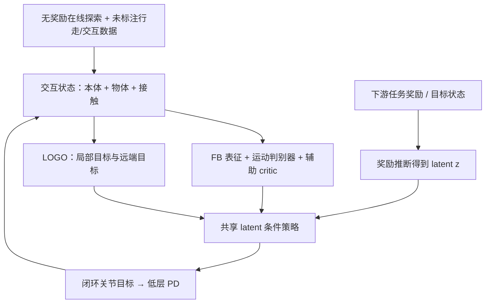

# I-BFM: Reward-Conditioned Robust Humanoid Interaction via Unsupervised Reinforcement Learning

**作者：** Ziqi Han、Yitang Li、Junhan Sun、Fanrong Dong、Yaojie Shen、Lei Ye、Zetong Jing、Yongqi Zhang、Yiming Zhang、Xue Wang、Hao Zhao。Ziqi Han、Yitang Li、Junhan Sun 共同一作；Hao Zhao 通讯作者。  
**机构：** Tongji University（同济大学）、Tsinghua University（清华大学）、Zhejiang University（浙江大学）、RoboParty Lab、Harbin Institute of Technology（哈尔滨工业大学）、ShanghaiTech University（上海科技大学）。  
**时间/状态：** arXiv:2610.06129v1，2026-10-05 提交；预印本。  
**论文：** [arXiv 摘要页](https://arxiv.org/abs/2610.06129) · [PDF](https://arxiv.org/pdf/2610.06129) · [HTML](https://arxiv.org/html/2610.06129v1)  
**官方项目页：** [I-BFM](https://iamhardworking.github.io/I-BFM/) · 代码状态标注为 “Coming soon”。

## 一句话定义

I-BFM 是面向人形–物体交互的行为基础模型：在统一潜在空间中学习身体、物体与接触的耦合动力学；下游给定任务奖励后，将奖励映射为 latent 行为指令，由一个闭环策略执行交互、恢复和任务链，而非为每个任务再训练策略。

## 英文缩写速查

| 缩写 | 全称 | 含义 |
|---|---|---|
| BFM | Behavioral Foundation Model | 行为基础模型，复用单一策略覆盖多种行为 |
| FB | Forward–Backward Representation | 用前向/后向表征近似策略的后继状态分布，并让奖励可映射到共享 latent |
| URL | Unsupervised Reinforcement Learning | 无监督强化学习；预训练目标不依赖每个下游任务的专属策略训练 |
| LOGO | Local–Goal Objective Geometry Operator | 本文的局部–目标几何条件化方式，同时保留近期接触意图与远端目标 |
| G1 | Unitree G1 | 论文仿真与定性真机验证的人形平台 |
| SR | Success Rate | 成功率 |
| Eobj | Object-to-Goal Error | 终止时物体到目标的距离误差 |

## 研究问题与贡献

以人体动作参考跟踪全身和物体轨迹能产生精细演示，但接触丢失或物体被推偏后，机器人可能仍试图回到过时轨迹。另一路线用规划器重规划，但闭环响应会受到计划更新与执行滞后的影响。I-BFM 主张直接学习状态中含有物体与接触关系的统一行为表征，让同一策略依据当前观测和任务目标在线调整动作。

论文的贡献可归纳为：

1. **交互感知 FB 表征：** 将人形本体状态、物体状态、手–物接触信息纳入 forward–backward 表征与共享策略，使 latent 行为不仅区分“身体如何动”，也编码动作对物体造成的后果。
2. **奖励寻址与 LOGO：** 将下游奖励映射到 latent 指令；LOGO 把短时局部交互目标与较长时域目标分别投影到 latent 球面的切空间，避免简单平均未来特征模糊第一步接触意图。
3. **单策略覆盖多类技能：** 仿真涵盖 Carry / Push / Kick、目标到达、动作跟踪、风格控制和任务串联；Unitree G1 上展示了搬运、推踢、受扰恢复与失败重试等定性结果。

“无需 task-specific policy optimization”指预训练后可通过奖励推断 latent、执行同一策略；**并非完全无需任务工程**：论文仍手工定义阶段奖励，并按物体距离、接触和进度选择阶段命令。

## 方法

### 1. 交互状态与策略接口

将交互建模为部分可观测 MDP，完整状态分成：

- **机器人：** 本体感知状态与关节级动作目标（由低层 PD 控制执行）。
- **物体：** 位姿、速度、相对目标位移与物体存在标记。
- **接触：** 双手与物体的接触指示、手的位置及手–物相对位移。
- **任务身份：** 是否需要物体交互；carry、push、kick 共用一个交互 task ID。

执行 actor 使用可部署观测历史（本体、可用物体/接触观测）和 latent 命令。论文训练中的 critic 可用特权状态。注意，项目页的真机演示依赖动捕工作区；不能据此推断任意传感器配置都可直接复现。

### 2. 预训练目标

I-BFM 将在线无奖励探索与两个未标注的离线运动数据集联合训练（一个运动/行走类，一个交互类；论文未报告数据集规模及训练计算量）。目标由三部分组成：

- **FB critic：** 学习交互状态的折扣后继分布；forward 表征 `F(s,a,z)` 与 backward 表征 `B(s')` 共同定义潜在行为及其价值。
- **条件判别器：** 比较策略 rollout 与运动数据，为交互行为加入运动风格先验。
- **辅助交互 critic：** 从环境级辅助奖励学习额外价值信号，用于控制平滑与训练稳定。

三者共同训练一个共享策略。行走数据没有箱体状态，物体/接触字段置零；盒子交互则共享同一 task ID，而不是给 Carry、Push、Kick 各训练独立行为策略。

### 3. LOGO：让近端动作与远端目标共存

简单地把未来 8 步 backward feature 求均值，再投影为一个 latent 命令，可能将“当前应该做的接触动作”和“最后需要到达的目标”混在一起。LOGO 显式构造：

- `z_local`：下一步（`t+1`）的局部交互意图；
- `z_goal`：8 步窗口末端（`t+8`）的较远目标；
- 两个目标分别映射到当前 latent 球面点的切空间，使用球面 log map 表示距离与方向，并交给同一个 actor。

训练时保留原 actor 目标，并加入 local / goal 辅助 actor loss，权重比例 4:3、(eta=0.005)（作者通过受控超参数搜索选择）。这不是把两个 latent 直接相加，也不是动作标签监督。消融把 LOGO 移除后，改为八步特征平均。

### 4. 奖励推断与长程任务

下游奖励 `r(s)` 通过对 backward 表征做奖励加权期望，得到对应 latent `z_r`；目标到达也可用目标状态的 backward embedding 构造 latent。策略随后按当前观测历史与该 latent 闭环执行。

搬运被拆成靠近、抬起、向目标运输、降低、释放、稳定放置等阶段；推箱与踢箱也分别用接触模式、物体运动和稳定性构造阶段奖励。高层根据物体距离、接触和任务进度更新阶段目标/latent。多个子任务可顺序替换 reward 形成 push→carry→place，而不切换低层策略。

### 方法流程图

## 实验与结果

### 仿真任务结果

论文在 MuJoCo 的 Unitree G1 上评估 Carry Box、Push Box、Kick Box；每个方法每项任务运行三组、每组 100 个 episode，机器人和物体初始状态及目标随机化。成功条件通常为物体中心进入距目标 0.2 m 范围，episode 最长 60 s。扰动在运输进度过半后触发。

| 任务 | SR | Eobj（m） | 物体受扰 SR-O | 机器人跌倒扰动 SR-R |
|---|---:|---:|---:|---:|
| Carry Box | 94.3 ± 3.1% | 表 I：0.15 ± 0.02；正文另报 0.11 | 91.0 ± 1.0% | 89.3 ± 1.5% |
| Push Box | 75.0 ± 6.6% | 0.31 ± 0.05 | 46.0 ± 4.4% | 74.3 ± 5.8% |
| Kick Box | 70.0 ± 3.6% | 0.28 ± 0.03 | 57.3 ± 7.6% | 60.0 ± 8.7% |

表中为原文 Table I 的三次运行均值 ± 标准差；搬运 Eobj 在原文 Table I 与正文存在 **0.15 m vs 0.11 m** 的不一致，故并列保留，不替作者消解。与 OmniContact 相比，Carry 标称成功率为 92.7 ± 0.6%，I-BFM 为 94.3 ± 3.1%；机器人跌倒扰动下两者为 1.3 ± 2.3% 与 89.3 ± 1.5%。这组数字支持在论文所定义的跌倒扰动协议下更强的恢复，但不能外推成所有扰动条件都占优。

### LOGO 消融

| 方法 | Carry SR | Eobj（m） | 关节位置误差* | 速度误差* |
|---|---:|---:|---:|---:|
| 不含 LOGO | 51.0% | 0.33 | 1.06 | 129.7 |
| 完整 I-BFM | 94.3% | 0.15 | 1.02 | 126.9 |

* 原文未给上述两项 tracking error 的单位。此消融对比只隔离了 LOGO；不能据此断言其余组件各自的独立贡献。

### 通用行为与真机

同一模型也演示了 goal reaching、携物动作跟踪、舞蹈、风格化持箱旋转/举升及 push–carry–place 长程串联。真机验证使用 Unitree G1、动捕工作区、边长 0.35 m / 质量 0.7 kg 的箱体，策略 50 Hz；论文给出推、踢、搬运、箱体被移动后的再接近、外力扰动后恢复和失败重试等视频/定性描述，**没有报告这些真机演示的成功率统计**。

## 与其他工作对比

| 方法 | 主要交互表征/接口 | 失败恢复路径 | 与 I-BFM 的差别 |
|---|---|---|---|
| [BFM-Zero](./paper-bfm-zero.md) | FB + 无监督 RL，主要建模人形身体行为 | latent / reward 调用身体动作 | I-BFM 把物体和接触显式纳入状态，关注持久的人–物交互 |
| [OmniContact](./paper-omnicontact-humanoid-loco-manipulation.md) | contact-flow 条件 meta-skills，并可在线重规划 | 生成中间参考后由跟踪器执行 | I-BFM 直接由交互状态条件化单策略；论文报告的跌倒恢复差异尤其明显，但两方法的重规划/评测细节需结合附录 |
| HDMI / 人–物 co-tracking | 稠密人和物体参考轨迹 | 对参考进行跟踪 | I-BFM 不以固定交互轨迹作为下游策略优化目标，因而可响应接触变化 |
| I-BFM | 物体–接触感知 FB latent + 奖励推断 + LOGO | 共享闭环策略在同一目标下恢复 | 一次预训练、以奖励/目标 latent 调用不同交互技能 |

**比较可比性注意：** 附录中的 baseline 并非所有任务完全同一成功定义：Carry 中 LessMimic 使用 XY 距离而其他实现多使用 3D；Push 中 LessMimic 与 OmniContact 的距离判据和原生初始化/运行方式也不同。不要把每个表格格子都当成完全控制变量的横向基准。

## 局限与复现状态

- 论文没有给出离线运动数据集名称/规模、训练 GPU 小时、完整模型规模等关键成本信息，独立复现实验预算不够透明。
- 任务的阶段奖励仍需设计，推断 latent 后还需高层进度/接触逻辑选择阶段；“零样本”不等于无任务定义。
- 真机结果是动捕工作区中的定性演示，策略执行为 50 Hz；没有真机统计成功率、多硬件泛化或广泛物体种类评测。
- 稳健性结论依赖 MuJoCo 指定箱体与中途施加的固定方向/持续时间扰动协议；不等同于自然分布中所有失败模式的鲁棒性。
- 官方项目页将代码状态标为 **Coming soon**；目前未发现可下载代码仓库或权重/数据集发布入口。项目页提供浏览器内 MuJoCo 交互演示，但它不是训练代码公开。

## 源码运行时序图

**不适用**（截至 2026-10-06，官方项目页标注 Code Coming soon，未公开可运行训练/推理实现；网页 MuJoCo 演示不能替代源码）。

## 结论

I-BFM 的核心增量不是“再加一套操作策略”，而是让 BFM 的共享状态和 latent 行为从身体运动扩展到人形–物体–接触耦合。FB 奖励寻址提供统一调用接口，LOGO 则显式保留接触附近的下一步意图和较远的任务目标。在所报告的 G1 仿真测试中，尤其是 Carry 的中途机器人跌倒恢复，以及 G1 上的定性演示，展示了这一交互建模方向的潜力；但成本信息缺失、Eobj 与项目网页结果不一致、真机评估未量化等因素限制了现阶段的可复现性和结论外推范围。

## 项目资源与工程补充

### 项目页提供什么

该站点是论文配套的视觉演示与试用入口，不是一个已发布的训练代码仓库。首页提供：

- **研究概览视频**：呈现 I-BFM 预训练及奖励推断的框架。
- **浏览器内交互演示**：Live MuJoCo Carry Box 与键盘控制入口。该交互 demo 可用于体验项目所表达的闭环操作概念，但不能据此复现训练。
- **鲁棒性视频**：Carry Box、Push Box、Kick Box 的受扰表现，以及 Robust Goal Reaching。
- **结果卡片**：把 Carry / Push / Kick 在无扰动、物体受扰、机器人受扰下的 300 episode 计数放到同一页面。

### 项目站结果卡（按页面原值记录）

| 条件 | Carry Box | Push Box | Kick Box |
|---|---:|---:|---:|
| 无外部扰动 | 94.33% (283/300) | 90.00% (270/300) | 81.67% (245/300) |
| 物体受扰 | 91.00% (273/300) | 85.33% (256/300) | 79.67% (239/300) |
| 机器人受扰 | 89.33% (268/300) | 84.67% (254/300) | 86.67% (260/300) |

#### 与论文表格核对

网站结果不完全等于 arXiv v1 Table I：例如 Push 标称成功率网页为 90.00%，论文表格为 75.0 ± 6.6%；Kick 标称网页为 81.67%，论文表格为 70.0 ± 3.6%。机器人扰动下 Kick 网页为 86.67%，论文表格为 60.0 ± 8.7%。项目页没有解释版本或协议差异。因此：

1. 本节只把上述数字标为**网站结果卡所示**；
2. 本页实验节保留 arXiv 表格数据与论文正文中 Carry Eobj 的数值冲突；
3. 在作者澄清前，不推断哪一套数字更新，也不把项目站的 300-episode 数值写成论文表格结果。

### 复现与资源状态

| 资源 | 当前状态 |
|---|---|
| 项目页与演示视频 | 已公开 |
| 浏览器内 MuJoCo 交互入口 | 项目页嵌入/链接提供 |
| 论文 | [arXiv:2610.06129](https://arxiv.org/abs/2610.06129) |
| 代码仓库 | 页面标注 Coming soon；未找到公开仓库 |
| 权重 / 训练数据下载 | 未发现公开入口；论文也未给出可下载链接 |

## 关联页面

- [BFM-Zero](./paper-bfm-zero.md) — 身体优先的 FB 行为基础模型
- [OmniContact](./paper-omnicontact-humanoid-loco-manipulation.md) — 接触流条件化交互与技能链
- [行为基础模型概念](../concepts/behavior-foundation-model.md)

## 参考来源

- [i_bfm_arxiv_2610_06129.md](../../sources/papers/i_bfm_arxiv_2610_06129.md)
- [i-bfm-project-page.md](../../sources/sites/i-bfm-project-page.md)
- [arXiv 摘要页](https://arxiv.org/abs/2610.06129)
- [arXiv PDF](https://arxiv.org/pdf/2610.06129)
- [官方 I-BFM 项目页](https://iamhardworking.github.io/I-BFM/)
