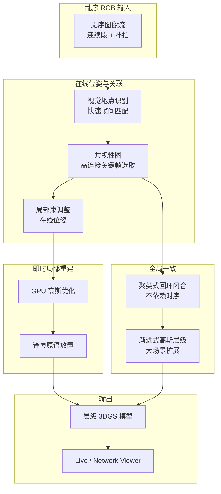
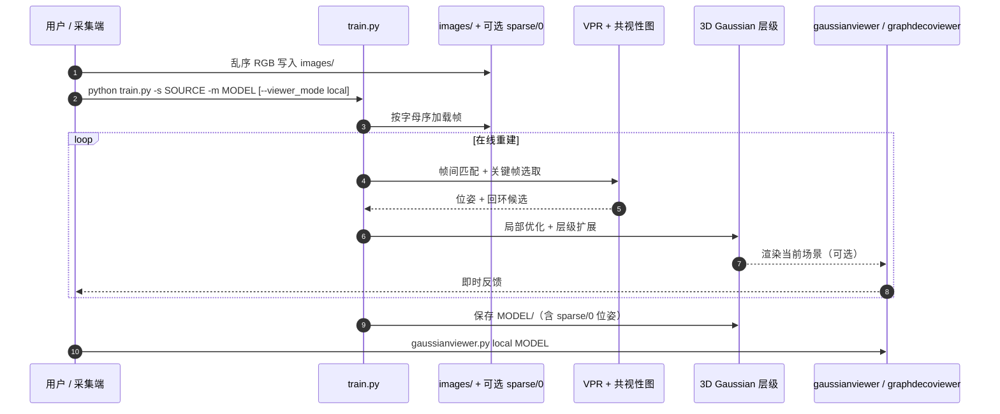

# i3dGS（Immediate 3D Gaussian Splat Reconstruction of Unordered Input with Global Consistency）

**i3dGS**（Meuleman et al., arXiv:2607.14481，[项目页](https://repo-sam.inria.fr/nerphys/i3dgs/)，[代码](https://github.com/graphdeco-inria/i3dgs)）由 **Inria GraphDeco** 提出，SIGGRAPH Conference Papers 2026 收录。系统面向 **乱序 RGB 捕获**（连续视频 + 补拍混采）给出 **即时 3D Gaussian Splatting 反馈**，并通过 **共视性图上的聚类回环** 与 **渐进式高斯层级** 保持 **全局一致**，可扩展至 **数千张图像** 的大场景；算法亦为 GraphDeco 衍生 **[OnTheFly](https://onthefly3d.com)** 的核心技术。

## 英文缩写速查

| 缩写 | 英文全称 | 简要说明 |
|------|----------|----------|
| i3dGS | Immediate 3D Gaussian Splatting | 本文即时乱序 3DGS 重建系统 |
| 3DGS | 3D Gaussian Splatting | 显式各向异性高斯辐射场表示 |
| VPR | Visual Place Recognition | 视觉地点识别；用于乱序帧快速匹配 |
| SfM | Structure from Motion | 传统离线多视图几何；需全量图像且慢 |
| SLAM | Simultaneous Localization and Mapping | 增量定位建图；多数假设时序输入 |
| LBA | Local Bundle Adjustment | 局部束调整；配合 VPR 估计在线位姿 |
| NVS | Novel View Synthesis | 新视角渲染；3DGS 重建质量主评测维度之一 |

## 为什么重要

- **采集现实是乱序的：** 高质量场景扫描常混合 **连续轨迹** 与 **回头补拍**；离线 COLMAP / SfM 要 **等全部照片到齐** 且算力高，无法边拍边看。
- **增量 3DGS-SLAM 吃时序：** MonoGS、GS-SLAM、Gaussian-LIC 等 **即时反馈** 方案多假设 **有序帧流**；乱序补拍与跨段回环是结构性缺口。
- **全局一致不能等离线：** 本文把 **VPR 匹配 + 共视性图 + 聚类回环** 嵌进 **在线 3DGS 优化**，声称首个 **乱序 + 即时 + 全局一致** 的 radiance field 捕获方案。
- **Real2Sim 资产侧的上游：** 对机器人/仿真管线，输出是可漫游 **3DGS 场景** 而非像素视频；与 [Instant NuRec](./paper-instant-nurec.md)（驾驶日志前向 3DGS）互补，更贴近 **手持/漫游式照片流** 捕获。

## 核心信息

| 字段 | 内容 |
|------|------|
| 作者 | Andreas Meuleman, Linus Franke*, Boris Zhestiankin, Camille Montemagni, George Drettakis |
| 机构 | Inria GraphDeco · Université Côte d'Azur · Université de Rennes · EPFL |
| 出处 | arXiv:2607.14481；SIGGRAPH Conference Papers 2026；DOI [10.1145/3799902.3811167](https://doi.org/10.1145/3799902.3811167) |
| 项目 | <https://repo-sam.inria.fr/nerphys/i3dgs/> |
| 代码 | <https://github.com/graphdeco-inria/i3dgs>（**已开源**，Immediate3DGS 研究许可） |
| 商业 | [OnTheFly](https://onthefly3d.com) — GraphDeco 衍生产品 |

## 流程总览

## 核心原理 / 方法栈

| 模块 | 作用 |
|------|------|
| **VPR + 共视性图匹配** | 在 **乱序** 序列中快速建立帧关联；选取 **高连接关键帧**，有序输入亦受益 |
| **即时局部 3DGS** | GPU 优化 + 原语放置策略，radiance field 场景下 **快速局部重建** |
| **聚类式回环闭合** | 利用共视性图做 **cluster-based loop closure**，**无需时序假设** |
| **渐进式层级** | 大场景按层级组织高斯，兼顾 **规模** 与 **效率** |
| **交互 viewer** | 基于 [graphdecoviewer](https://github.com/graphdeco-inria/graphdecoviewer) 的 live / network 模式，优化过程中浏览场景与位姿 |

### 与相邻路线的分工

| 路线 | 输入假设 | 反馈时机 | 本文差异 |
|------|----------|----------|----------|
| COLMAP + 3DGS | 全量图像 | 离线 | 需等采集结束；算力高 |
| MonoGS / GS-SLAM | 有序 RGB(-D) | 在线 | 难处理乱序补拍 |
| [Gaussian-LIC2](./paper-gaussian-lic2.md) | 有序 LIC 流 | 实时 | 多传感器 + 有序；强调几何 NVS |
| [Instant NuRec](./paper-instant-nurec.md) | 标定多相机驾驶 clip | 前向 ~1.5 s | 非漫游捕获；分层驾驶 3DGS |
| **i3dGS** | **乱序 RGB** | **即时 + 全局一致** | **VPR/回环/层级** 专为此捕获模式设计 |

## 源码运行时序图

对齐官方 README：`train.py` 为主入口；首次运行下载 checkpoint 并 JIT 编译；可选 `--viewer_mode local/server` 即时可视化。

关键复现命令：`python scripts/download_datasets.py --out_dir data/` → `python train.py -s data/MipNeRF360/garden -m results/MipNeRF360/garden`；论文表：`python scripts/train_eval_all.py --base_dir data/ --base_out_dir results/`。

## 实验与评测（论文/官方协议摘要）

| 项 | 说明 |
|----|------|
| **数据集** | MipNeRF360、TUM、StaticHikes、tandt_db 等（`download_datasets.py`） |
| **留一协议** | `--test_hold N` 每 N 帧留测；`--test_frequency` 控制评测频率 |
| **规模** | 项目页/demo 展示 **数千张图** 级大场景（如 CityWalk 层级） |
| **交互** | Live optimization viewer；network viewer 支持远程机器只看渲染流 |

## 工程实践

| 项 | 说明 |
|----|------|
| **平台** | Ubuntu 24.04 / Windows 11；RTX + CUDA 12.8 测试 |
| **依赖** | Python 3.12、PyTorch 2.7.1、CuPy、`requirements.txt`（含子模块） |
| **许可** | **Immediate3DGS license** — **研究/评测**；商业/专利限制联系 [OnTheFly](https://onthefly3d.com) |
| **Viewer** | 远程端可仅装 `graphdecoviewer@i3dgs-fixes`，无需 CUDA GPU |
| **输出** | `results/.../` 下模型、`sparse/0` 优化位姿、`test_images/`（评测模式） |
| **开源状态** | **已开源** — 训练/推理/viewer 可跑；非 MIT/Apache 宽松许可 |

## 局限与风险

- **许可边界：** 代码可复现研究与对比，但 **Immediate3DGS license** 限制商业集成；产品化需走 OnTheFly 渠道。
- **输入模态：** 官方管线为 **RGB 图像文件夹**；无 LiDAR/IMU 紧耦合，几何精度不如 [Gaussian-LIC2](./paper-gaussian-lic2.md) 类 LIC-SLAM。
- **仿真就绪性：** 输出是 **外观级 3DGS**，不含碰撞 mesh / 物性；Real2Sim 仍需 [SimFoundry](./paper-simfoundry-real2sim-scene-generation.md) 等下游补全。
- **与 SLAM 栈关系：** 更贴近 **捕获时即时重建** 而非机器人 **导航里程计**；定位精度评测口径与 LIO/VIO 不同。

## 结论

**i3dGS 把 3DGS 重建从「等采集结束再 COLMAP」推进到「乱序照片流边拍边出全局一致 splat」：VPR+共视性图负责关联，聚类回环负责漂移，渐进层级负责规模。**

- **问题定义准：** 乱序补拍是真实采集常态，增量 SLAM 系 3DGS 的时序假设在这里不成立；本文正面解决 **unordered + immediate + globally consistent** 三元组。
- **工程可跑：** 官方 `graphdeco-inria/i3dgs` 含数据下载、训练、评测脚本与 live viewer；SIGGRAPH 级实现而非 placeholder。
- **许可要读清：** **研究/评测开源**，非宽松 OSS；产品集成看 OnTheFly，论文复现看 GitHub。
- **Real2Sim 读法：** Stage 1 **外观重建** 上游——适合 **漫游照片 / 视频抽帧乱序入库** 的快速 3DGS 资产；接触动力学仍须另管线。
- **对照 Instant NuRec：** 驾驶多相机 **前向 3DGS** vs 手持 **在线优化 3DGS**；办公室扫描优先 i3dGS，车队 clip 优先 NuRec。
- **对照 Gaussian-LIC2：** 需要 **LiDAR 几何 + 有序 LIC** 选后者；只有 **RGB 乱序相册** 选 i3dGS。
- **Viewer 生态：** graphdecoviewer 组件可复用到其他 3DGS 项目，利于调试大场景 splat（可接 [Spark](./spark-3dgs-renderer.md) Web 栈做分发）。

## 与其他页面的关系

- [Real2Sim 纵深路线](../../roadmap/depth-real2sim.md) — Stage 1 几何/外观重建；乱序捕获 → 即时 3DGS 资产
- [Gaussian-LIC2（实体）](./paper-gaussian-lic2.md) — 有序 LIC 3DGS-SLAM；几何 NVS 对照
- [Instant NuRec（实体）](./paper-instant-nurec.md) — 驾驶日志前向 3DGS；秒级 vs 在线优化
- [GS-Playground（实体）](./gs-playground.md) — 3DGS 光真实感 **仿真训练** 下游
- [Spark（实体）](./spark-3dgs-renderer.md) — Web 大场景 splat 浏览
- [导航·SLAM 栈总览](../overview/navigation-slam-autonomy-stack.md) — 辐射场 SLAM 支路索引

## 参考来源

- [i3dgs_arxiv_2607_14481.md](../../sources/papers/i3dgs_arxiv_2607_14481.md)
- [i3dgs-inria.md](../../sources/sites/i3dgs-inria.md)
- [i3dgs-graphdeco-inria.md](../../sources/repos/i3dgs-graphdeco-inria.md)
- Meuleman et al., *Immediate 3D Gaussian Splat Reconstruction of Unordered Input with Global Consistency*, SIGGRAPH 2026 — <https://arxiv.org/abs/2607.14481>

## 推荐继续阅读

- [i3dGS 项目页](https://repo-sam.inria.fr/nerphys/i3dgs/) — Demo 视频与 method teaser
- [i3dGS GitHub 仓库](https://github.com/graphdeco-inria/i3dgs) — 安装、训练、评测与 viewer
- [graphdecoviewer](https://github.com/graphdeco-inria/graphdecoviewer) — 可复用 viewer 组件
- [OnTheFly](https://onthefly3d.com) — 商业衍生与许可咨询
- Kerbl et al., *3D Gaussian Splatting for Real-Time Radiance Field Rendering* — 3DGS 基线（SIGGRAPH 2023）
- Tosi et al., *How NeRFs and 3D Gaussian Splatting are reshaping SLAM* — 辐射场 SLAM 综述（arXiv:2402.13255）
