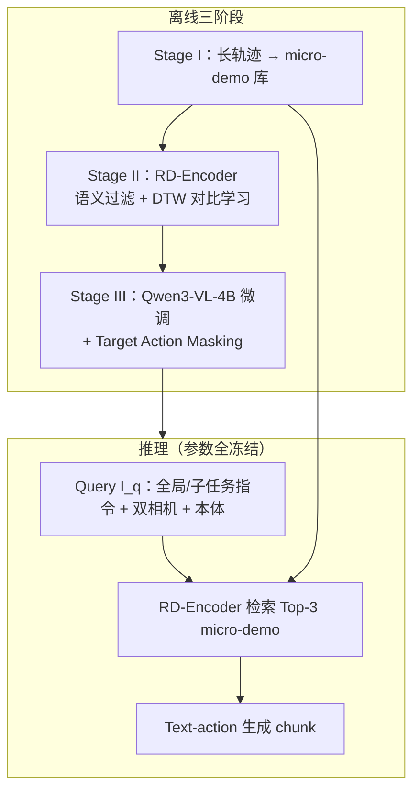

# ICI-VLA（时空对齐 In-Context 模仿 · VLA）

**ICI-VLA**（*In-Context Imitation with Spatiotemporally Aligned Demonstrations for Vision-Language-Action Models*，[arXiv:2609.07581](https://arxiv.org/abs/2609.07581)，武汉大学 Songhua Yang 等）——在 **VLA-0 式 text-action VLM** 上实现 **零梯度 few-shot 测试时适应**：长轨迹离线切成 **语义标注 micro-demonstration**，**RD-Encoder** 用 **DTW 挖对比三元组** 学相位感知检索，策略微调时 **Target Action Masking** 抑制直接抄录检索动作。

## 一句话定义

**推理时不更新任何参数，靠 DTW 对齐训练出的检索器为当前子任务相位匹配 micro-demo，把固定 Qwen3-VL-4B 从「每任务微调」变成「检索-conditioned text-action 生成」。**

## 英文缩写速查

| 缩写 | 英文全称 | 简要说明 |
|------|----------|----------|
| VLA | Vision-Language-Action | 视觉-语言-动作统一策略 |
| ICL | In-Context Learning | 测试时不更新权重，靠上下文示范适应 |
| ICIL | In-Context Imitation Learning | 检索示范作前缀的模仿学习框架 |
| DTW | Dynamic Time Warping | 轨迹几何对齐；离线挖 RD-Encoder 正样本 |
| RD-Encoder | Retrieval-Demonstration Encoder | 基于 Qwen3-VL-Embedding-2B 的多模态检索编码器 |

## 为什么重要

- **朴素 ICL 的反面教材被量化：** 同一骨干上 **VLA-0 + Naive ICL** 在 RoboTwin 2.0 仅 **10.7%**，Full ICI-VLA **60.4%**——说明机器人 ICL 瓶颈在 **示范对齐**，不在「有没有 context 槽位」。
- **与 action head 路线正交：** 保留 **原生文本生成接口**（对照 diffusion / discrete-token / OFT head），把适应负担交给 **离线库 + 检索 + masking 训练**，与 [StellaVLA](./paper-stellavla-structured-icl-vla.md) 的「结构化语言示范」形成 **表征 vs 几何相位** 两条纯 ICL 线。
- **RoboTwin 2.0 大幅领先：** 平均 **60.4%** 较报告最强基线 OpenVLA-OFT（**41.1%**）**+19.3 pp**，Hard 子集 **46.3%**——长程双臂仿真上检索对齐的收益明显大于 LIBERO 上的边际增益（**97.7% vs VLA-0 94.5%**）。

## 核心结构与方法栈

| 模块 | 作用 |
|------|------|
| **Visual planner** | 全局指令 → 有序子任务 \(T_{\mathrm{sub}}\)；随视觉完成度推进 |
| **Micro-demo 库 \(\mathcal{D}\)** | ~11.2k 轨迹 → ~**139,659** 条 \(\langle T, T_k, O, Z, A_{i:i+k}\rangle\)；动作/本体 **文本化**（VLA-0 范式） |
| **RD-Encoder** | Qwen3-VL-Embedding-2B；语义 top-64 过滤 + DTW 挖 \(P^+\)/\(N^-\)；最多 5 轮对比学习 |
| **ICI-VLA 策略** | Qwen3-VL-4B 全参微调；prompt = system + **K=3 检索示范** + 当前 query；**无 action head** |
| **Target Action Masking** | 随机 mask context 内 action token，仅监督 query 未 mask 位 → 防轨迹抄录 |

### 流程总览

## 实验与评测

| 基准 | ICI-VLA 要点 | 强基线对照 |
|------|----------------|------------|
| **LIBERO** | 平均 **97.7%**（Long **96.8**） | VLA-0 **94.5**；OpenVLA-OFT **96.4**；Naive ICL **71.5** |
| **RoboTwin 2.0** | Easy **72.4** / Hard **46.3** / Avg **60.4** | OpenVLA-OFT **41.1**；VLA-0 **34.6**；Naive ICL **10.7** |
| **真机（Aloha 双臂，4 任务）** | 平均 **83.2%** [80.8, 85.4] | π₀ **66.4**；VLA-0 **63.0** |
| **检索 Recall@1 / @5** | **70.8 / 90.1**（full RD-Encoder） | 基座 embedding **27.8 / 52.4** |

**消融要点（RoboTwin Avg）：** 去 **DTW** → **31.4%**；去 **语义过滤** → **38.1%**；去 **Target Action Masking**（朴素 ICL）→ **10.7%**——三项组件在 Hard 仿真上 **缺一不可**，Masking 对防抄录最关键。

## 结论

**ICI-VLA 证明：固定 text-action VLA 可以在测试时用「相位对齐的 micro-demo 检索」做 few-shot 适应，RoboTwin 2.0 上的 +19.3 pp 主要来自 DTW 检索与 Target Action Masking，而非再堆 action head 或在线微调。**

- **真影响指标的是检索对齐质量**：Recall@1 从 27.8 提到 70.8 与 RoboTwin 从 10.7→60.4 同步——部署应优先投资 **子任务分段 + RD-Encoder**，而非单纯增大 context 长度。
- **LIBERO 已接近饱和**：97.7% vs VLA-0 94.5% 边际小；选型读法应看 **RoboTwin / 真机** 等同域长程双臂证据。
- **与 [StellaVLA](./paper-stellavla-structured-icl-vla.md) 互补**：本文用 **原始 micro-demo + 几何 DTW**；StellaVLA 用 **结构化语言 + 2D/3D 运动 verbalization**——前者实现更贴 VLA-0 文本接口，后者 OOD 语言可读性更强。
- **与 [RoboTTT](./paper-robottt-test-time-training-vla-context.md) 正交**：RoboTTT **每步写 fast weights**；ICI-VLA **完全零梯度**，但不能在执行漂移后「重写记忆」。
- **开源边界**：截至入库日 **无官方代码/权重**；复现需自搭 VLA-0 式 text-action 管线 + 示范库与 RD-Encoder 训练循环。

## 工程实践

| 项 | 内容 |
|----|------|
| **骨干** | 策略 **Qwen3-VL-4B**；检索 **Qwen3-VL-Embedding-2B**；动作/本体文本化（VLA-0 范式） |
| **库规模** | ~11.2k 长轨迹 → ~139k micro-demo；含 LIBERO、RoboTwin 2.0、~1k Aloha 真机 |
| **推理** | 默认 **K=3** 检索示范；RD-Encoder 与策略 **均冻结**；子任务由 visual planner 在线选择 |
| **复现入口** | **不适用**（截至入库日无官方仓库）；对照范式见 VLA-0 [arXiv:2508.02062](https://arxiv.org/abs/2508.02062) |
| **选型读法** | 已有 text-action VLA、可建/维护示范库、需零梯度新任务适应 → 优先考虑；执行中严重漂移需在线纠错 → 对照 RoboTTT / DAgger |

## 源码运行时序图

**不适用**（截至入库日 arXiv 未发布 ICI-VLA 可运行官方代码；论文三阶段离线管线与 frozen 推理循环见上文流程总览）。

## 常见误区或局限

- **误区：** 「ICI-VLA = 在 prompt 里多塞几条完整 demo」——朴素 ICL 仅 **10.7%** RoboTwin，必须 **子任务切分 + DTW 检索 + Masking**。
- **误区：** 推理时仍用 DTW 对 query 动作选示范——**DTW 仅离线挖训练标签**；测试时 encoder 只用 **可观测量** 排序。
- **局限：** 依赖 **预建示范库** 与 **子任务分段质量**；训练/验证/评测轨迹划分需严格隔离；**无官方实现** 阻碍快速复现。

## 与其他工作对比

| 路线 | 适应机制 | 示范形态 | 与 ICI-VLA |
|------|----------|----------|------------|
| **ICI-VLA** | 零梯度检索 ICL | 子任务 micro-demo + DTW 相位对齐 | 本页 |
| [StellaVLA](./paper-stellavla-structured-icl-vla.md) | 零梯度 ICL | 结构化计划 + 2D/3D 运动语言 | 语言结构化 vs 几何 DTW |
| [BPP](./paper-behavior-prompting-policy.md) | 零梯度 ICL | 原始人类 sensorimotor prompt | 无子任务切分与 DTW |
| [RoboTTT](./paper-robottt-test-time-training-vla-context.md) | TTT fast weights | visuomotor 流 / 人视频 prefix | 需梯度更新，可 8K 步记忆 |
| VLA-0 | 任务微调 | 无 ICL | 每任务梯度更新；本文在其上 + 检索 ICL |

## 关联页面

- [机器人 In-Context Learning](../concepts/robot-in-context-learning.md) — 真 ICL vs TTT taxonomy
- [VLA](../methods/vla.md) — text-action 与部署期适应分支
- [Manipulation](../tasks/manipulation.md) — LIBERO / RoboTwin 评测语境
- [StellaVLA](./paper-stellavla-structured-icl-vla.md) — 结构化语言 ICL 对照
- [四路线 ICL 对比](../comparisons/wam-ttt-robottt-stellavla-zero-wam-embodied-icl.md) — WAM-TTT / RoboTTT / StellaVLA / Zero-WAM 坐标系

## 参考来源

- [ICI-VLA 论文摘录](../../sources/papers/ici_vla_arxiv_2609_07581.md)

## 推荐继续阅读

- 论文 PDF：<https://arxiv.org/abs/2609.07581>
- VLA-0（text-action 范式对照）：<https://arxiv.org/abs/2508.02062>
- RoboTwin 2.0 基准：<https://arxiv.org/abs/2508.06571>
