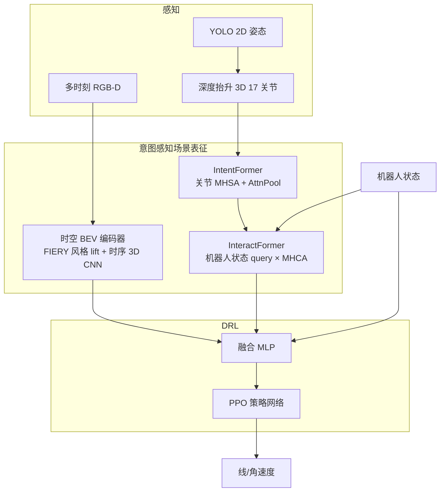

# iCrowdNav（意图感知场景表征的视觉人群导航）

**iCrowdNav**（*Learning Robot Visual Navigation in Crowds via Intention-Aware Scene Representations*，[arXiv:2606.26047](https://arxiv.org/abs/2606.26047)，RA-L 2026，[项目页](https://broln7.github.io/socialbev.io/)）来自 **南方科技大学（SUSTech） / 锐冠信息（Reconova） / 鹏城实验室（Peng Cheng Laboratory）**：针对 **密集人群中的第一人称视觉导航**，用 **时空 BEV 编码器** 保留环境占据与语义线索，用 **I²Former（Intent-Interact Former）** 从 **3D 人体姿态** 推断行人运动意图，再与机器人状态融合后以 **PPO** 训练策略；在 Isaac Sim **SocNav-Gym** 上相对 DRL-VO、SARL\*-OM、ViNT、[DWA](../methods/dwa.md) 提升成功率并降低私人空间侵入，并在健身房 / 地铁站 / 商场完成 **零样本** 真机部署。

## 一句话定义

**别把行人压成平面点**——用 RGB-D 的 BEV 占据 + 姿态 Transformer 意图，再喂给 PPO，让服务机器人在商场式拥挤通道里提前让行、少贴身。

## 英文缩写速查

| 缩写 | 英文全称 | 简要说明 |
|------|----------|----------|
| iCrowdNav | Intention-aware Crowd Navigation | 本文视觉人群导航框架 |
| I²Former / I2Former | Intent-Interact Former | 关节意图编码 + 人机交互交叉注意力模块 |
| BEV | Bird’s-Eye View | 多相机/多帧抬升后的俯视场景特征 |
| DRL | Deep Reinforcement Learning | 深度强化学习策略训练 |
| PPO | Proximal Policy Optimization | 本文在线策略优化算法 |
| TPZ | Time in Private Zone | 落入行人私人空间（<0.8 m）的累计时间 |
| SFM | Social Force Model | 仿真行人动力学模型 |
| SR / NT / PL | Success Rate / Navigation Time / Path Length | 成功、用时、路径长度指标 |

## 为什么重要

- **补上「社交导航」里的视觉缺口：** 大量人群 DRL（如 SARL、DRL-VO）默认 **可观测 2D 状态或激光**，难迁移到只有机载相机的服务机器人；本文显式编码 **姿态线索**（转肩/转头等）与 **结构化环境约束**。
- **表征优先于手调社交奖励：** 奖励只保留到达、碰撞、近距惩罚、进度与角速度平滑；作者主张意图已由 I²Former 隐式编码，避免复杂 proxemics 奖励调参。
- **狭窄 + 高密度更有区分度：** 仓库 2.5 m、密度 0.2 ped/m² 等设定下，相对 ViNT / DWA 的 SR 与 TPZ 差距拉开；长程拓扑导航（>20 m）同样保持领先。
- **真机零样本证据链：** 商场单次 **109.49 m**、均速 **0.76 m/s**，板载 RTX 2060 **~15 Hz**——对 [Sim2Real](../concepts/sim2real.md) 视觉导航选型有参考价值。
- **开源边界需清醒：** 官方仓截至入库日仍是 **Release codes TODO**；可读方法与附录，不可当可跑栈。

## 核心信息

| 字段 | 内容 |
|------|------|
| 机构 | 南方科技大学（SUSTech）；锐冠信息（Reconova）；鹏城实验室（Peng Cheng Laboratory） |
| 发表 | IEEE RA-L 2026，11(5):6186–6193；doi:[10.1109/LRA.2026.3677748](https://doi.org/10.1109/LRA.2026.3677748) |
| arXiv | [2606.26047](https://arxiv.org/abs/2606.26047) |
| 项目页 | <https://broln7.github.io/socialbev.io/> |
| 代码 | <https://github.com/BRoln7/icrowdnav> — **待发布**（README TODO，截至 2026-07-28） |
| 平台 | Clearpath Dingo；双 Intel RealSense D435；仿真 Isaac Sim + SocNav-Gym |
| 训练 | PPO；ResNet-18 / 时序 BEV 骨干 nuScenes 预训练后 **冻结**；其余端到端 |
| 主要基线 | DRL-VO、SARL\*-OM、ViNT、DWA；消融 w/o I²、w/o BEV |

## 核心原理

### 输入 / 输出

| 侧 | 内容 |
|------|------|
| 视觉 | 多时刻多相机 **RGB-D**（真机双目合计 FoV ~140°） |
| 行人 | YOLO 2D 姿态 → 深度抬升 **17 关节 3D**（遮挡零填充） |
| 本体 | 目标方向 \((g_x,g_y)\)、目标距离 \(d_g\)、速度 \((v_x,v_y)\) |
| 动作 | 线速度 / 角速度指令（POMDP 策略 \(\pi_\theta(a^t\|o^t)\)） |

### 流程总览

### 关键机制（压缩）

1. **Spatio-temporal BEV：** 多视角 ResNet-18 特征按深度抬升到统一 egocentric BEV（\(120\times200\)），历史帧按轨迹补偿对齐，3D 卷积聚合后 2D CNN 得 \(\mathbf{z}^t_{\mathrm{bev}}\)。
2. **IntentFormer：** 对每行人关节 embedding 做 MHSA + FFN，再用 attention pooling 得到意图特征 \(\mathbf{f}^t_{\mathrm{ped}}\)。
3. **InteractFormer：** 以机器人状态 embedding 为 query，对行人意图做 MHCA，得到交互表征 \(\mathbf{z}^t_{\mathrm{interact}}\)。
4. **融合 + PPO：** \(\mathrm{Concat}(\mathbf{z}_{\mathrm{bev}},\mathbf{z}_{\mathrm{interact}},\mathbf{z}_{\mathrm{state}})\) → MLP → 策略；奖励 \(r=r_{\mathrm{nav}}+r_\omega\)（到达 +20 / 碰撞 −20 / 近距 shaping / 进度 / \(|\omega_z|>1\) 惩罚）。

## 源码运行时序图

**不适用**：截至 **2026-07-28**，官方仓 [BRoln7/icrowdnav](https://github.com/BRoln7/icrowdnav) 仅含 README、演示 GIF 与 `icrowdnav_appendix.pdf`；README 明确 **TODO: Release codes of iCrowdNav**，无可对齐的 `train` / `eval` / 部署入口。项目页与徽章宣称的 Isaac Sim 4.0 / stable-baselines3 / ROS 1 栈 **待代码发布后** 再补本图与复现路径。

## 工程实践

| 项 | 建议 / 论文设定 |
|----|----------------|
| 仿真入口 | SocNav-Gym（大厅 / 转角 / 杂乱区 / 开放密集人群）；行人 SFM + Isaac 动画 |
| 感知链路 | 双 RealSense D435；深度范围 [0.3, 10] m；姿态用 Ultralytics YOLO |
| 训练技巧 | RGB 骨干与时序编码器 **冻结**；仅训 BEV 下游、I²Former、融合与策略 |
| 长程部署 | 局部 DRL 策略 + **广义 Voronoi 拓扑图** 路点，勿指望单策略跨楼层全局规划 |
| 真机算力 | 板载 RTX 2060 → **~15 Hz**；商场长程约 **0.76 m/s** |
| 复现现状 | **代码未发布**；仅能作方法选型与对照，见 [仓库归档](../../sources/repos/icrowdnav.md) |
| 与经典栈关系 | 不替代 Nav2 全局层；更接近「学习型局部社交控制器」，对照 [DWA](../methods/dwa.md) / [分层规划选型](../comparisons/mobile-robot-navigation-planning-methods.md) |

## 实验与评测

| 设置 | 结果要点（以论文 Table I/II 为准） |
|------|-----------------------------------|
| 短程三场景 × 两密度 | **Ours** 在多数配置取得最高 **SR** 与最低 **TPZ**；高密度仓库 SR **0.80** vs ViNT **0.51** / DWA **0.72** |
| 消融 | w/o I²：私人空间侵入升、SR 降；w/o BEV：停顿增多、路径更僵 |
| 仅 BEV | 性能接近需完整行人状态 + 激光融合的 **DRL-VO** |
| 长程 Office | SR **0.95**、TPZ **1.70** vs SARL\*-OM SR **0.33**、TPZ **7.96** |
| 长程 Hospital | SR **0.79**、TPZ **0.42**（最窄通道优势更明显） |
| 真机 | 健身房让行、地铁站挤密通道、商场 **109.49 m**；盲区突然出现行人可急调航向 |

## 结论

**人群视觉导航的关键不是再堆复杂社交奖励，而是把「环境占据 BEV」与「姿态意图」写进同一状态嵌入，再让 PPO 学让行。**

1. **读指标时优先看 SR + TPZ** — 本文在高密度/窄通道上拉开差距的正是「少撞 + 少贴身」，NT/PL 次之。
2. **I² 与 BEV 各管一轴** — 去 I² 损意图与私人空间；去 BEV 损场景灵活性；两者拼接才是完整故事。
3. **奖励可以简单** — 若表征已含意图，不必先卷复杂 proxemics 手调项；调参精力应放在姿态质量与 FoV。
4. **长程靠拓扑外挂** — 局部策略 + Voronoi 路点，不是端到端跨楼导航；与 Nav2 全局层可分层共存。
5. **真机零样本有条件** — 依赖可靠深度与姿态；作者自述超密遮挡与有限 FoV 仍是瓶颈。
6. **选型边界** — 相对 [SRU](./paper-sru-spatially-enhanced-recurrent-memory.md)（长程空间记忆）与 [NavWAM](./paper-navwam-goal-conditioned-visual-navigation-wam.md)（image-goal WAM），本文专攻 **社交意图 + 拥挤通道**；代码未开源前只作对照。

## 局限与风险

- **代码待发布：** 无法复现训练曲线或核对超参；徽章栈仅作意向声明。
- **姿态依赖：** YOLO + 深度抬升在遮挡、逆光、远距下会退化；零填充不能凭空恢复被挡行人。
- **FoV 与盲区：** egocentric 相机无法覆盖侧后；商场盲角突发需快速反应，仍有碰撞风险。
- **仿真行人模型：** SFM + 动画 ≠ 真实非合作人群多样性；真机已展示但未给大规模统计表。
- **误区：** 把 iCrowdNav 当成 Nav2 替代品，或当成语言 VLN——任务是 **坐标目标 + 社交避障**，不是自然语言 grounding（见 [VLN](../tasks/vision-language-navigation.md)）。

## 与其他工作对比

| 路线 | 观测 | 意图建模 | 开源/复现 |
|------|------|----------|-----------|
| **DWA / Nav2 DWB** | costmap / 激光 | 无显式行人意图 | 成熟工程栈 |
| **DRL-VO / SARL\*** | 激光 + 行人状态 / 占据图 | 规则或危险区奖励 | 需状态估计完备 |
| **ViNT** | 视觉基础模型 | 通用视觉导航，非社交专用 | 开源基础模型 |
| **正负示范社交导航** | 见 [笔记实体](./paper-notebook-learning-social-navigation-from-positive-and-neg.md) | 密度奖励 + 规则 | 另路线 |
| **SRU** | 单前向深度 | 长程空间记忆，非姿态意图 | 已开源 / [SRU-Odin](./sru-odin.md) |
| **NavWAM** | image-goal + 视频 WM | 未来观测–动作联合，非人群社交 | 代码 Coming soon |
| **iCrowdNav（本文）** | RGB-D + 3D 姿态 | **BEV + I²Former** | **仓占位，代码待发布** |

## 关联页面

- [DWA](../methods/dwa.md) — 经典局部避障基线（本文 Table I 对照）
- [PPO](../methods/ppo.md) — 策略优化算法
- [Sim2Real](../concepts/sim2real.md) — 仿真训、真机零样本语境
- [移动机器人导航规划方法对比](../comparisons/mobile-robot-navigation-planning-methods.md) — 全局/局部/平滑分层；本文属学习型局部层
- [导航·SLAM·自动驾驶开源栈总览](../overview/navigation-slam-autonomy-stack.md) — 经典栈坐标；学习型社交控制对照
- [SRU](./paper-sru-spatially-enhanced-recurrent-memory.md) — 视觉 RL 无地图长程导航对照
- [NavWAM](./paper-navwam-goal-conditioned-visual-navigation-wam.md) — image-goal 视觉导航对照
- [社会导航（正负示范）](./paper-notebook-learning-social-navigation-from-positive-and-neg.md) — 另一社交导航范式
- [视觉–语言导航](../tasks/vision-language-navigation.md) — 语言条件导航任务族（边界）
- [导航纵深路线](../../roadmap/depth-navigation.md) — Stage 3 学习型导航入口

## 参考来源

- [iCrowdNav 论文摘录（arXiv:2606.26047）](../../sources/papers/icrowdnav_arxiv_2606_26047.md)
- [iCrowdNav 仓库归档](../../sources/repos/icrowdnav.md)
- [iCrowdNav 项目页归档](../../sources/sites/broln7-socialbev-io.md)

## 推荐继续阅读

- Bao et al., *Learning Robot Visual Navigation in Crowds via Intention-Aware Scene Representations* — [arXiv:2606.26047](https://arxiv.org/abs/2606.26047)
- [项目页与演示](https://broln7.github.io/socialbev.io/)
- [GitHub 占位仓（跟进代码发布）](https://github.com/BRoln7/icrowdnav)
- Xie & Dames, *DRL-VO* — IEEE T-RO 2023（文中主对比 DRL 基线）
- Shah et al., *ViNT* — CoRL 2023（视觉导航基础模型基线）
