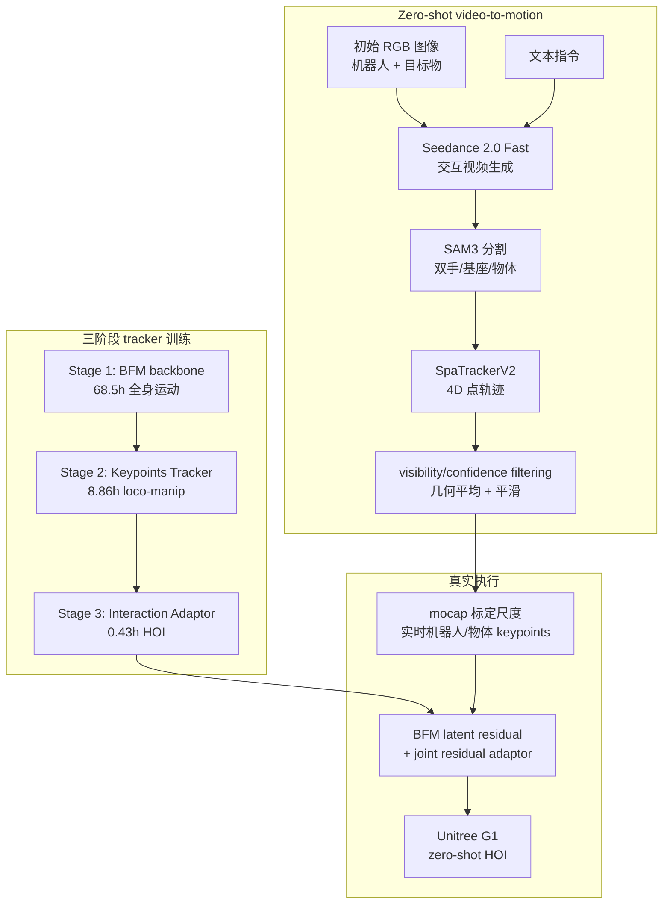

# Imagine2Real

**Imagine2Real: Towards Zero-shot Humanoid-Object Interaction via Video Generative Priors**（arXiv:2605.22272，Zhejiang University / Shanghai AI Laboratory / CUHK）收录于 [具身智能研究室 Loco-Manip 接触专题](../../sources/blogs/wechat_embodied_ai_lab_loco_manip_contact_survey.md) **03 生成式补数** 组。它把“图像 + 文本 → 生成交互视频”接到 **4D point trajectories** 和 **BFM latent-space tracking**，尝试在无目标任务示范的情况下执行人形-物体交互。

## 一句话定义

Imagine2Real 用视频生成模型“想象”交互过程，再用统一 4D 点轨迹和 BFM 潜空间稀疏关键点 tracker 把视频里的机器人/物体运动转成真实 humanoid HOI 执行。

## 英文缩写速查

| 缩写 | 英文全称 | 简要说明 |
|------|----------|----------|
| HOI | Humanoid-Object Interaction / Human-Object Interaction | 本文处理的人形与物体全身交互任务 |
| BFM | Behavior Foundation Model | 作为自然全身运动 latent search space，避免稀疏点跟踪导致怪异姿态 |
| SAM3 | Segment Anything Model 3 | 用于分割机器人手、基座和目标物体区域 |
| SpaTrackerV2 | SpatialTrackerV2 | 从生成视频中跟踪 4D point trajectories |
| PPO | Proximal Policy Optimization | 三阶段 tracker / adaptor 在 Isaac Gym 中训练的 RL 算法 |
| PSI | Physical State Initialization | 对比类复杂训练机制；本文强调用 BFM 降低 reward engineering |

## 为什么重要

- **绕过 CAD / FoundationPose 强依赖**：很多 video-to-real HOI 方法要先估物体 CAD 或 6D pose；Imagine2Real 改用 robot/object 统一 4D 点轨迹，降低表示错位。
- **避免密集 retargeting 误差放大**：只跟踪 base、left hand、right hand 和 object 等交互关键点，不把生成视频强行 morph 成完整人形骨架。
- **BFM 解决稀疏点跟踪的自然性问题**：直接追三点容易抖动、怪姿态；把动作搜索限制在 BFM latent space 中，保留自然步态和平衡先验。
- **生成式补数的典型路线**：与 [GenHOI](./paper-loco-manip-03-genhoi.md) 一样从视频生成先验出发，但 Imagine2Real 更强调 **geometry-free 4D points + BFM tracker**。
- **给接触专题提供边界案例**：它展示视频模型可以提供任务意图和粗物理过程，但真正接触执行仍依赖 mocap、tracker、adaptor 与 sim2real randomization。

## 流程总览

## 核心机制

### 1）统一 4D point trajectories

Imagine2Real 的核心反驳是：分别估计机器人 dense pose 和物体 6D pose 会把二者放进不同坐标/尺度假设中，形成 **Representation Misalignment**。因此它把机器人和物体都表示为同一视频空间中的 4D 点轨迹：

- 对机器人：跟踪 base、left hand、right hand 等关键区域。
- 对物体：跟踪目标物体区域的点云运动。
- 对每个 mask：按 SpaTrackerV2 的 visibility/confidence 过滤无效点，再去除时空 outlier，最后几何平均和平滑为稳定 keypoint trajectory。

这种表示不需要 explicit CAD、物体 mesh morphing 或完整人体重定向，但也牺牲了手指、接触面法向和物体姿态细节。

### 2）BFM backbone：稀疏跟踪的自然运动先验

Stage 1 训练一个 BFM backbone，把局部全身运动序列编码为 latent，再由 predictor + decoder 从 proprioceptive history 生成自然低层动作：

- 训练数据：AMASS、LAFAN1、100STYLE，总计 **10,000+ clips / 68.5h**，经 pink IK retarget 到机器人。
- latent dimension：附录中 BFM latent 为 **32**。
- 作用：冻结后成为下游 keypoints tracker 的低层 motor prior；稀疏点只调制 latent residual，不直接在关节空间乱追点。

### 3）Keypoints Tracker：在 BFM latent 上追三点

Stage 2 的 Keypoints Tracker 不重新训练全身控制器，而是在 frozen predictor/decoder 上学习 residual planner：

1. frozen predictor 给出当前自然 motion prior latent。
2. planner 读取 proprioception、sparse keypoint targets、previous latent 和 current prior。
3. 输出 residual latent，叠加到 prior latent。
4. frozen decoder 将 latent 变为全身动作。

这解释了消融中 Direct tracking 虽然点误差低，但 action rate / smoothness 和自然性差；BFM 版本在保持高 success 的同时显著降低抖动。

### 4）Interaction Adaptor：补足物体接触能力

BFM backbone 主要来自非交互运动，缺少抓/推物体的细节。Stage 3 引入 residual joint-level Interaction Adaptor：

- 输入：proprioceptive history、robot sparse keypoint motion、target object motion。
- 输出：joint residual action，叠加到 Keypoints Tracker 输出。
- 训练数据：OMOMO 中 box-carrying / pushing 子集，经 holosoma HOI retarget，约 **200 clips / 0.43h**。
- 作用：把“追手和基座”变成“真正推动/搬起物体”。

### 5）Mocap deployment：zero-shot 的现实支架

真实执行并不是纯 onboard perception。mocap 系统提供两个关键功能：

- 实时给出机器人和物体 keypoints 的 global positions，作为 tracker 输入。
- 解决生成视频没有 metric depth 的尺度歧义，用初始帧 mocap 位置把 4D 点轨迹标定到真实尺度。

## 工程实践

| 维度 | 记录 |
|------|------|
| 平台 | Unitree G1；真实部署在 motion capture system 内 |
| 视频模型 | Seedance 2.0 Fast；论文也讨论 open-source Wan2.2 物理一致性仍不足 |
| 感知提取 | SAM3 segmentation + SpaTrackerV2 4D point tracking |
| 训练仿真 | Isaac Gym；8192 parallel environments；PPO；单 RTX 4090 |
| 频率 | physics 250 Hz；PD 50 Hz；Keypoints Tracker / Adaptor 10 Hz |
| 开源状态 | 论文称 anonymized source code and pretrained checkpoints 在 supplementary material；未发现公开 GitHub/项目页 |
| 源码运行时序图 | **不适用**：没有公开可访问的官方可运行仓库或 README 入口 |

## 实验与评测

### HOI task execution

| Task | Method | SR (%) | Object error | Hands error | Base error |
|------|--------|--------|--------------|-------------|------------|
| Carry Box | w/o Adaptor | 0.00 | - | - | - |
| Carry Box | w/ Adaptor | **82.65** | 6.34 cm | 7.33 cm | 5.16 cm |
| Push Box | w/o Adaptor | 29.82 | 11.11 cm | 4.42 cm | 5.85 cm |
| Push Box | w/ Adaptor | **64.91** | 9.00 cm | 7.25 cm | 6.49 cm |

### Keypoints tracker 消融

| Method | SR (%) | Hands error | Base error | MPJAE | Action rate | Action smoothness |
|--------|--------|-------------|------------|-------|-------------|-------------------|
| Direct | 99.16 | 1.95 cm | 1.66 cm | 0.44 | 1.65 | 0.64 |
| DAgger | 99.32 | 3.73 cm | 3.32 cm | 0.36 | 0.61 | 0.20 |
| Ours (BFM) | **99.36** | 3.08 cm | 3.78 cm | **0.25** | **0.22** | **0.09** |

真实部署展示 lifting boxes 与 hitting an “Iron Man” pillar 等任务，证明完整 video-to-points-to-real loop 可以跑通，但评测仍在 mocap 环境中。

## 与相邻路线对比

| 路线 | 上游生成/数据 | 几何依赖 | 执行接口 |
|------|---------------|----------|----------|
| Imagine2Real | 生成视频 + 4D points | 不依赖 CAD；依赖 mocap 标定尺度 | BFM latent tracker + interaction adaptor |
| [GenHOI](./paper-loco-manip-03-genhoi.md) | 生成视频恢复交互过程 | 更强调从视频恢复可执行轨迹 | 优化/跟踪闭环 |
| [Humanoid-DART](./paper-humanoid-dart.md) | 稀疏示范 + 扩散轨迹自举 | 需要 seed demonstrations 与物理仿真 | RL motion tracker |
| [VLK](./paper-vlk-synthetic-loco-manipulation.md) | 3DGS 重建场景合成数据 | 依赖场景标注与 G1 interaction synthesis | SceneBot tracker |

## 局限与风险

- **依赖 mocap**：marker occlusion 会影响 close-contact pushing；离开 mocap 场地需要 onboard SLAM、多相机或自跟踪替代。
- **开环视频先验**：生成视频不能根据真实物理反馈即时修正，论文提到 pseudo-closed-loop prompting 低效。
- **视频模型闭源/物理一致性不稳定**：Seedance 2.0 Fast 是外部模型；开源视频模型物理一致性尚不足。
- **稀疏点表示不含接触力**：object orientation、grasp affordance、手指姿态和力闭环需要额外机制。
- **补充材料不等于公开复现**：即使审稿补充含匿名代码，社区仍需等待正式 release 才能复核。

## 关联页面

- [Loco-Manip 接触技术地图](../overview/loco-manip-contact-technology-map.md)
- [03 生成式补数分类 hub](../overview/loco-manip-contact-category-03-generative-data.md)
- [Loco-Manipulation](../tasks/loco-manipulation.md)
- [Behavior Foundation Model](../concepts/behavior-foundation-model.md)
- [Contact-Rich Manipulation](../concepts/contact-rich-manipulation.md)
- [GenHOI](./paper-loco-manip-03-genhoi.md)
- [Humanoid-DART](./paper-humanoid-dart.md)

## 参考来源

- [Imagine2Real 来源摘录](../../sources/papers/imagine2real_arxiv_2605_22272.md)
- [具身智能研究室 Loco-Manip 接触专题](../../sources/blogs/wechat_embodied_ai_lab_loco_manip_contact_survey.md)
- arXiv: <https://arxiv.org/abs/2605.22272>

## 推荐继续阅读

- [GenHOI](./paper-loco-manip-03-genhoi.md)
- [BFM 概念页](../concepts/behavior-foundation-model.md)
- [SpaTrackerV2](https://arxiv.org/abs/2507.12462)
