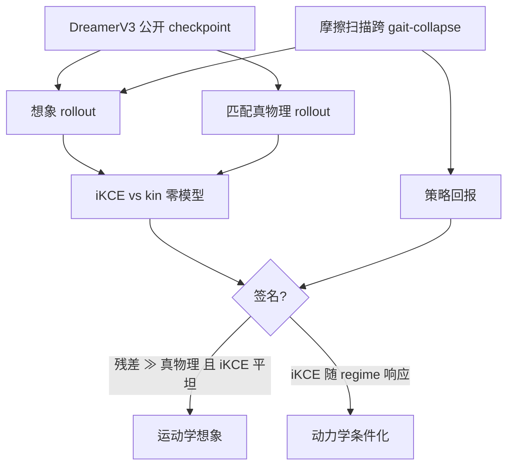

# Imagined Rollouts are Kinematic, Not Dynamic（长程世界模型失败诊断）

**Imagined Rollouts are Kinematic, Not Dynamic**（*A Diagnosis of Long-Horizon World-Model Failure*，[arXiv:2607.05966](https://arxiv.org/abs/2607.05966)，2026，Finn Rasmus Schäfer 等 · **慕尼黑工业大学（TU Munich）**；RSS Robot World Model Workshop）主张：长程想象变差不能只用「误差累积」概括——许多世界模型在做 **运动学外推**，而不是在复现 **动力学约束**。

## 一句话定义

**用 imagined Kinematic-Consistency Error（iKCE）衡量想象轨迹离闭式运动学零模型有多远，再用物理工况扰动检验它是否真的「看见」了动力学边界。**

## 英文缩写速查

| 缩写 | 英文全称 | 简要说明 |
|------|----------|----------|
| iKCE | imagined Kinematic-Consistency Error | 想象 rollout 相对 \(\mathrm{kin}(\cdot)\) 的逐步残差 |
| WM | World Model | 本文诊断对象（以 DreamerV3 为例） |
| DMC | DeepMind Control Suite | walker-walk 实验环境 |
| MBRL | Model-Based Reinforcement Learning | Dreamer 等规划/想象学习范式 |
| MBPO | Model-Based Policy Optimization | 误差累积界叙事代表 |
| kin | kinematic null predictor | 恒速 / 恒加速等闭式运动学预测器 |
| RSS | Robotics: Science and Systems | 本文 workshop 挂靠会议 |

## 为什么重要

- **给「物理保真」一个可证伪协议：** 对齐 [物理保真度输出轴](../overview/world-model-physics-fidelity-outputs.md) 的 **动力学敏感性** 测试，而不是只看回报或像素误差。
- **与控制概念打通：** [运动学可行 ≠ 动力学可行](../concepts/kinematic-vs-dynamic-feasibility.md) 在 **想象空间** 的对应物——轨迹可以「自洽」却对摩擦崩溃不敏感。
- **第三种失败叙事：** 相对 Dreamer 系「可预测表征工程」与 MBPO「误差累积界」，提出 **kinematic fallback**。
- **开权重点可复述：** 用公开发布的 DreamerV3 checkpoint，不依赖作者私有训练。

## 核心信息

| 项 | 内容 |
|----|------|
| 机构 | 慕尼黑工业大学（TUM）AVS Lab + DAMML |
| 会场 | RSS Robot World Model Workshop 2026 |
| 实例模型 | DreamerV3 @ DMC **walker-walk** |
| 关键诊断 | iKCE + 摩擦扫描（跨 gait-collapse） |
| 关键签名 | \(T{=}16\) 时 null residual **∼180×** 真物理；摩擦变、iKCE **统计平坦** |
| 开源 | **未开源**（诊断脚本未见官方仓，2026-07-27） |

## 核心原理（方法）

### 运动学 vs 动力学（本文定义）

| | 运动学想象 | 动力学想象 |
|---|-----------|-----------|
| 描述量 | 位置 / 速度 / 加速度时间序列 | 还需质量、摩擦、接触等约束成立 |
| 失败样子 | 轨迹局部自洽，但对工况边界不敏感 | 工况跨越 regime 时预测结构应改变 |
| 文献位置 | 本文主张的常见默认行为 | 规划可用的物理条件化行为 |

### iKCE 定义

对想象轨迹 \(\{\hat{x}^{\mathrm{WM}}_t\}_{t=0}^{T}\)，选运动学状态（如 \([x,y,v,a,\theta]^\top\)）：

\[
\mathrm{iKCE} \;\doteq\; \frac{1}{T}\sum_{t=0}^{T-1}\left\lVert \hat{x}^{\mathrm{WM}}_{t+1} - \mathrm{kin}\big(\hat{x}^{\mathrm{WM}}_{t}\big) \right\rVert_2
\]

\(\mathrm{kin}(\cdot)\) 为匹配具身与输出空间的闭式运动学预测器。形式来自 Gao 等训练期 kinematic-consistency loss，这里改为 **测试期** 诊断（前缀 **i**）。

### 扰动协议

1. 在名义物理上记录策略回报与匹配真物理 rollout 的 iKCE。
2. 扫描摩擦等参数，跨越 **gait-collapse** 等经验 regime 边界。
3. 若策略回报崩塌而 **想象 iKCE 不响应**，则得到 kinematic-not-dynamic 签名。
4. **签名强调 regime-invariance**，不是绝对 iKCE 幅度（平凡运动学预测器也会有高残差）。

### 流程总览

## 源码运行时序图

**不适用。** 截至 **2026-07-27**：本文 **未发布** 独立 diagnostic 代码仓；实验依赖上游 DreamerV3 权重与论文协议。可按 Eq.(1) 与摩擦扫描自建复现，但 **无官方可运行入口**。

## 实验要点（索引级）

| 轴 | 报告口径（以论文为准） |
|----|------------------------|
| 平台 | DMC **walker-walk** + 公开发布 DreamerV3 |
| 幅度签名 | \(T{=}16\) kinematic-null residual **∼180×** matched physics |
| 不变性签名 | 摩擦扫过 gait-collapse：**回报崩塌，iKCE 统计平坦** |
| Horizon | 需 **长于步态周期** 才能区分运动学 / 动力学想象 |
| 对照叙事 | Dreamer 表征工程；MBPO compounding-error bounds |

## 工程实践

| 项 | 实践要点 |
|----|----------|
| 何时用 | 怀疑 latent / 视频 WM「只会外推光滑轨迹」时，加动力学敏感性探针 |
| 怎么读 | 高 iKCE **单独**不够；必须看 **扰动是否改变** iKCE |
| 与像素评测 | 互补于 FVD / LPIPS；也互补于 [Thinking in Video](./paper-thinking-in-video.md) 的因果感知 |
| 与执行评测 | [KineBench](./paper-kinebench.md) 测「视频动作能否在仿真执行」；本页测「想象是否条件化于物理」 |
| 部署 | 诊断本身轻量；但需能导出 WM 状态轨迹与可扫的环境参数 |

## 结论

**长程失败常表现为运动学自洽的想象对物理 regime 不敏感；iKCE + 扰动协议把这一点变成可报告的签名，而不是笼统的「误差大了」。**

1. **重新框定问题** — compounding error 正确但欠定；要问累积的是哪类误差。
2. **iKCE 可操作** — 闭式 \(\mathrm{kin}\) 残差均值，测试期即可算。
3. **双签名** — 相对真物理的大幅 residual（∼180× @ \(T{=}16\)）+ 摩擦扫描下的 **不变性**。
4. **Horizon 门槛** — 短于步态周期可能看不出；诊断窗口要够长。
5. **选型含义** — 规划用 WM 若在工况边界上 iKCE 不响应，不宜单独作物理可行性判据。
6. **开源** — 协议可复述；官方 diagnostic 包截至入库日 **未发布**。

## 局限与风险

- **单具身实例：** 主结果在 walker-walk / DreamerV3；外推到视频 WM / 人形需额外实验。
- **kin 选择敏感：** 零模型形式需匹配状态定义，否则诊断偏移。
- **未开源 diagnostic：** 第三方结果对比成本高。
- **不替代任务成功：** 动力学敏感仍可能任务失败；需与可执行性 / 策略相关测试联用。

## 与相邻工作的对比（分界）

| 对比轴 | 本文 iKCE | [KineBench](./paper-kinebench.md) | [Thinking in Video](./paper-thinking-in-video.md) |
|--------|-----------|-----------------------------------|--------------------------------------------------|
| **对象** | Latent MBRL 想象 | 具身视频 WM 生成轨迹 | 通用视频生成器因果 |
| **主问题** | 运动学 vs 动力学 | IDM 归因混淆 / 可执行性 | 感知–预测差距 |
| **协议** | 残差 + 摩擦扰动 | 6D EEF → ManiSkill3 | CGDJ 双轨 |
| **开源** | 未开源 | MIT 已开源 | 代码+数据已开源 |

## 关联页面

- [世界模型物理保真度输出轴](../overview/world-model-physics-fidelity-outputs.md)
- [运动学可行与动力学可行](../concepts/kinematic-vs-dynamic-feasibility.md)
- [DreamerV3](./paper-shenlan-wm-13-dreamerv3.md)
- [Model-Based RL](../methods/model-based-rl.md)
- [KineBench](./paper-kinebench.md)
- [Thinking in Video](./paper-thinking-in-video.md)
- [PhysCoRe](./paper-physcore.md) — 显式动力学混合对照

## 参考来源

- [Imagined Rollouts… 论文归档（arXiv:2607.05966）](../../sources/papers/imagined_rollouts_kinematic_not_dynamic_arxiv_2607_05966.md)
- [具身智能研究室 · 世界模型物理保真度导读](../../sources/blogs/wechat_embodied_ai_lab_world_model_physics_fidelity.md)

## 推荐继续阅读

- [arXiv:2607.05966](https://arxiv.org/abs/2607.05966)
- [DreamerV3 实体页](./paper-shenlan-wm-13-dreamerv3.md)
- [KineBench](./paper-kinebench.md) — 执行向诊断
