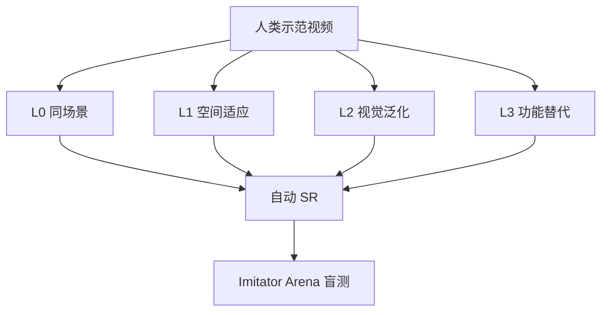

# The Imitator Game：用目标等价衡量模仿

**The Imitator Game**（*Benchmarking Robot Imitative Ability Beyond Action Prediction*，[arXiv:2608.22301](https://arxiv.org/abs/2608.22301)，[项目页](https://imitator-game.github.io/)）由 **香港大学（HKU）**、**超忆（TranscEngram）**、**复旦大学（Fudan）** 与 **浙江大学（ZJU）** 提出：四级任务差异把人类示范与机器人现场逐步拉开，配套 IG-10K 配对数据与开放盲测平台 Imitator Arena。

## 一句话定义

**机器人真正的模仿能力，应以目标等价而非动作相似来衡量——L3 功能替代才是轨迹复现失效、意图理解必须上场的分界。**

## 英文缩写速查

| 缩写 | 英文全称 | 简要说明 |
|------|----------|----------|
| IG-10K | Imitator Game 10K | 2 万余组人机配对数据集 |
| L0–L3 | Level 0–3 | 场景相同 → 功能替代四级 |
| VLA | Vision-Language-Action | 字幕条件族对照 |
| P+FT | Pretrain + Fine-Tune | IG-10K 预训练再 10 条微调 |
| SR | Success Rate | 自动成功率；与 Arena 人类分对照 |

## 为什么重要

- **现有榜多测「像不像」：** 近似场景复现轨迹就能过。本基准逼模型换工具/物体仍完成同一意图。
- **数据接口统一：** 仿真与真机同一格式，含 MANO、分割与多层语言。
- **人类盲测校准：** Arena 与自动 SR 相关 r≈0.86，避免只信脚本判定。

## 核心信息

| 项 | 内容 |
|----|------|
| **机构** | 香港大学（HKU）；超忆（TranscEngram）；复旦大学（Fudan）；浙江大学（ZJU） |
| **数据** | IG-10K：20,000+ 配对、50+ 任务、6 领域、四级全覆盖 |
| **开源** | **部分开源** — 项目页 + Arena；训练仓未见 |

## 核心原理（方法）

每一级要同一结果，变的是示范轨迹还能用多少：

| 级 | 名称 | 还能否靠复现轨迹 |
|----|------|------------------|
| L0 | Scene-identical | 能 |
| L1 | Spatial adaptation | 部分（布局变） |
| L2 | Visual generalization | 外观变，轨迹骨架或仍在 |
| L3 | Intent-level transfer | 否；必须换 affordance |

固定协议：5 个 seen + 5 个 unseen 任务 × 四级。鼓励社区评完整 50 任务。

### 流程总览

## 工程实践

| 项 | 建议 |
|----|------|
| **源码运行时序图** | **不适用**（截至 2026-08-30 无官方训练仓） |
| 读榜 | 先看 L3 与 unseen 零样本，不要只报 L0 |
| 微调预算 | 论文显示 10 组配对就够拉开 P+FT，但依赖 IG-10K 预训练规模 |
| 编码器 | 视频条件族里 DINOv2 / SigLIP2 稳定优于 VideoMAE |

## 实验与评测

| 设定 | 结果 |
|------|------|
| L0–L2 | 九个先进模型表现稳定 |
| L3 功能替代 | 明显崩溃（作者定为决定性壁垒） |
| 未见任务零样本 | 全部模型 **<13%** |
| 10 条配对 P+FT | 相对零样本显著增益，随预训练任务数增大 |
| 自动 SR vs Arena | r ≈ **0.858 / 0.861** |

## 结论

**L3 才是意图模仿的考场；L0 高分只说明轨迹回放还没被拆穿。**

1. **人视频条件 > 字幕条件** — 但两者在未见任务零样本都弱。
2. **10 条配对的价值取决于预训练规模** — 没有 IG-10K 先验就不要指望 few-shot 神话。
3. **自动指标可用** — 与人类盲测相关足够高，但仍应抽查 Arena。
4. **功能替代单独记账** — 不要把 L0–L2 平均掉 L3。
5. **训练栈未开源** — 现阶段贡献评测协议与提交，而不是复现九模型。

## 与其他工作对比

| 对照 | 差异读法 |
|------|----------|
| [Indi](./paper-indi.md) | 蒸馏局部目标进 VLA；本页是评测「目标等价」本身 |
| 常规 BC / ACT / DP 榜 | 多在近复现设定；本页把差距显式分级 |
| 人类视频预训练 VLA | 本页显示视频条件更强，但仍过不了 L3 / unseen |

## 局限与风险

- 主协议只用 10 个任务（5+5），50 任务全表是参考而非默认。
- 数据集下载开放程度以项目页为准，入库日未核独立镜像。
- 无训练仓则无法复核九模型配方。

## 关联页面

- [模仿学习](../methods/imitation-learning.md)
- [VLA](../methods/vla.md)
- [Indi](./paper-indi.md)
- [Manipulation](../tasks/manipulation.md)
- [48ms WAM / 编排 10 篇地图](../overview/glancewam-vla-crew-10-papers-technology-map.md)

## 参考来源

- [imitator_game_arxiv_2608_22301](../../sources/papers/imitator_game_arxiv_2608_22301.md)
- [项目页归档](../../sources/sites/imitator-game-github-io.md)
- [具身智能小站 10 篇盘点](../../sources/blogs/wechat_embodied_station_10_papers_glancewam_vla_crew_2026-08-30.md)

## 推荐继续阅读

- [arXiv:2608.22301](https://arxiv.org/abs/2608.22301)
- [项目页 / Arena](https://imitator-game.github.io/)
