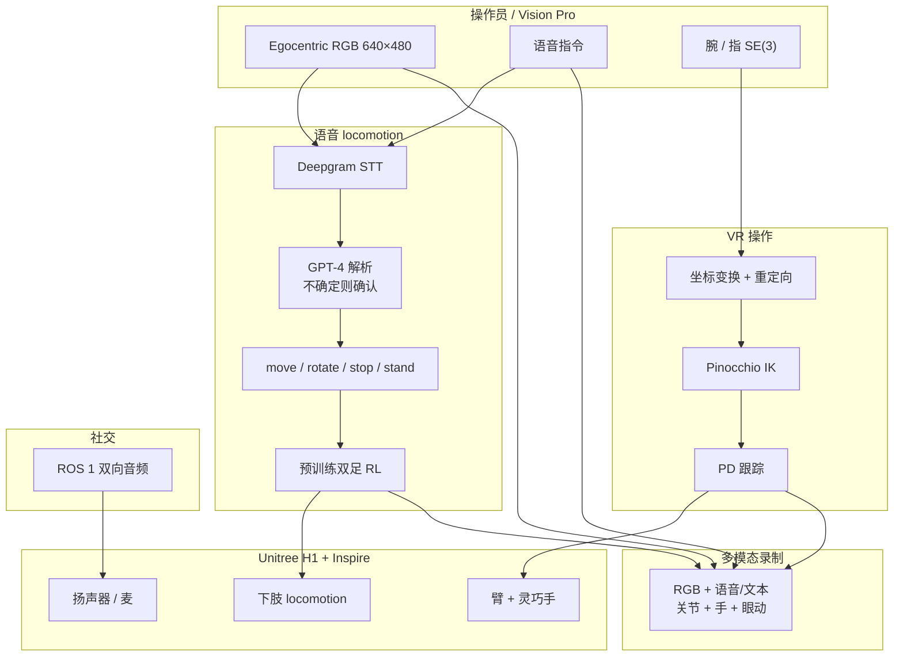

# Immersive Social VR + LLM Humanoid Teleop

**Immersive Social Interaction with VR and LLM-Assisted Humanoids**（[arXiv:2607.07430](https://arxiv.org/abs/2607.07430)，IEEE-RAS Humanoids Workshop *Designing Interactive Humanoids*）由 **纽约大学阿布扎比分校（NYU Abu Dhabi）** 提出：在 **Apple Vision Pro** 上把 **自然语言语音 locomotion**、**腕/指 VR 操作** 与 **双向音频社交** 合成为可及的全身人形遥操作接口，并在 **Unitree H1 + Inspire 灵巧手** 上验证采数与任务成功率。

## 一句话定义

**用语音（LLM）管腿、用 VR 手管臂与灵巧手，再用双向音频做人机社交——降低全身动捕与低层遥控的负担，同时录多模态示范。**

## 英文缩写速查

| 缩写 | 英文全称 | 简要说明 |
|------|----------|----------|
| LLM | Large Language Model | 文中用 GPT-4 解析语音为高层 locomotion API |
| VR | Virtual Reality / Spatial Computing | Apple Vision Pro 提供 egocentric 视场与手部跟踪 |
| STT / TTS | Speech-to-Text / Text-to-Speech | Deepgram 转写 + Silero 合成 |
| IK | Inverse Kinematics | Pinocchio 将腕姿解为臂关节 |
| PD | Proportional–Derivative Control | 臂/手关节跟踪底层 |
| ROS | Robot Operating System | ROS 1 双向音频节点 |
| IL | Imitation Learning | 多模态遥操作数据的下游用途（本文未训策略） |

## 为什么重要

- **接口分层清晰：** locomotion 走高层语义命令，操作走连续手跟踪——相对全身 shadowing（如 [HumanPlus](./paper-loco-manip-161-012-humanplus.md)、[H2O](./paper-hrl-stack-07-learning_human_to_humanoid_real_time.md)）降低操作员体力，相对纯摇杆降低认知负担。
- **社交通道一等公民：** 不只采数，还用双向音频做传物/握手等 telepresence，对齐养老陪伴与危险环境远程协助叙事。
- **采数模态更全：** egocentric RGB、语音/文本、19 身体 + 12 手关节、眼动——为后续 [模仿学习](../methods/imitation-learning.md) / embodied reasoning 留接口（文中指向同组 chain-of-action 等工作）。
- **对照表可读：** Table II 把自身相对 [Open-TeleVision](./paper-loco-manip-161-131-open-television.md) / HumanPlus / H2O 定位为「语音 locomotion + 操作 + 社交」全覆盖。

## 核心信息

| 字段 | 内容 |
|------|------|
| 机构 | 纽约大学阿布扎比分校（NYU Abu Dhabi） |
| 作者 | Niraj Pudasaini、Geeta Chandra Raju Bethala、Pranav Doma、Anthony Tzes、Yi Fang |
| 平台 | Unitree **H1** + Inspire Robotics 灵巧手；Apple Vision Pro |
| 输入 | egocentric RGB（640×480）、语音、腕/指 SE(3)、眼动 |
| 输出 | 高层 locomotion API（`move/rotate/stop/stand`）+ 臂 4 DoF/侧 + 手 6 DoF/侧 + 扬声器音频 |
| 栈 | Deepgram + GPT-4 + Silero/LiveKit；VisionProTeleop；Pinocchio IK + PD；ROS 1 音频；预训练双足 RL |
| 开源 | **确认未开源**（截至 2026-08-09：无项目页、无官方仓；仅第三方组件链接） |

## 流程总览

## 核心原理

### 1）语音高层 locomotion

- STT → LLM 映射到离散高层 API，再调用预训练双足策略；双足形态本身不自稳，实现时需依赖既有 RL locomotion。
- 不确定指令二次确认；GPT-4V 场景描述按需开启，默认关以保实时性。

### 2）VR 腕/指操作

- 采用 [VisionProTeleop](https://github.com/Improbable-AI/VisionProTeleop) 流式姿态；腕姿变换到机器人系后 IK，手指映射到 Inspire 手 6 DoF/侧。
- 与 [Teleopit](./paper-teleopit.md)（PICO 全身+连续灵巧手+主动视觉、已开源）不同：本文 **下肢不跟全身动捕**，而走语音高层命令。

### 3）社交与采数

- ROS 1 双向音频支持口头请求与环境聆听；作者指出 **仅 egocentric 不利于导航**，规划腰部相机。
- 录制通道对齐未来 IL / Gaussian Splatting 感知，但本文评测止于遥操作成功率，**未报告下游策略训练结果**。

## 源码运行时序图

**不适用（官方可运行代码未发布）。** 截至 **2026-08-09**：无项目页与官方 GitHub；论文仅引用第三方 VisionProTeleop、LiveKit、Silero 等组件。发布后应补：Vision Pro 传感 → STT/LLM/TTS → locomotion API / IK-PD → H1 IO → 多模态 recorder 的 `sequenceDiagram`。

## 工程实践

| 项 | 建议 / 论文设定 |
|----|----------------|
| 何时对照 | 需要 **低体力** 的全身接口，且强调 **语音+社交**，而非高精度全身 shadowing |
| 硬件清单 | AVP + H1 + Inspire 手 + ROS 1 音频；LLM/STT 需云或本地 API |
| 延迟预算 | 关默认视觉描述；对不确定语音加确认环，换鲁棒性 |
| 采数字段 | egocentric RGB、voice/text、19 body + 12 hand joints、eye-gaze |
| 复现边界 | **系统未开源**；只能复用第三方组件自组，不能当「一键跑通」论文仓 |
| 与 Open-TeleVision | 后者偏沉浸主动视觉采数闭环；本文加 **LLM 语音腿控 + 双向社交** |
| 同组后续 | [H2-COMPACT](./paper-loco-manip-161-062-h2-compact.md) 等同作者协作工作，勿与本系统代码混为一谈 |

## 实验与评测

| 任务 | 新手 SR / 时间 | 专家 SR / 时间 |
|------|----------------|----------------|
| 物体抓放（瓶→盒） | **0.8** / 52 s | **0.90** / 22 s |
| 社交传方块（口头要物→递交） | **0.7** / 326 s | **0.8** / 158 s |

- 新手经短暂熟悉即可操作；社交任务耗时显著更长（步行+口头协调）。
- 对比声明（Table II）：相对 Open-TeleVision / HumanPlus / Human-to-Humanoid，作者强调同时具备语音 locomotion、操作与社交交互（表中勾选以原文为准）。

## 结论

**这是一篇「接口可达性」论文，不是新 locomotion/IL 算法：把腿交给 LLM 高层 API、把手交给 VR、把社交交给双向音频，用 H1 真机证明新手也能用。**

1. **选型先问目标：** 要低负担远程协助/采数 → 看本文分层接口；要高保真全身跟踪/灵巧手开源栈 → 看 [Teleopit](./paper-teleopit.md) / [Open-TeleVision](./paper-loco-manip-161-131-open-television.md)。
2. **真影响指标是新手 SR 与上手时间** — 80%/70% 与专家差距主要在时间（52→22 s、326→158 s），说明瓶颈在熟练度而非「能不能做」。
3. **LLM 是解析器不是控制器** — 真正走步的是预训练双足 RL；语音链路要有确认环防误解析。
4. **采数承诺 ≠ 已训策略** — 多模态字段齐全，但下游 IL 结果留给后续；勿把本文当行为克隆 benchmark。
5. **复现预期要低** — 官方系统未开源；工程上最多拼第三方 AVP/语音组件。
6. **导航感知缺口已知** — 作者承认纯 egocentric 不适导航，腰部相机是明确后续项。

## 局限与风险

- **未开源：** 无法核对 prompt、IK 标定、RL 策略版本与录制格式。
- **评测规模有限：** 两任务、新手/专家对照；无大规模用户研究或跨场景泛化。
- **LLM 误解析：** 虽有确认环，仍依赖云 API 与网络；安全关键指令需额外硬约束。
- **双足稳定与视场：** 双足不自稳 + 仅第一人称，复杂环境导航风险高。
- **误区：** 不要把「LLM-Assisted」读成端到端语言策略或 VLA——本文 LLM 只解析高层 locomotion API。

## 与其他工作对比

| 系统 | 腿/移动 | 臂手 | 社交 / 音频 | 开源 |
|------|---------|------|-------------|------|
| [Open-TeleVision](./paper-loco-manip-161-131-open-television.md) | 沉浸主动视觉遥操作 | VR 操作采数 | 非本文重点 | 有项目页 |
| [HumanPlus](./paper-loco-manip-161-012-humanplus.md) | 全身 shadowing / IL | 全身 | — | 有开源栈 |
| [H2O](./paper-hrl-stack-07-learning_human_to_humanoid_real_time.md) | 实时全身 teleop | 全身 | — | [human2humanoid](./human2humanoid.md) |
| [Teleopit](./paper-teleopit.md) | VR 全身跟踪 | 连续灵巧手 + 主动视觉 | — | **五仓开源** |
| **本文（NYUAD）** | **语音 + LLM → 高层 API + RL** | **AVP 腕/指 + IK/PD** | **ROS 双向音频** | **未开源** |

## 关联页面

- [Teleoperation](../tasks/teleoperation.md) — 遥操作系统对照表入口
- [Loco-Manipulation](../tasks/loco-manipulation.md) — 行走–操作耦合任务
- [Whole-Body Control](../concepts/whole-body-control.md) — 全身控制背景
- [Imitation Learning](../methods/imitation-learning.md) — 多模态采数下游
- [Unitree](./unitree.md) — H1 平台组织页
- [Open-TeleVision](./paper-loco-manip-161-131-open-television.md) / [HumanPlus](./paper-loco-manip-161-012-humanplus.md) / [H2O](./paper-hrl-stack-07-learning_human_to_humanoid_real_time.md) — Table II 对照
- [Teleopit](./paper-teleopit.md) — 同期 VR 全身+灵巧手开源对照
- [H2-COMPACT](./paper-loco-manip-161-062-h2-compact.md) — 同组协作相关工作

## 参考来源

- [immersive_social_vr_llm_humanoids_arxiv_2607_07430.md](../../sources/papers/immersive_social_vr_llm_humanoids_arxiv_2607_07430.md) — 本篇 arXiv 归档与开源核查
- [arXiv:2607.07430](https://arxiv.org/abs/2607.07430) — 论文摘要与 PDF/HTML

## 推荐继续阅读

- [arXiv abs / PDF](https://arxiv.org/abs/2607.07430)
- [VisionProTeleop（第三方组件）](https://github.com/Improbable-AI/VisionProTeleop)
- [Teleoperation 任务页](../tasks/teleoperation.md)
- [Teleopit 论文实体](./paper-teleopit.md) — 开源 VR 全身遥操作对照
