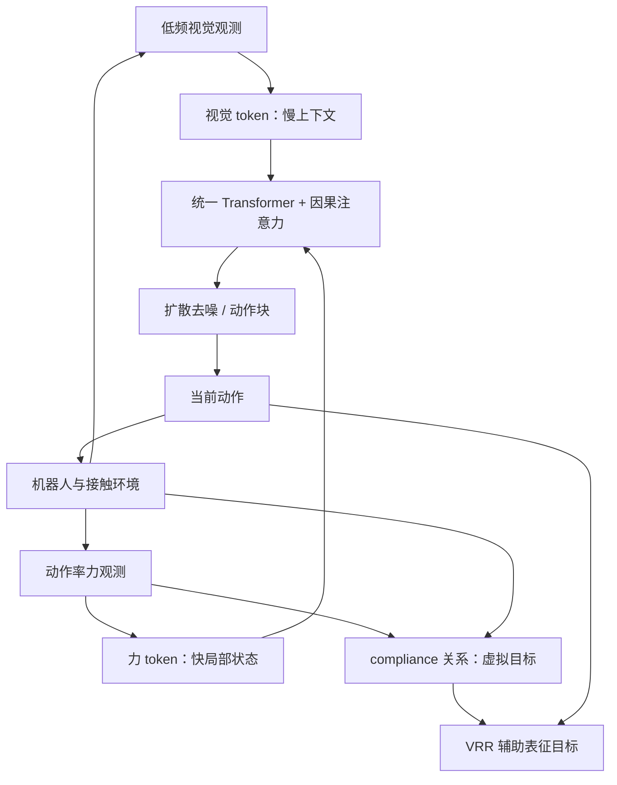

# ImplicitRDP：端到端视觉–力扩散策略

**ImplicitRDP: An End-to-End Visual-Force Diffusion Policy With Structural Slow-Fast Learning** 是 RDP 的端到端后续工作：保留视觉规划慢、力反馈快的时间结构，但不再让两个独立策略显式交接；改用统一 Transformer 对异步视觉与力 token 作因果序列建模，并加入 **Virtual-target-based Representation Regularization（VRR）**，以物理一致的虚拟目标表示作为力觉学习信号。发表于 **IEEE Robotics and Automation Letters (RA-L) 2026, Vol. 11, No. 8, pp. 10010–10017**。

## 一句话定义

**同一扩散策略接收低频视觉上下文与动作率力输入，再以 compliance 关系导出的虚拟目标把力监督锚定到动作空间。**

## 英文缩写速查

| 缩写 | 英文全称 | 简要说明 |
|------|----------|----------|
| ImplicitRDP | Implicit Reactive Diffusion Policy | 端到端视觉–力扩散策略 |
| RDP | Reactive Diffusion Policy | 显式慢–快视觉–触觉策略前作 |
| SSL | Structural Slow-Fast Learning | 因果注意力处理异步模态并维持动作块时序 |
| VRR | Virtual-target-based Representation Regularization | 以虚拟目标辅助表征，强化力对动作的影响 |
| DP | Diffusion Policy | 视觉扩散策略基线 |
| F/T | Force/Torque | 力/力矩输入 |
| RA-L | IEEE Robotics and Automation Letters | 论文发表期刊 |

## 为什么重要

- RDP 快策略只接收压缩后的 latent action，空间上下文不足时难以纠正慢层错误；ImplicitRDP 用统一模型保留慢快因果关系。
- 原始力值回归不保证策略学会如何动作；VRR 将力反馈映射到顺应关系下的虚拟目标位置，与动作空间更直接对齐。
- 视觉 token 低频、力 token 按动作率到来，causal attention 建模时序依赖，而非将两种信号硬同步成同频输入。
- Box flipping 与 switch toggling 两项真机任务的表格均报告 18/20 成功；此结论限于论文设定。
- 官方项目页将其称为 RDP 的 end-to-end version；关系详见 [RDP 条目](./paper-sa-2503-02881-reactive-diffusion-policy-slow-fast-visual-tacti.md)。

## 核心信息

| 项 | 内容 |
|----|------|
| 论文 | [arXiv:2512.10946](https://arxiv.org/abs/2512.10946)（v2，2026-07-21） |
| 期刊 | IEEE Robotics and Automation Letters, 2026, Vol. 11, No. 8, pp. 10010–10017 |
| DOI | [10.1109/LRA.2026.3710031](https://doi.org/10.1109/LRA.2026.3710031) |
| 作者 | Wendi Chen、Han Xue、Yi Wang、Fangyuan Zhou、Jun Lv、Yang Jin、Shirun Tang、Chuan Wen、Cewu Lu |
| 机构 | 上海交通大学；上海创智学院；Noematrix Ltd.（部分作者） |
| 项目 | [ImplicitRDP 项目主页](https://implicit-rdp.github.io/) |
| 代码 | [Chen-Wendi/ImplicitRDP](https://github.com/Chen-Wendi/ImplicitRDP) |

## 方法与推理数据流

训练使用去噪动作目标，并加入 VRR 辅助目标。VRR 根据实测力与机器人 compliance/stiffness 关系构造虚拟目标位置，将表示监督放在动作相关空间，而不只是复现原始力读数。推理保留 chunk 连贯性：慢视觉上下文可复用，chunk 内以新力观测更新快反应路径。论文称之为 consistent inference，旨在支持动作率闭环而不破坏扩散采样时序。

准静态近似下，虚拟目标关系可写为 (x_v = x_{real} + K^{-1} f_{ext})，其中真实位置、外力与顺应/刚度参数的符号和坐标约定应以论文定义为准。这是 VRR 的物理动机，不是独立控制器。

## 与 RDP 的架构对比

| 维度 | RDP（RSS 2025） | ImplicitRDP（RA-L 2026） |
|------|----------------|--------------------------|
| 策略结构 | 慢 LDP + 快 AT 两个显式阶段 | 单个端到端扩散模型，内含慢快因果结构 |
| 快信号 | tactile/force 输入 AT 并修正 latent chunk | 异步视觉与 force token 输入统一 causal sequence |
| 监督 | 非对称 tokenizer 与分阶段训练 | 扩散动作目标 + VRR 虚拟目标辅助表示 |
| 关键取舍 | 模块边界清楚，依赖慢层 latent | 避免显式 hand-over；时序 mask、chunk cache 与辅助损失实现更关键 |
| 代表任务 | 剥皮、擦拭、双臂提杯 | Box flipping、switch toggling |

## 评测与消融

主表在两项接触丰富真机任务各试验 20 次。不同于 RDP 原文的剥皮/擦拭指标，不能直接横向排名。

| 方法 | Box flipping | Switch toggling |
|------|--------------|-----------------|
| Diffusion Policy | 0/20 | 8/20 |
| Reactive Diffusion Policy | 16/20 | 10/20 |
| **ImplicitRDP** | **18/20** | **18/20** |

结构/闭环消融：

| 变体 | Box flipping | Switch toggling |
|------|--------------|-----------------|
| 去除 SSL 与 VRR | 6/20 | 5/20 |
| 去除 SSL | 4/20 | 15/20 |
| 完整 ImplicitRDP | **18/20** | **18/20** |

这些结果支持结构化慢快学习与 VRR 的组合在所测任务上有帮助，但小规模实机对照不等价于跨机器人或跨任务的泛化保证。

## 工程实践与开源边界

- 官方仓库为论文配套研究代码；具体依赖、数据格式、机器人平台、权重、许可与复现状态以仓库当前 README、LICENSE 和 release 为准。
- VRR 是训练辅助表征目标，不是部署时额外接入的虚拟传感器或独立高层规划器。
- 虚拟目标依赖外力、坐标系与顺应关系的近似；复现时应检查论文硬件设计、controller tuning 与 implementation details。
- 本页不声称仓库对任意机器人、力传感器或驱动开箱即用，也不推断代码、数据与权重共享许可。

## 结论

**ImplicitRDP 将 RDP 显式两个模型间的 hand-over 改写成带因果结构的端到端序列建模，并通过 VRR 提供更贴近动作空间的力觉监督。**它在两项任务上达到 18/20，同时增加了对力坐标、顺应参数、时序结构和辅助损失稳定性的要求。

## 局限与注意事项

- 两项任务、每项 20 次试验不能证明跨任务泛化或极端接触安全性。
- VRR 依赖外力与机械顺应关系近似；坐标、刚度估计或控制偏差会改变虚拟目标。
- 统一结构减少显式接口，却使时序 mask、chunk cache、辅助损失权重等实现细节更重要。
- 与 RDP 的任务、传感器与评分口径不同，不能从两篇表格得出统一 benchmark 排名。

## 关联页面

- [Reactive Diffusion Policy（RDP）](./paper-sa-2503-02881-reactive-diffusion-policy-slow-fast-visual-tacti.md) — 直接前作；含 TactAR 与触觉/力实验
- [FA-RDP](./paper-fa-rdp.md) — 相关频率自适应后续工作
- [Diffusion Policy](../methods/diffusion-policy.md)
- [Imitation Learning](../methods/imitation-learning.md)
- [Contact-Rich Manipulation](../concepts/contact-rich-manipulation.md)
- [Hybrid Force-Position Control](../concepts/hybrid-force-position-control.md)
- [Manipulation](../tasks/manipulation.md)

## 参考来源

- [arXiv 论文与摘录](../../sources/papers/implicitrdp_arxiv_2512_10946.md)
- [项目页归档](../../sources/sites/implicit-rdp-github-io.md)
- [代码仓归档](../../sources/repos/implicitrdp.md)
