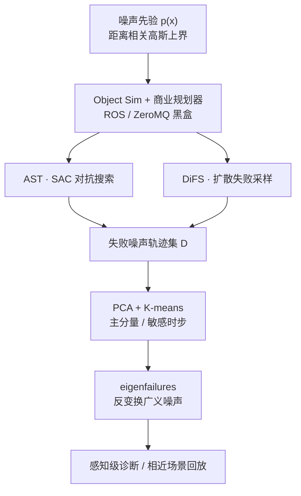

# Importance Sampling + PCA：商业自动驾驶失败挖掘与 eigenfailure 诊断

**Importance Sampling and PCA for Finding Failures in Commercial Autonomous Vehicles**（[arXiv:2607.18106](https://arxiv.org/abs/2607.18106)，IEEE ICVES 2026 submitted）由 **斯坦福大学航空航天系** 与 **Torc Robotics** 合作：把 **Adaptive Stress Testing (AST)** 与 **Diffusion-based Failure Sampling (DiFS)** 接到商业自动驾驶卡车规划栈，在 Monte Carlo 挖不出碰撞的 cut-in/merge 场景上找到失败；再用 **PCA + K-means** 把失败噪声轨迹压成可回放的典型模式（eigenfailures），通向感知级诊断。

## 一句话定义

**用 AST / DiFS 在商业 AV 黑盒上高效采样「最可能致撞」的感知噪声轨迹，再用 PCA 聚类反变换抽出可复现的典型失败模式（eigenfailures）。**

## 英文缩写速查

| 缩写 | 英文全称 | 简要说明 |
|------|----------|----------|
| AST | Adaptive Stress Testing | 用 RL（本文 SAC）对抗搜索最可能致失败的噪声轨迹 |
| DiFS | Diffusion-based Failure Sampling | 用去噪扩散迭代采样多样、高似然失败 |
| PCA | Principal Component Analysis | 对失败噪声集降维，提取主模式与敏感时步 |
| MC | Monte Carlo | 按噪声先验直接采样；商业栈上常挖不到碰撞 |
| SAC | Soft Actor-Critic | AST 对抗策略的求解器 |
| IDM | Intelligent Driver Model | 学术基线驾驶模型；MC 失败率远高于商业栈 |
| MinTTC / DRAC | Minimum Time-To-Collision / Deceleration Rate to Avoid Crash | 文中代理安全指标（美交部口径） |

## 为什么重要

- **填商业栈空白：** 稀有失败挖掘此前多在 IDM 等简单模型上演示；商业规划器失败更稀，MC 在本文设定下 **2000** 回合仍 **0** 碰撞——说明需要针对性 importance sampling。
- **从「找到」到「可修」：** 原始噪声轨迹难指导修复；PCA 给出主分量敏感时步与可回放 eigenfailures，把验证输出接到感知规格诊断。
- **与部署安全层互补：** [Safety Filter](../concepts/safety-filter.md) / [Safe RL](../methods/safe-rl.md) 约束在线动作；本文是 **离线验证侧** 的失败发现与归类，不替代硬约束。

## 核心信息

| 字段 | 内容 |
|------|------|
| 机构 | 斯坦福大学（Stanford）；托克机器人（Torc Robotics） |
| arXiv / 会议 | [2607.18106](https://arxiv.org/abs/2607.18106)；IEEE ICVES 2026（Submitted） |
| 平台 | 商业自动驾驶卡车规划栈（规则层次长时域路径 + QP 安全/舒适；多驾驶模式与安全覆盖） |
| 仿真 | Applied Intuition **Object Sim**；规划经 **ROS**；AST/DiFS 经 **ZeroMQ** 黑盒注入观测噪声 |
| 场景 | 高速 **cut-in / merge**；对最近 actor 感知位置加性噪声 |
| 开源（截至 2026-08-01） | **确认未开源**：无项目页/GitHub；商业栈不可社区复现 |

## 核心原理

### 问题形式

把驾驶栈当黑盒：每步对最近车辆感知位置注入扰动 \(a_t\)，噪声轨迹 \(x=(a_1,\ldots,a_T)\)；碰撞即失败。噪声先验 \(p(x)\) 取零均值高斯，标准差随纵/横向距离线性增大（作感知规格上界，而非标定某款传感器）：

\[
\sigma_x(x)=0.02x+1,\quad \sigma_y(y)=0.00625y+0.2
\]

目标是按 \(p^\star(x\mid\mathrm{fail})\propto\mathbf{1}[\mathrm{collision}]\,p(x)\) 采样失败区——直接 MC 几乎采不到。

### AST vs DiFS

| 方法 | 机制 | 本文读法 |
|------|------|----------|
| **AST** | 噪声注入建成 MDP；逐步奖励 \(\log p(a)\)，非失败终止罚 \(\alpha+c_{\mathrm{dist}}d_{\min}\)；**SAC** 学对抗策略 | **极高样本效率**（评测 300 ep 失败率 **94.6%**），易 **模式坍缩** |
| **DiFS** | 扩散模型 \(p(x\mid r)\) 迭代：采样 → 按鲁棒性 \(r=\min\) 距离滤最差分位（分位 0.3）→ 再训 | 失败率低但 **似然更高、模式更多样**；算力更贵 |

### 流程总览

### PCA → eigenfailures

对失败噪声矩阵做 SVD/PCA，主分量按时步幅值标出「最影响结果」的时刻（文中多在碰撞前）。K-means 聚类后反变换 \(\hat D=D^\ast V_k^\top+\mu\)，得到可在相同/相近 cut-in 上复现失败的广义噪声轨迹。横向噪声呈低方差线性结构；纵向扰动对 cut-in 成败影响更大。

## 源码运行时序图

**不适用。** 截至 **2026-08-01**，论文与 arXiv 页 **未列** 可运行官方仓库或项目页；被测对象为商业规划栈，无法对齐 `sources/repos/` 入口绘制复现时序。

## 工程实践

| 项 | 建议 |
|----|------|
| 何时用 AST | 需要 **快速挖到碰撞**、可接受模式集中时；优先扫 batch / buffer / \(\tau\) / \(\alpha\) / \(c_{\mathrm{dist}}\)（本文小 batch≤16 普遍更优） |
| 何时用 DiFS | 需要 **更高似然与多样失败**、算力与墙钟可接受时（本文 T4 约 \$0.65/碰撞 vs AST \$0.02） |
| 黑盒接入 | 勿改规划器内部；观测噪声注入 + 仿真回报经消息总线即可（文中 ZeroMQ） |
| 噪声先验 | 用规格上界而非未标定真实传感器噪声，便于把发现绑定安全规格 |
| 诊断 | 对失败集跑 PCA：看解释方差、敏感时步、聚类 eigenfailures，再回放到 ±场景扰动验证 |
| 代理指标 | 除碰撞外跟踪 MinTTC / DRAC，区分 near-miss、不可避与规划器失败 |

## 实验与评测

| 设定 | 结果要点 |
|------|----------|
| MC：商业 vs IDM | 商业失败率 **0%**；IDM **40.1%**（Table I）——说明商业栈已很可靠，MC 不够用 |
| 评测 300 ep | AST 失败率 **94.6%**；DiFS **3.1%** 但平均 log-prob 最好；MC 2000 ep 仍 **0**（Table IV） |
| AST 泛化 | 预训练策略在 cut-in 目标距离 ±5 m：**100%** 仍碰撞（Table V） |
| DiFS 安全代理（300） | 9 碰撞 + 10 near-miss；4 不可避、5 规划器失败；MinTTC/DRAC 领先碰撞约 2.24 s / 0.23 s |
| PCA | 3 簇 eigenfailures 回放可复现；暴露 AST 碰撞前不必要的反向噪声偏置（为抬高 log-prob） |

## 结论

**商业 AV 上 MC 挖不到的稀有碰撞，可用 AST（快、易塌模）与 DiFS（贵、更多样/更高似然）挖出；真正可行动的是 PCA 抽出的可回放 eigenfailures，不是单条噪声样本。**

1. **主缺口** — 重要性采样此前卡在学术简单栈；本文首次接到商业卡车规划器。
2. **MC 基线** — 商业栈 2000 ep 零碰撞；同设定 IDM MC 失败率 40%——验证难度来自可靠性而非场景无聊。
3. **AST vs DiFS** — AST 样本效率极高（评测 94.6%），DiFS 失败更稀但更「像真实噪声」且更多样。
4. **诊断闭环** — PCA 聚类 + 反变换 → eigenfailures；相同/相近 cut-in 可复现，并标出敏感时步。
5. **工程读法** — 验证管线用黑盒观测注入；先验按感知规格上界；勿把 AST 单模式当成完整故障目录。
6. **边界** — 未开源；sim-to-real 与真实传感器噪声未验证；场景主要是 cut-in 族。

## 与其他工作对比

| 维度 | 本文（AST + DiFS + PCA） | [Safe RL](../methods/safe-rl.md) / [Safety Filter](../concepts/safety-filter.md) | 传统 MC 验证 |
|------|--------------------------|----------------------------------|--------------|
| 角色 | **离线失败发现 + 模式诊断** | **在线约束 / 投影** | 按名义分布抽样 |
| 对象 | 商业规划器黑盒 + 感知噪声 | 策略/控制输出 | 同左或更简单模型 |
| 稀有失败 | AST/DiFS 可挖到 | 不负责搜索失败区 | 商业栈上常挖不到 |
| 产出 | 碰撞轨迹 + eigenfailures | 安全动作 / 不变集保证 | 失败率估计（可能恒为 0） |

> 定位：做量产/准量产栈的 **稀有事件验证与感知故障归类** 时读本页；要部署期硬约束仍走 Safety Filter / Safe RL / 安全状态机。

## 局限与风险

- **确认未开源：** 无法社区复现商业栈实验；只能迁移方法骨架到自有仿真。
- **Sim-to-real 未探：** 文中明确 eigenfailure 泛化受噪声模型精度限制。
- **AST 模式坍缩：** 高失败率不等于覆盖全部故障模式；需 DiFS 或奖励增广补多样性。
- **场景窄：** 主线为 cut-in/merge；作者建议更大场景族以防过拟合。
- **噪声模型简化：** 距离相关对角高斯是规格上界，不是真实多传感器误差。

## 关联页面

- [Safe RL](../methods/safe-rl.md) — 训练/部署期安全约束主线；与本文验证侧互补
- [SAC](../methods/sac.md) — AST 对抗策略求解器
- [Safety Filter](../concepts/safety-filter.md) — 在线安全投影；不替代稀有失败搜索
- [扩散模型](../concepts/diffusion-model.md) — DiFS 底座
- [《自动驾驶核心算法盘点》技术地图](../overview/autonomous-driving-core-algorithms-series.md) — 车载感知–规划–控制词典
- [Sim2Real](../concepts/sim2real.md) — 文中未闭合的仿真–实车鸿沟入口
- [机器人安全状态机](../concepts/robot-safety-state-machine.md) — 硬故障降级；与验证挖掘不同层

## 参考来源

- [Importance Sampling and PCA for Finding Failures…（arXiv:2607.18106）摘录](../../sources/papers/importance_sampling_pca_av_failures_arxiv_2607_18106.md)
- [arXiv abs](https://arxiv.org/abs/2607.18106)

## 推荐继续阅读

- Delecki et al., *Diffusion-based Failure Sampling…*，IEEE ERAS 2025（DiFS 方法前作）
- Koren et al., *Adaptive Stress Testing for Autonomous Vehicles*，IEEE IV 2018（AST 经典入口）
- Lee et al., *Adaptive Stress Testing: Finding Likely Failure Events with Reinforcement Learning*，JAIR 2020
