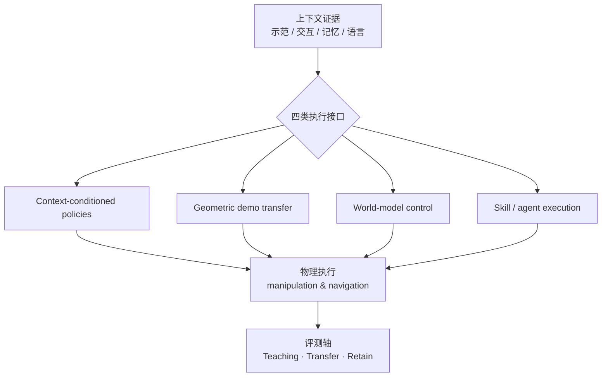

# In-Context Learning for Robots（Methods and Applications）

**In-Context Learning for Robots: Methods and Applications**（[arXiv:2609.36012](https://arxiv.org/abs/2609.36012)，2026）由 **Knowin AI、香港科技大学（广州）、香港中文大学** 等联合撰写（共 40 作者；通讯 Ying-Cong Chen、Yinchuan Li）。约 **100 页、26 图、25 表**，系统梳理机器人 **In-Context Learning（ICL）** 的方法谱系与评测议程。

## 一句话定义

机器人 ICL 是在 **部署时不更新神经网络权重** 的前提下，用示范与交互证据 **引导已有策略**；本篇按 **上下文→执行接口** 分四族方法，并统一 **学任务 / 迁情境 / 留经验** 三类问题与评测口径。

## 英文缩写速查

| 缩写 | 英文全称 | 简要说明 |
|------|----------|----------|
| ICL | In-Context Learning | 上下文内适应；部署期权重固定 |
| VLA | Vision-Language-Action | 常以语言/目标图作条件，易与真 ICL 混读 |
| WM | World Model | 第三类接口：预测未来再规划/解码 |
| TTT | Test-Time Training | 测试时写权重；机制上不同于 ICL |

## 为什么重要

- **名词过载的「对照表」：** 2026 年「上下文」同时指 metadata 条件化、历史记忆、快权重 TTT 与 **真 ICL**；本综述用 **接口 taxonomy** 把文献拆开，可补本库 [机器人 ICL 概念页](../concepts/robot-in-context-learning.md) 的 **论文级索引**。
- **评测议程：** 强调区分 **对教学的响应（teaching）**、**物理迁移（transfer）** 与 **经验留存（retain）**，避免把 sim 指标或单任务成功率误标为 ICL。
- **开放策展：** [awesome-robots-icl](https://github.com/JethroJames/awesome-robots-icl) 持续维护论文与 benchmark 列表，便于 ingest 跟进。

## 核心信息

| 项 | 内容 |
|----|------|
| **机构** | Knowin AI；香港科技大学（广州）；香港中文大学；同济大学；清华大学；哈尔滨工业大学（深圳）；西湖大学；天津大学 等 |
| **出处** | arXiv:2609.36012（2026-09-28） |
| **开源** | **部分开源** — [GitHub 文献库](https://github.com/JethroJames/awesome-robots-icl)；无可运行策略栈 |

## 核心原理

### 四类上下文→执行接口

| 家族 | 核心机制（归纳） | 典型迁移假设 |
|------|------------------|--------------|
| **Context-conditioned policies** | 从上下文 **推断/检索** 动作或策略模式 | 上下文与执行共享表征或检索库 |
| **Geometric demonstration transfer** | **对齐** 示范运动与接触几何 | 对应关系（物体/坐标系）可建立 |
| **World-model-based control** | **预测未来** → 规划或解码控制 | 模型在情境变化下仍可信 |
| **Skill- and agent-based execution** | **组合** 技能、程序与工具 | 技能库覆盖子任务；编排可泛化 |

### 三类「从上下文学什么」

1. **Acquire — 新任务：** 示范究竟教了哪些约束与目标？
2. **Transfer — 新情境：** 换物体、场景、执行条件后是否仍满足所教要求？
3. **Retain — 下一任务：** 累积经验是否 **提高后续任务的学习效率**（physical recursive self-improvement 议程）？

### 流程总览

## 源码运行时序图

**不适用** — 开源产物为 **文献与 benchmark 策展仓库**（[awesome-robots-icl](https://github.com/JethroJames/awesome-robots-icl)），不含可运行训练/真机部署流水线。若后续发布统一评测代码，应补 `sources/repos/` 与本节时序图。

## 工程实践

| 项 | 说明 |
|----|------|
| 文献入口 | [项目页](https://jethrojames.github.io/awesome-robots-icl/) → arXiv PDF |
| 复现单篇方法 | 按综述引用跳转原文；本页不替代 100 页细节 |
| 与本库对齐 | 读具体算法前先过 [ICL 概念页](../concepts/robot-in-context-learning.md) **三类不确定性** 表 |

## 实验与评测读法

- 综述 **不提出单一 SOTA 数字**；选型应看各节引用的 **任务协议** 是否覆盖 teaching / transfer / retain。
- 对比 [StellaVLA](./paper-stellavla-structured-icl-vla.md)、[RoboTTT](./paper-robottt-test-time-training-vla-context.md) 等站内节点时，先对齐 **是否部署期改权重**。

## 结论

**这是 2026 年机器人 ICL 的「接口地图 + 评测议程」，适合作为 depth-icl 路线的论文索引，而不是单点算法复现入口。**

1. 四族接口覆盖条件策略、几何迁移、世界模型与技能/agent 编排——读文献时先归类再比数字。
2. Acquire / Transfer / Retain 三连问可直接用作 PR / 实验设计检查表。
3. 权重固定是 ICL 与 TTT 的 **硬分界**；综述议程指向 **physical recursive self-improvement**。
4. GitHub 策展库 **已开源**，便于跟踪新 benchmark。
5. 与 arXiv:2609.36012 **无关** 的 RA-L 工作（如 PADP）应走 DOI 节点，勿混链。

## 局限与风险

- 100 页综述 **滞后于 arXiv 日更**；关键结论仍须回原文。
- Knowin 等机构 **未全量注册** 于 `institutions.json`；机构 tag 以 HKUST-GZ 等已登记 alias 为主。
- 文献库 **不含** 统一 sim/real 代码，复现成本取决于所引子论文。

## 关联页面

- [机器人 In-Context Learning（概念）](../concepts/robot-in-context-learning.md)
- [纵深路线：ICL](../../roadmap/depth-icl.md)
- [模仿学习](../methods/imitation-learning.md)
- [VLA](../methods/vla.md)
- [Embodied ICL 对比](../comparisons/wam-ttt-robottt-stellavla-zero-wam-embodied-icl.md)

## 参考来源

- [in_context_learning_robots_arxiv_2609_36012.md](../../sources/papers/in_context_learning_robots_arxiv_2609_36012.md)
- [awesome-robots-icl 项目页](../../sources/sites/awesome-robots-icl.md)
- [awesome-robots-icl 仓库](../../sources/repos/awesome-robots-icl.md)

## 推荐继续阅读

- [https://arxiv.org/abs/2609.36012](https://arxiv.org/abs/2609.36012)
- [https://jethrojames.github.io/awesome-robots-icl/](https://jethrojames.github.io/awesome-robots-icl/)
- [https://github.com/JethroJames/awesome-robots-icl](https://github.com/JethroJames/awesome-robots-icl)
