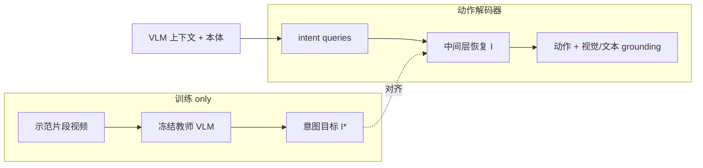

# Indi：把行为意图蒸馏进 VLA 解码器

**Indi**（*Act with Intent: Distilling Behavior Intent for Vision-Language-Action Models*，[arXiv:2608.23478](https://arxiv.org/abs/2608.23478)，[项目页](https://leesangoh.github.io/indi-project-page/)）由 **浦项工科大学（POSTECH）** 提出：训练时用冻结教师 VLM 解释「这段示范在当前指令下要达成什么」，部署侧 VLA 在中间解码层恢复该多模态意图，并用它组织动作与视觉/文本 grounding。

## 一句话定义

**动作解码器缺的不是更多未来像素，而是可恢复的局部目标表征——Indi 把教师对已执行行为的语义解释蒸馏进解码器中间态，推理时零教师模块。**

## 英文缩写速查

| 缩写 | 英文全称 | 简要说明 |
|------|----------|----------|
| Indi | Intention Distillation | 本文：把行为级意图蒸馏进 VLA 解码器 |
| VLA | Vision-Language-Action | 视觉–语言–动作策略 |
| VLM | Vision-Language Model | 训练期冻结教师；部署不保留 |
| BC | Behaviour Cloning | 只监督电机指令的基线 |
| GR00T | Generalist Robot 00 Technology | 本文主骨干 N1.7 |

## 为什么重要

- **BC 天花板：** 解码器学会 context→动作，却不知道该行为服务的局部目标。
- **未来监督不够：** 生成帧、潜观测、轨迹/光流是某一种实现，不是共享语义目标。
- **部署代价低：** 教师与对齐头全部去掉；GR00T-N1.7 上约 +0.04B、~5 ms/query。
- **可干预：** 交换意图的任务判别分量会把闭环成功率从 84.5% 打到 45.2%（跨目标）或 1.0%（高斯破坏），说明解码器在「按意图行动」。

## 核心信息

| 项 | 内容 |
|----|------|
| **机构** | 浦项工科大学（POSTECH） |
| **骨干** | 冻结 VLM + 可训 flow-matching 动作解码器；评测 GR00T-N1.7 与 π0.5 |
| **教师输入** | 当前观察、指令、粗动作摘要、执行视频 |
| **部署输入** | 标准 VLA：RGB、指令、本体感觉 |
| **开源** | **未开源** — 仅项目页 / GitHub Pages |

## 流程总览

## 源码运行时序图

| 项 | 说明 |
|----|------|
| **源码运行时序图** | **不适用**（截至 2026-08-26 项目页未列可运行训练/推理仓；`Leesangoh/indi-project-page` 仅为静态站） |

## 实验与评测读法

### SimplerEnv-Bridge（三轮均值）

| 方法 | Avg. |
|------|------|
| GR00T-N1.7 | 64.3% |
| + 未来监督 | 68.0% |
| **+ Indi** | **84.7%** |
| π0.5 | 52.3% |
| π0.5 + Indi | 58.8% |

EP-Basket：36.0→**96.0%**。同等架构下，自由 latent（57%）与仅 grounding（60%）都低于纯动作基线（61.5%），单意图监督到 76.0%、完整 Indi 85.5%（固定评测 run）——不是「加容量」。

### RoboCasa Kitchen（24 任务，100 demo/task）

GR00T-N1.7 64.1→**70.3%**，距论文引用的 3000 demo/task 报告点 70.8% 仅 0.5 pp。

### 真机（GR00T-N1.7，每任务 50 trial × 三条件）

平均 62.0→**68.7%**；增益集中在长程 Cross-Bin Stacking 与 Drawer Storage；held-out 物体 +6.0 pp、干扰物 +9.0 pp。

## 结论

**给解码器一个「这段行为为了什么」的中间态，比再堆未来帧更能抬长程与 OOD；真影响来自意图内容被下游使用，而不是辅助读出。**

1. **对照锚点：** 未来监督只到 68.0%，Indi 到 84.7%——增益来自行为级目标，不是「多一条 loss」。
2. **数据读法：** 100 demo/task 已接近 30× 数据的报告点，优先试意图监督再堆演示。
3. **部署：** 推理零教师；代价是训练要跑教师前向并缓存目标。
4. **风险：** 教师质量与片段切分定义了意图上界；闭环干预证明表征可被破坏。

## 与其他工作对比

| 对比轴 | Indi | 未来帧 / WAM 监督 | Play-LMP 类 latent plan |
|--------|------|-------------------|-------------------------|
| 监督对象 | 教师对已执行行为的语义目标 | 某一种未来实现 | 与策略联合学的重构码 |
| 部署教师 | 无 | 通常无 | 无 |
| 骨干 | GR00T-N1.7 / π0.5 | 各异 | 轨迹 VAE 族 |

## 工程实践

| 项 | 说明 |
|----|------|
| 接入点 | 预训练 VLA 的 **动作解码器中间层**，不是再训整个 VLM |
| 教师 | 论文用 Cosmos-Reason2 构造训练目标；部署删除 |
| 调试 | 读出终点图与 purpose 文本；跨任务注入意图应改变行为 |

## 局限与风险

- **确认未开源：** 无法按官方脚本复现数字。
- 评测绑定桌面/厨房操纵与双臂 SO-101，不是全身 loco-manip。
- 意图定义依赖教师提示与片段窗 \(H\)。

## 关联页面

- [VLA](../methods/vla.md) — 解码器监督与 foundation policy
- [Isaac GR00T](./isaac-gr00t.md) — N1.7 工程栈
- [π0.5](./paper-pi05-open-world-vla.md) — 第二骨干
- [ROS2SmolVLA](./paper-ros2smolvla.md) — 同专辑工业轻量 VLA
- [开源 7 篇系统结构地图](../overview/open-source-7-papers-system-structure-technology-map.md)

## 参考来源

- [Indi 论文摘录](../../sources/papers/indi_arxiv_2608_23478.md)
- [项目页归档](../../sources/sites/indi-leesangoh.md)
- [具身智能小站 7 篇盘点](../../sources/blogs/wechat_embodied_station_7_papers_vla_intent_space_2026-08-26.md)

## 推荐继续阅读

- [arXiv:2608.23478](https://arxiv.org/abs/2608.23478)
- [项目页](https://leesangoh.github.io/indi-project-page/)
