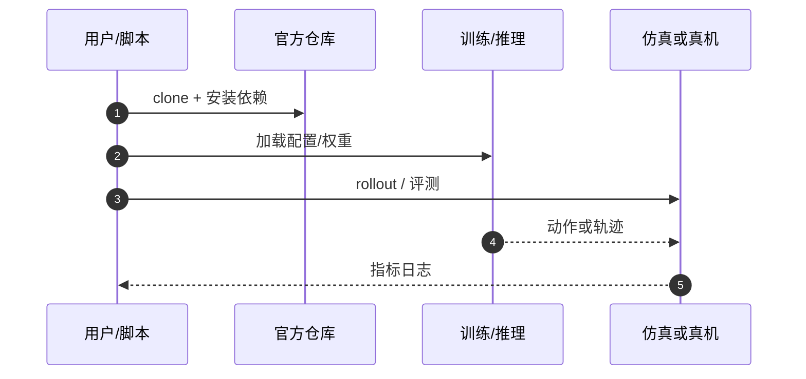

# IndustrialVLA-Bench（arXiv:2609.25562）

**IndustrialVLA-Bench**（*IndustrialVLA-Bench: A Traceable Multi-Axis Evaluation of Open Robot Policy Models*，[arXiv:2609.25562](https://arxiv.org/abs/2609.25562)，[代码](https://github.com/xiaoqi-7/IndustrialVLA-Bench)）来自 [具身智能小站 12 篇盘点](../../sources/blogs/wechat_embodied_station_12_papers_collab_wm_2026-09-23.md)。

## 一句话定义

**多轴可追溯 VLA 评测：LIBERO / LIBERO-Plus / LIBERO-Para 分测干净能力、视觉鲁棒与指令敏感，并记录延迟、显存与证据等级。**

## 英文缩写速查

| 缩写 | 英文全称 | 简要说明 |
|------|----------|----------|
| VLA | Vision-Language-Action | 视觉–语言–动作策略 |
| LIBERO | Lifelong Robot Learning Benchmark | 操作基准套件 |
| Bench | Benchmark | 评测协议与工具链 |
| SR | Success Rate | 任务成功率 |

## 为什么重要

- 六个系统 clean LIBERO 平均仅差 1.58 分，但鲁棒性与改写指令摘要可差 14.62 与 31.08 分——部署选型不能只看单一成功率。
- 开源结论：**已开源**（步骤 2.5，2026-09-23）。
- 与 [12 篇技术地图](../overview/collab-wm-12-papers-technology-map.md) 中同类工作可横向对照。

## 核心机制

| 项 | 内容 |
|----|------|
| **arXiv** | [2609.25562](https://arxiv.org/abs/2609.25562) |
| **开源** | **已开源** |
| **要点** | 三套件分轴评测；每任务 3 随机种子；protocol-faithful / near-reproduction / pending-verification 分层。 |
| **文内指标** | 官方仓库含环境、启动脚本、逐种子结果与延迟/显存日志；权重与部分仿真资产需按各项目说明下载。 |

## 源码运行时序图

## 实验与评测

- 官方仓库含环境、启动脚本、逐种子结果与延迟/显存日志；权重与部分仿真资产需按各项目说明下载。
- **读法：** 索引级摘要；逐项对照与 baseline 以原文 PDF 为准。

## 与其他工作对比

- 横向索引见 [12 篇技术地图](../overview/collab-wm-12-papers-technology-map.md)；与同 arXiv 节点不重复造页。

## 结论

**IndustrialVLA-Bench 把「谁更强」从排行榜变成诊断式协议；复现前核对证据等级与运行成本列。**

1. 开源边界：**已开源** — 以项目页实际链接为准（入库日 2026-09-23）。
2. 核心机制：三套件分轴评测；每任务 3 随机种子；protocol-faithful / near-reproduction / pending-verification …
3. 部署前核对任务协议与硬件条件，勿直接横比公众号摘录数字。

## 关联页面

- [vla](../methods/vla.md)
- [manipulation](../tasks/manipulation.md)
- [vla-deployment-guide](../queries/vla-deployment-guide.md)
- [fluxvla-engine](./fluxvla-engine.md)

## 参考来源

- [industrialvla-bench_arxiv_2609_25562.md](../../sources/papers/industrialvla-bench_arxiv_2609_25562.md)
- [wechat_embodied_station_12_papers_collab_wm_2026-09-23.md](../../sources/blogs/wechat_embodied_station_12_papers_collab_wm_2026-09-23.md)
- [arXiv:2609.25562](https://arxiv.org/abs/2609.25562)

## 推荐继续阅读

- [arXiv PDF](https://arxiv.org/pdf/2609.25562)
- [https://github.com/xiaoqi-7/IndustrialVLA-Bench](https://github.com/xiaoqi-7/IndustrialVLA-Bench)

