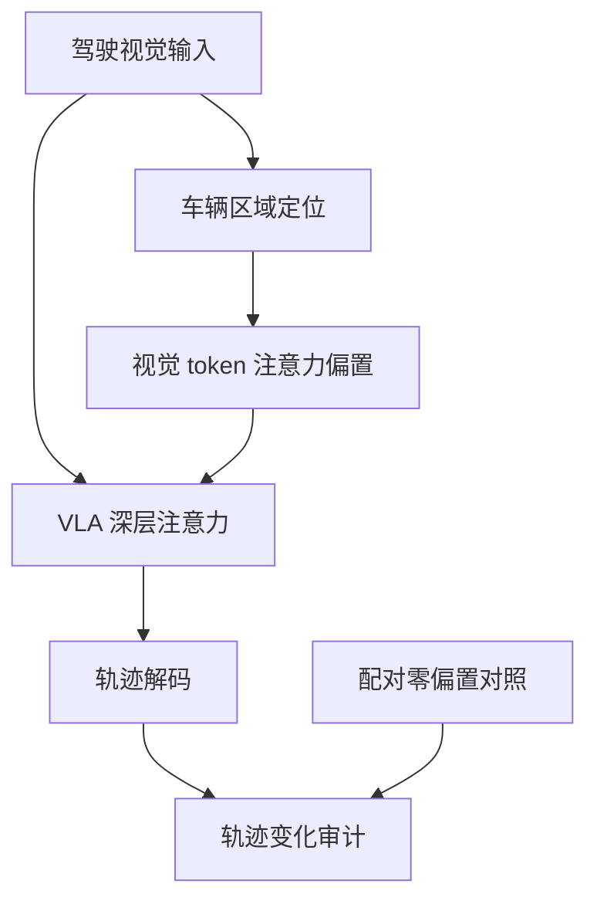

# Inference-Time Attention Steering

**Inference-Time Attention Steering for Vision-Language-Action Driving Models**（arXiv:[2608.17095](https://arxiv.org/abs/2608.17095)）— **埃朗根-纽伦堡大学（FAU，德）**。多模空间 [2026.08.17–08.23 周报](../../sources/blogs/wechat_duomo_vla_weekly_trends_2026-08-17_part1.md) 策展条目；细节以 arXiv 为准。

## 一句话定义

无训练修改，对安全关键车辆区域 steering，轨迹更避让；CoT 文本不变。

## 英文缩写速查

| 缩写 | 英文全称 | 简要说明 |
|------|----------|----------|
| VLA | Vision-Language-Action | 视觉–语言–动作策略 |
| RL | Reinforcement Learning | 强化学习后训练或微调 |
| TTA | Test-Time Augmentation / Adaptation | 测试时增强或适配 |
| SR | Success Rate | 任务成功率 |
| LIBERO | LIBERO Benchmark | 常见操作仿真基准套件 |

## 流程总览

以下按本页已归纳的机制与资料绘制，表示模块或阅读路径关系。

## 核心信息

| 项 | 内容 |
|----|------|
| **机构** | 埃朗根-纽伦堡大学（FAU，德） |
| **评测** | PhysicalAI WorldModel-Synthetic |
| **开源** | 待核实（截至 2026-09-29） |

## 为什么重要

- 纳入 [一周 VLA 趋势（2026.08.17 第一篇）](../overview/vla-weekly-trends-2026-08-17-part1-technology-map.md) 横切面索引。
- 与 [VLA](../methods/vla.md) 方法页及同周其他 **16/16 独立 canonical 节点** 交叉对照。

## 评测与指标

- **场景：** Physical AI World Model Synthetic 数据集中的 **50 个变道场景**；骨干为 Alpamayo-R1 的 Qwen3-VL，以前向 pre-hook 注入，**不改权重**。
- **剂量响应：** 轨迹解码器随偏置幅度**单调**变化，每个幅度都与配对零偏置对照可区分；平均位移约 **17 cm**，限幅处横向偏移最高约 **140 cm**（数值摘自 arXiv 摘要，完整表格与基线设定以原文为准）。
- **层消融：** 只挂前 8 层 **2.0 cm**，挂满 36 层 **67.6 cm**——动作相关信号位于深层。
- **推理链：** Chain-of-Causation 文本不变，经逐次注入审计确认是偏置**未到达**推理通路，因此这是「暴露验证」而非鲁棒性证据。

## 与其他工作对比

| 维度 | 注意力引导 | 对照 |
|------|------------|------|
| 干预时机 | 推理时、无需重训 | [Geo-VLA](./paper-geo-vla.md)：训练时内化几何语义 |
| 干预对象 | 检测器定位到的交通参与者对应的视觉 token | [Neural Introspection Gating](./paper-neural-introspection-gating.md)：同样只在推理时改注意力/缓存，但目标是提速而非改变注视 |
| 结论性质 | 偏置决定「看哪里」，不编码目标行为 | [EMMA（Waymo）](./paper-emma-waymo-e2e.md)：训练期多任务统一，不提供推理时干预接口 |

## 结论

**Inference-Time Attention Steering 在本库中作为 arXiv:2608.17095 的 canonical 详情节点；部署与复现前请对照原文 PDF/HTML 与作者发布资源。**

1. **canonical 唯一性** — 全库仅此一页绑定 arXiv:2608.17095。
2. **读法** — 先读公众号策展摘要，再读 arXiv 方法与实验节。
3. **开源** — 待核实（截至 2026-09-29）。
4. **安全/评测类**（若适用）— 勿把任务成功率等同于安全或授权跟随。

## 关联页面

- [VLA](../methods/vla.md)
- [Manipulation](../tasks/manipulation.md)
- [一周 VLA 趋势地图（2026.08.17）](../overview/vla-weekly-trends-2026-08-17-part1-technology-map.md)

## 参考来源

- [inference_time_attention_steering_vla_driving_arxiv_2608_17095.md](../../sources/papers/inference_time_attention_steering_vla_driving_arxiv_2608_17095.md)
- [多模空间周报归档](../../sources/blogs/wechat_duomo_vla_weekly_trends_2026-08-17_part1.md)
- arXiv：<https://arxiv.org/abs/2608.17095>

## 推荐继续阅读

- [arXiv 摘要页](https://arxiv.org/abs/2608.17095)
