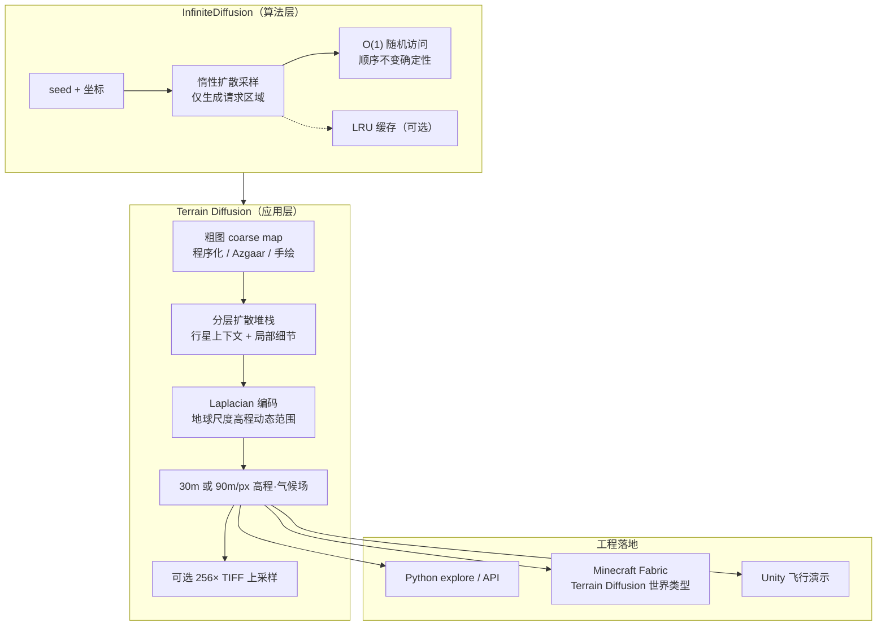

# InfiniteDiffusion / Terrain Diffusion（学习式无限地形生成）

**InfiniteDiffusion**（*Bridging Learned Fidelity and Procedural Utility for Open-World Terrain Generation*，**SIGGRAPH 2026**，Alexander Goslin，[项目页](https://xandergos.github.io/terrain-diffusion/)，[arXiv:2512.08309](https://arxiv.org/abs/2512.08309)）提出 **training-free** 算法：把扩散采样重表述为 **惰性、无界** 计算，仅由 **seed + 坐标** 索引，具备 **O(1) 随机访问**、**顺序不变确定性** 与 **可 embarrassingly parallel** 扩展，内部 LRU 缓存仅为性能优化。**Terrain Diffusion** 是其首个落地：**学习式程序化地形生成器**——接口类似 Perlin 噪声（按坐标查询高程/气候），但保真度来自 **分层扩散堆栈** 与 **Laplacian 编码**（垂直范围约 **-10 km～+9 km**），在消费级 GPU 上可达约 **9× 轨道速度**，并以 **[Minecraft Fabric mod](https://modrinth.com/mod/terrain-diffusion)** 与 Unity 演示证明可嵌入游戏引擎。

## 英文缩写速查

| 缩写 | 英文全称 | 简要说明 |
|------|----------|----------|
| PCG | Procedural Content Generation | 程序化内容生成；Terrain Diffusion 是学习式 PCG 地形实例 |
| DR | Domain Randomization | 地形多样性常作为仿真 DR 的几何载体 |
| HF | Height Field | 高程场；Terrain Diffusion 输出可转 GeoTIFF/引擎高度图 |
| GPU | Graphics Processing Unit | 推理主力；Minecraft mod 峰值 VRAM ~1.5 GB |
| LRU | Least Recently Used | InfiniteDiffusion 内部缓存策略，非持久世界状态 |
| API | Application Programming Interface | `terrain_diffusion api` 子命令提供高程/气候查询 |

## 为什么重要

- **打破「无限 / 无状态 / 学习逼真」三难困境：** 经典 Perlin 噪声无限且确定性但不可学习；扩散模型逼真但传统上有界；自回归外绘可学习无界内容却牺牲 **O(1) 随机访问** 与 **顺序不变确定性**。InfiniteDiffusion 把 MultiDiffusion 推广到 **无限或超内存域**，质量几乎不降级。
- **机器人仿真语境的地形供给新路线：** 腿式 RL 长期依赖 [程序化噪声/高度场](../concepts/procedural-terrain-generation.md)（如 [Legged Gym](./legged-gym.md) `terrain.py`）制造坡/台阶/碎石课程；Terrain Diffusion 提供 **大陆尺度连贯、气候耦合** 的学习式高度场，可作为 **高保真户外 sim 资产源**——但仍需与 **碰撞体对齐、动力学 DR** 联用，不能替代接触/摩擦建模。
- **引擎集成的「噪声式接口」：** 函数式无状态（仅 seed+坐标）使 **种子共享、多人瞬移、按需流式** 成为可能；Minecraft mod 证明无需外部服务即可落地。
- **与像素世界模型正交：** 相对 [Generative World Models](../methods/generative-world-models.md) 的 **视频 rollout**，本工作回答 **静态/准静态环境几何从哪来**——更接近 [HomeWorld](./paper-homeworld-whole-home-scene-generation.md) 的「仿真环境资产」层，但面向 **开放世界户外地形**。

## 流程总览



## 核心机制（归纳）

### 1）InfiniteDiffusion vs 自回归外绘

| 维度 | 自回归外绘 | InfiniteDiffusion |
|------|------------|-------------------|
| 随机访问 | O(n) | **O(1)** |
| 确定性 | 顺序依赖 | **顺序不变** |
| 误差 | 复合累积 | **不复合** |
| 并行 | 串行 | **Embarrassingly parallel** |
| 状态 | 全局共享 | **函数式无状态**（仅 LRU 优化） |
| 训练 | 通常需专门训练 | **Training-free**（推广 MultiDiffusion） |

### 2）Terrain Diffusion 两阶段管线

1. **粗图（coarse map）：** 程序化 `synthetic_map.py`（Perlin + 统计变换）、[Azgaar](https://azgaar.github.io/Fantasy-Map-Generator/) JSON 导出，或手绘草图——控制大陆/气候布局，不必精确。
2. **细模型 refine：** 将粗条件转为 **30 m/px**（`terrain-diffusion-30m`，粗像素 ~7.7 km，偏可玩）或 **90 m/px**（`terrain-diffusion-90m`，粗 ~23 km，偏大尺度写实）高程与温度/降水场；`tiff-export` 可再 **256×** 上采样为 GeoTIFF。

条件 TIFF 通道（缺失则回退 Perlin）：`heightmap.tif`、`temperature.tif`、`temperature_std.tif`、`precipitation.tif`、`precipitation_cv.tif`。

### 3）尺度与性能（论文叙事）

- 单张 **1024×1024** relief 约 **100 km** 宽；大陆可达 **百万 km²** 量级。
- 消费级 GPU：**~9× 轨道速度** 流式生成；Unity 演示 **~3× 轨道速度** 舒适飞行。
- Minecraft 多人：**同种子共享世界**、长距离瞬移无全局状态同步负担。

## 工程实践

### Python 快速体验

```bash
git clone https://github.com/xandergos/terrain-diffusion
cd terrain-diffusion && pip install -r requirements.txt
python -m terrain_diffusion explore xandergos/terrain-diffusion-30m
```

- **仅复现 InfiniteDiffusion 核心：** `annotated_infinite_panorama.py`（SD v1.5 + [infinite-tensor](https://github.com/xandergos/infinite-tensor)）。
- **开发者 API：** `python -m terrain_diffusion api xandergos/terrain-diffusion-30m`（见仓库 `API_README.md`）。

### Minecraft Mod（[Modrinth](https://modrinth.com/mod/terrain-diffusion)）

| 项 | 建议 |
|----|------|
| 平台 | Java **1.21.1+**，**Fabric** + Fabric API |
| 模型 | 首次在线下载 **~2.5 GB** |
| 内存 | JVM **≥2.5 GB**；GPU VRAM **~1.5 GB**（`offload_models=true`） |
| 世界 | 类型选 **Terrain Diffusion**；**World Scale=2** 为推荐起点 |
| 侦察 | `/td-explore` → 浏览器地图筛选气候/地形后再进游戏 |

### 接入机器人仿真（策展判断，非论文主张）

- **潜在用途：** 为 [locomotion](../tasks/locomotion.md) / [terrain adaptation](../concepts/terrain-adaptation.md) 研究生成 **大尺度连贯户外 mesh/高度场**，替代手工或纯噪声地形，丰富 [DR](../concepts/domain-randomization.md) 的几何分布。
- **必要配套：** 碰撞体与视觉对齐、摩擦/接触参数随机化、课程调度——参见 [Procedural Terrain Generation](../concepts/procedural-terrain-generation.md) 与 [Extreme Parkour](./extreme-parkour.md) 的工程教训。
- **当前缺口：** 官方栈面向 **游戏/地形态势**；无 Isaac Lab / MuJoCo 一键插件，需自行导出高度场并接入仿真器 terrain importer。

## 实验与评测

- **本页为策展编译；量化基准、消融与实机指标以原文 PDF / 项目页为准**（链接见 [参考来源](#参考来源)）。论文的评测围绕 **生成质量 × 尺度 × 吞吐**，而非机器人任务成功率。
- **质量（论文叙事）：** InfiniteDiffusion 将 MultiDiffusion 推广到 **无限 / 超内存域**，作者主张相对全图 eager 扩散 **质量几乎不降级**，同时保持 **O(1) 随机访问** 与 **顺序不变确定性**。
- **尺度与吞吐（论文叙事）：** 单张 1024×1024 relief 约 **100 km** 宽、大陆可达 **百万 km²**；消费级 GPU **~9× 轨道速度** 流式，Unity 演示 **~3× 轨道速度** 舒适飞行；Minecraft mod 峰值 VRAM **~1.5 GB**。
- **机器人迁移未评测：** 论文 **未报告** 腿式/人形在生成地形上的 sim2real 迁移实验；将其用作 sim 资产源属 **合理假设**，需单独 benchmark（见 [局限与风险](#局限与风险)）。

## 结论

**真正值钱的是 InfiniteDiffusion 的 O(1) 随机访问 + 顺序不变确定性；Terrain Diffusion 是把这套接口落地成「可学习的 Perlin 式」高程/气候场，不是机器人任务成功率论文。**

1. **相对自回归外绘：访问与误差形态不同** — O(1) 随机访问、顺序不变、误差不复合、可并行；自回归是 O(n)、顺序依赖、误差复合。
2. **Training-free 推广 MultiDiffusion** — 惰性、无界采样仅由 seed+坐标索引；LRU 只是性能优化，不是持久世界状态。
3. **尺度与吞吐按论文叙事读** — 单张 1024×1024 relief 约 **100 km** 宽、大陆可达百万 km²；消费级 GPU 约 **9× 轨道速度** 流式，Unity 演示约 **3×** 舒适飞行。
4. **两阶段管线可操作** — 粗图（Perlin/Azgaar/手绘）控大陆布局 → 30 m/px 或 90 m/px refine；缺条件 TIFF 则回退 Perlin。
5. **游戏集成门槛清晰** — Minecraft Fabric 1.21.1+、模型约 **2.5 GB**、JVM ≥2.5 GB、VRAM 约 **1.5 GB**（可 offload）；World Scale=2 为推荐起点。
6. **机器人迁移尚未评测** — 输出是高程/气候场，不含接触动力学；作 sim 资产源需自接碰撞体、摩擦 DR 与课程，无 Isaac/MuJoCo 一键插件。

## 与其他工作对比

| 对照对象 | 关系 |
|----------|------|
| **Perlin / 高度场噪声**（见 [Procedural Terrain Generation](../concepts/procedural-terrain-generation.md)） | 噪声无限、确定、O(1) 但 **不可学习**；Terrain Diffusion **学习式** 逼近，提供大陆尺度气候耦合高度场 |
| **自回归外绘（outpainting）** | 可学习无界但 **O(n) 随机访问、顺序依赖、误差复合**；InfiniteDiffusion **O(1)、顺序不变、误差不复合、可并行**（详见上「核心机制」对照表） |
| **视频世界模型**（[Generative World Models](../methods/generative-world-models.md)、[Cosmos 3](./cosmos-3.md)、[DWM](../methods/dwm.md)） | 预测 **未来像素 rollout**；本工作产出 **静态/准静态环境几何**，二者 **正交** |
| **LLM 驱动 PCG**（[RoboGen](./robogen.md)） | 用 LLM 编排任务/场景；本工作专注 **连续户外高程场** 的学习式采样 |

## 局限与风险

- **动力学无关：** 输出是 **高程/气候场**，不含可微接触模型；不能替代 MuJoCo/PhysX 物理引擎。
- **算力与内存：** 虽比全图 eager 扩散省，但仍需 GPU；Minecraft 侧模型体积与 VRAM 门槛高于经典噪声。
- **Mac / CPU：** 官方 README 标明 **CPU-only 显著更慢**；交互体验依赖 NVIDIA CUDA（或 Windows DirectML 构建）。
- **Sim2Real 未验证：** 论文未报告腿式/人形在生成地形上的迁移实验；作为 sim 资产源属于 **合理假设**，需单独 benchmark。
- **与视频 WM 混淆风险：** 这是 **几何程序化生成**，不是操纵 **像素世界模型**——选型时与 [Cosmos 3](./cosmos-3.md)、[DWM](../methods/dwm.md) 等区分。

## 关联页面

- [Procedural Terrain Generation](../concepts/procedural-terrain-generation.md) — 经典噪声/高度场程序化地形与 DR/课程关系
- [Generative World Models](../methods/generative-world-models.md) — 生成式环境层谱系（视频 WM vs 静态 3D/高程场）
- [Terrain Adaptation](../concepts/terrain-adaptation.md) — 策略如何利用地形几何
- [Legged Gym](./legged-gym.md) — 腿式仿真程序化 `terrain.py` 参考实现
- [Extreme Parkour](./extreme-parkour.md) — 复杂户外地形上的腿式控制
- [RoboGen](./robogen.md) — LLM 驱动程序化仿真数据生成（另一 PCG 范式）

## 参考来源

- [InfiniteDiffusion / Terrain Diffusion 论文摘录（SIGGRAPH 2026）](../../sources/papers/infinite_diffusion_terrain_diffusion_siggraph_2026.md)
- [Terrain Diffusion 仓库与 Minecraft Mod 归档](../../sources/repos/terrain-diffusion.md)

## 推荐继续阅读

- Goslin, A. (2026). *InfiniteDiffusion: Bridging Learned Fidelity and Procedural Utility for Open-World Terrain Generation* — [arXiv:2512.08309](https://arxiv.org/abs/2512.08309) · [DOI:10.1145/3799902.3811080](https://doi.org/10.1145/3799902.3811080)
- [Terrain Diffusion 项目页](https://xandergos.github.io/terrain-diffusion/) — InfiniteDiffusion 与自回归对比、演示视频
- [Minecraft Mod（Modrinth）](https://modrinth.com/mod/terrain-diffusion) — 可游玩集成与配置说明
