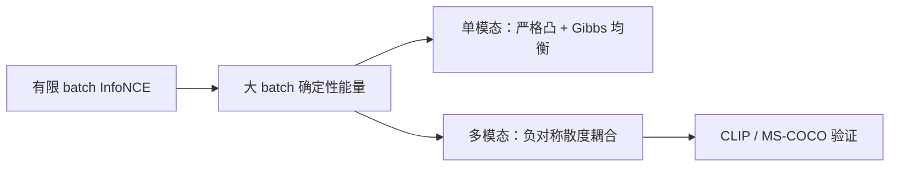
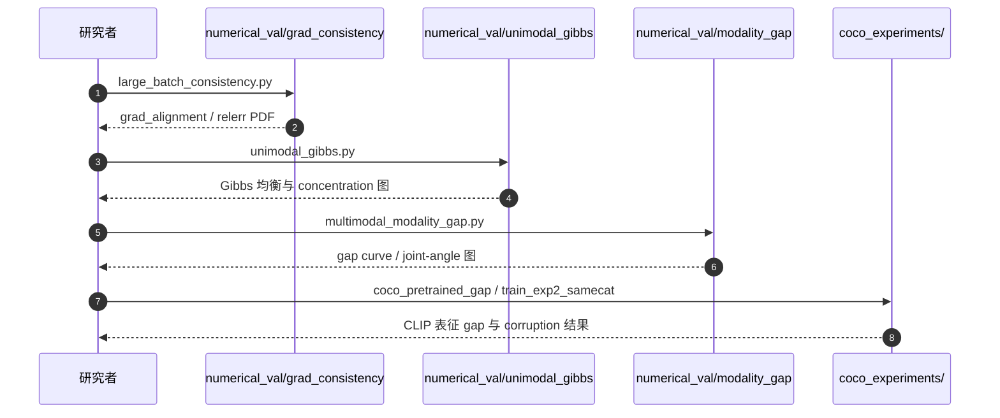

# InfoNCE Geometry（Contrastive Representation Learning 的几何力学）

**InfoNCE Geometry**（*The Geometric Mechanics of Contrastive Representation Learning: Alignment Potentials, Entropic Dispersion, and Cross-modal Divergence*，[arXiv:2601.19597](https://arxiv.org/abs/2601.19597)，**ICML 2026**，[项目页](https://yichaocai.com/nce_geo.github.io/)，[代码](https://github.com/YichaoCai1/InfoNCE_Geometry)）由 **Yichao Cai、Zhen Zhang、Yuhang Liu、Javen Qinfeng Shi**（**AIML, Adelaide University**；**RAIR Centre**）提出：在 **测度论** 框架下把对比学习视为嵌入流形上 **表示测度的演化**，证明大 batch **InfoNCE** 的 **value/gradient consistency**，并揭示 **单模态 vs 对称多模态** 的 **几何分岔（bifurcation）**。

## 一句话定义

**用确定性能量景观刻画 InfoNCE：单模态情形有唯一 Gibbs 均衡；对称多模态 InfoNCE 因负对称散度耦合，可在强 pairwise 对齐下仍保留 modality gap。**

## 英文缩写速查

| 缩写 | 英文全称 | 简要说明 |
|------|----------|----------|
| InfoNCE | Information Noise-Contrastive Estimation | 对比学习核心损失 |
| CLIP | Contrastive Language–Image Pre-training | 图像–文本对比预训练 |
| NCE | Noise Contrastive Estimation | InfoNCE 前身 |
| VLM | Vision-Language Model | 多模态下游应用载体 |
| COCO | Common Objects in Context | MS-COCO 验证实验数据集 |
| SEM | Standard Error of the Mean | 多 seed 曲线误差带 |

## 为什么重要

- **解释 modality gap：** CLIP 类系统常 **检索强** 但 **模态边际仍分离**；本文给出 **population-level** 机制，而非仅 initialization artifact。
- **精炼 alignment–uniformity：** 单模态下 entropy 更精确是 **aligned basin 内的 entropic dispersion**；多模态下 **pairwise alignment 不足以控制 cross-modal marginal**。
- **可检验预测：** 合成实验 + 预训练 CLIP + MS-COCO **语义 plausible corruption** 系统性放大 gap — 与「加强 pairwise 对齐即可闭合 gap」的直觉相悖。
- **工程启示：** 闭 gap 可能需要 **显式 distribution-level regularization**，不能单靠更多 positive pairs。

## 核心方法结构

| 概念 | 单模态 InfoNCE | 对称多模态 InfoNCE |
|------|----------------|-------------------|
| **Large-batch 极限** | 跟踪 **确定性能量**；梯度一致 | 同左 |
| **内在 functional** | **严格凸** | **交叉耦合** + **负对称散度项** |
| **均衡** | **唯一 Gibbs 均衡** | 可 **强对齐 + 模态边际分离** 共存 |
| **Uniformity 读法** | basin 内 **熵 dispersion** tie-break | 分布级 **repulsion** 与对齐并存 |
| **Modality gap** | N/A | **conditional heterogeneity** 下稳定 |

### 分析路线图

## 源码运行时序图

图下说明：仓库以 **论文验证实验** 为主，各脚本自包含、输出 PDF 至脚本目录。

## 主要结果（摘要）

| 实验 | 结论 |
|------|------|
| **Gradient consistency** | negatives 增多 → 随机梯度与确定性能量梯度对齐 |
| **Unimodal Gibbs** | 降温 → 质量集中于 alignment potential 低能区；唯一均衡 |
| **Multimodal toy** | latent misalignment 增强 → 模态边际 **对称散度** 上升 |
| **CLIP / COCO** | strong retrieval **不等价于** small cross-modal discrepancy；caption corruption 放大 gap |

## 工程实践

| 项 | 内容 |
|----|------|
| **机构** | 阿德莱德大学 AIML、RAIR Centre |
| **复现入口** | `numerical_val/*` 三套件 + `coco_experiments/*` |
| **依赖** | PyTorch、open_clip_torch、pycocotools 等 |
| **开源状态** | **已开源（实验复现）** |
| **适用读者** | 设计 **VLM/CLIP 式对比预训练**、诊断 **modality gap** 的研究者 |

## 局限与风险

- **理论 regime 假设：** 大 batch、特定 symmetric multimodal 形式；实际训练还有 augment、projector、batch construction 等工程因素。
- **非 training framework：** 开源仓 **不包含** 完整 CLIP 预训练栈，主要是 **验证论文命题** 的脚本。
- **闭 gap 处方：** 论文指出需 distribution-level 正则，但 **未给出单一 SOTA 训练配方** 替换现有 CLIP pipeline。

## 与其他工作对比

| 维度 | InfoNCE Geometry（本文） | 经验式 CLIP 训练配方工作 | modality gap 的表征观测类工作 |
|------|---------------------------|---------------------------|--------------------------------|
| 产出 | **population geometry** 的理论刻画（Gibbs 均衡 / 分岔） | 更好的 batch、温度、数据配方 | 「gap 存在」的实证测量 |
| 对 gap 的解释 | 对称多模态 InfoNCE 的 **负对称散度耦合** 使 gap 可在强对齐下保留 | 多归因于优化不充分或数据噪声 | 描述现象，不给机制 |
| 可操作性 | 指出需 **distribution-level 正则**，但未给替换配方 | 直接可用 | 不直接可用 |
| 验证方式 | 合成 toy + CLIP/COCO 复现脚本（已开源） | 大规模训练 | 探针实验 |

- **最重要的一条反直觉结论：** CLIP/COCO 实验显示 **强 retrieval 不等价于小 cross-modal discrepancy**——把 retrieval 指标当作「模态已对齐」的证据是错的，这直接影响用 CLIP 特征做下游 grounding 的可靠性判断。
- **不要当训练框架读：** 开源仓是 **命题验证脚本**，不含完整 CLIP 预训练栈；它能告诉你 gap 为什么在，不能替你把 gap 关掉。
- **适用边界：** 结论建立在 **大 batch + 对称多模态 InfoNCE** 这一 regime 上；实际训练里的 augmentation、projector、batch 构造都在假设之外，跨到非对称或小 batch 设定前需重新检查前提。

## 结论

**本文把 InfoNCE 从「点对判别」提升到「测度在流形上的几何力学」，为 modality gap 提供了可证伪的 population 机制，并附可跑合成与 COCO 实验。**

1. **大 batch 确定性极限** 是后续几何声明的锚点，有限 batch 训练可对照 `grad_consistency` 脚本。
2. **单模态** 故事是 cohesive Gibbs — 适合作为 multimodal 分岔的 **对照基线**。
3. **Multimodal bifurcation** 是核心增量：负对称散度 → gap 可 **结构性稳定**。
4. **CLIP 实证** 说明 retrieval 指标 **不能替代** cross-modal marginal 诊断。
5. **工程上** 若 VLA/VLM 依赖 CLIP 式对齐，应单独监控 **模态边际** 而非只看 downstream retrieval。
6. **复现** 从 `numerical_val/` 玩具实验起步，再跑 `coco_experiments/` 需 COCO 与 open_clip 环境。

## 关联页面

- [Skeleton Action Recognition（CLIP 对齐语境）](../methods/skeleton-action-recognition.md)
- [VLA](../methods/vla.md)
- [Dial Instruction Augmentation](../methods/dial-instruction-augmentation.md)
- [GenCAD](./gencad.md)

## 参考来源

- [infonce_geometry_arxiv_2601_19597.md](../../sources/papers/infonce_geometry_arxiv_2601_19597.md)
- [infonce geometry 项目页归档](../../sources/sites/infonce-geometry-project.md)
- [InfoNCE_Geometry 仓库归档](../../sources/repos/infonce-geometry.md)
- [arXiv:2601.19597](https://arxiv.org/abs/2601.19597)

## 推荐继续阅读

- [项目页](https://yichaocai.com/nce_geo.github.io/) — 理论路线图与交互图
- [GitHub 仓库](https://github.com/YichaoCai1/InfoNCE_Geometry)
- [arXiv PDF](https://arxiv.org/pdf/2601.19597)
- Radford et al., *Learning Transferable Visual Models From Natural Language Supervision* (CLIP) — 经验背景
