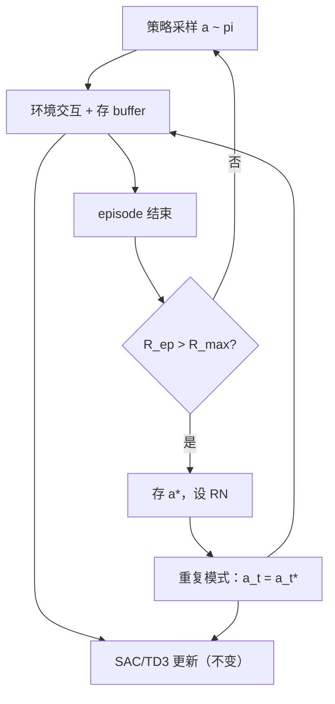

# Instant Episode Repetition（IER）

**Instant Episode Repetition（IER）**（*Repetition as Reinforcement: Enhancing Sample Efficiency via Instant Episode Repetition in Reinforcement Learning*，[arXiv:2608.17347](https://arxiv.org/abs/2608.17347)，[代码](https://github.com/UoA-CARES/instant-episode-repetition)）由 **奥克兰大学（University of Auckland）** CARES Robot Learning Team 提出：在 **离策略连续控制** 中，当一条 episode 刷新 **最高累积回报** 时，**立即** 在环境里 **重执行** 其动作序列 **RN** 次，而不是只在 replay buffer 里被动采样。

## 一句话定义

**成功轨迹不只写进 buffer——在发现新 best episode 后，立刻用同一动作序列再跑 RN 局，把交互密度压到已验证高价值行为附近。**

## 英文缩写速查

| 缩写 | 英文全称 | 简要说明 |
|------|----------|----------|
| IER | Instant Episode Repetition | 本文交互层重复机制 |
| RN | Repetition Number | 连续重复 stored 动作序列的 episode 数 |
| SAC | Soft Actor-Critic | 论文评测的 off-policy 算法之一 |
| TD3 | Twin Delayed DDPG | 论文评测的另一 off-policy 算法 |
| SIL | Self-Imitation Learning | 从 buffer 采样高回报轨迹做更新的对照族 |
| PER | Prioritized Experience Replay | 被动优先复用转移的对照 |
| RL | Reinforcement Learning | 通过与环境交互学习策略的范式 |
| DMC | DeepMind Control Suite | 论文评测套件之一 |

## 为什么重要

- **改数据采集，不改学习式：** 网络、actor/critic 损失、优化器与标准 SAC/TD3 相同；IER 只切换 **谁选动作**。
- **相对 replay / SIL 的差异：** Experience replay 在 **梯度步** 复用旧转移；SIL 仍用当前策略与环境交互。IER 在 **交互环** 主动重复整段动作序列。
- **重复≠复制轨迹：** 重执行时初始状态、随机性与接触动力学不同，仍收集 **新转移** 入 buffer。
- **即插即用：** 论文集成 SAC、TD3；仓库提供 YAML 配置与 `train_loops/ier/`。
- **真机证据：** 双指 **dynamic object translation** 任务上 IER 仍提升样本效率。

## 核心信息

| 项 | 内容 |
|----|------|
| **机构** | 奥克兰大学（University of Auckland）/ CARES |
| **会议** | Reinforcement Learning Conference（RLC）2026 |
| **算法** | IER-SAC、IER-TD3 |
| **仿真** | MuJoCo（Ant/HalfCheetah/Humanoid/Hopper）+ DMC 四任务 |
| **开源** | **已开源**：[UoA-CARES/instant-episode-repetition](https://github.com/UoA-CARES/instant-episode-repetition) |

## 核心原理

episode 累积回报 \(R_{\mathrm{ep}}(\tau)=\sum_t r_t\)。若 \(R_{\mathrm{ep}}(\tau)>R_{\max}\)，存储动作序列 \(\mathbf{a}^*=(a_0^*,\ldots,a_T^*)\) 并更新 \(R_{\max}\)。随后 **RN** 个 episode 执行 \(a_t=a_t^*\)；否则 \(a_t\sim\pi_\theta(\cdot|s_t)\)。episode 结束后所有 \((s,a,r,s')\) 正常入 replay，SAC/TD3 更新不变。

### 流程总览



## 源码运行时序图

官方仓 [instant-episode-repetition](https://github.com/UoA-CARES/instant-episode-repetition)（归档见 [sources/repos/instant-episode-repetition.md](../../sources/repos/instant-episode-repetition.md)）：

```mermaid
sequenceDiagram
    autonumber
    actor Dev as 开发者
    participant CFG as configs/ier/*.yaml
    participant Train as train.py run
    participant Loop as train_loops/ier/
    participant Env as environments/
    participant Mem as memory/ replay
    participant Alg as algorithms/ SAC|TD3
    Dev->>CFG: 指定 env、seed、RN、算法
    Dev->>Train: python train.py run --config ...
    Train->>Loop: 初始化 R_max、重复计数
    loop 每个 environment step
        alt 探索 / 策略 / 重复模式
            Loop->>Env: 执行 a_t
        end
        Env-->>Loop: s', r, done
        Loop->>Mem: store transition
        Loop->>Alg: 标准 off-policy 更新
    end
    Note over Loop,Env: episode 结束：若 R_ep > R_max 则存 a* 并激活 RN 次重复
```

- **最短复现：** clone → `conda create -n ier python=3.10` → `python train.py run --config configs/ier/<task>.yaml`；RN=0 即基线。

## 工程实践

| 项 | 建议 |
|----|------|
| **何时用** | 已有 SAC/TD3（或同类 off-policy）管线；episode 级回报可定义；样本贵（仿真慢/真机） |
| **RN 调参** | 论文扫 0–7；中等 RN 通常最优；过大可能过拟合单条序列 |
| **不适用** | on-policy（PPO 等）需另设计；episode 边界模糊或 reward 非 episode 级 |
| **与 SIL 并存** | IER 改交互；SIL 改损失——论文作对照，非互斥 |

## 局限与风险

- **绑定 off-policy + episode 回报：** on-policy 或逐步稀疏 shaping 需重新设计触发逻辑。
- **RN 与任务相关：** Humanoid 等长 episode 任务最优 RN 可能与 Hopper 不同。
- **重复序列可过时：** 仅当 **刷新全局 best** 才更新 \(\mathbf{a}^*\)；非 prioritized 多条成功轨迹。
- **真机：** 重复同一开环动作序列在强扰动下可能放大接触风险——论文任务相对温和。

## 实验与评测

MuJoCo + DMC 八任务：IER-SAC / IER-TD3 相对基线与 SIL 变体 **更快收敛、更高渐近性能**。真机双指 dynamic translation 验证 **仿真→硬件** 可迁移。RN 消融显示 0 即标准 RL，1–3 常为最稳增益区。

## 结论

**IER 把「生物式重复巩固」落到 RL 交互环：不改损失就能 densify 高回报行为附近的采样。**

1. **真影响：交互层重复** — 相对 replay/SIL 的被动复用，主动重执行成功动作序列。
2. **真影响：即插 SAC/TD3** — 官方仓 YAML 切换 RN 即可 A/B。
3. **真影响：RN 是主旋钮** — 中等重复通常最优；过大重复可能过拟合单序列。
4. **次要代价：只跟踪全局 best episode** — 非多条成功轨迹的优先级重复。
5. **工程读法：真机可用但需任务安全评估** — 开环重复在接触丰富任务上要谨慎。
6. **选型边界** — 样本效率问题在 **off-policy 连续控制** 时优先评估；VLA/离散长 horizon 需另证。

## 关联页面

- [强化学习](../methods/reinforcement-learning.md) — off-policy 与样本效率背景
- [PPO vs SAC](../comparisons/ppo-vs-sac.md) — on-policy vs off-policy 对照
- [在线 vs 离线 RL](../comparisons/online-vs-offline-rl.md) — 数据收集范式
- [模仿学习](../methods/imitation-learning.md) — SIL 对照叙事

## 参考来源

- [IER 论文归档](../../sources/papers/instant_episode_repetition_arxiv_2608_17347.md)
- [instant-episode-repetition 仓库归档](../../sources/repos/instant-episode-repetition.md)

## 推荐继续阅读

- 官方仓库 README — <https://github.com/UoA-CARES/instant-episode-repetition>
- arXiv 全文 — <https://arxiv.org/abs/2608.17347>
