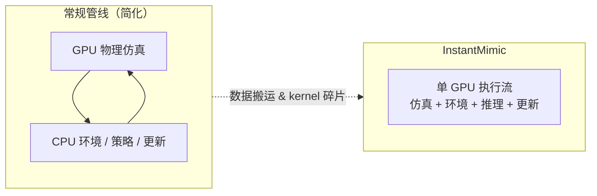

# InstantMimic：秒级物理技能模仿训练系统

**InstantMimic**（*A High Performance System for Learning Physics-based Skills in Seconds*，[arXiv:2609.09821](https://arxiv.org/abs/2609.09821)，[项目页](https://scripter36.github.io/projects/instantmimic/)）由 **首尔大学（SNU）Intelligent Motion Lab** 提出（SIGGRAPH Asia 2026，Conditionally accepted）。本文 **不动模仿学习算法**，而是把 **训练系统** 做成 GPU-native：在 GPU 物理后端上整合仿真、环境计算、策略推理与策略更新，消除传统管线中 **碎片化 kernel launch** 与 **CPU 内存访问** 带来的硬件空转。

## 一句话定义

**把 DeepMimic 类物理技能学习的整环搬进单条 GPU 执行流，让标准动作跟踪在数秒内收敛、AMASS 级预训练从数十小时压到约半小时，并使 LLM-agent 驱动的超参搜索变得可行。**

## 英文缩写速查

| 缩写 | 英文全称 | 简要说明 |
|------|----------|----------|
| IL | Imitation Learning | 从专家示范学习策略 |
| RL | Reinforcement Learning | 强化学习 |
| GPU | Graphics Processing Unit | 本文训练环全部驻留的设备 |
| AMASS | Archive of Motion Capture as Surface Shapes | 大规模人体动捕数据集 |
| DeepMimic | DeepMimic | 经典物理角色模仿学习基线 |

## 为什么重要

- **瓶颈在系统而非算法：** 即便仿真已 GPU 加速，端到端管线常在物理求解器之外浪费算力；本文量化 **kernel 碎片化** 与 **CPU 往返** 是主因。
- **改变实验迭代节奏：** 秒级技能训练 + 约 30 min 级 AMASS 预训练，使 **高频试错**（含 LLM-agent 超参搜索）从不可行变为日常。
- **跨动画与机器人：** 物理角色控制长期是图形学与机器人交叉问题；高效 IL 训练环直接利好 **敏捷人形技能** 数据闭环。

## 核心信息

| 项 | 内容 |
|----|------|
| **机构** | 首尔大学（SNU）Intelligent Motion Lab |
| **arXiv** | [2609.09821](https://arxiv.org/abs/2609.09821) |
| **项目页** | <https://scripter36.github.io/projects/instantmimic/> |
| **代码** | <https://github.com/Scripter36/InstantMimic> |
| **开源** | **待发布**（README：`Code will be released soon`） |

## 核心原理

### 归因

| 现象 | 本文解释 |
|------|----------|
| GPU 仿真已快，训练仍慢 | 瓶颈在 **仿真之外**：环境包装、策略推理、梯度更新 |
| 硬件利用率低 | **碎片化 GPU kernel** + 关键路径上的 **CPU 内存访问** |
| 超参搜索贵 | wall-clock 过长，难以支撑 agent 驱动的大规模搜索 |

### GPU-native 整合

Built on a **GPU-native physics backend**，四模块在同一执行流内衔接，避免逐步把张量搬回 CPU。

## 源码运行时序图

**不适用**（GitHub 仓存在但 README 仅占位「即将发布」；代码发布后应补训练入口对齐 [sources/repos/instantmimic.md](../../sources/repos/instantmimic.md)。）

## 实验与评测

| 项 | 文内口径 |
|----|----------|
| 标准动作跟踪 | **秒级** wall-clock 收敛 |
| AMASS 预训练 | **37.4 h → 约 30 min** |
| 归因 | **kernel 碎片化** 与 **CPU 内存访问** 是 RL 训练主瓶颈 |
| 附带收益 | **LLM-agent 超参搜索** 变得实用 |

- **量的是系统不是算法：** 本文报告 **训练时间与吞吐**，不是新的跟踪质量上限；勿与「成功率更高」混谈。
- **读法：** 加速比依赖 **GPU 型号、并行度与基线实现**；跨论文横比需对齐硬件与任务。
- **复现边界：** 截至 **2026-09-11** 无可跑入口。

## 与其他工作对比

| 对照路线 | 差异 |
|----------|------|
| GPU 仿真 + CPU 侧 RL 循环（常规 Isaac / MJX 栈） | 仿真在 GPU、环境/更新回 CPU → **搬运与 launch 开销**；本文整环留 GPU。 |
| 增大并行环境数 | 靠 worlds 数量摊薄开销，**不消除碎片化**；本文改执行模型。 |
| 算法侧加速（样本效率、蒸馏、课程） | 减少所需样本；本文减少 **单位样本时间**，可叠加。 |
| [SwingBot](./paper-swingbot.md) 等技能学习 | 那边问「技能能不能学会」，本文问「同一学习能多快」，正交。 |
| [BeyondMimic](../methods/beyondmimic.md) | 那边优化 **跟踪 formulation 与 sim2real**；本文优化 **训练系统吞吐**。 |

## 结论

**InstantMimic 是「训练基础设施」论文：若你做物理技能 IL/RL 且 wall-clock 是瓶颈，值得等代码发布后对标自家管线。**

1. **核心贡献是 GPU-native 整环整合**，不是新奖励或新网络。
2. **秒级跟踪 / 半小时级 AMASS** 是作者 wall-clock 口径；硬件不齐勿直接外推。
3. **LLM-agent 超参搜索** 是系统加速的下游用例，不是单独算法贡献。
4. **开源：待发布** — 引用加速数字前应先确认仓库可跑。
5. 与算法论文（如 JEPA Policy）**互补**：一个减 **训练时间**，一个减 **推理延迟**。

## 关联页面

- [模仿学习 (Imitation Learning)](../methods/imitation-learning.md)
- [BeyondMimic](../methods/beyondmimic.md)
- [VLM 与操作 11 篇技术地图](../overview/vlm-manipulation-11-papers-technology-map.md)
- [SwingBot](./paper-swingbot.md)

## 参考来源

- [instantmimic_arxiv_2609_09821.md](../../sources/papers/instantmimic_arxiv_2609_09821.md)
- [instantmimic 项目页归档](../../sources/sites/instantmimic-github-io.md)
- [instantmimic 仓库归档](../../sources/repos/instantmimic.md)
- [arXiv:2609.09821](https://arxiv.org/abs/2609.09821)

## 推荐继续阅读

- [arXiv PDF](https://arxiv.org/pdf/2609.09821)
- [项目页](https://scripter36.github.io/projects/instantmimic/)
- [GitHub](https://github.com/Scripter36/InstantMimic)
