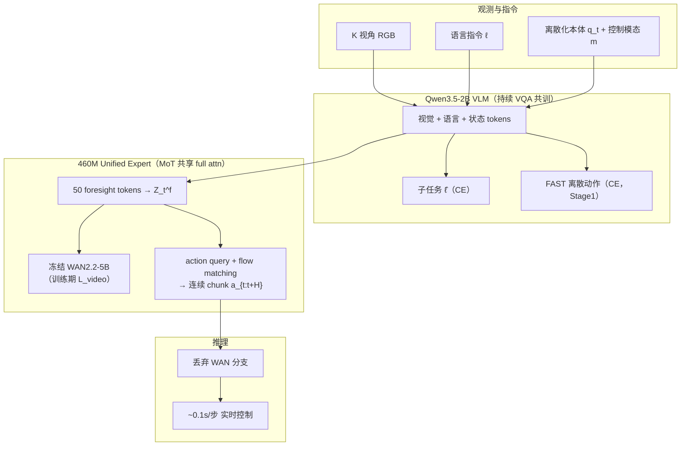

# InternVLA-A1.5：理解、潜式前瞻与动作的统一 VLA

**InternVLA-A1.5**（*Unifying Understanding, Latent Foresight, and Action for Compositional Generalization*，[arXiv:2607.04988](https://arxiv.org/abs/2607.04988)，上海人工智能实验室 **Physical Intelligence Team**）是在 [InternVLA-A1](https://arxiv.org/abs/2601.02456) 统一范式上的升级：把 **视觉–语言理解**、**潜式未来推理** 与 **连续动作生成** 收进 **单一 MoT 框架**——在 **Qwen3.5-2B** 原生 chat 模板上 **持续 VQA 与子任务共训** 以守住语义，用 **50 个 learnable foresight token** 向 **冻结 WAN2.2-5B** 查询 **任务相关紧凑未来潜码**（训练期视频 监督、**推理完全丢弃生成器**），再以 **flow matching** 输出 **50 步 action chunk**；在 **1.2M 机器人 episode + 3M InternVLA-M1 多模态** 上预训练后，**六套仿真基准均为最佳或极强竞争力**，真机 **held-out 指令绑定** 与 **13 步 MOF 长程流程** 显著超过 **π₀.₅** 与 **Motus**。

## 一句话定义

**在原生 VLM 上继续语言共训，用少量 foresight token 向冻结视频世界模型「提问」未来潜码来监督动作专家，部署时只留理解 + flow 动作头，兼顾组合泛化、长程执行与实时闭环。**

## 英文缩写速查

| 缩写 | 英文全称 | 简要说明 |
|------|----------|----------|
| InternVLA-A1.5 | Intern Vision-Language-Action A1.5 | 本文统一理解–前瞻–动作 VLA 简称 |
| VLA | Vision-Language-Action | 视觉、语言与动作统一的多模态策略 |
| VLM | Vision-Language Model | 预训练视觉–语言骨干；本文用 Qwen3.5-2B |
| MoT | Mixture of Transformers | 共享 full attention、分模态 linear attention 的混合 Transformer |
| FM | Flow Matching | 流匹配生成范式，学习连续动作速度场 |
| FAST | Fine-grained Action Sequence Tokenizer | 将动作块离散化为短 token 序列的编码器（π 系常用） |
| WAN | Wan video generation model | 本文冻结的视频生成世界模型教师（WAN2.2-5B） |

## 核心信息

| 字段 | 内容 |
|------|------|
| **机构** | 上海人工智能实验室（Shanghai AI Laboratory）Physical Intelligence Team |
| **arXiv** | [2607.04988](https://arxiv.org/abs/2607.04988) |
| **骨干** | Qwen3.5-2B VLM + 460M unified expert（MoT） |
| **世界模型教师** | 冻结 WAN2.2-5B（仅训练期 latent foresight） |
| **预训练数据** | 1.2M 机器人 episode（861M 帧）+ ~3M InternVLA-M1 多模态 QA |
| **推理延迟** | ~0.1s/步（RTX 5090，无视频 分支） |

## 为什么重要

- **统一模型的新配方：** 相对 InternVLA-A1、Being-H0、MMADA 等「未来像素 + 动作联合回归」路线，A1.5 把未来预测改成 **latent querying**——**不从零学像素生成**，却通过冻结 WAN 吸收 **时空动力学先验**；部署侧与 **Fast-WAM / DSWAM** 同族：**训练用世界模型、推理不想象**。
- **语义不被动作目标侵蚀：** Stage 1–2 持续 **VQA + 子任务 + FAST 离散动作** 的 **单一 next-token CE**（机器人:多模态 **0.15:0.85**），论文强调这是 **组合指令 OOD 绑定** 领先 π₀.₅ 的关键——与 [Vesta](./paper-vesta-generalist-embodied-reasoning.md) 讨论的「专精 VLA 遗忘语义」形成对照语境。
- **仿真六榜 + 真机长程：** LIBERO **98.9%**、RoboTwin **93.2%**、SimplerEnv **80.8%**、LIBERO-Plus **84.8%**、DOMINO 零样本 **27.7%**、EBench Test **35.2%**；真机 MOF **76.4%** vs π₀.₅ **29.3%**，held-out tube–target 绑定 **全胜**。
- **工程可部署：** 视频 分支训练后丢弃；**静态图 + SDPA** 下单步 **~0.1s**，避免 Motus 类 WAM 在测试期 **秒级像素 roll** 的延迟税。

## 方法栈（核心结构）

| 模块 | 角色 |
|------|------|
| **Qwen3.5-2B VLM** | 多视角图 + 指令 + 离散本体 + 控制模态；输出子任务文本与（Stage1）FAST 动作 token |
| **460M unified expert** | 与 VLM **MoT 共享 full attention**；承载 foresight tokens + flow action head |
| **50 foresight tokens** | 从多模态上下文读出潜码 \(C_t^f\)，条件化 **冻结 WAN2.2** 做 4 帧未来 video loss |
| **Flow matching 动作头** | 对 **H=50** 连续 chunk 学速度场；Euler 积分去噪；推理复用 VLM KV cache |
| **FAST 词表扩展** | 2048 action tokens 并入 VLM embedding；训练时 expert **被 mask 不得 attend FAST** |

### 流程总览

### 训练阶段

| 阶段 | 步数 | 目标 | 要点 |
|------|------|------|------|
| **Stage 1** | 300K | \(\mathcal{L}_{stage1}\) CE | 机器人+VQA；子任务→FAST 自回归因子分解 |
| **Stage 2** | 600K | CE + \(\mathcal{L}_{video}\) + \(\mathcal{L}_{action}\) | \(\alpha=1,\ \beta=10\)；引入 unified expert |
| **Posttrain** | 60K | 同 Stage 2 | cosine LR；下游 task 微调 |

## 数据与采样

- **机器人六源：** InternData-A1、AgiBotWorld、UMI、DROID、Galaxea、RoboMind 1.0 → **InternVLA-A1 统一动作空间**。
- **多模态：** InternVLA-M1（General / Box / Point / Trajectory QA，~3M）。
- **采样：** 组内 \((\#\text{frames})^\gamma\) + Re-Mix 组间权重；**机器人:多模态 = 0.15:0.85**。

## 实验要点（摘要级）

> 数字以 [arXiv:2607.04988](https://arxiv.org/abs/2607.04988) 为准。

| 设定 | InternVLA-A1.5 | 对照要点 |
|------|----------------|----------|
| **LIBERO avg** | **98.9%** | 超 Motus 97.7%、LingBot-VA 98.5% |
| **LIBERO-Plus total** | **84.8%**（零样本） | 背景/噪声/相机扰动领先 |
| **RoboTwin 2.0 avg** | **93.2%** | clean 93.3 / rand 93.0，域随机几乎不掉点 |
| **SimplerEnv avg** | **80.8%** | 超 Xiaomi-Robotics-0 79.2% |
| **DOMINO SR** | **27.7%** ZS / **29.3%** FT | 动态操作零样本最高 |
| **EBench Test SR** | **35.2%** | 移动操作长程领先 π₀.₅ 29.5% |
| **真机 MOF** | **76.4%** | π₀.₅ 29.3%；Motus 0% |
| **held-out 指令绑定** | 三任务 OOD **最佳** | 组合泛化核心证据 |

**消融（Table 8）：** 去掉 video loss 或 foresight tokens → LIBERO-Plus / DOMINO 跌幅最大，说明 **潜式前瞻** 主要服务 **分布偏移与动态交互**。

## 常见误区或局限

- **误区：** 把 A1.5 当成测试期仍滚 WAN 的 WAM——**视频 生成器仅训练期监督 foresight token，推理接口是纯 VLA + flow head**。
- **误区：** 认为持续 VQA 只是正则——论文把 **chat 模板 + 单一 CE** 视为 **语义保持与组合 grounding** 的核心设计，而非可选 trick。
- **局限：** foresight 视界 **≤ 一个 action chunk**；尚无长程显式规划或在线 world-model roll。
- **局限：** WAN 冻结且通用，**embodied 场景覆盖** 上界受教师预训练分布约束；代码/权重截至 ingest **尚未公开**。

## 与其他工作对比

| 对照对象 | InternVLA-A1.5 的差异 |
|----------|------------------------|
| **InternVLA-A1** | 同团队前作；A1.5 用 **latent foresight + 持续 VQA** 替代 **像素级未来回归**，语义与零样本更稳 |
| **π₀.₅** | 同族 FAST 离散 + flow 连续双阶段；A1.5 加强 **VQA 共训比例** 与 **冻结 WAN 动力学蒸馏**，长程 MOF 大幅领先 |
| **Motus** | 典型 **部署期仍想象未来** 的 video-action 路线；A1.5 **丢弃生成器** 保实时，MOF 上 76.4% vs 0% |
| **Being-H0.7** | 同为 **潜空间未来监督**；A1.5 用 **冻结大规模视频生成器** 作教师而非自建轻量未来头 |
| **LingBot-VLA 2.0** | 同 RoboTwin/LIBERO 赛道；LingBot 走 **MoE + 6 万小时数据工程**；A1.5 强调 **语义保持 + latent WAN 查询** |
| **Xiaomi-Robotics-0** | 同 **Qwen3 + DiT flow** 族；A1.5 额外统一 **理解/前瞻/动作** 三目标与 **组合泛化** 真机协议 |

## 关联页面

- [VLA（Vision-Language-Action）](../methods/vla.md) — 统一 VLA 范式与 π₀.₅/FAST 语境。
- [π₀.₇（Pi-zero 0.7）](../methods/pi07-policy.md) — 多模态提示与子任务分解对照。
- [World Action Models（WAM）](../concepts/world-action-models.md) — 「训练耦合、部署不想象」族谱定位。
- [Being-H0.7](../methods/being-h07.md) — 潜空间世界–动作先验的另一路径。
- [Action Chunking](../methods/action-chunking.md) — H=50 chunk 与 KV cache 推理。
- [Manipulation](../tasks/manipulation.md) — LIBERO / RoboTwin / 真机操作背景。
- [RoboTwin](./robotwin.md) — 双臂仿真基准与 DOMINO 动态扩展。
- [LingBot-VLA 2.0](./lingbot-vla-v2.md) — 同赛道大规模预训练 VLA 对照。
- [RoboInter1.5](./paper-robointer-1-5.md) — 同组织生态的稠密中间表示 + plan-then-execute VLA 套件（Executor 参考 InternVLA-M1）

## 推荐继续阅读

- 论文 PDF：[arXiv:2607.04988](https://arxiv.org/pdf/2607.04988)
- 前作 InternVLA-A1：[arXiv:2601.02456](https://arxiv.org/abs/2601.02456) / [项目页](https://internrobotics.github.io/internvla-a1.github.io/)
- π₀.₅ 技术报告：[Physical Intelligence π₀.₅](https://www.physicalintelligence.company/blog/pi05) — FAST 离散动作与 flow 连续头对照
- WAN 视频生成：[Wan2.2](https://arxiv.org/abs/2503.20314) — foresight 冻结教师来源

## 参考来源

- [InternVLA-A1.5 论文摘录](../../sources/papers/internvla_a15_arxiv_2607_04988.md)
