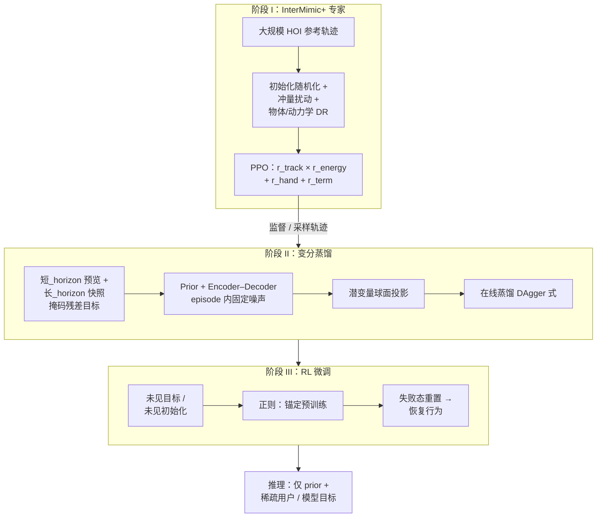

# InterPrior（Scaling Generative Control for Physics-Based Human-Object Interactions）

**InterPrior** 是 UIUC 与 Amazon 团队的 **物理仿真人–物交互（HOI）** 论文（arXiv:2602.06035，项目页标注 **CVPR 2026 Highlight**）：用 **大规模模仿预训练** 建立 **稀疏目标条件** 的 **生成式全身控制器**，再用 **RL 后训练** 缓解纯蒸馏在巨大 HOI 构型空间上的 **分布外脆性**，同时避免孤立 RL 的 **非自然奖励投机**。与 **InterMimic**（全参考共跟踪）形成「专家 → 可条件采样先验 → 可泛化流形」的前后级关系。

## 为什么重要

- **对准 HOI 的组合爆炸**：多接触模式、相对位姿与物体几何使 **稠密参考** 难以覆盖；论文把问题表述为需要 **运动先验（motor prior）** 而非单一轨迹跟踪器。
- **算法立场清晰**：**蒸馏给自然性与技能宽度，RL 给鲁棒与失败恢复**；并显式使用 **失败状态重置** 学习 **再接近 / 再抓取**。
- **与人形落地叙事衔接**：在 **Unitree G1** 上展示 **sim-to-sim** 与 **实时键盘交互**；同系列 [ULTRA](https://ultra-humanoid.github.io/) 站点将「真机多模态部署」作为延伸线索（以各论文为准）。

## 流程总览

## 核心机制（归纳）

### 观测、目标与动作接口

- **观测**：人体与刚体物体的运动学量，加上 **体段–物体有符号距离** 与 **接触指示** 等交互项；量在 **根坐标 + 局部航向** 下归一化（支持 SMPL 人形与 G1 等不同骨架宽度）。
- **目标**：由参考构造的 **多_horizon 掩码目标**（含手–物接触、末端位姿、物体位姿等分量的随机子集），推理时可由用户或上游生成器 **只填稀疏分量**。
- **动作**：**关节目标（指数映射）→ PD 力矩**，在物理仿真中闭环滚动。

### InterMimic+ 相对全参考模仿的补丁

- **物理与形状随机化** 暴露动力学多样性；**无参考手奖励** 让抓取对齐 **仿真中真实物体** 而非盲跟可能已偏的参考；**终止惩罚** 抑制跌倒与大偏差下的投机。

### 变分蒸馏的关键设计

- **残差后验** 把「未来全序列信息」压进训练期 encoder，推理折叠为 **prior 采样**。
- **球面潜变量** 限制 rare latent 幅度、稳定多模态；**episode 内固定 \(\epsilon\)** 促进时间连贯。

### RL 微调的角色

- 优化 **任务成功** 相关项并 **正则回拉** 到预训练行为；用 **失败池重置** 显式增加恢复数据占比，从而把离散「技能片段」 **焊成连续可泛化流形**。

## 常见误区或局限

- **仿真主证据**：论文核心实验与先验仍在 **物理仿真** 内；「真机部署潜力」需与后续系统（如 ULTRA 线）区分阅读。
- **非视觉端到端**：观测以 **本体 + 几何交互特征** 为主，不与 RGB 像素策略直接竞争同一接口。
- **计算与数据前提**：大规模 HOI 模仿 + RL 微调依赖 **并行仿真吞吐** 与 **高质量参考数据管线**（常与 InterMimic / InterAct 等姊妹工作一起看）。

## 关联页面

- [Imitation Learning](../methods/imitation-learning.md)
- [Reinforcement Learning](../methods/reinforcement-learning.md)
- [DAgger](../methods/dagger.md)
- [Loco-Manipulation](../tasks/loco-manipulation.md)
- [Contact-Rich Manipulation](../concepts/contact-rich-manipulation.md)
- [Domain Randomization](../concepts/domain-randomization.md)
- [Sim2Real](../concepts/sim2real.md)
- [Unitree G1](./unitree-g1.md)

## 推荐继续阅读

- InterMimic 项目页：<https://sirui-xu.github.io/InterMimic/>
- InterAct 数据集：<https://sirui-xu.github.io/InterAct/>
- ULTRA（多模态人形 loco-manipulation）：<https://ultra-humanoid.github.io/>

## 参考来源

- [InterPrior 论文摘录](../../sources/papers/interprior_arxiv_2602_06035.md)
- [InterPrior 项目页归档](../../sources/sites/sirui-xu-interprior-github-io.md)
- Xu et al., *InterPrior: Scaling Generative Control for Physics-Based Human-Object Interactions*, arXiv:2602.06035, 2026. <https://arxiv.org/abs/2602.06035>
