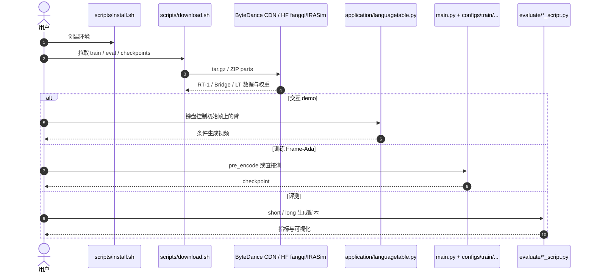

# IRASim（细粒度操作世界模型 · arXiv:2406.14540）

**IRASim**（*IRASim: A Fine-Grained World Model for Robot Manipulation*，[arXiv:2406.14540](https://arxiv.org/abs/2406.14540)，Fangqi Zhu / Hongtao Wu 等 · **字节跳动 Seed（ByteDance Seed）** / **香港科技大学（HKUST）**；[项目页](https://gen-irasim.github.io/)，[代码](https://github.com/bytedance/IRASim)）把机器人 **动作轨迹** 条件成 **高保真交互视频**：给定历史观测与 action chunk，用 Diffusion Transformer 的 **帧级动作条件（Frame-Ada）** 对齐「每一步动作 ↔ 每一帧」，服务策略评估、测试时模型规划与可控合成。

## 一句话定义

**一种面向操作的 trajectory-to-video 世界模型：在 latent 扩散 DiT 里用帧级动作条件生成细粒度机–物交互视频，并据此做策略评估与模型规划。**

## 英文缩写速查

| 缩写 | 英文全称 | 简要说明 |
|------|----------|----------|
| IRASim | Interactive Real-robot Action Simulator | 本文方法名（细粒度操作 WM） |
| DiT | Diffusion Transformer | 骨干生成架构 |
| Frame-Ada | Frame-level Adaptation | 每帧对应动作 embedding 的 AdaLN 条件 |
| Video-Ada | Video-level Adaptation | 整段轨迹压成单一条件 embedding |
| VAE | Variational Autoencoder | SDXL VAE；在 latent 空间扩散 |
| CEM / MBP | Model-Based Planning | 用想象视频筛轨迹提案 |
| IoU | Intersection over Union | Push-T 规划成功度量 |
| LIBERO | Lifelong Robot Learning benchmark | 仿真策略评估对照环境 |

## 为什么重要

- **对齐 action chunking：** 现代操作策略输出轨迹而非单步；IRASim 把「轨迹→视频」当一等公民，而不是用粗粒度文本去提示通用 T2V。
- **细粒度交互：** 操纵失败常在毫米级接触；帧级动作条件强化每帧与对应动作对齐，项目页与论文定性显示机–物接触细节优于 Video-Ada / 若干视频预测基线。
- **虚拟沙盒两条用：** （1）策略评估与 GT 仿真相关高；（2）测试时规划把 Push-T IoU 从 **0.637 提到 0.961**——对齐 [route-03 虚拟沙盒](../overview/world-models-route-03-virtual-sandbox.md) 与 [物理保真输出轴](../overview/world-model-physics-fidelity-outputs.md) 的「未来视频」族。
- **已开源可落地：** Apache-2.0 仓含数据、checkpoints 与键盘交互 demo，复现门槛相对清晰。

## 核心信息

| 项 | 内容 |
|----|------|
| **机构** | 字节跳动 Seed（ByteDance Seed）、香港科技大学（HKUST） |
| **任务形式** | \(I^{t+1:t+n+1}=f(I^{t-h:t},a^{t:t+n})\) |
| **骨干** | Spatial–temporal DiT + 冻结 SDXL VAE |
| **关键条件** | **Frame-Ada**（优于 Video-Ada） |
| **数据** | RT-1、Bridge、Language-Table、RoboNet |
| **分辨率 / 长度** | 最高约 **288×512**；长轨迹自回归 **150+** 帧 |
| **开源** | **已开源** · Apache-2.0 · 数据+权重 |

## 流程总览

```mermaid
flowchart LR
  subgraph input [输入]
    HIST[历史帧 I^{t-h:t}]
    TRAJ[动作轨迹 a^{t:t+n}]
  end
  subgraph model [IRASim]
    VAE_E[VAE Enc]
    DIT[DiT + Frame-Ada]
    VAE_D[VAE Dec]
  end
  subgraph use [下游]
    VID[细粒度交互视频]
    EVAL[策略评估]
    PLAN[模型规划选轨迹]
    CTRL[键盘/VR 可控合成]
  end
  HIST --> VAE_E
  VAE_E --> DIT
  TRAJ --> DIT
  DIT --> VAE_D
  VAE_D --> VID
  VID --> EVAL
  VID --> PLAN
  VID --> CTRL
```

## 核心原理

### Trajectory-to-video

操作世界模型需预测「执行动作轨迹后场景如何变」。文本条件 T2V 只给全局语义，无法逐帧指定臂运动；IRASim 把每步动作 \(a^i\in\mathbb{R}^{d}\)（典型 7-DoF：平移+旋转+夹爪）与对应帧绑定。

### Frame-Ada vs Video-Ada

| 设定 | 条件方式 | 适用直觉 |
|------|----------|----------|
| **Video-Ada** | 整段轨迹 → 单一 embedding → 全局 AdaLN | 类似文本条件，帧–动作对齐弱 |
| **Frame-Ada** | 每动作独立 embedding；空间块按帧 scale/shift；时间块共享视频级条件 | **显式帧级对齐** |

历史帧作为「干净」上下文参与注意力，仅对未来帧加噪并计损失，保证与观测一致。

### 长时自回归

短轨迹单次生成；长任务把上一 clip 末帧当作下一 clip 历史条件，滚动生成并保持时间一致。

## 工程实践

| 项 | 实践要点 |
|----|----------|
| **开源状态** | **已开源**（截至 **2026-07-27**）：[bytedance/IRASim](https://github.com/bytedance/IRASim) · Apache-2.0；项目页 [gen-irasim.github.io](https://gen-irasim.github.io/) |
| **数据 / 权重** | `scripts/download.sh` 或 HF `fangqi/IRASim`；单数据集数十～数百 GB |
| **最短体验** | `bash scripts/install.sh` → 下 Language-Table checkpoint → `python3 application/languagetable.py` |
| **训练** | 建议先 VAE 预编码；`main.py --config configs/train/rt1/frame_ada.yaml`；多卡 `torchrun` |
| **选型** | 需要 **动作轨迹条件像素仿真 + 可复现权重** 时优先；需要掩码前向/逆向统一见 [Masked Visual Actions](./paper-masked-visual-actions.md)；需要 RGB-D-Flow 见 [RynnWorld-4D](./paper-rynnworld-4d-rgb-depth-flow.md) |

## 源码运行时序图

节点对齐 [`sources/repos/irasim.md`](../../sources/repos/irasim.md)。



- **最短复现：** install → 下 Language-Table 权重 → `languagetable.py`。
- **论文向复现：** 对应数据集 config 训 Frame-Ada → `evaluation_short_script.py` / long 生成脚本。

## 实验与评测

| 轴 | 报告口径（以论文 / 项目页为准） |
|----|--------------------------------|
| 视频质量 | RT-1 / Bridge / Language-Table / RoboNet 上优于对照；人类偏好更高 |
| 缩放 | 模型规模与算力增加，生成质量提升 |
| 策略评估 | 在 IRASim 上评测与 **LIBERO GT 仿真** 强相关 |
| 模型规划 | Push-T：vanilla diffusion policy IoU **0.637 → 0.961**；测试时算力可继续抬升 |
| 可控性 | 键盘 / VR 轨迹控制数据集中虚拟臂 |

## 结论

**IRASim 用帧级动作条件把「动作块→细粒度交互视频」做成可开源复现的操作世界模型，并在评估相关与测试时规划上给出明确收益。**

1. **Frame-Ada 是主贡献** — 相对 Video-Ada，显式绑定每帧与对应动作，服务精细接触。
2. **评估可替代部分仿真刷分** — 与 LIBERO GT 相关高，适合作策略筛选层（仍须真机校准）。
3. **测试时规划有效** — Push-T IoU **0.637→0.961**，且随测试算力缩放。
4. **工程可落地** — Apache-2.0 + 公开数据/权重 + 键盘 demo；注意单数据集体积很大。
5. **物理保真读法** — 属「未来视频」输出族：画面可检查，但 **画面连续 ≠ 动力学正确**；需动作敏感性与策略相关性测试（见 [物理保真输出轴](../overview/world-model-physics-fidelity-outputs.md)）。

## 局限与风险

- **像素生成成本高：** 长 horizon 自回归贵；相对 [V-JEPA 2](./paper-vjepa2.md) latent 规划更重。
- **外观保真 ≠ 物理正确：** 接触与动量细节仍可能「看起来对、执行不对」。
- **数据域绑定：** 公开权重按数据集切分；跨具身 / 新机位需额外微调。
- **存储门槛：** Language-Table 等全集达数百 GB。

## 与其他工作对比

| 对比轴 | IRASim | [Masked Visual Actions](./paper-masked-visual-actions.md) | [V-JEPA 2](./paper-vjepa2.md) | [RynnWorld-4D](./paper-rynnworld-4d-rgb-depth-flow.md) |
|--------|--------|-----------------------------------------------------------|-------------------------------|--------------------------------------------------------|
| **条件** | 低维动作轨迹 | 像素掩码轨迹 | latent 动作（AC 阶段） | 语言 + RGB-D；出 RGB-DF |
| **规划介质** | 像素/latent 视频 | 像素视频 | **表征空间** | 4D latent + Policy 头 |
| **开源** | **完整** 数据+权重 | 部分（LoRA；渲染 soon） | **完整** 权重+AC | 以论文/项目页为准 |
| **代表叙事** | 细粒度交互 + Push-T 规划 | 前向/逆向统一 + r=0.982 | 互联网预训练 + 少机器人数据 | 几何–运动三联 |

## 关联页面

- [世界模型物理保真：输出阅读轴](../overview/world-model-physics-fidelity-outputs.md) — 「未来图像/视频」族代表
- [Masked Visual Actions](./paper-masked-visual-actions.md) — 掩码动作条件对照
- [RynnWorld-4D](./paper-rynnworld-4d-rgb-depth-flow.md) — 几何/运动信号对照
- [V-JEPA 2](./paper-vjepa2.md) — latent 规划中间路线
- [WorldWeaver](./paper-worldweaver.md) — 持续状态寄存器对照
- [Generative World Models](../methods/generative-world-models.md)
- [Video-as-Simulation](../concepts/video-as-simulation.md)
- [世界模型路线 03：虚拟沙盒](../overview/world-models-route-03-virtual-sandbox.md)
- [Manipulation](../tasks/manipulation.md)

## 参考来源

- [IRASim 论文归档（arXiv:2406.14540）](../../sources/papers/irasim_arxiv_2406_14540.md)
- [bytedance/IRASim 代码索引](../../sources/repos/irasim.md)
- [IRASim 项目页归档](../../sources/sites/gen-irasim-github-io.md)
- [具身智能研究室：世界模型物理保真（微信）](../../sources/blogs/wechat_embodied_ai_lab_world_model_physics_fidelity.md)

## 推荐继续阅读

- [arXiv:2406.14540](https://arxiv.org/abs/2406.14540)
- [项目页](https://gen-irasim.github.io/)
- [GitHub — bytedance/IRASim](https://github.com/bytedance/IRASim)
- [HF Dataset — fangqi/IRASim](https://huggingface.co/datasets/fangqi/IRASim)
