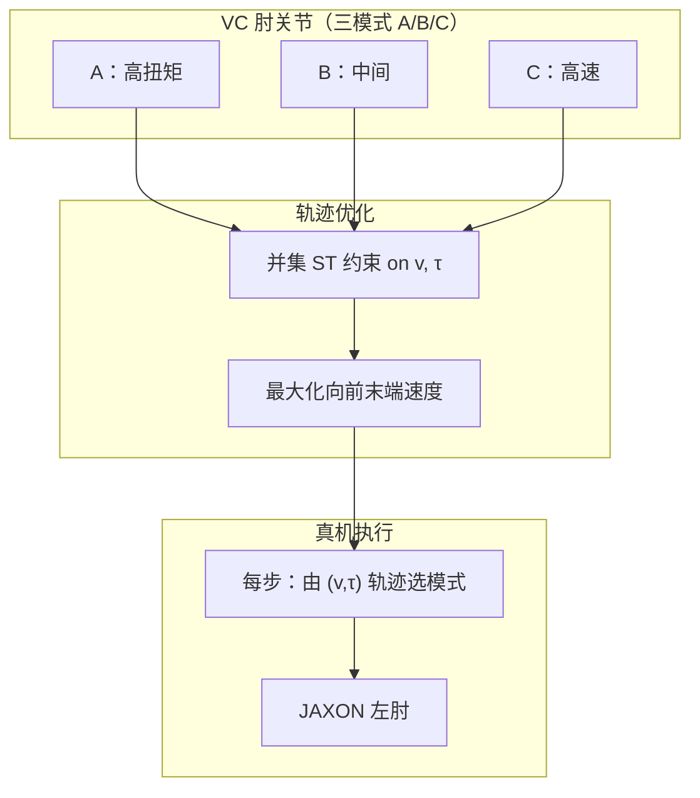

# IROS 2026：VC 电机模式切换动态人形甩臂

**Dynamic Humanoid Arm-Swing Motion via Trajectory Optimization Leveraging Speed–Torque Mode Switching of a Variable Chain Motor**（IROS 2026）在 [可变链电机（VC motor）](./variable-chain-motor.md) 上提出 **轨迹优化 + 运行时模式切换** 管线：优化阶段用 **全模式 speed–torque 可行域并集** 约束关节速度与扭矩，不显式引入离散模式变量；执行阶段按优化轨迹的 speed–torque 剖面 **逐步选择电气模式**。项目在 **JAXON** 左肘验证 **最大向前末端速度** 甩臂，真机峰值 **9.01 m/s**（固定最快单模式 **8.24 m/s**）。项目页：<https://hit4752.github.io/projects/202609_iros26-arm-swing/>。

## 一句话定义

用 **多模式 ST 并集约束** 的轨迹优化，为人形 VC 肘关节生成 **可动态切换电气模式** 的高速度甩臂，并在 JAXON 上实测超越任一固定模式。

## 英文缩写速查

| 缩写 | 英文全称 | 简要说明 |
|------|----------|----------|
| VC motor | Variable Chain Motor | 可变链电机，三档 speed–torque 可切换 |
| TO | Trajectory Optimization | 轨迹优化 / 最优控制数值求解 |
| ST | Speed–Torque | 转速–扭矩特性与可行域 |
| OCP | Optimal Control Problem | 最优控制问题 |
| LSE | Log-Sum-Exp | 用于 smooth max/min 的可微近似 |
| JAXON | JAXON humanoid | 东京大学 life-sized 人形机器人 |

## 为什么重要

- **填补规划空白：** 变输出特性作动器使 admissible \((v,\tau)\) **随模式跳变**；本文给出 **可优化、可执行** 的并集约束 formulation，避免混合整数模式变量。
- **可量化收益：** 相对固定 **最快单模式**，优化轨迹末端速度 **+7.7%**、肘角速度 **+10.2%**；真机末端 **9.01 m/s**。
- **硬件—算法闭环：** 与 IROS 2025 **VC 硬件** 成对阅读，展示 **电气模式切换** 在竞技型臂动作中的价值。

## 流程总览

## 核心机制

### 并集 speed–torque 约束

- 对每个模式 \(i \in \{A,B,C\}\) 有 \(v_{\max,i}\)、\(\tau_{\max,i}\) 与斜率 \(\alpha\) 定义的 **ST 边界**。
- 优化中约束 \(|v|\) 与 \(|\tau|\) 落在 **三模式可行区域的并集**（项目页给出组合边界图）；**不** 在决策变量中显式枚举模式序列。
- **Smooth 近似：** 对 max/min 用 **LSE（log-sum-exp）**，便于 NLP / 轨迹优化求解。

### 执行时模式选择

- 沿优化得到的 \(v(t),\tau(t)\)（或离散时间步），根据当前 speed–torque 点 **选择对应模式** 驱动 VC 电路。
- 切换条件 (d) 的典型序列：**(a)→(b)→(c)→(b)→(a)** — 先高扭矩加速，再切入高速模式完成峰值甩动。

## 实验与评测

| 条件 | 固定模式 / 切换 | 优化轨迹峰值末端 (m/s) | 真机峰值末端 (m/s) | 真机峰值肘速 (rad/s) |
|------|-----------------|------------------------|--------------------|-----------------------|
| (a) | 高扭矩 | 6.20 | 6.20 | −3.93 |
| (b) | 中间 | 8.16 | 7.95 | −7.80 |
| (c) | 高速 | 8.26 | 8.24 | −9.19 |
| (d) | **模式切换（提出）** | **8.89** (+7.7% vs c) | **9.01** | **−10.23** |

- **读数：** 固定 (c) 已接近单模式极限，但无法在 **起摆段** 同时获得 (a) 的扭矩与 **末段** 的 (c) 速度；并集优化 + 切换 (d) 同时利用两者。

## 结论

**VC 电机的价值要在「会切换的模式序列 + 并集约束轨迹优化」里才完整释放；只锁死在单一 ST 模式会明显浪费包络。**

1. **规划用并集、执行再选模式** — 避免离散模式变量，仍能在真机沿 (a)→…→(c) 切换。
2. **相对最快固定模式仍有 ~8–10% 速度增益** — 优化与真机均一致；固定高扭矩 (a) 末端仅 ~6.2 m/s。
3. **电压日志支持「高速不必电压爆炸」叙事** — 切换高速模式后肘速上升时所需电压仍可控（项目页图）。
4. **任务聚焦单肘甩臂** — 全身协调、接触与重复切换耐久需后续工作。
5. **复现门槛** — 2026-09-25 项目页 **无代码**；需 VC 硬件 + JAXON 类平台或自建 ST 并集模型。

## 工程实践

| 项 | 建议 |
|----|------|
| 仿真建模 | 为每模式建立 **ST 多边形 / 分段线性** 边界，优化层取 **并集**；执行层加 **模式滞后 / 最小保持时间** 防抖动（论文未详述，工程上建议） |
| 与 SysID 衔接 | 固定 ST 辨识见 [PACE](./paper-pace-sim2real-legged-robots.md)；VC 需 **分模式** 标定再并集 |
| 对照基线 | 始终对比 **固定 A/B/C** 三模式，避免只与「错误减速比」电机比 |

## 与其他工作对比

| 对照 | 差异读法 |
|------|----------|
| [可变传动 / 多档减速](./variable-chain-motor.md)（VC 硬件语境） | 机械 CVT/多档对人形 **增重**；VC 用 **电气串并联** 切换 ST |
| [PACE](./paper-pace-sim2real-legged-robots.md) | 固定 ST 参数 + SysID；VC 需 **分模式 ST + 并集规划** |
| [轨迹优化 vs RL](../comparisons/trajectory-opt-vs-rl.md) | 本文是 **离线 TO + 开环执行模式调度**；高动态全身仍常混合 RL/MPC |

## 局限与风险

- **源码运行时序图 | 不适用** — 项目页与作者 GitHub **未发布** 轨迹优化或控制代码（2026-09-25 核查）。
- **无 arXiv** — 细节以 IROS 2026 正文与项目页为准。
- **切换瞬态 / 热设计** — 公开页强调性能，未系统报告连续切换寿命。

## 关联页面

- [可变链电机（VC motor）](./variable-chain-motor.md)
- [轨迹优化（Trajectory Optimization）](../methods/trajectory-optimization.md)
- [最优控制（OCP）](../concepts/optimal-control.md)
- [作动器传动选型闭环](../queries/actuator-drive-chain-selection-loop.md)

## 参考来源

- [IROS 2026 论文摘录](../../sources/papers/iros26_vc_motor_arm_swing_tada.md)
- [IROS 2025 VC 硬件摘录](../../sources/papers/iros25_variable_chain_motor_tada.md)
- [项目页归档](../../sources/sites/hit4752_iros26_vc_motor_arm_swing.md)

## 推荐继续阅读

- 项目页：[Dynamic Humanoid Arm-Swing Motion](https://hit4752.github.io/projects/202609_iros26-arm-swing/)
- IROS 2025 VC 电机：[DOI 10.1109/iros60139.2025.11246199](https://doi.org/10.1109/iros60139.2025.11246199)
