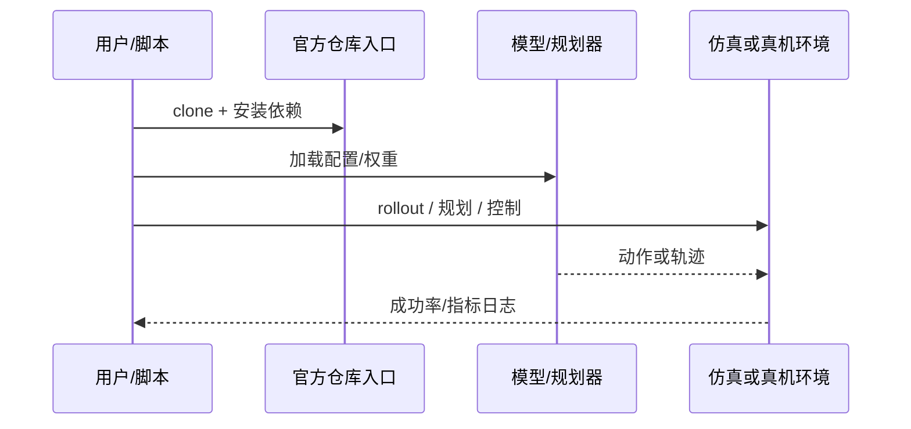

# JEPA Policy（arXiv:2609.09630）

**JEPA Policy**（[JEPA Policy: Diffusion-Free Imitation Learning via Paired Action and Future Representation Prediction](https://arxiv.org/abs/2609.09630)）来自 [具身智能小站 11 篇盘点](../../sources/blogs/wechat_embodied_station_11_papers_vlm_manipulation_2026-09-10.md)。成对监督动作块与未来视觉表征的扩散-free 模仿学习；共享 Transformer；仿真 83.0% 均值成功率，真机 630 次评估；jiejie567/JEPA-Policy 已开源。

## 一句话定义

**仿真九任务均值成功率 83.0%（MIP 77.4%、Diffusion Policy 76.6%）；推理仅 +0.29 ms。**

## 英文缩写速查

| 缩写 | 英文全称 | 简要说明 |
|------|----------|----------|
| IL | Imitation Learning | 从专家示范学习策略 |
| VLM | Vision-Language Model | 视觉-语言多模态模型 |
| WM | World Model | 预测未来观测或表征的动力学模型 |
| RL | Reinforcement Learning | 强化学习 |
| CEM | Cross-Entropy Method | 采样优化动作/轨迹的规划器 |
| DoF | Degrees of Freedom | 自由度 |

## 为什么重要

- 纳入本期 **VLM 控制 / 世界模型 / 灵巧操作 / 规划 / 评测** 主线之一。
- 开源状态：**已开源**（步骤 2.5 核查，2026-09-10）。
- 与 [11 篇技术地图](../overview/vlm-manipulation-11-papers-technology-map.md) 中同类工作可横向对照。

## 核心机制

| 项 | 内容 |
|----|------|
| **arXiv** | [2609.09630](https://arxiv.org/abs/2609.09630) |
| **项目页** | https://jiejie567.github.io/JEPA-Policy/ |
| **代码** | https://github.com/jiejie567/JEPA-Policy |
| **开源** | **已开源** |
| **文内指标** | 仿真九任务均值成功率 83.0%（MIP 77.4%、Diffusion Policy 76.6%）；推理仅 +0.29 ms。 |

## 源码运行时序图

## 实验与评测

| 项 | 文内口径 |
|----|----------|
| 仿真 | 九任务 **均值成功率 83.0%**；对照 MIP **77.4%**、Diffusion Policy **76.6%** |
| 真机 | **630 次** 评估 rollout |
| 延迟 | 相对基线推理仅 **+0.29 ms**（扩散-free 的直接收益） |

- **读法：** 本页为索引级摘要，上表数字取自 [公众号盘点](../../sources/blogs/wechat_embodied_station_11_papers_vlm_manipulation_2026-09-10.md) 与项目页；任务清单、消融与真机协议以 **原文 PDF** 为准（[参考来源](#参考来源)）。
- **可复现性：** 开源结论 **已开源**（步骤 2.5 核查，2026-09-10），数字可尝试自跑复核。

## 与其他工作对比

| 对照路线 | 差异 |
|----------|------|
| Diffusion Policy | 本文的直接对照基线（76.6% vs 83.0%）；扩散需多步采样，本文用 **成对预测动作块 + 未来视觉表征** 的共享 Transformer 去掉采样环，换来 +0.29 ms 的延迟口径。 |
| MIP | 第二条对照基线（77.4%）；同为非扩散路线，差异在是否把 **未来表征预测** 作为配对监督。 |
| [DUET-DINO](./paper-duet-dino.md) | 同期同样预测动作条件未来表征，但用 **CEM 在 latent 空间做规划**，作者自陈候选量限制实时性；JEPA Policy 直接回归动作块，取舍正好相反。 |
| [Semigroup-JEPA](./paper-semigroup-jepa.md) | 同属 JEPA 家族，目标是 **零样本物理泛化** 而非策略延迟与成功率。 |
| [PccDiffuser](./paper-pccdiffuser.md) | 同期反向取舍：那里把扩散的 **多模态解** 当卖点，这里把扩散的 **采样延迟** 当要消除的成本。 |

## 结论

**JEPA Policy 值得按「已开源」边界阅读：先核对仓库是否可跑，再引用文内成功率数字。**

1. 索引来源为公众号导读，实验细节以 arXiv PDF 为准。
2. 开源结论：**已开源**。
3. 选型时对照 [11 篇地图](../overview/vlm-manipulation-11-papers-technology-map.md) 中相邻节点，避免重复造页。

## 关联页面

- [VLM 与操作 11 篇技术地图](../overview/vlm-manipulation-11-papers-technology-map.md)
- [模仿学习 (Imitation Learning)](../methods/imitation-learning.md)
- [Generative World Models](../methods/generative-world-models.md)
- [Manipulation](../tasks/manipulation.md)

## 参考来源

- [jepa-policy_arxiv_2609_09630.md](../../sources/papers/jepa-policy_arxiv_2609_09630.md)
- [wechat 11篇盘点](../../sources/blogs/wechat_embodied_station_11_papers_vlm_manipulation_2026-09-10.md)
- [arXiv:2609.09630](https://arxiv.org/abs/2609.09630)

## 推荐继续阅读

- [arXiv PDF](https://arxiv.org/pdf/2609.09630)
- [项目页](https://jiejie567.github.io/JEPA-Policy/)
- [GitHub](https://github.com/jiejie567/JEPA-Policy)
