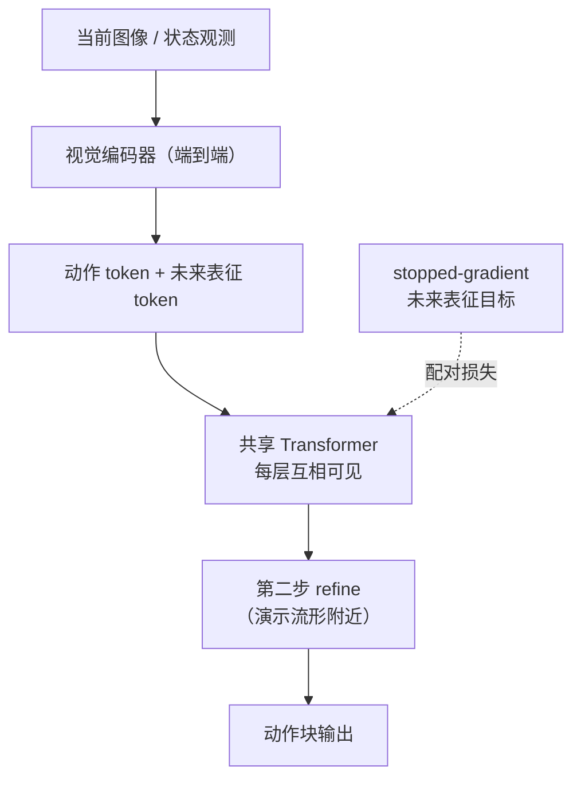
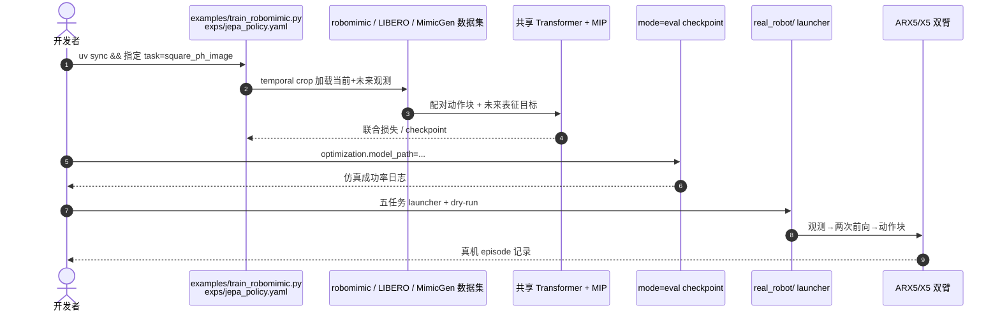

# JEPA Policy：扩散-free 的动作与未来表征联合模仿学习

**JEPA Policy**（*Diffusion-Free Imitation Learning via Paired Action and Future Representation Prediction*，[arXiv:2609.09630](https://arxiv.org/abs/2609.09630)，[项目页](https://jiejie567.github.io/JEPA-Policy/)）提出：在 **同一条共享 Transformer** 里，用 **成对监督** 同时预测专家 **动作块** 与执行该动作后出现的 **未来视觉表征**；训练与部署均 **无扩散采样环**，两次前向即可完成 refine。实现基于 [Minimum Flow Policies (MIP)](https://github.com/simchowitzlabpublic/much-ado-about-noising)，官方仓库 [jiejie567/JEPA-Policy](https://github.com/jiejie567/JEPA-Policy) **已开源**（仿真训练/评测 + ARX5/X5 真机推理栈；checkpoint 未随 Git）。

## 一句话定义

**把「未来感知」写进动作生成栈本身——动作 token 与未来表征 token 全程互相可见，用 stopped-gradient 的未来目标做配对监督，换来比 100-step Diffusion Policy 快 33× 的决策时间且仿真九任务均值成功率 83.0%。**

## 英文缩写速查

| 缩写 | 英文全称 | 简要说明 |
|------|----------|----------|
| JEPA | Joint Embedding Predictive Architecture | 联合嵌入预测架构 |
| MIP | Minimum Flow Policies | 本文基座的两步扩散-free 策略族 |
| IL | Imitation Learning | 模仿学习 |
| DP | Diffusion Policy | 本文主要延迟对照基线 |
| BC | Behavior Cloning | 标准行为克隆仅监督动作 |

## 为什么重要

- **未来监督不必走扩散：** 许多「未来感知」策略依赖迭代去噪；本文用 **配对 latent 目标 + 共享注意力栈** 直接塑造动作表征。
- **延迟与成功率兼得：** 相对 100-step Diffusion Policy，**模型决策 13.2 ms vs 439.5 ms**（33×）；仿真九任务 **均值 83.0%**，较 action-only MIP **+5.6 pt**（9/9 任务提升）。
- **可复现栈齐全：** robomimic / LIBERO / MimicGen Hydra 配置、匹配基线与 `real_robot/` 推理管线已发布（权重见 manifest）。

## 核心信息

| 项 | 内容 |
|----|------|
| **arXiv** | [2609.09630](https://arxiv.org/abs/2609.09630) |
| **项目页** | <https://jiejie567.github.io/JEPA-Policy/> |
| **代码** | <https://github.com/jiejie567/JEPA-Policy>（MIT） |
| **开源** | **已开源**（仿真完整；真机权重未入库） |

## 核心原理

### 配对监督 vs 纯 BC

| 路线 | 监督信号 |
|------|----------|
| 标准 BC | 仅专家 **动作块** |
| JEPA Policy | **动作块** + 该动作实际导致的 **未来观测表征**（非假设平均未来） |

### 共享 Transformer + 两步 refine

- **零扩散步：** 训练与推理均为 **两次前向**，无去噪链。
- **架构消融要点（项目页）：** 双分支 / 梯度路由对照显示，未来监督必须能 **穿过动作生成栈** 才带来增益；未来预测误差可用于 **任务内失败排序**。

### 公开 preset（仓库）

| 超参 | robomimic / MimicGen | LIBERO |
|------|----------------------|--------|
| 动作 horizon | 10 | 16 |
| MIP 步数 | 2（插值时间 0.9） | 同左 |
| 未来 token | 1（horizon 4） | 同左 |
| future-loss ratio | 0.1（自适应） | 同左 |

## 源码运行时序图

官方仓库 [jiejie567/JEPA-Policy](https://github.com/jiejie567/JEPA-Policy)（归档见 [sources/repos/jepa-policy.md](../../sources/repos/jepa-policy.md)）：

- **最短仿真路径：** `uv sync --extra dev` → `train_robomimic.py -cn exps/jepa_policy.yaml task=square_ph_image` → `mode=eval`。
- **真机：** 先读 `real_robot/README.md`（安全、标定、紧急停止）；checkpoint 按 75-checkpoint manifest 获取。

## 实验与评测

### 仿真（九任务，三 seed）

| 指标 | JEPA Policy | action-only MIP | Diffusion Policy |
|------|-------------|-----------------|------------------|
| 均值成功率 | **83.0%** | 77.4% | 76.6% |
| 模型决策时间（PPU） | **13.2 ms** | — | 439.5 ms（100-step） |

- **9/9 任务** 相对 action-only 提升；相对 Diffusion Policy **全胜**，但均值 margin 受 Tool Hang 等任务影响（项目页有说明）。

### 真机（ARX5/X5，630 episode / 63 session）

| 方法 | 汇总成功率 |
|------|------------|
| JEPA Policy | **66.9%** |
| action-only MIP | 54.7% |
| Diffusion Policy（DP-16） | 31.8% |

五任务：Cabinet、Cup Stack、Cup Upright、Plate Grape、Pen Insert；每格 10 episode，**固定动作块预算** 判成功（不计墙钟）。

- **读法：** 仿真数字可自跑复核；真机优势相对 action-only 为 **方向性**（每格仅 10 ep）。

## 与其他工作对比

| 对照路线 | 差异 |
|----------|------|
| Diffusion Policy | 多步采样 → 高延迟；本文 **扩散-free 两次前向**。 |
| action-only MIP | 去掉未来配对监督 → 仿真 **-5.6 pt** 均值。 |
| [DUET-DINO](./paper-duet-dino.md) | 同样预测动作条件未来表征，但用 **CEM latent 规划**；JEPA 直接回归动作块，换 **低延迟**。 |
| [Semigroup-JEPA](./paper-semigroup-jepa.md) | 同属 JEPA 家族，目标 **零样本物理泛化** 而非策略延迟。 |
| [PccDiffuser](./paper-pccdiffuser.md) | 保留扩散的多模态解；本文消除扩散 **采样成本**。 |

## 结论

**若部署瓶颈是扩散采样延迟、仍想要未来感知监督，JEPA Policy 提供了可复现的「配对未来表征 + 共享栈」配方。**

1. **增益在架构：** 未来监督必须贯穿动作生成栈，非简单 auxiliary head。
2. **仿真 83.0% / +5.6 pt** 与 **33× 决策加速** 是主文数字；真机为 **方向性** 证据。
3. **开源：仿真完整**；真机需 manifest 取权重，勿假设 clone 即可跑硬件。
4. **未来预测误差** 可做 **任务内风险排序**，不是通用失败概率。
5. 与 [InstantMimic](./paper-instantmimic.md) 正交：一个减 **推理延迟**，一个减 **训练 wall-clock**。

## 关联页面

- [模仿学习 (Imitation Learning)](../methods/imitation-learning.md)
- [DUET-DINO](./paper-duet-dino.md)
- [VLM 与操作 11 篇技术地图](../overview/vlm-manipulation-11-papers-technology-map.md)
- [Semigroup-JEPA](./paper-semigroup-jepa.md)

## 参考来源

- [jepa-policy_arxiv_2609_09630.md](../../sources/papers/jepa-policy_arxiv_2609_09630.md)
- [jepa-policy 项目页归档](../../sources/sites/jepa-policy-github-io.md)
- [jepa-policy 仓库归档](../../sources/repos/jepa-policy.md)
- [arXiv:2609.09630](https://arxiv.org/abs/2609.09630)

## 推荐继续阅读

- [arXiv PDF](https://arxiv.org/pdf/2609.09630)
- [项目页](https://jiejie567.github.io/JEPA-Policy/)
- [GitHub](https://github.com/jiejie567/JEPA-Policy)
