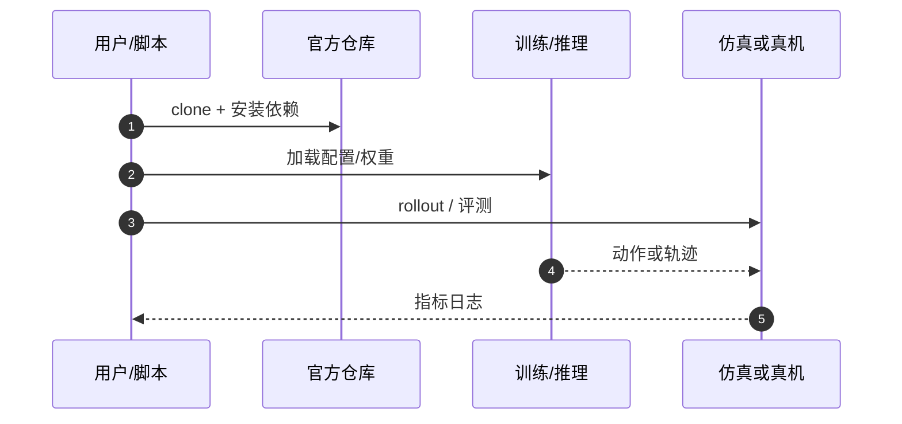

# JEPLO（arXiv:2609.15770）

**JEPLO**（*JEPLO: Joint-Embedding Predictive Learning for LiDAR-Based Legged Locomotion*，[arXiv:2609.15770](https://arxiv.org/abs/2609.15770)，[代码](https://github.com/ASIG-X/JEPLO)）来自 [具身智能小站 12 篇盘点](../../sources/blogs/wechat_embodied_station_12_papers_vla_deploy_2026-09-16.md)。

## 一句话定义

**PE-JEPA 学局部地形 latent，CJTS 教师—学生接到四足运动策略；强调遮挡/稀疏/噪声感知退化下的鲁棒 sim-to-real。**

## 英文缩写速查

| 缩写 | 英文全称 | 简要说明 |
|------|----------|----------|
| JEPLO | Joint-Embedding Predictive Learning for Locomotion | 本文框架 |
| JEPA | Joint-Embedding Predictive Architecture | 联合嵌入预测表征学习 |
| LiDAR | Light Detection and Ranging | 激光雷达外感知 |
| Sim2Real | Simulation to Real | 仿真到真机迁移 |

## 为什么重要

- 足式在楼梯、箱体与遮挡环境中，感知退化往往比策略本身更先造成失稳；无图导航与板载轻量计算的可迁移表征。
- 开源结论：**已开源**（步骤 2.5，2026-09-16）。
- 与 [12 篇技术地图](../overview/vla-deploy-12-papers-technology-map.md) 中同类工作可横向对照。

## 核心机制

| 项 | 内容 |
|----|------|
| **arXiv** | [2609.15770](https://arxiv.org/abs/2609.15770) |
| **开源** | **已开源** |
| **要点** | PE-JEPA 从原始 LiDAR + 本体状态学局部地形表征；CJTS 管线把 latent 接到 locomotion policy；评测强调退化感知条件。 |
| **文内指标** | 多地形 sim-to-real；依赖 Unitree Go2、Mid-360 LiDAR、Isaac Lab/MuJoCo 与 Jetson 等具体条件。 |

## 源码运行时序图

## 实验与评测

- 多地形 sim-to-real；依赖 Unitree Go2、Mid-360 LiDAR、Isaac Lab/MuJoCo 与 Jetson 等具体条件。
- **读法：** 索引级摘要；逐项对照与 baseline 以原文 PDF 为准。

## 与其他工作对比

- 横向索引见 [12 篇技术地图](../overview/vla-deploy-12-papers-technology-map.md)；与同 arXiv 节点不重复造页。

## 结论

**JEPLO 用 JEPA 式预测表征替代显式建图，把退化感知当作一等评测维度；部署前核对硬件栈与 sim2real 口径。**

1. 开源边界：**已开源** — 以项目页实际链接为准（入库日 2026-09-16）。
2. 核心机制：PE-JEPA 从原始 LiDAR + 本体状态学局部地形表征；CJTS 管线把 latent 接到 locomotion policy；评测强调退化感知条件。…
3. 部署前核对任务协议与硬件条件，勿直接横比公众号摘录数字。

## 关联页面

- [reinforcement-learning](../methods/reinforcement-learning.md)
- [locomotion](../tasks/locomotion.md)
- [sim2real](../concepts/sim2real.md)
- [unitree-g1](./unitree-g1.md)

## 参考来源

- [jeplo_arxiv_2609_15770.md](../../sources/papers/jeplo_arxiv_2609_15770.md)
- [wechat_embodied_station_12_papers_vla_deploy_2026-09-16.md](../../sources/blogs/wechat_embodied_station_12_papers_vla_deploy_2026-09-16.md)
- [arXiv:2609.15770](https://arxiv.org/abs/2609.15770)

## 推荐继续阅读

- [arXiv PDF](https://arxiv.org/pdf/2609.15770)
- [https://github.com/ASIG-X/JEPLO](https://github.com/ASIG-X/JEPLO)

