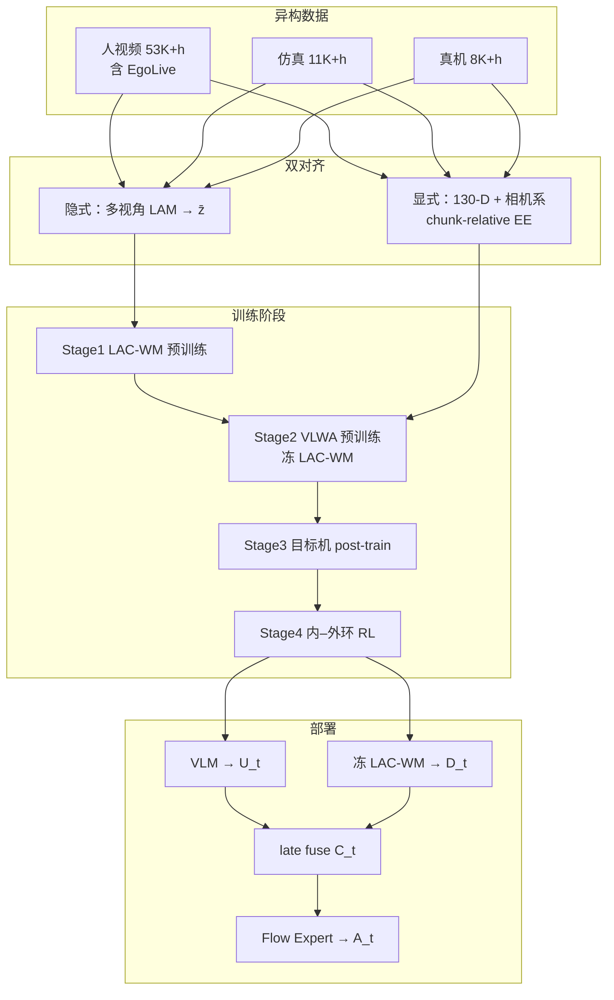

# JoyAI-RA 0.5：双动作对齐的 VLWA 通才操作

**JoyAI-RA 0.5**（*Scaling Robot Manipulation Learning via Dual Action Alignment*，[arXiv:2608.05674](https://arxiv.org/abs/2608.05674)，[项目页](https://joyai-ra-05.github.io/)，京东 **Joy Future Academy / JoyAI-RA Team**）提出 **Vision-Language-World-Action（VLWA）** 框架：用 **隐式对齐**（多视角 latent action → 条件化世界模型）把 **无动作标签** 的人/仿/机视频变成动力学监督，用 **显式对齐**（**130-D** 规范槽 + 相机系 chunk-relative 末端动作）把可靠人/机轨迹焊进统一可执行空间；再经 **内–外环 RL** 做边缘任务适应与中心底座改进。在智元 **AgiBot G1** 真机基准上，相对 \(\pi_{0.5}\) 的 seen 均分 **92.0 vs 74.0**，且人视频预训练规模扩大时性能持续上升、**未见饱和**。

## 一句话定义

**把异构人视频、仿真与真机演示拆成两条监督通道——latent-action 吃无标签视频、130-D 规范动作吃可靠轨迹——再 late-fuse VLM 语义与 LAC-WM 动力学，用 flow matching 出可执行动作块。**

## 英文缩写速查

| 缩写 | 英文全称 | 简要说明 |
|------|----------|----------|
| VLWA | Vision-Language-World-Action | 本文：语义 VLM + 动力学 WM + 动作专家的联合框架 |
| VLA | Vision-Language-Action | 视觉–语言–动作通才策略；本文对照基线含 \(\pi_{0.5}\) |
| LAC-WM | Latent-Action-Conditioned World Model | 以 latent action 条件化预训练的世界模型 |
| LAM | Latent Action Model | 从相邻观测推断转移 latent 的逆动力学式模型 |
| FM | Flow Matching | 流匹配；LAC-WM 视频与 Action Expert 动作均用 |
| EE | End-Effector | 末端执行器；显式对齐用相机系 chunk-relative EE |
| RL | Reinforcement Learning | 内环 residual 适应 + 外环底座改进 |
| Ego | Egocentric | 第一人称人视频；主缩放轴（含 EgoLive） |

## 为什么重要

- **直面「人视频很大但朴素混训会负迁移」：** 论文把问题写成监督通道错配，而不是单纯缺数据——与 [EgoWAM](./paper-egowam-egocentric-human-wam-co-training.md)、[EgoScale](../methods/egoscale.md) 同题，但给出 **隐式 / 显式双路由** 的系统解法。
- **VLWA 补齐 VLA 缺动力学、WAM 缺语义的缝：** late-fuse 保留两骨干专长；部署时 LAC-WM **只抽第一帧特征、不滚像素**，与 [InternVLA-A1.5](./paper-internvla-a15-unified-vla.md)「训练用世界模型、推理不想象」同族。
- **人视频被写成主缩放轴：** EgoLive 与全量人视频缩放曲线在最大测试规模仍上升——对 [具身数据金字塔](./paper-data-pyramid-embodied-manipulation.md) 与 [EgoLive](./paper-ego-02-egolive.md) 是强实证补充。
- **真机 + 部署后训练闭环：** AgiBot 六场景 seen/unseen 协议 + 内–外环 RL，把 foundation 与边缘适应拆开时间尺度。

## 核心信息

| 字段 | 内容 |
|------|------|
| **机构** | 京东（JD）Joy Future Academy / JoyAI-RA Team |
| **arXiv** | [2608.05674](https://arxiv.org/abs/2608.05674) |
| **项目页** | <https://joyai-ra-05.github.io/> |
| **架构** | VLM + LAC-WM + Flow-Matching Action Expert（late fusion） |
| **动作空间** | **130-D** 跨具身规范槽；相机系 chunk-relative EE |
| **预训练数据** | 人 **53K+ h**（含 EgoLive **20K+ h**）+ 仿 **11K+ h** + 真机 **8K+ h** |
| **评测平台** | 智元 AgiBot G1 · Real-World AgiBot Benchmark |
| **开源** | **确认未开源**（核查日 2026-08-07；项目页未列代码/权重） |

## 核心原理

### 方法栈

| 模块 | 角色 |
|------|------|
| **多视角 LAM** | 头/左/右腕 concat → 变分推断 \(\mathbf{z}_t\)；冻后作离线 latent 标签 |
| **LAC-WM（Stage 1）** | latent / 语言条件未来视频 flow matching；部署冻住，抽 \(\mathbf{D}_t\) |
| **VLM** | 任务语义、物体与指令对应；Stage 2 联合 VQA + FAST |
| **Flow Action Expert** | 对 fused \(\mathbf{C}_t=[\mathbf{U}_t;\mathbf{D}_t]\) 做 masked flow matching → \(H\times 130\) |
| **显式 adaptor \(\Phi_e\)** | 原生轨迹 → 130-D + validity mask；人用腕+指尖稀疏槽 |
| **内–外环 RL** | 边缘 residual 快适应；中心异步改进 VLWA 并低频同步 |

### 流程总览

### 训练阶段

| 阶段 | 冻/训 | 监督 | 要点 |
|------|-------|------|------|
| **1 LAC-WM** | 训 WM | latent 条件视频 FM + TD | condition dropout 便于下游无 z |
| **2 VLWA** | 冻 WM；训 VLM+Expert | VQA + FAST + masked FM | 跨具身显式对齐轨迹 |
| **3 Post-train** | 冻 WM；适配目标机 | 同 Stage 2，限目标具身 | AgiBot G1 部署初始化 |
| **4 RL** | 内环 residual；外环 VLWA | HITL / 成功交互回灌 | 低频同步保 off-policy 稳定 |

## 源码运行时序图

**不适用。** 截至 **2026-08-07**，[项目页](https://joyai-ra-05.github.io/) 与 arXiv 页 **未列** GitHub / Hugging Face / 可运行训练或推理入口；无法对齐 `sources/repos/` 绘制复现时序。若后续发布官方仓，应补仓库归档并更新本图。

## 工程实践

| 项 | 内容 |
|----|------|
| **开源状态** | **确认未开源**（见 [项目页归档](../../sources/sites/joyai-ra-05-github-io.md)） |
| **复现入口** | 目前仅论文 PDF + 项目页叙事/演示视频 |
| **动作接口** | 部署只取目标机器人有效规范槽，再映射原生控制 |
| **WM 推理** | 因果第一帧特征；**不要**按 imagine-then-act 滚未来像素 |
| **RL 同步** | 外环权重低频同步；论文指出高频同步会破坏 off-policy 训练 |
| **数据路由** | 手姿不可靠的 ego clip → 仅进 LAC-WM；高置信手/机轨迹 → 显式对齐 |

## 实验与评测

> 数字以 [arXiv:2608.05674](https://arxiv.org/abs/2608.05674) 为准。

| 设定 | JoyAI-RA 0.5 | 对照要点 |
|------|--------------|----------|
| **Seen 均分** | **92.0** | \(\pi_{0.5}\) **74.0**；难度↑优势↑ |
| **Unseen 均分** | **75.5** | 全模型最高；去双对齐 → **29.8** |
| **去隐式对齐** | unseen **46.8**（seen 仍较强） | 主伤 BIG（背景/光照） |
| **去显式对齐** | seen **85.7**（unseen 相对好） | 主伤 PnP-Hard 精度 |
| **Desk WM 消融** | w/ WM **51.5** avg | w/o WM **48.4** |
| **LAC vs 普通 WM** | LAC-WM Desk seen **92.1** | 普通 WM **87.3** |
| **EgoLive 10%→100%** | seen **47.8→85.6** / unseen **37.6→60.2** | 相同机器人 post-train |
| **LAC-WM 人视频缩放** | seen **83.1→97.5** / unseen **56.9→72.4** | 机器人数据固定 |
| **内–外环 RL** | 鼠标/耳机 OOD 约 **70% / 50%** | 两环优于单环 |

## 结论

**JoyAI-RA 0.5 的核心赌注是：人视频要当主缩放轴，就必须先把「无标签动力学」和「可执行动作」拆成两条对齐通道，而不是往同一个 VLA 目标里硬混。**

- 真正拉开 \(\pi_{0.5}\) 的是 **双对齐互补**：隐式通道把人视频多样性转成外观/光照鲁棒（去隐式后 unseen 重伤），显式 **130-D + chunk-relative EE** 提供精度与物理一致性（去显式后 PnP-Hard 掉点）。
- 部署形态是 late-fuse 的 **特征级动力学先验**，不是测试期像素想象；LAC-WM 用 condition dropout 保证推理侧无需再跑 LAM。
- 缩放证据比单点 SOTA 更重要：EgoLive 与全量人视频在最大测试规模仍上升——选型上应把「人视频小时 + 对齐机制」当成与真机小时同级的杠杆。
- 内–外环 RL 把 **快适应** 与 **底座改进** 分时间尺度；工程上要接受 **低频同步** 的稳定–新鲜度权衡。
- 复现边界清晰：截至入库日 **无公开代码/权重**；读法是系统设计与缩放曲线，不是可直接跑的开源栈。

## 与其他工作对比

| 对照 | JoyAI-RA 0.5 的差异读法 |
|------|-------------------------|
| **\(\pi_{0.5}\)** | 同为 VLM + flow 专家族；本文额外 **LAC-WM 动力学先验** 与 **双对齐异构数据路由**，真机 seen 大幅领先 |
| **InternVLA-A1.5** | 同为「训练用世界模型、部署不滚像素」；A1.5 用 **冻结 WAN foresight token**，本文用 **自训 LAC-WM + latent-action 条件** |
| **EgoWAM** | 同题人–机共训；EgoWAM 固定骨干换世界目标做受控消融，本文给 **全栈 VLWA + 130-D 显式动作** 工程配方 |
| **EgoScale** | 同强调人视频缩放；EgoScale 重 **腕/手显式标签 + mid-training**，本文重 **latent 隐式 + 规范动作显式** 双通道 |
| **Green-VLA** | 同有统一动作空间与后训练 RL；Green 用 **64-D 语义槽 + IQL/噪声 RL**，本文用 **130-D + 内–外环 residual** |
| **EgoLive（数据页）** | 本页是 **策略系统**；[EgoLive](./paper-ego-02-egolive.md) 是其 **20K+ h** 自采人视频源的数据侧索引 |

## 局限与风险

- **开源空窗：** 无法本地复现训练/部署；指标只能作选型参考。
- **空间拓扑泛化（STG）：** 文中 \(\pi_{0.5}\) 在该维略优——双对齐并非全维碾压。
- **外环同步：** 高频参数同步会破坏 off-policy；闭环改进速度有工程上限。
- **误配风险：** 把不可靠手姿硬塞进显式通道，或把 VLWA 当成部署期视频想象力模型，都会读偏设计。

## 关联页面

- [VLA](../methods/vla.md) — 通才操作与 foundation + 后训练语境
- [World Action Models](../concepts/world-action-models.md) — Joint / 部署不想象族谱
- [Action Chunking](../methods/action-chunking.md) — chunk 条件动作表示
- [EgoScale](../methods/egoscale.md) — 人视频规模预训练另一条实证链
- [Manipulation](../tasks/manipulation.md) — 真机操作任务背景
- [EgoLive](./paper-ego-02-egolive.md) — 自采 egocentric 任务数据
- [InternVLA-A1.5](./paper-internvla-a15-unified-vla.md) — latent foresight + flow 对照
- [EgoWAM](./paper-egowam-egocentric-human-wam-co-training.md) — 人视频 + 世界目标共训
- [Green-VLA](./paper-greenvla-staged-vla-humanoid.md) — 统一动作 + 分阶段 RL
- [具身数据金字塔](./paper-data-pyramid-embodied-manipulation.md) — 人/仿/机数据层读法
- [Ego 分类 02：人→机器人](../overview/ego-category-02-human-to-robot.md) — 人视频进策略对齐叙事

## 参考来源

- [JoyAI-RA 0.5 论文摘录](../../sources/papers/joyai_ra_05_arxiv_2608_05674.md)
- [JoyAI-RA 0.5 项目页归档](../../sources/sites/joyai-ra-05-github-io.md)

## 推荐继续阅读

- 论文 PDF：[arXiv:2608.05674](https://arxiv.org/pdf/2608.05674)
- 项目页：<https://joyai-ra-05.github.io/>
- \(\pi_{0.5}\) 技术报告：[Physical Intelligence π₀.₅](https://www.physicalintelligence.company/blog/pi05) — 同协议真机对照基线
