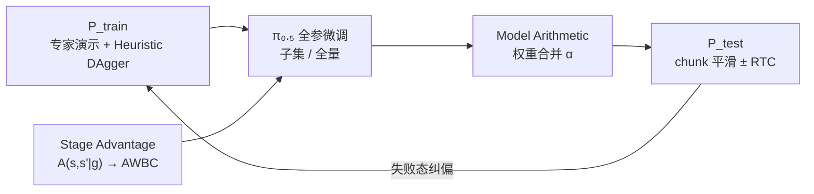
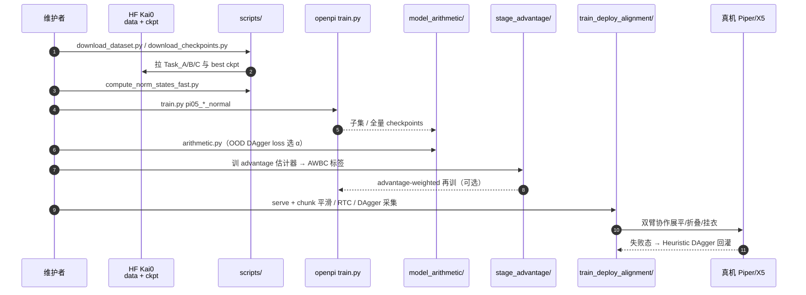

# χ₀ / kai0：资源感知的分布对齐稳健操作

**χ₀**（公开工程名 **kai0**；*Resource-Aware Robust Manipulation via Taming Distributional Inconsistencies*，[arXiv:2602.09021](https://arxiv.org/abs/2602.09021)，[博客](https://mmlab.hk/research/kai0)，[代码](https://github.com/OpenDriveLab/kai0)）由 **凯涅克斯人工智能（Kinetix AI）** 与 **香港大学 MMLab / OpenDriveLab** 提出：主张长时程操作稳健性的主瓶颈不是单纯堆数据与算力，而是 **$P_{\mathrm{train}}$（演示）/ $Q_{\mathrm{model}}$（策略偏置）/ $P_{\mathrm{test}}$（真机执行）** 三者分布不一致。框架以 [π₀.₅](./paper-pi05-open-world-vla.md) 为骨干，叠 **Model Arithmetic + Stage Advantage + Train-Deploy Alignment**，在两套协作双臂上完成展平→折叠→挂衣，并报告相对开源 $\pi_{0.5}$ 成功率约 **+250%**（约 20 h 演示 / 8×A100），附录含任意初态 **24 h** 连续运行。

## 一句话定义

**不要只靠更大 VLA 与更多演示硬堆稳健性——用权重合并扩覆盖、阶段条件 advantage 稳进度、启发式 DAgger + chunk 平滑把训练分布对准真机执行分布。**

## 英文缩写速查

| 缩写 | 英文全称 | 简要说明 |
|------|----------|----------|
| MA | Model Arithmetic | 多子集 checkpoint 的权重空间插值合并 |
| SA | Stage Advantage | 阶段条件的成对帧 advantage 估计 |
| TDA | Train-Deploy Alignment | DAgger / 时空增强 / chunk 平滑的部署对齐 |
| VLA | Vision-Language-Action | 视觉–语言–动作策略；骨干为 π₀ / π₀.₅ |
| DAgger | Dataset Aggregation | 策略诱导状态下的专家纠偏数据聚合 |
| AWR / AWBC | Advantage-Weighted Regression / BC | 用 advantage 加权的行为克隆 / 回归 |
| RTC | Real-Time Chunking | 动作块异步推理的前缀条件对齐 |
| OOD | Out-of-Distribution | 文中用 DAgger 恢复轨迹作合并权重验证集 |

## 为什么重要

- **生产级读法：** 成功率之外显式看 **吞吐量** 与 **retry cost**；TDA 常以「更敢重试」换更高完成率。
- **资源效率叙事：** 在服装这种高维可变形、需任意初态恢复的任务上，用 **20 h + 8 A100** 相对 $\pi_{0.5}$ 拉出大幅相对增益，对抗「只靠 foundation scaling」的单一叙事。
- **可复现工程：** 基于 [openpi](../../sources/repos/openpi.md)；MA / SA / TDA 与 HF 数据、每任务 best ckpt 均已发布，可对照 [LeHome](./paper-lehome-learning-to-fold.md) 等叠衣栈选型。

## 核心信息

| 项 | 内容 |
|----|------|
| 机构 | 凯涅克斯人工智能（Kinetix AI）；香港大学 MMLab；仓属自动驾驶开放实验室（OpenDriveLab） |
| 任务 | 协作双臂服装：Task A 展平折叠；Task B 条件取衣/分拣；Task C 挂衣 |
| 硬件 | 双套双臂（ALOHA 系布局）；A/B：**Agilex Piper**；C：**ARX X5**；RealSense D435i；推理 RTX 4090 |
| 数据 | 每任务 ~20 h；A/B/C 约 2668 / 3519 / 2988 episodes（30 Hz） |
| 骨干 | 全参 fine-tune $\pi_{0.5}$（辅以 $\pi_0$）；flow-matching；chunk $K=50$，执行 100 Hz |
| 开源 | **已开源** — 代码 + 数据集 + 每任务 best 权重 + advantage 标签（截至 2026-08-05） |

## 流程总览

## 核心原理 / 方法

### 1. Model Arithmetic（对齐 $P_{\mathrm{train}}\leftrightarrow Q_{\mathrm{model}}$）

- 将演示随机切成非重叠子集，各自微调得到 $\{\theta_i\}$，再 $\theta_{\mathrm{merged}}=\sum_i\alpha_i\theta_i$。
- **验证集必须 OOD**：用各子集策略 rollout 的 **DAgger 恢复轨迹** 估验证损失，避免 in-domain 乐观。
- 合并策略消融：uniform / inverse-loss / gradient descent / greedy；文内 **greedy + OOD** 最稳。
- 关键发现：子集 soup **优于**「单最佳子集」与「全量联合训练」——作者将其类比 LLM 参数冗余。

### 2. Stage Advantage（对齐 $Q_{\mathrm{model}}\leftrightarrow P_{\mathrm{test}}$ 的时序语义）

- 不用 $A=V(s')-V(s)$（噪声放大 + 多阶段多值），而直接 $A(s,a)=f_\theta(s,s')$，并条件于阶段标量 $g$。
- 帧对随机时间跨度 $\Delta$；阈值 $\epsilon=0.3$ 得最优性指示，供 advantage-weighted BC。
- 相对自实现的 $\pi^{*}_{0.6}$-style RECAP：Smooth Frame Ratio / MSTD 更稳，长时程条件任务重试更低。

### 3. Train-Deploy Alignment（对齐 $P_{\mathrm{train}}\leftrightarrow P_{\mathrm{test}}$）

- **Heuristic DAgger：** 直接从设计好的失败态（错抓、半掉落等）起步采恢复演示，减少「等自然失败」。
- **时空增强：** 水平翻转 + 左右臂交换；部分跳帧合成速度变化。
- **Temporal chunk-wise smoothing：** 在旧 buffer 与新 chunk 间按消费索引做 drop + 线性重叠插值（Algorithm 1）；多数设置优于 temporal ensembling / 单独 RTC，且可与 RTC 叠加。

## 源码运行时序图

对齐 [`OpenDriveLab/kai0`](https://github.com/OpenDriveLab/kai0) README：下载 → 全参微调 →（可选）MA / SA → TDA 推理服务。

复现路径：`git clone --recurse-submodules` → `uv sync` → `python scripts/download_*.py` → 改 `src/openpi/training/config.py` 的 `repo_id` / `weight_loader` → `uv run scripts/train.py …`；合并见 `model_arithmetic/README.md`，真机见 `setup/README.md`。

## 工程实践

| 项 | 做法 |
|----|------|
| 底座 | 基于 [openpi](https://github.com/Physical-Intelligence/openpi)；全参 fine-tune，非仅 LoRA |
| 配置名示例 | `pi05_flatten_fold_normal` 等（见仓内 `config.py`） |
| MA 输入 | 4 个子集 ckpt；验证优先用 DAgger OOD 损失 |
| SA | 手动阶段标注；advantage 标签已发布于 `Task_A/advantage/` 等 |
| 推理 | `serve_policy.py` + TDA 客户端；chunk 平滑参数 $d_{\max}$ / $m_{\min}$ |
| 开源边界 | 代码/数据/best ckpt **已开**；博客仍预告 2026 Challenge；数据许可 **CC-BY-NC-SA-4.0**（非商业约束需注意） |

## 实验与评测

> 文内主文以图消融为主；主张数字以 abstract / Fig.1 相对 $\pi_{0.5}$ 成功率约 **+250%** 为准。指标：SR、Throughput（任务/时）、Retry Cost、规则里程碑 Score（归一化 100）。

| 评测面 | 结果（文内） |
|--------|--------------|
| 系统组合（Task A） | 单模块 → 两两 → 全 χ₀ 单调提升；SA↑吞吐量，TDA↑SR（retry↑） |
| MA | 全面优于 single-best 与 full-data joint；OOD 验证标准误更低；greedy 最稳 |
| SA vs RECAP-style | SFR/MSTD 更稳；条件长时程（Task B）retry 更低 |
| DAgger | Heuristic / 标准均抬 SR·TP·Score；Heuristic 采集更省；$\pi_{0.5}$ 上 full DAgger 可进一步改善 TP–retry 折中 |
| 控制 | chunk 平滑多数设置优于 ensembling / RTC；与 RTC 叠加再提升 |
| 压力测试 | 任意初态 **24 h** 连续自主运行（附录 livestream） |
| 负结果 | GO-1 / X-VLA / DexVLA 同 20 h 数据仍难出可用策略 |

## 结论

**χ₀ 把「稳健操作」从单纯 scaling 改写成三分布对齐工程：用 soup 扩模式覆盖、用阶段 advantage 稳进度、用启发式 DAgger + chunk 平滑把部署分布焊回训练集——在开源 π₀.₅ 叠衣栈上给出可复现的生产向增量。**

1. **先确认骨干可塑性** — 文内仅 $\pi_0$/$\pi_{0.5}$ 可微调出可用策略；换骨架前先做同数据可跑通检查。
2. **MA 用 DAgger OOD 选 α** — in-domain 验证会低估部署缺口；greedy 是默认首选。
3. **子集 soup 可优于全量联训** — 数据不够时优先「切子集再合并」，而非只会加数据。
4. **SA 要阶段标签** — 直接预测 advantage 仍依赖语义阶段，否则多阶段视觉相似态会多值。
5. **TDA 接受 retry↑ 换 SR↑** — 评估勿只看成功率；Heuristic DAgger 是省人工的恢复数据入口。
6. **推理侧 chunk 平滑与 RTC 正交** — 部署时两者可叠加，而非二选一。
7. **复现注意许可证** — 权重/流程跟 Apache 仓；**数据集 CC-BY-NC-SA-4.0**，商用需另寻授权或自采。

## 与其他工作对比

| 对照 | 差异 |
|------|------|
| [π0.5 / openpi](./paper-pi05-open-world-vla.md) | 提供骨干；χ₀ 贡献在后训练对齐与部署配方 |
| [LeHome / Learning to Fold](./paper-lehome-learning-to-fold.md) | 同叠衣开源；LeHome=竞赛 SO-ARM101 + 异步 AWR/RECAP；χ₀=双臂协同长时程 + MA/SA/TDA |
| [STEAM](./paper-steam-advantage-modeling.md) | STEAM=离线自监督 ensemble advantage；χ₀=手标阶段 + 在线/启发式 DAgger |
| $\pi^{*}_{0.6}$ / RECAP | 值差 advantage；SA 改为直接/阶段条件估计以压方差 |

## 局限与风险

- **先验保持未测：** 未系统评估后训练对预训练通才能力的保留；刚体操作可迁移性待验证。
- **跨任务 soup 未做：** MA 目前合并同任务子集，而非多任务策略。
- **数据质量瓶颈：** 作者强调数据效用波动极大；仍缺廉价的预筛选指标（现靠全训或 replay）。
- **失败模式：** 空间抓取错位与策略死循环；MA/SA 为外挂修正，不能替代更强预训练空间/规划先验。
- **开源状态：** **已开源（可运行）** — 以 GitHub README + HF/ModelScope 为准（核查日 2026-08-05）；Challenge 仍为预告。

## 关联页面

- [VLA](../methods/vla.md) — 视觉–语言–动作后训练语境
- [π₀ Policy](../methods/π0-policy.md) — flow-matching 骨干与 openpi
- [π0.5](./paper-pi05-open-world-vla.md) — 主基线与微调起点
- [DAgger](../methods/dagger.md) — Heuristic / 标准纠偏闭环
- [AWR](../methods/awr.md) — advantage 加权回归族
- [Learning to Fold（LeHome）](./paper-lehome-learning-to-fold.md) — 叠衣开源竞赛栈对照
- [STEAM](./paper-steam-advantage-modeling.md) — 离线 advantage 另一路线
- [ALOHA](./aloha.md) — 双臂遥操作硬件谱系
- [Manipulation](../tasks/manipulation.md) — 可变形服装操作任务族

## 参考来源

- [论文摘录](../../sources/papers/chi0_kai0_arxiv_2602_09021.md)
- [项目博客归档](../../sources/sites/mmlab-kai0.md)
- [仓库归档](../../sources/repos/kai0.md)

## 推荐继续阅读

- [项目博客（含 livestream 与交互图）](https://mmlab.hk/research/kai0)
- [arXiv:2602.09021](https://arxiv.org/abs/2602.09021)
- [OpenDriveLab/kai0 README](https://github.com/OpenDriveLab/kai0)
- [openpi（π₀ / π₀.₅）](https://github.com/Physical-Intelligence/openpi)
