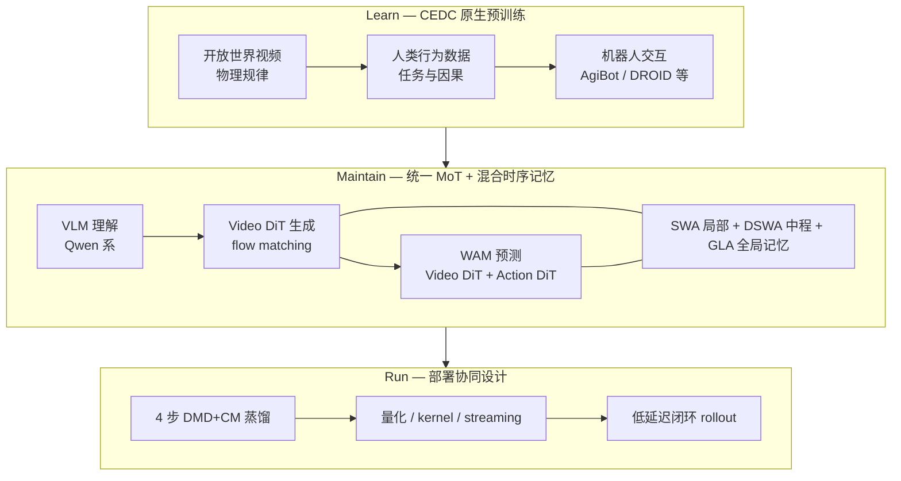

# Kairos（原生世界模型栈 · kairos-agi）

**Kairos**（*Kairos: A Native World Model Stack for Physical AI*，arXiv:2606.16533，2026-06-16，[代码](https://github.com/kairos-agi/kairos-sensenova)，[HF](https://huggingface.co/kairos-agi)，[ModelScope Kairos 3.0](https://modelscope.cn/collections/kairos-team/kairos30)）是 **Kairos Team** 提出的 **原生、部署感知** 世界模型栈：把「如何 **学** 世界、如何 **维持** 世界状态、如何 **跑** 世界」收进同一 **非割裂** 框架，面向未来 **自进化 Physical AI** 的观察–动作–反馈闭环。

> **品牌区分：** 与 [HomeWorld（Kairos · Whole-Home Scene Generation）](./paper-homeworld-whole-home-scene-generation.md)（**Kairos-HomeWorld**，静态全屋 3D）**同名不同项目**；本页仅指 **kairos-agi 视频/WAM 世界模型**。

## 一句话定义

**一个 4B 级原生世界–动作栈：用跨具身数据课程从开放视频渐进到机器人接地，用 SWA/DSWA/GLA 混合线性 DiT 维持长程世界状态，并把低延迟推理作为一等建模约束，在 WM 与 WAM 双评测上同时追求强竞争力结果与线性可扩展吞吐。**

## 英文缩写速查

| 缩写 | 英文全称 | 简要说明 |
|------|----------|----------|
| WM | World Model | 学习环境动态以供想象/规划的世界模型 |
| WAM | World Action Model | 联合世界预测与动作生成的架构 |
| CEDC | Cross-Embodiment Data Curriculum | 开放视频→人类行为→机器人数据的渐进预训练课程 |
| MoT | Mixture-of-Transformers | Video DiT 与 Action DiT 共享条件的联合骨干 |
| GLA | Gated Linear Attention | 门控线性注意力，作全局因果记忆路径 |
| SWA | Sliding-Window Attention | 滑动窗口注意力，捕获局部时空动态 |
| DSWA | Dilated Sliding-Window Attention | 膨胀滑动窗口，捕获中程（约秒级）依赖 |
| DiT | Diffusion Transformer | 扩散去噪 Transformer 骨干 |
| VLM | Vision-Language Model | 世界理解模块；本工作以 Qwen 系为基座 |

## 为什么重要

- **拒绝「先视频后策略」割裂范式：** 主张物理规律、行为语义与具身接地须在 **scaling 起点原生注入**（CEDC），而非对开放域 T2V 生成器做后训微调——对齐 [Generative World Models](../methods/generative-world-models.md) 中「基础设施级 WM」叙事。
- **长程一致性有理论锚点：** 纯局部注意力对 **超窗依赖**（遮挡再现、延迟物理效应）存在 **信息论下界**；**SWA + DSWA + GLA** 因子化 + 收缩全局记忆给出 **有界误差累积**（论文 Theorem 1–2）。
- **WAM 不是外挂仿真器：** **Video DiT + Action DiT** 联合 flow matching；消融显示 **仅训 ActionDiT** 相对联合训练 LIBERO-Plus **−23.2** 点——世界生成监督为控制提供 **可恢复的动力学表征**（见 [World Action Models](../concepts/world-action-models.md)）。
- **部署是一等公民：** **DMD + Consistency Distillation** 蒸馏至 **4 步**；**Kairos-4B** 报告相对 **Cosmos-Predict2.5-14B 28×–85×** 延迟优势，DiT 单步随分辨率/时长 **近线性**——把 WM 从离线演示推向 **闭环可嵌入**。

## 核心结构（方法栈）

| 模块 | 作用 |
|------|------|
| **World Understanding** | **Qwen2.5-VL / Qwen3.5** 等 VLM 编码文本、图像与多模态传感器 → 语义条件 |
| **World Generation** | 高压缩 **video VAE** + **LinearDiT**（flow matching）；T2V / I2V / TI2V；**SWA / DSWA / GLA** 时序骨干 |
| **World Prediction（WAM）** | **Video DiT**（自生成预训练初始化）+ **Action DiT**（约 **1/5** 参数）；历史/未来视频 + 未来动作三组 token + **非对称注意力掩码** |
| **CEDC 预训练** | Phase I 开放视频物理 → Phase II 人类任务行为 → Phase III 机器人轨迹（AgiBotWorld-Beta、DROID 等） |
| **部署栈** | 硬件感知 kernel、量化、token streaming；**4 步蒸馏** 具身 WM |

### CEDC 数据金字塔

| 阶段 | 数据来源 | 习得能力 |
|------|----------|----------|
| **I — 物理知识** | 百万小时级开放视频 + 物理 CoT | 重力、物体恒常、流体等「世界规律」 |
| **II — 人类行为** | >10 万小时人类中心数据 | 任务组织、干预因果、行为抽象 |
| **III — 机器人具身** | AgiBotWorld-Beta、DROID 等 | 感知–动作对齐、可执行控制 |

训练流水线：**Stage I–II 仅优化 VideoDiT** → **Stage III 联合 ActionDiT**；分辨率 **256P→720P**，最长 **241 帧（~15 s）**；后接域 SFT、model merging 与 **Video DPO**。

### 流程总览（学 → 维持 → 跑）

### WAM 推理模式

| 模式 | 行为 | 用途 |
|------|------|------|
| **action-only** | 关闭未来视频分支，仅生成动作 token | 部署：显著降低 attention / 扩散成本 |
| **Kairos-joint** | 未来视频与动作 **联合去噪** | LIBERO-Plus **89.0 → 90.8**（论文 Table 12） |

## 评测与效率（论文报告）

### 具身世界模型（Kairos-4B）

| 基准 | 指标 | Kairos-4B |
|------|------|-----------|
| WorldModelBench-robot | Total | **9.30**（IF **2.36**，Physics **4.96**） |
| DreamGen Bench | AVG_Score | **0.618**（AVG_PA **0.538**） |
| PAI-Bench TI2V | Overall | **82.57**（Domain **88.59**） |

### WAM 操纵（微调后）

| 基准 | Kairos | 备注 |
|------|--------|------|
| **LIBERO-Plus** | **89.0** avg | joint 模式 **90.8** |
| **RoboTwin 2.0** | **96.1%** avg | Clean **96.9%** / Randomized **95.2%** |

### 效率（A800，480P 5s 蒸馏模型）

| 模型 | 显存 | 算力 | 1×GPU | 4×GPU |
|------|-----:|-----:|------:|------:|
| Kairos-4B | 23.5 GB | 2.3 PFlops | 43 s | 9 s |

相对 **Cosmos-Predict2.5-14B**：延迟 **28×–85×** 优势；相对 **Wan2.2-5B**：**2.5×–3.7×** 加速（论文 §6.1）。

## 与相邻路线的分界（对比）

| 对比轴 | Kairos | [Cosmos 3](./cosmos-3.md) | [τ₀-WM](./tau0-world-model.md) | [DiT4DiT](./paper-dit4dit-video-action-model.md) |
|--------|--------|---------------------------|--------------------------------|------------------------------------------------|
| **核心主张** | **原生 CEDC** + **GLA 长程记忆** + **边缘部署** | **全模态 16B/64B 平台**（语言/音频/动作） | **5B VAM** + **测试时 propose–evaluate–revise** | **Cosmos-Predict2.5 双 DiT** 端到端 dual flow |
| **时序骨干** | **SWA+DSWA+GLA** 线性复杂度 + 理论界 | 标准 DiT / MoT（平台级） | Wan-2.2 视频扩散 | 固定 flow 步隐状态条件动作 |
| **规模（主报告）** | **4B** | **16B / 64B** | **5B** | 与 Cosmos-Predict2.5 同系 |
| **闭环侧重** | **4 步蒸馏 + action-only** | policy / forward / inverse 多 I/O | 动作条件仿真 + 一致性分数 | LIBERO **98.6%** 等操纵数字 |

## 常见误区

- **误区 1：与 HomeWorld 混淆。** [HomeWorld](./paper-homeworld-whole-home-scene-generation.md) 是 **Kairos-HomeWorld** 的 **静态 sim-ready 全屋 3D**；本页 Kairos 是 **kairos-agi 动态视频/WAM 栈**。
- **误区 2：线性注意力 = 免费长视频。** GLA 是 **压缩全局状态**，仍受训练时长、蒸馏质量与动作接地数据限制；**15 s+** 生成依赖 **状态传递** 与 **形状感知 timestep shift**，不是无限上下文魔法。
- **误区 3：WAM 数字 = 零样本通用策略。** LIBERO-Plus / RoboTwin 结果为 **WAM 微调后**；原生预训练提供 **表征与物理先验**，下游仍依赖任务数据与推理模式选择（action-only vs joint）。

## 开源与团队（截至 2026-06-18）

- **代码：** [kairos-agi/kairos-sensenova](https://github.com/kairos-agi/kairos-sensenova)
- **权重：** [huggingface.co/kairos-agi](https://huggingface.co/kairos-agi)；[ModelScope Kairos 3.0](https://modelscope.cn/collections/kairos-team/kairos30)
- **Project Lead：** Fei Wang, Shan You, Qiming Zhang；**Core：** Tao Huang, Zuoyi Fu

## 关联页面

- [Generative World Models](../methods/generative-world-models.md) — 生成式 WM 谱系与基础设施叙事
- [World Action Models（WAM）](../concepts/world-action-models.md) — Joint 族文献坐标
- [Video-as-Simulation](../concepts/video-as-simulation.md) — 像素级交互仿真与 WM 部署语境
- [robot-world-models-training-loop-taxonomy](../overview/robot-world-models-training-loop-taxonomy.md) — 机器人 WM 三线 taxonomy
- [Cosmos 3](./cosmos-3.md) — NVIDIA 全模态 MoT 平台对照
- [τ₀-World Model](./tau0-world-model.md) — Agibot 系测试时想象闭环
- [MotionWAM](./paper-motionwam-humanoid-loco-manipulation-wam.md) — Cosmos 系双 DiT 实时人形 WAM
- [Manipulation](../tasks/manipulation.md) — LIBERO / RoboTwin 操纵评测语境

## 参考来源

- [Kairos 技术报告归档（arXiv:2606.16533）](../../sources/papers/kairos_arxiv_2606_16533.md)
- [kairos-agi/kairos-sensenova 代码索引](../../sources/repos/kairos_sensenova.md)

## 推荐继续阅读

- [arXiv 摘要与 PDF](https://arxiv.org/abs/2606.16533)
- [Hugging Face Papers 页](https://huggingface.co/papers/2606.16533)
- [GitHub — kairos-sensenova](https://github.com/kairos-agi/kairos-sensenova)
- [Hugging Face — kairos-agi 组织](https://huggingface.co/kairos-agi)
