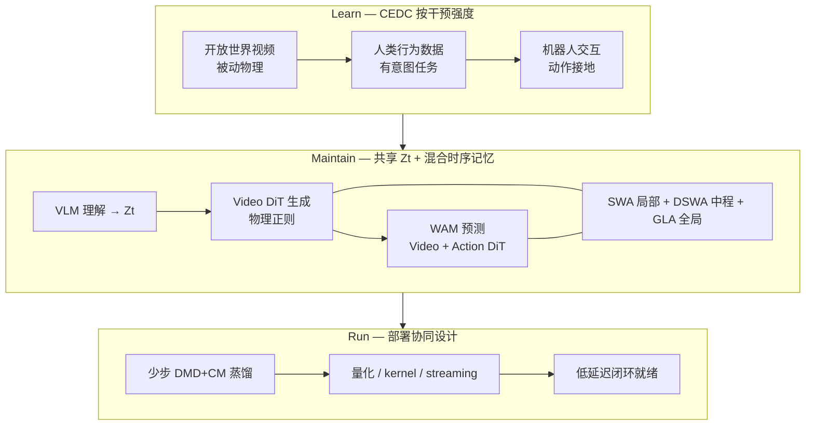
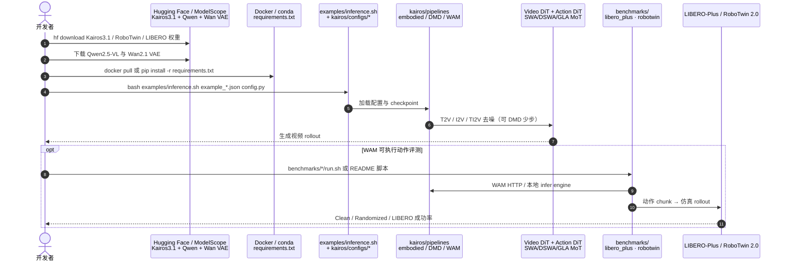

# Kairos（原生世界–动作模型栈 · kairos-agi）

**Kairos**（*Kairos: A Regret-Aware Native World-Action Model Stack for Physical AI*，[arXiv:2606.16533](https://arxiv.org/abs/2606.16533) **v3**，2026-07-03，[代码](https://github.com/kairos-agi/kairos)，[HF](https://huggingface.co/kairos-agi)，[平台](https://kairos.acerobotics.com)，[ModelScope Kairos 3.0](https://modelscope.cn/collections/kairos-team/kairos30)）由 **Kairos Team / 大晓机器人（Ace Robotics）** 提出：把世界模型从「全像素未来仿真器」改写为 **regret-aware** 的 **控制充分状态（control-sufficient state）** 学习–维持–部署栈，面向 Physical AI 的观察–动作–反馈闭环。

> **品牌区分：** 与 [HomeWorld（Kairos · Whole-Home Scene Generation）](./paper-homeworld-whole-home-scene-generation.md)（**Kairos-HomeWorld**，静态全屋 3D）**同名不同项目**；本页仅指 **kairos-agi 视频 / WAM 世界–动作模型**。

## 一句话定义

**一个 4B 级 regret-aware 原生世界–动作栈：用 CEDC 按干预强度从开放视频渐进到机器人接地，用 SWA/DSWA/GLA 维持多时间尺度的控制充分状态，并把延迟/显存当作一等约束；现有 WM/WAM 数字是 proxy，真机闭环 regret 降低仍是后续目标。**

## 英文缩写速查

| 缩写 | 英文全称 | 简要说明 |
|------|----------|----------|
| WM | World Model | 学习环境动态以供想象/规划的世界模型 |
| WAM | World Action Model | 联合世界预测与动作生成的架构 |
| CEDC | Cross-Embodiment Data Curriculum | 按干预强度组织的开放视频→人类行为→机器人预训练课程 |
| MoT | Mixture-of-Transformers | Video DiT 与 Action DiT 共享条件的联合骨干 |
| GLA | Gated Linear Attention | 门控线性注意力，作全局因果记忆路径 |
| SWA | Sliding-Window Attention | 滑动窗口注意力，捕获局部时空/接触动态 |
| DSWA | Dilated Sliding-Window Attention | 膨胀滑动窗口，捕获中程（约秒级）依赖 |
| DiT | Diffusion Transformer | 扩散去噪 Transformer 骨干 |
| VLM | Vision-Language Model | 世界理解模块；本工作以 Qwen 系为基座 |
| DMD | Distribution Matching Distillation | 与 Consistency Distillation 联用的少步蒸馏 |

## 为什么重要

- **目标函数换了：** v3 明确用 **representation-induced regret** \(\operatorname{Reg}_H(f;g)\)——压缩态 \(Z_t\) 相对全历史 \(H_t\) 的超额物理代价——作为设计原则；视觉真实感是 proxy，不是 Physical AI 的最终账本。
- **拒绝「先视频后策略」割裂：** 物理规律、行为语义与具身接地须在 scaling 起点经 **CEDC** 原生注入（见 [Generative World Models](../methods/generative-world-models.md)）。
- **长程一致性有理论锚点：** 纯局部注意力对超窗依赖存在信息论下界；**SWA + DSWA + GLA** + 收缩全局记忆给出有界误差累积（Theorem 1–2）。
- **WAM 监督不可省：** 仅训 ActionDiT 相对联合训练 LIBERO-Plus **−23.2**——世界生成是控制相关表征的来源（见 [World Action Models](../concepts/world-action-models.md)）。
- **部署是一等公民：** 4 步蒸馏与近线性 DiT 扩展，把 WM 从离线演示推向可嵌入闭环；**真机闭环 regret 验证仍标为未来工作**。

## 核心信息

| 项 | 内容 |
|----|------|
| **机构** | 大晓机器人（Ace Robotics）/ Kairos Team；HF 权重镜像常见于 **ACERobotics** |
| **规模** | 主报告 **Kairos-4B**；产品线 **Kairos 3.0 / 3.1** |
| **代码** | **已开源**（Apache-2.0）：[kairos-agi/kairos](https://github.com/kairos-agi/kairos)（旧名 `kairos-sensenova` 301 重定向） |
| **权重** | [huggingface.co/kairos-agi](https://huggingface.co/kairos-agi) + [Kairos3.0 集合](https://huggingface.co/collections/kairos-agi/kairos30)；ModelScope 同步 |
| **平台** | [kairos.acerobotics.com](https://kairos.acerobotics.com) |

## 核心原理（方法栈）

### Regret 与 control-sufficient state

给定观测–动作历史 \(H_t\)、任务目标 \(g\) 与候选未来动作，模型学习压缩 \(Z_t=f(H_t)\)，使基于 \(Z_t\) 的规划期望物理代价逼近基于全历史的代价。\(Z_t\) 应保留：**物体状态、空间关系、接触、任务进度、动作后果、失败边界、安全风险、部署不确定性**——而不是桌面纹理等无关像素。报告强调：现有基准成绩是 **regret 相关能力的 proxy evidence**，不是闭环 regret 已降低的直接证明。

### 模块表

| 模块 | 作用 |
|------|------|
| **World Understanding** | **Qwen2.5-VL / Qwen3.5** 等 VLM 从多模态历史构造 \(Z_t\) |
| **World Generation** | 高压缩 video VAE + **LinearDiT**（flow matching）；用未来想象正则化物理一致性 |
| **World Prediction（WAM）** | **Video DiT** + **Action DiT**（约 **1/5** 参数）；三组 token + 非对称注意力掩码 |
| **CEDC 预训练** | 干预强度金字塔：开放视频物理 → 人类任务行为 → 机器人轨迹 |
| **部署栈** | 硬件感知 kernel、量化、token streaming；**DMD + CM** 少步蒸馏 |

### CEDC 数据金字塔

| 阶段 | 数据来源 | 习得能力 |
|------|----------|----------|
| **I — 物理知识** | 百万小时级开放视频 + 物理 CoT | 重力、物体恒常、流体等「世界规律」 |
| **II — 人类行为** | >10 万小时人类中心数据 | 任务组织、干预因果、行为抽象 |
| **III — 机器人具身** | AgiBotWorld-Beta、DROID 等 | 感知–动作对齐、可执行控制 |

训练流水线：**Stage I–II 仅优化 VideoDiT** → **Stage III 联合 ActionDiT**；分辨率 **256P→720P**，最长 **241 帧（~15 s）**；后接域 SFT、model merging 与 **Video DPO**。高价值数据优先失败、接触跃迁、恢复与边界案例（报告 Limitations）。

### 流程总览（学 → 维持 → 跑）

### WAM 推理模式

| 模式 | 行为 | 用途 |
|------|------|------|
| **action-only** | 关闭未来视频分支，仅生成动作 token | 部署：显著降低 attention / 扩散成本 |
| **Kairos-joint** | 未来视频与动作 **联合去噪** | LIBERO-Plus **89.0 → 90.8**（论文 Table） |

## 源码运行时序图

官方仓 [kairos-agi/kairos](https://github.com/kairos-agi/kairos)（归档见 [sources/repos/kairos.md](../../sources/repos/kairos.md)）提供生成推理与仿真 WAM 评测入口：

- **最短生成路径：** 装环境 → 下权重与 Qwen/VAE → `examples/inference.sh` + 对应 JSON / `kairos_4b_*.py`（细节见仓库 `docs/QUICKSTART.md`）。
- **最短 WAM 路径：** 下载 `kairos-4B-robot-{RoboTwin2.0,LIBERO-plus}` → 跟 `benchmarks/robotwin` 或 `benchmarks/libero_plus` README。

## 工程实践

| 项 | 建议 |
|----|------|
| 克隆 | 使用 **`git clone https://github.com/kairos-agi/kairos.git`**（旧 `kairos-sensenova` URL 仍会 301） |
| 环境 | Python ≥3.10、torch ≥2.6、CUDA ≥12.6；或 GHCR Docker（标签可能仍写 `kairos-sensenova`） |
| 480P 蒸馏 | 优先 `Kairos3.1-4B-robot-480P` + 480P JSON；README 提示该蒸馏模型 720P 不理想 |
| 动作预测 | 用专用 RoboTwin / LIBERO 权重，不要假设通用视频权重零样本出可执行动作 |
| 推理模式 | 部署优先 **action-only**；要抬成功率再开 **joint**（有额外计算） |
| 硬件 | README：A800 480P 蒸馏 1×GPU **11.7 s** / 4× **3.0 s**；RTX 5090 有独立镜像标签 |

## 实验与评测（论文 / README 报告）

### 具身世界模型（Kairos-4B）

| 基准 | 指标 | Kairos-4B |
|------|------|-----------|
| WorldModelBench-robot | Total | **9.30**（IF **2.36**，Physics **4.96**） |
| DreamGen Bench | AVG_Score | **0.618**（AVG_PA **0.538**） |
| PAI-Bench TI2V | Overall | **82.57**（Domain **88.59**） |

### WAM 操纵（微调后）

| 基准 | Kairos | 备注 |
|------|--------|------|
| **LIBERO-Plus** | **89.0** avg | joint 模式 **90.8** |
| **RoboTwin 2.0** | **96.1%** avg | Clean **96.9** / Randomized **95.2** |

### 效率

| 设定 | 数字 |
|------|------|
| A800，480P 5s 蒸馏（论文 §6.1 表） | 显存 **23.5 GB**，**2.3 PFlops**，1× **43 s** / 4× **9 s** |
| 相对 Cosmos-Predict2.5-14B | 延迟约 **28×–85×** 优势 |
| README 实时推理（480P 蒸馏） | A800 1× **11.7 s** / 4× **3.0 s** |

消融：人类中心预训练 LIBERO-Plus **+6.0**；联合生成+预测相对仅 ActionDiT **+23.2**；joint 去噪 **+1.8**。

## 结论

**Kairos v3 的核心贡献不是又一个更强的视频生成器，而是把「学什么状态、怎么维持、怎么在延迟约束下跑」收成同一套 regret-aware 世界–动作栈；开源的是可复现的 4B 生成/WAM 代理能力，不是已完成的真机闭环 regret 最小化。**

1. **以 control-sufficient state 为目标** — 丢掉无关像素，保留接触、进度、失败边界与动作后果；用 \(\operatorname{Reg}_H\) 表述压缩代价。
2. **CEDC 按干预强度组织数据** — 比「扁平混数据 + 后训策略」更贴近控制相关表征学习。
3. **SWA/DSWA/GLA 不是单纯加速技巧** — 对应局部接触、中程子任务与全局物体恒常；有误差界理论支撑。
4. **世界生成监督对控制很贵也很值** — 去掉联合生成–预测，LIBERO-Plus 掉 **23+** 点。
5. **部署数字与 WAM 榜是 proxy** — 读论文时勿把 RoboTwin/LIBERO 成功率直接等同于「真机 regret 已降」。
6. **复现入口已齐** — `kairos` 仓 + Kairos3.1 权重 + `benchmarks/*`；旧 `kairos-sensenova` 仅作重定向别名。
7. **下一步该盯什么** — 报告自承：rollout 相关、失败预测、安全过滤、恢复学习与「想象经验→策略改进」的真机关闭环。

## 与相邻路线的分界（对比）

| 对比轴 | Kairos | [Cosmos 3](./cosmos-3.md) | [τ₀-WM](./tau0-world-model.md) | [DiT4DiT](./paper-dit4dit-video-action-model.md) |
|--------|--------|---------------------------|--------------------------------|------------------------------------------------|
| **核心主张** | **Regret / control-sufficient** + CEDC + 边缘部署 | **全模态 16B/64B 平台** | **5B VAM** + 测试时 propose–evaluate–revise | **Cosmos-Predict2.5 双 DiT** dual flow |
| **时序骨干** | **SWA+DSWA+GLA** 线性复杂度 + 理论界 | 标准 DiT / MoT（平台级） | Wan-2.2 视频扩散 | 固定 flow 步隐状态条件动作 |
| **规模（主报告）** | **4B** | **16B / 64B** | **5B** | 与 Cosmos-Predict2.5 同系 |
| **闭环侧重** | 少步蒸馏 + action-only；**真机 regret 待验证** | policy / forward / inverse 多 I/O | 动作条件仿真 + 一致性分数 | LIBERO 等高操纵数字 |

## 局限与风险

- **误区 1：与 HomeWorld 混淆。** [HomeWorld](./paper-homeworld-whole-home-scene-generation.md) 是静态 sim-ready 全屋 3D；本页是动态视频/WAM。
- **误区 2：把 proxy 当闭环证明。** 摘要写明真机闭环 regret 降低仍是未来工作。
- **误区 3：线性注意力 = 无限长视频。** GLA 是压缩全局状态；长时生成仍受训练时长、蒸馏与动作数据限制。
- **误区 4：WAM 数字 = 零样本通用策略。** LIBERO / RoboTwin 为微调后结果；需选对专用权重与推理模式。
- **工程摩擦：** README 仍混用旧仓名/旧镜像标签；HF `kairos-agi/...` 可能解析到 `ACERobotics/...`。

## 关联页面

- [Generative World Models](../methods/generative-world-models.md) — 生成式 WM 谱系与基础设施叙事
- [World Action Models（WAM）](../concepts/world-action-models.md) — Joint 族文献坐标
- [Video-as-Simulation](../concepts/video-as-simulation.md) — 像素级交互仿真与 WM 部署语境
- [robot-world-models-training-loop-taxonomy](../overview/robot-world-models-training-loop-taxonomy.md) — 机器人 WM 三线 taxonomy
- [Cosmos 3](./cosmos-3.md) — NVIDIA 全模态 MoT 平台对照
- [τ₀-World Model](./tau0-world-model.md) — Agibot 系测试时想象闭环
- [MotionWAM](./paper-motionwam-humanoid-loco-manipulation-wam.md) — Cosmos 系双 DiT 实时人形 WAM
- [Manipulation](../tasks/manipulation.md) — LIBERO / RoboTwin 操纵评测语境

## 参考来源

- [Kairos 技术报告归档（arXiv:2606.16533 v3）](../../sources/papers/kairos_arxiv_2606_16533.md)
- [kairos-agi/kairos 代码索引](../../sources/repos/kairos.md)
- [Kairos 平台页归档](../../sources/sites/kairos-acerobotics.md)
- [历史仓名索引（重定向）](../../sources/repos/kairos_sensenova.md)

## 推荐继续阅读

- [arXiv 摘要与 PDF（v3）](https://arxiv.org/abs/2606.16533)
- [HTML 全文 v3](https://arxiv.org/html/2606.16533v3)
- [GitHub — kairos](https://github.com/kairos-agi/kairos)
- [Hugging Face — kairos-agi](https://huggingface.co/kairos-agi)
- [Kairos Platform](https://kairos.acerobotics.com)
