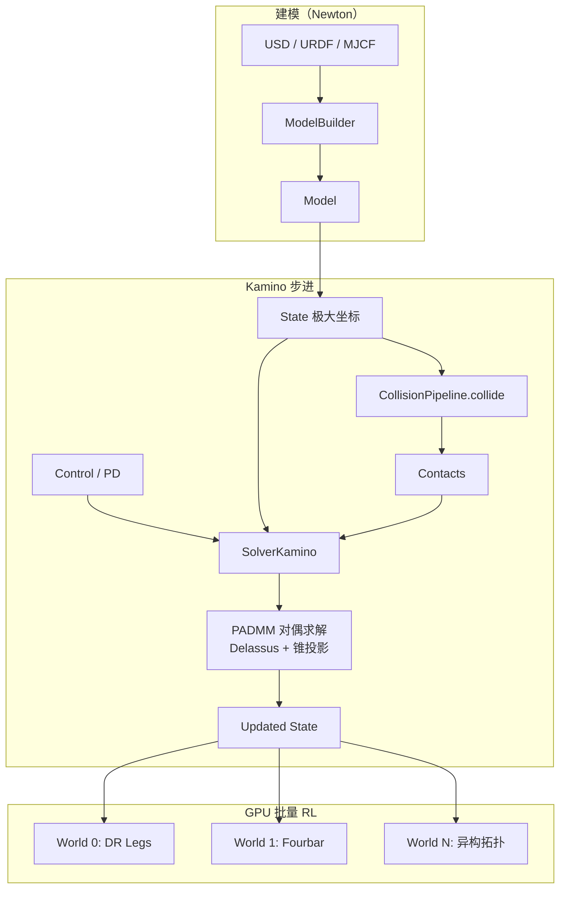
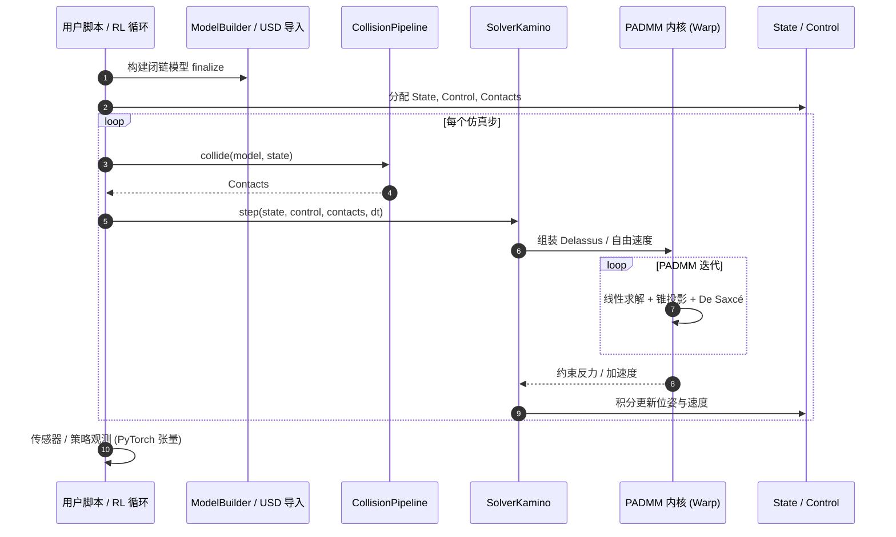

# Kamino（GPU 闭链约束多体仿真）

**Kamino** 是 Disney Research 与 NVIDIA 提出的 **GPU 原生物理求解器**（arXiv [2603.16536](https://arxiv.org/abs/2603.16536)），面向含 **运动学环（kinematic loops）** 的复杂机构：并联操作臂、平面/空间连杆、四连杆传动腿与多肢耦合关节。实现基于 [NVIDIA Warp](./nvidia-warp.md)，作为 [Newton Physics](./newton-physics.md) 的可插拔后端（`SolverKamino`，**BETA 1**）。项目页：<https://disneyresearch.github.io/kamino/>；代码：`newton/_src/solvers/kamino/`。

## 一句话定义

用 **极大坐标 + Proximal-ADMM** 在 GPU 上原生仿真闭链刚体装配，并支持 **异构并行世界** 的大规模 RL，避免把闭链机构强行折成开链 + 等式约束的近似建模。

## 英文缩写速查

| 缩写 | 英文全称 | 简要说明 |
|------|----------|----------|
| GPU | Graphics Processing Unit | 数千并行仿真环境的算力基础 |
| RL | Reinforcement Learning | 论文主展示：DR Legs 批量策略训练 |
| PADMM | Proximal Alternating Direction Method of Multipliers | 约束反应对偶空间的前向动力学求解核心 |
| ADMM | Alternating Direction Method of Multipliers | PADMM 的基础增广拉格朗日框架 |
| SE(3) | Special Euclidean group in 3D | 刚体位姿群；极大坐标每体独立位姿 |
| MPM | Material Point Method | Newton 另一后端 ImplicitMPM，与本求解器分工不同 |
| USD | Universal Scene Description | Kamino 示例支持从 USD 加载模型 |
| Sim2Real | Simulation to Real | 闭链近似误差是机构级 sim-to-real 来源之一 |
| MJWarp | MuJoCo Warp | Newton 开链刚体主后端；纯树形系统通常更快 |

## 为什么重要

- **闭链是真实机器人的常态：** 四连杆膝/踝传动、并联臂与液压机构在功率密度与刚性上优于纯串联，但主流 GPU 仿真器假设 **运动学树**，实践者常被迫用 mimic joint 或额外等式约束近似，增加调参负担与 **sim-to-real gap**。
- **算法与工程首次对齐到 RL 规模：** 闭链动力学理论（[2504.19771](https://arxiv.org/abs/2504.19771)）已有，Kamino 补齐 **Warp GPU 实现**、**Delassus 矩阵** 全局求解与 **heterogeneous worlds** 批量能力。
- **与 Newton / Isaac 栈衔接：** 同一 `Model` / `CollisionPipeline` / `Solver` 抽象下可与 [MuJoCo Warp](./mujoco-warp.md) 等后端对比；Isaac Lab 已有 `newton_kamino` preset，端到端 RL 管线项目页称 **coming soon**。

## 流程总览

## 核心机制

### 1. 极大坐标 vs 树形递推

- 每刚体独立位姿 $\mathbf{q}_i \in SE(3)$；关节与 **环闭合** 同为代数约束，无需把部分关节「划入树、其余变约束」的任意拆分。
- 代价：闭链使 **Delassus 矩阵** $\mathbf{D} = \mathbf{J}\mathbf{M}^{-1}\mathbf{J}^\top + \mathbf{R}$ 失去 $O(n)$ 递推结构，必须全局求解 — Kamino 用块 Cholesky（小系统）或 **warm-started Conjugate Residual**（大系统）。

### 2. Proximal-ADMM 统一约束

- 双边/单边关节、关节限位、**Signorini–Coulomb** 接触（De Saxcé 修正）进入同一对偶优化；每时间步 Delassus 分解一次，迭代仅更新右端项 + 锥投影。
- 时间积分：默认半隐式 Euler；支持 **Moreau–Jean midpoint** 以改善闭链系统稳定性。

### 3. Heterogeneous worlds

- 并行维度上每个环境可有 **不同** 刚体数、关节图与碰撞几何 — 适合多样化形态批量 RL，区别于多数「同构并行」仿真器。

## 方法

| 维度 | 要点 |
|------|------|
| ** formulation ** | 极大坐标 Newton–Euler + 约束 Jacobian；KKT → 对偶锥约束优化 |
| **求解器** | PADMM（共识变量 + 锥投影）；参考 [2504.19771](https://arxiv.org/abs/2504.19771) |
| **接触** | 硬接触互补 + 空间摩擦；Baumgarte 稳定化可 per-constraint 配置 |
| **驱动** | 隐式 PD、armature、粘性阻尼、关节 Coulomb 摩擦、有界力矩 |
| **实现** | Python + Warp CUDA；PyTorch/JAX 零拷贝张量互操作 |

## 评测与实证

| 实验 | 结果摘要 |
|------|----------|
| **DR Legs** | Disney 双足：每腿多嵌套四连杆 + 双腿间附加环；**4096** 并行环境、单 GPU RL 训练出可行行走策略 |
| **Fourbar / ANYmal-D** | Newton 示例 `kamino_basic_fourbar`、`kamino_robot_anymal_d` |
| **对比基线** | 论文定位：开链 GPU 仿真器对闭链需近似；Kamino 直接仿真装配体 |

## 对比

| 维度 | Kamino (`SolverKamino`) | MuJoCo Warp (`SolverMuJoCo`) | 开链 + 等式约束（常见折衷） |
|------|-------------------------|------------------------------|---------------------------|
| **拓扑** | 原生任意图（含闭链） | 运动学树为主 | 树 + mimic / equality 近似环 |
| **求解** | PADMM + 全局 Delassus | PGS / 约束迭代（MJWarp） | 依赖宿主求解器调参 |
| **批量** | 异构并行世界 | 同构并行为主 | 通常同构 |
| **适用** | 四连杆/并联机构 RL | 通用腿臂 RL | 快速原型但机构误差 |
| **成熟度** | BETA 1 | 主路径、生态更成熟 | 视工具而定 |

## 工程实践

| 项 | 说明 |
|----|------|
| **安装** | `pip install "newton[examples]"`；Kamino 开发需 Newton + Warp 源码 |
| **成熟度** | **BETA 1** — README 声明暂不建议生产依赖；2026 夏目标 BETA 2；**不接受社区 PR** |
| **示例** | `python -m newton.examples kamino_basic_fourbar`；`kamino/examples/example_sim_dr_legs.py` |
| **Isaac Lab** | preset `newton_kamino` 已存在；项目页 RL 管线 **planned** |
| **不适用** | 纯开链 → 用 `SolverMuJoCo` / Featherstone；单环境低延迟 → CPU 专用仿真 |

## 源码运行时序图

入口对齐 `newton/_src/solvers/kamino/solver_kamino.py` 与 `kamino/examples/`；批量维由 Warp 内核与 CUDA graph capture 承载（项目页 Advanced Setup）。

## 局限与风险

- **BETA 与维护边界：** 官方明确 BETA 1、暂不接受外部贡献；API 与性能在 2026 夏前可能变动。
- **计算成本：** 闭链通用性带来相对开链 $O(n)$ 求解器的开销；无闭环机构不应强行使用 Kamino。
- **生态：** Isaac Lab 端到端 RL 集成仍在推进；与 [mjlab](./mjlab.md) / MJWarp 成熟任务库相比，闭链任务模板仍少。
- **资产：** DR Legs 等为 Disney 内部机构；公开示例以 fourbar、ANYmal 为主。

## 结论

Kamino 把 **闭链约束刚体动力学** 落到 **GPU 批量 RL 可承受** 的工程实现，是 Newton 求解器谱系中填补「原生环拓扑」空白的关键后端。

- **选型：** 机构含四连杆/并联环且不愿开链近似时，优先评估 `SolverKamino`；纯开链腿臂仍用 MJWarp。
- **算法：** PADMM + Delassus 全局求解是闭链与硬接触的统一核心；极大坐标使环闭合与普通过关节同构。
- **RL：** Heterogeneous worlds 适合多形态批量实验；DR Legs 4096 环境证明复杂闭链可训，但任务与资产公开度仍有限。
- **成熟度：** 当前 BETA — 生产管线应跟踪 BETA 2 与 Isaac Lab 集成进度。
- **Sim2Real：** 减少机构近似有助于缩小动力学 gap，但接触参数、驱动与传感器 gap 仍需独立处理（见 [Sim2Real](../concepts/sim2real.md)）。
- **对照：** 与 [人形并联关节解算](../concepts/humanoid-parallel-joint-kinematics.md) 互补 — 该页讲机构层建模折衷，Kamino 提供「不折衷」的仿真后端选项。

## 关联页面

- [Newton Physics](./newton-physics.md) — 八求解器总览与仿真循环
- [NVIDIA Warp](./nvidia-warp.md) — JIT/GPU 计算底座
- [MuJoCo Warp](./mujoco-warp.md) — 开链刚体主后端对照
- [Isaac Gym / Isaac Lab](./isaac-gym-isaac-lab.md) — `newton_kamino` preset
- [人形机器人并联关节解算](../concepts/humanoid-parallel-joint-kinematics.md) — 闭链机构建模背景
- [Sim2Real](../concepts/sim2real.md)
- [仿真器选型指南（Query）](../queries/simulator-selection-guide.md)
- [Reinforcement Learning](../methods/reinforcement-learning.md)
- [OmniSim](./omnisim.md) — Newton 单后端仿真器案例

## 参考来源

- [Kamino arXiv 2603.16536](../../sources/papers/kamino_arxiv_2603_16536.md)
- [Disney Kamino 项目页](../../sources/sites/disney-kamino.md)
- [Newton Kamino 求解器源码路径](../../sources/repos/newton-kamino-solver.md)
- [Newton 求解器目录再核](../../sources/sites/newton-solvers-catalog.md)
- [newton-physics 仓库归档](../../sources/repos/newton-physics.md)

## 推荐继续阅读

- [Kamino 项目页](https://disneyresearch.github.io/kamino/)
- [arXiv:2603.16536](https://arxiv.org/abs/2603.16536)
- [算法基础 arXiv:2504.19771](https://arxiv.org/abs/2504.19771)
- [Newton Kamino README](https://github.com/newton-physics/newton/tree/main/newton/_src/solvers/kamino)
- [Newton 官方文档 Overview](https://newton-physics.github.io/newton/stable/guide/overview.html)
