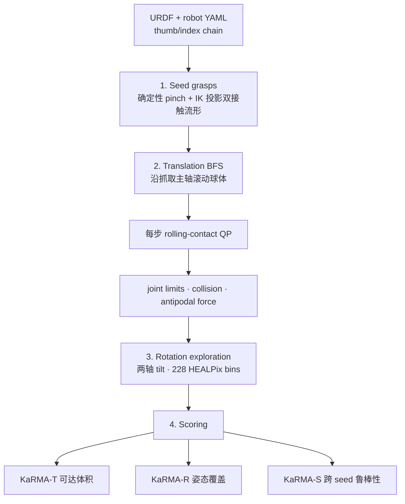
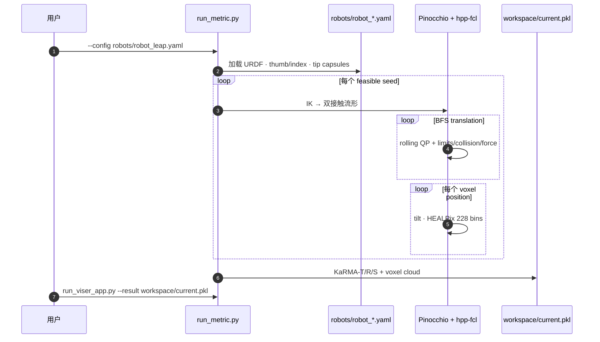

# KaRMA：机器人手精细操作运动学指标

**KaRMA**（*A Kinematic Metric for Fine Manipulation Ability in Robotic Hands*，[arXiv:2605.15548](https://arxiv.org/abs/2605.15548)，**IROS 2026**，[项目页](https://martinpeticco.com/karma/)，[GitHub](https://github.com/mfpeticco/karma-hand-metric)）由 **MIT Improbable AI Lab**（Martin Peticco、Pulkit Agrawal）提出：在 **无电机、无策略、无传感器集成** 的前提下，仅用 **URDF 运动学** 评估灵巧手在 **拇指–食指 rolling pinch** 内 **连续改变物体位姿** 的能力——对应 Bicchi (2000) 意义上的 dexterity，而非 DoF 计数或 Jacobian 条件数代理。

## 一句话定义

**KaRMA 把「手内滚动操纵能走多远」收成三个无量纲分数（平移体积 / 228-bin 旋转覆盖 / 初始抓取鲁棒性），从 URDF 在 CPU 上秒–分钟级算完，用于选型与运动学设计迭代，而非替代任务成功率榜。**

## 英文缩写速查

| 缩写 | 英文全称 | 简要说明 |
|------|----------|----------|
| KaRMA | Kinematic Metric for Fine Manipulation Ability | 本文指标总称 |
| KaRMA-T | KaRMA Translation | 可达球心体积 / 手尺寸³ 归一化 |
| KaRMA-R | KaRMA Rotation | 228 HEALPix 姿态 bin 可达比例（五最佳位姿均值） |
| KaRMA-S | KaRMA Sensitivity | median seed / best seed，初始抓取鲁棒性 |
| URDF | Unified Robot Description Format | 输入 kinematic model |
| HEALPix | Hierarchical Equal Area isoLatitude Pixelization | 228 等面积 twist-invariant 姿态分区 |
| QP | Quadratic Program | 每步 rolling-contact 小 QP |
| GCI | Global Conditioning Index | 传统 Jacobian 基线之一；与 KaRMA 几乎不相关 |

## 为什么重要

- **补「DoF / workspace / manipulability ≠ 手内 dexterity」：** 16 手榜中 **6-DoF D'Claw** 平移可达约为 **9-DoF Shadow 三倍**；Ability **GCI 最高** 却 **KaRMA-T 末位**——关节数与 Jacobian 条件数不能替代 rolling-pinch 操纵体积。
- **平移与旋转可解耦：** LEAP **KaRMA-T 最高**（0.097），Allegro **KaRMA-R 最高**（0.335）且 T 仅第二；voxel 着色可见「位置绿、旋转红」（D'Claw vs Allegro）。
- ** PROCUREMENT / 设计迭代友好：** CPU-only、无训练；自定义 URDF + YAML 模板即可打分；与 [HAND ERC](./paper-hand-erc-benchmarking-dexterity.md) **hand 层**、[DexBench](./dexbench.md) **工业任务规格** 互补而非替代。
- **工程可复现：** MIT 仓含 16 手 Table I、`run_viser_app.py` 体素云、约束消融与 bit-reproducible 声明。

## 核心信息

| 项 | 内容 |
|----|------|
| 机构 | 麻省理工学院（MIT）Improbable AI Lab |
| 会议 | IROS 2026 |
| 对象 | 16  bundled 手（Allegro、LEAP、Shadow、D'Claw、Dex3/5、DLR、Inspire 等） |
| 接触模型 | 双指 pinch + **维持 rolling** 的小球；capsule 指链 + 接触法向 |
| 约束 | Joint limits、自碰/物碰、rolling contact、**antipodal force closure** |
| 代码 | [mfpeticco/karma-hand-metric](https://github.com/mfpeticco/karma-hand-metric)（**已开源**） |
| 运行时 | 单手 ~10 s–5 min；16 手 ~18 min（32 线程桌面） |

## 流程总览

## 三阶段机制（与实现一致）

### 1. 初始抓取（Seed grasps）

- **确定性** 生成候选 thumb–index 捏取姿势，**逆运动学** 投影到 **双接触流形**。
- **每个** 可行 seed 均进入后续搜索（非只取单一 grasp）。

### 2. 平移搜索（Translation search）

- 从各 seed **广度优先** 沿抓取 **主轴** 滚动球体。
- 每步：小型 **rolling-contact QP** + 检查 **关节限位、碰撞、反向力（antipodal）可行性**。
- 输出：可达 **球心 voxel 云**（项目页交互着色 = 该位置 **KaRMA-R 局部覆盖**）。

### 3. 旋转探索（Rotation exploration）

- 每个到达位姿：绕 **两个可控轴** 倾斜球体。
- 统计 **228** 个 **HEALPix** 等面积 **twist-invariant** 姿态 bin 中可达个数 → 局部位姿覆盖；汇总为 **KaRMA-R**（五最佳位姿均值）。

### 4. 打分（Scoring）

| 分数 | 定义 | 读法要点 |
|------|------|----------|
| **KaRMA-T** | 可达体积 / \(L_{\mathrm{ref}}^3\) | 平移「能占多大立方比例」；Dex3 等可为 **2D 流形**（单层 voxel） |
| **KaRMA-R** | 228 bin 覆盖率 | **天花板 ~1/3** 即使最强手；高分≠全 workspace 高覆盖 |
| **KaRMA-S** | median/best seed | D'Claw T 第三但 **S 低**——强依赖「捏对地方」 |

## 源码运行时序图

节点对齐 [`sources/repos/karma-hand-metric.md`](../../sources/repos/karma-hand-metric.md) 与 README。

复现：`conda env create -f environment.yml` → `python run_metric.py --config ...`；新 hand 复制 `robot_template.yaml` 并 **目视校验 capsule 长度**（错长度会「静默低分」）。

## 评测与主要发现

### 16 手榜（Table I 量级，完整表见 `results/16_hand_batch/summary.yaml`）

| 现象 | 代表数据 / 案例 |
|------|-----------------|
| T 跨两数量级 | LEAP **0.097** vs Inspire **~0.0005** 量级 |
| T vs R 分化 | Allegro **R=0.335** 第一、T 第二；LEAP **T** 第一、R 第二 |
| DoF 误导 | Shadow 9 DoF **T=0.013** < D'Claw 6 DoF **0.036** |
| 同 DoF 不同维 | xHand1 vs D'Claw 均 6 DoF，T 差 **~10×**（平面 vs 体积） |
| 传统基线失效 | Yoshikawa ρ=**−0.20** vs KaRMA-T；GCI ρ=**−0.08** |
| 约束消融 | LEAP naive gap **0.580** → +JL **0.241** → full **0.099** |

### 与任务榜关系

- 作者声明：KaRMA 是 **standardized lower bound**；与 **DexMachina、ISyHand** 等同向一致，在 **简单 proxy 失误处** 与任务榜同向。
- **不** 单独预测任意物体任务成功率——见 [Scope](#局限与风险)。

## 结论

**KaRMA 把「手内 rolling pinch 操纵体积」从 DoF/Jacobian 叙事里拆成可算的 T/R/S 三分，适合 URDF 阶段的选型与 kinematic 设计迭代，但必须与任务级 benchmark 并读。**

- **先跑 KaRMA 再采购/改 URDF**：秒–分钟级 CPU，无控制器集成成本
- **KaRMA-T 与 KaRMA-R 分开读**：LEAP/Allegro 解耦说明「reach ≠ reorient」
- **KaRMA-S 筛「挑 grasp」手**：D'Claw 高 T 低 S → 部署需 grasp 选择器
- **勿用 GCI/Yoshikawa 替代**：论文相关性与 KaRMA 接近零或负
- **Joint limits 是主杀手**：消融显示 naive workspace 58–99% 被 JL 砍掉
- **自定义 URDF 必查 capsule 几何**：非 mesh 碰撞，tip 长度错会低估
- **与 HAND ERC / DexBench 分工**：KaRMA=kinematic lower bound；HAND=四层归因；DexBench=工业 OSC 任务规格

## 工程实践

| 步骤 | 动作 |
|------|------|
| 1 | `git clone` + `conda env create -f environment.yml` |
| 2 | `python run_metric.py --config robots/robot_<name>.yaml` |
| 3 | `python run_viser_app.py` 或 `--result workspace/current.pkl` 查 voxel 着色 |
| 4 | 新 hand：`robots/urdfs/` + 复制 `robot_template.yaml`；`tools/tune_tip_lengths.py` 调 capsule |
| 5 | 与 [All Hands Up](./all-hands-up.md) / 采购 spec 对照：KaRMA 给 **kinematic 下界**，不是真机 SR |

## 局限与风险

- **单 pinch + 球 + rolling only：** 无 regrasp、finger gaiting、滑动比例（† 手需 11–32% sliding 仍计分但机制不同）。
- **Kinematics only：** 不建模摩擦、力控、触觉、控制延迟。
- **KaRMA-R 全局上限：** 单 grasp 即使最佳位姿也难覆盖全 HEALPix → 解释为何需 regrasp/gaiting。
- **Capsule 近似：** 非 URDF mesh；错误 tip → **低分无报错**。
- **与 [DexBench](./dexbench.md) OSC / [HAND ERC](./paper-hand-erc-benchmarking-dexterity.md) DexNex 正交：** 不评工业任务终态或系统级 16 原子任务。

## 与其他基准/指标的定位

| 工具 | 测什么 | 输入 | 与 KaRMA |
|------|--------|------|----------|
| **KaRMA** | rolling pinch **kinematic** T/R/S | URDF | 本页 |
| [HAND ERC](./paper-hand-erc-benchmarking-dexterity.md) | 四层 dexterity + DexNex 16 任务 | 手/系统/任务 | hand 层 **设计灵敏度**；KaRMA 可作 URDF 预筛 |
| [DexBench](./dexbench.md) | 工业 18 任务 OSC 规格 | 真机任务定义 | 任务终态 vs 纯 kinematic 体积 |
| DoF / Yoshikawa / GCI | 传统 proxy | URDF Jacobian | 论文证 **mis-rank** 常见 |
| [Allegro Hand](./allegro-hand.md) 等实体 | 硬件平台 | — | KaRMA 榜给出 **in-hand kinematic** 对照数字 |

## 关联页面

- [HAND ERC 灵巧评测综述](./paper-hand-erc-benchmarking-dexterity.md) — hand 层 benchmark 与 DexNex
- [DexBench](./dexbench.md) — 工业灵巧任务规格（OSC）
- [Allegro Hand](./allegro-hand.md) / [Shadow Hand](./shadow-hand.md) — 榜内代表平台
- [In-hand reorientation](../methods/in-hand-reorientation.md) — 任务方法论
- [Manipulation](../tasks/manipulation.md) — 操纵任务总览
- [具身评测基准选型闭环](../overview/hub-embodied-eval-benchmark.md) — ③ 层 adjacent：手型 kinematic 预筛

## 参考来源

- [KaRMA 论文归档](../../sources/papers/karma_hand_metric_arxiv_2605_15548.md)
- [KaRMA 项目页](../../sources/sites/karma-hand-metric-martinpeticco.md)
- [karma-hand-metric 仓库](../../sources/repos/karma-hand-metric.md)

## 推荐继续阅读

- 交互榜与案例：<https://martinpeticco.com/karma/>
- 官方仓库 README：<https://github.com/mfpeticco/karma-hand-metric>
- Bicchi (2000) — dexterity 与 rolling manipulation 经典定义（论文引用链）
