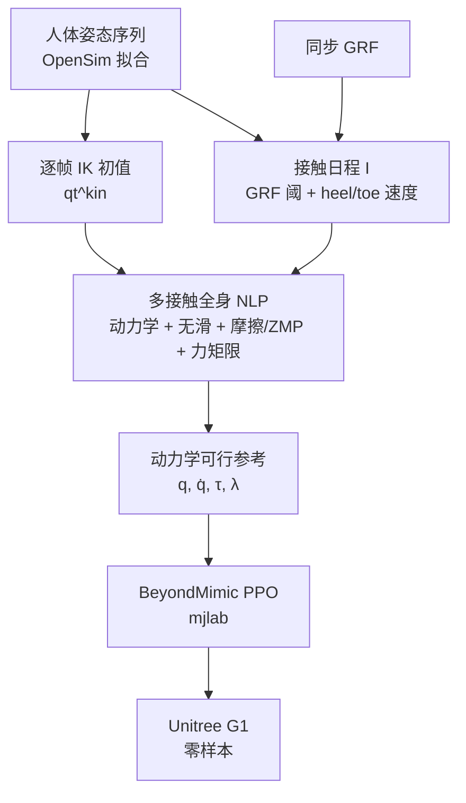

# KDMR（Kinodynamic Motion Retargeting）

**KDMR**（*Kinodynamic Motion Retargeting for Humanoid Locomotion via Multi-Contact Whole-Body Trajectory Optimization*，[arXiv:2603.09956](https://arxiv.org/abs/2603.09956)）由 **佐治亚理工学院（Georgia Tech）** 提出：把人形 locomotion 重定向写成 **GRF 锚定的多接触全身轨迹优化**，在刚体动力学、日程化接触与作动限下生成参考，再经 [BeyondMimic](../methods/beyondmimic.md)（mjlab）训跟踪策略并 **零样本** 上 Unitree G1。

## 一句话定义

**用测得的地面反力推断 heel–toe 接触日程，再把 IK 初值 refinement 成满足动力学与无滑约束的全身参考，减轻下游 RL 对伪影的补偿。**

## 英文缩写速查

| 缩写 | 英文全称 | 简要说明 |
|------|----------|----------|
| KDMR | Kinodynamic Motion Retargeting | 本文多接触动力学重定向框架 |
| GRF | Ground Reaction Force | 同步测力，用于接触日程与力初值 |
| NLP | Nonlinear Program | CasADi 求解的全身 TO |
| GMR | General Motion Retargeting | 运动学基线对照 |
| ZMP | Zero Moment Point | 接触力矩可行域约束 |
| PPO | Proximal Policy Optimization | BeyondMimic 下游跟踪训练 |

## 为什么重要

- **接触信息进 TO：** 不只靠几何脚高，用 **GRF + 足点速度** 系统检测多接触，适合 heel–toe 步态。
- **伪影在参考层消：** 相对纯 [GMR](../methods/motion-retargeting-gmr.md)，stance 脚浮空与速度尖峰明显减少，下游策略少做「补动力学」。
- **可复用离线预处理：** 单次 TO 贵（相对 GMR 慢一个数量级），但参考可贯穿训练与部署。
- **与同族分工清晰：** 对比 [SPARK](./paper-spark-skeleton-aligned-retargeting.md)（骨架 URDF 校准 + 渐进 KDTO）、[DynaRetarget](../methods/dynaretarget-sbto-motion-retargeting.md)（采样 SBTO）、[DSMS](./paper-shooting-for-contact.md)（接触隐式打靶）——KDMR 的差异化是 **实测 GRF 日程**。

## 核心信息

| 项 | 内容 |
|----|------|
| **机构** | 佐治亚理工学院（Georgia Tech） |
| **平台** | Unitree G1；下游 BeyondMimic / mjlab |
| **输入** | 同步 MoCap（OpenSim 拟合）+ 脚级 GRF；生物力学开放集 walking / twisting |
| **求解栈** | CasADi NLP + Pinocchio 刚体动力学 |
| **开源** | **宣称正式发表时开源**；截至 2026-08-08 **无官方 GitHub**；匿名仓 `anonymous.4open.science/r/KDMR` 不可作稳定入口 |

## 流程总览

## 源码运行时序图

**不适用（官方可运行代码尚未发布）。** 截至 2026-08-08：论文承诺 *open-sourced upon publication*；脚注匿名仓无法稳定访问，亦无公开 GitHub。发布后应补：GRF/接触日程 → CasADi NLP → BeyondMimic 训练 → G1 部署的 `sequenceDiagram`。

## 工程实践

| 项 | 建议 / 论文设定 |
|----|----------------|
| 何时用 | 有 **同步 GRF**（或等价测力）且运动含复杂 heel–toe / 全身扭转接触时 |
| 无 GRF 时 | 不宜硬套；改看 [SPARK](./paper-spark-skeleton-aligned-retargeting.md) / [DynaRetarget](../methods/dynaretarget-sbto-motion-retargeting.md) / [DSMS](./paper-shooting-for-contact.md) |
| 基线对照 | 同数据仔细调参的 [GMR](../methods/motion-retargeting-gmr.md)（含原文最低高度修正） |
| 下游 | 默认 BeyondMimic 超参；**唯一变量**应是参考轨迹 |
| 成本 | 800 帧 walk/twist 约 **88.6 / 282.4 s**（GMR 约 7 / 10 s）——按离线数据工厂预算 |
| 新机型 | 文称换 Pinocchio 模型即可；复现前仍需等开源权重与脚本 |

## 实验与评测

- **动态可行性 / 平滑：** Fig. 3–4 显示 KDMR 保持步态风格，踝部局部修正以满足接触；stance 期 heel/toe 贴地，GMR 常见脚浮空；下肢速度尖峰减弱。
- **下游跟踪（Table I，100 seeds）：** Walk 上 Eg-bpe / Ebpe / Ejpe 相对 GMR 降 **38.1% / 35.2% / 27.6%**；Twister 降 **46.8% / 40.7% / 27.4%**。
- **样本效率：** Fig. 5 — KDMR 参考下 mean reward 更高、更早收敛。
- **真机：** 两策略均可无微调上 G1；扭转动作上 \(\pi_{\mathrm{GMR}}\) 更脆，\(\pi_{\mathrm{KDMR}}\) 更稳（视频定性）。

## 结论

**有测力锚定的多接触 TO，能把「接触伪影」挡在 RL 之前；代价是离线算力，收益是可学性与真机稳健性。**

1. **真影响：GRF→接触日程** — 系统检测 heel–toe，避免仅靠运动学猜接触。
2. **真影响：动力学+无滑进 NLP** — 相对 GMR 降跟踪误差约三成以上，并抬高训练 reward。
3. **真影响：参考层消伪影** — 策略少补偿脚浮空与速度尖峰。
4. **次要代价：运行时** — 比 GMR 慢约一个数量级；设计为离线预处理。
5. **部署读法：** 适合测力实验室 MoCap→人形；纯视觉/无 GRF 管线勿默认可复现同增益。
6. **工程读法：代码待发表开源** — 选型先对照 GMR/SPARK/DSMS 开源栈。

## 与其他工作对比

| 对照 | 差异读法 |
|------|----------|
| [GMR](../methods/motion-retargeting-gmr.md) | 运动学主线；KDMR 用其作初始化/基线，并强制动力学与接触力 |
| [SPARK](./paper-spark-skeleton-aligned-retargeting.md) | 强调 **URDF 骨架校准** + 渐进 KDTO/力矩监督；不依赖测力 GRF |
| [DynaRetarget / SBTO](../methods/dynaretarget-sbto-motion-retargeting.md) | 采样式全时域精炼，偏 loco-manipulation 物体交互 |
| [DSMS / Shooting for Contact](./paper-shooting-for-contact.md) | 接触隐式多重打靶，无需预设接触时刻表 |
| [BeyondMimic](../methods/beyondmimic.md) | 下游跟踪框架；KDMR 只换参考质量 |

## 局限与风险

- **依赖 GRF：** 无同步测力时接触日程质量下降；当前实现为二元阈值，无脚高/学习置信度。
- **算力：** 长序列/扭转 TO 可达数百秒级。
- **非处处必要：** 作者承认简单运动上 kinodynamic 增益可能有限。
- **开源未落地：** 匿名仓与「发表后开源」意味着现阶段 **不可工程复现全文管线**。

## 关联页面

- [SPARK（骨架对齐 + KDTO）](./paper-spark-skeleton-aligned-retargeting.md) — 同期 kinodynamic 重定向对照（文内互引）
- [GMR](../methods/motion-retargeting-gmr.md) — 运动学基线
- [BeyondMimic](../methods/beyondmimic.md) — 下游跟踪
- [DynaRetarget / SBTO](../methods/dynaretarget-sbto-motion-retargeting.md) / [Shooting for Contact](./paper-shooting-for-contact.md) — 动力学精炼谱系
- [Motion Retargeting](../concepts/motion-retargeting.md) / [Pipeline](../concepts/motion-retargeting-pipeline.md) / [知识链汇总](../overview/hub-motion-retargeting.md)

## 参考来源

- [kdmr_arxiv_2603_09956.md](../../sources/papers/kdmr_arxiv_2603_09956.md) — 论文摘录与开源核查
- [arXiv:2603.09956](https://arxiv.org/abs/2603.09956) — 原文（v2，2026-07-30）

## 推荐继续阅读

- [Retargeting Matters / GMR（arXiv:2510.02252）](https://arxiv.org/abs/2510.02252) — 运动学对照与工程基线
- [BeyondMimic（arXiv:2508.08241）](https://arxiv.org/abs/2508.08241) — 下游跟踪配方
