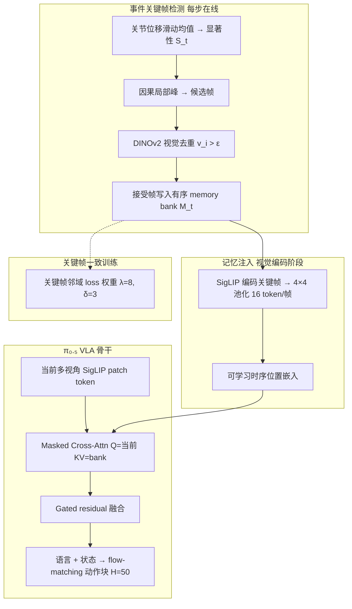

# KEMO（Event-Driven Keyframe Memory for Long-Horizon Robot Manipulation with VLA Policies）

**KEMO**（arXiv:[2606.23589](https://arxiv.org/abs/2606.23589)，[项目页](https://hatty-z.github.io/KEMO)，Hong Kong Embodied AI Lab / CUHK / xdof.ai / UESTC / SJTU）提出面向 **记忆依赖长程双臂操作** 的 **可插拔关键帧记忆框架**：不保留稠密历史、也不依赖在线 VLM 任务分解，而是用 **运动学事件显著性 + 视觉变化验证** 自动选出任务相关过渡帧，编码为紧凑 **memory bank**，经 **masked cross-attention 与门控残差融合** 注入 **π₀.₅** 视觉表征；同一关键帧索引还在训练时对邻域 **flow-matching loss 加权**。真机 **YAM 双臂** 六项任务（2–6 计分子阶段、28–95 s、830–2846 步）上，相对无记忆 **π₀.₅** 聚合 **TSR +23.6 百分点、SCR +34.1 百分点**，并显著超过 **MemoryVLA** 对照。

## 一句话定义

用 **事件关键帧**（机器人减速过渡 + 场景确实变化）作为稀疏历史证据，以 **门控 cross-attention** 插拔进现有 VLA 视觉编码，并用 **关键帧一致 loss 加权** 让「被记住的时刻」与「被强调学习的时刻」对齐。

## 英文缩写速查

| 缩写 | 英文全称 | 简要说明 |
|------|----------|----------|
| KEMO | Event-Driven Keyframe Memory | 本文事件驱动关键帧记忆框架 |
| VLA | Vision-Language-Action | 视觉-语言-动作多模态策略骨干 |
| TSR | Task Success Rate | 全阶段按序成功的试验占比 |
| SCR | Stage Completion Rate | 从首阶段起连续完成阶段的平均比例 |
| SFT | Supervised Fine-Tuning | 在遥操作演示上微调 π₀.₅ 骨干 |
| RGB | Red Green Blue | 三视角 Decxin 彩色相机观测 |
| KV | Key-Value | Cross-attention 中记忆 token 的键值 |

## 为什么重要

- **直击长程 VLA 的 stage ambiguity：** 相似画面在不同执行阶段需要不同动作；KEMO 用 **稀疏过渡证据** 而非整段历史或 VLM 子目标来消歧。
- **轻量、可插拔、任务无关检测：** 关键帧检测只需 **本体运动 + 冻结 DINOv2**，无需子任务标注或每步 VLM 推理；记忆模块挂在 **SigLIP 视觉 token** 层，不改 LLM 前缀结构。
- **记忆构建与训练信号同源：** 关键帧既写入 $\mathcal{M}_t$，又定义 **$\lambda=8$ 邻域 loss**；Cover Blocks 上单独去掉门控或 loss 加权都会让 TSR 从 **75%** 跌到 **0–25%**。
- **真机长时程实证：** 六项 **记忆依赖** 双臂任务、每任务 12 trials，相对 **π₀.₅** 与 **MemoryVLA** 均有稳定增益；事件选帧优于 **均匀采样** 与 **近帧保留**。

## 流程总览

## 核心机制（归纳）

### 1）事件驱动关键帧检测

| 步骤 | 机制 | 要点 |
|------|------|------|
| **显著性** | $S_t=1/(1+\bar{\delta}_t)$，$\bar{\delta}_t$ 为关节位移 $w$ 帧均值 | 减速峰对应抓放、覆盖、释放等过渡 |
| **峰检测** | 在线确认 $S_t$ 局部极大 | 因果、无需未来全轨迹 |
| **视觉过滤** | $\phi$=DINOv2，$v_i=1-\cos(\phi(I_{c_i}),\phi(I_{k_{i-1}}))$ | $v_i>\epsilon=0.05$ 才接受；去掉无场景变化的停顿 |
| **不应期** | 连续接受帧间隔 $\geq r$ | 抑制同一次过渡重复记帧 |

超参 $w$、峰窗、$r$ 按任务调节（论文表 6）；检测 **推理与训练共用同一管线**。

### 2）记忆 bank 与门控融合

- **编码：** 与骨干相同 **SigLIP**；每关键帧 **256 patch → $4\times4$ 池化 → 16 token**。
- **容量：** 最近 **$K$** 个已接受关键帧（$K$ 按任务阶段数设定）；不足 pad 最近帧并用 **mask** 屏蔽 attention。
- **时序：** 槽位 **可学习位置嵌入** 广播到 16 token，区分「第几次完成的状态转移」。
- **融合：** 当前帧 token 为 Query；$\hat{X}_t=X_t+\sigma(g([X_t;X'_t]))\cdot X'_t$，门控 **负偏置初始化** 以早期保持原策略。

### 3）训练与评测设定

| 字段 | 内容 |
|------|------|
| **骨干** | 预训练 **π₀.₅**，joint-space，action horizon **50** |
| **优化** | AdamW，30k steps，batch 32，2×A100；与 π₀.₅ 基线同配方公平对比 |
| **Loss 加权** | 距关键帧 $\leq 3$ 步乘 **$\lambda=8$** |
| **硬件** | **YAM 双臂**；顶视 + 双腕 **Decxin RGB**；leader–follower 遥操作 100–200 demos/任务 |
| **对照** | **π₀.₅**（无记忆）、**MemoryVLA**（单顶视、8×A100、40k steps） |

### 4）六项真机任务与聚合结果

| 任务 | 子阶段 | 时长 / 步数 | KEMO TSR | π₀.₅ TSR | MemoryVLA TSR |
|------|--------|-------------|----------|----------|---------------|
| Swap Foods | 2 | ~28 s / 830 | **8/12** | 6/12 | 1/12 |
| Find Block | 4 | ~40 s / 1186 | **2/12** | 0/12 | 0/12 |
| Cover Blocks | 6 | ~50 s / 1480 | **9/12** | 0/12 | 0/12 |
| Box Refill | 4 | ~50 s / 1480 | **7/12** | 4/12 | 0/12 |
| Make Sandwich | 4 | ~54 s / 1616 | **11/12** | 10/12 | 0/12 |
| Drawer Items Replacement | 4 | ~95 s / 2846 | 0/12 | 0/12 | 0/12 |
| **聚合** | — | — | **TSR 51.4%** | 27.8% | 1.4% |

SCR 聚合：**76.4%** vs π₀.₅ **42.3%**（**+34.1 pt**）。Drawer 任务对所有方法仍难，但 KEMO SCR **1.42/4** 优于两基线 **0**。

**Cover Blocks 选帧消融（固定检索+门控，关 loss 加权）：** 均匀采样 TSR **0%**；近帧 **8.3%**；事件关键帧 **25%**。**组件消融（事件帧固定）：** 无门控 TSR **0%**；无 loss 加权 **25%**；完整 **75%**。

## 常见误区或局限

- **不是通用长程记忆银弹：** Drawer Items Replacement 上 TSR 仍为 **0/12**；任务需 **记住物体–容器/抽屉对应** 且轨迹最长，说明检测与 $K$ 仍受任务结构限制。
- **超参与 $K$ 需任务级设定：** $w$、峰窗、$r$、bank 容量尚未自动推断；跨任务迁移要再调参。
- **与 π₀.₇ MEM 历史视觉不同：** KEMO 存的是 **稀疏语义过渡帧**，不是固定窗口稠密帧；与 **MemoryVLA token merge**、**VLM 子目标分解** 是不同记忆粒度。
- **代码尚未公开：** 项目页标注 Code coming soon；复现需等待官方发布。

## 与其他页面的关系

- 任务语境：[Manipulation](../tasks/manipulation.md) — 双臂桌面长程操作与记忆依赖子任务。
- 骨干对照：[π₀.₇ Policy](../methods/pi07-policy.md)、[π₀ Policy](../methods/π0-policy.md)、[VLA](../methods/vla.md) — π 系 flow-matching VLA 与记忆增强路线谱系。
- 关键帧工具对照：[机器人关键帧与运动编辑工具](./robot-motion-keyframe-editors.md) — 离线示教关键帧 vs 在线事件检测。
- 动作接口：[Action Chunking](../methods/action-chunking.md) — $H=50$ 块预测与长时程执行。
- 相邻稀疏记忆路线：[EventVLA](./paper-eventvla-visual-evidence-memory.md) — **学习式前瞻 KEM + 原始图像拼接**（QwenOFT）与 **RoboTwin-MeM** 基准；本文侧重 **运动学启发式选帧 + π₀.₅ 门控融合**。

## 实验与评测

- 量化指标、消融与 sim2real / 实机结果见 **原文 PDF** 与 [参考来源](#参考来源)；本页正文侧重方法结构与知识库交叉引用。

## 关联页面

- [AMI-EV 微扫视事件相机](./paper-microsaccade-inspired-event-camera.md)

## 参考来源

- [kemo_arxiv_2606_23589.md](../../sources/papers/kemo_arxiv_2606_23589.md)

## 推荐继续阅读

- Zeng et al., *KEMO: Event-Driven Keyframe Memory for Long-Horizon Robot Manipulation with VLA Policies* — <https://arxiv.org/abs/2606.23589>
- [KEMO 项目页](https://hatty-z.github.io/KEMO) — 真机视频与逐任务结果表
- Physical Intelligence, *π₀.₅: a vision-language-action model with open-world generalization* — <https://arxiv.org/abs/2504.16054>（本文微调骨干）
- Shi et al., *MemoryVLA: Perceptual-Cognitive Memory in Vision-Language-Action Models* — <https://arxiv.org/abs/2508.19236>（论文对照基线）
