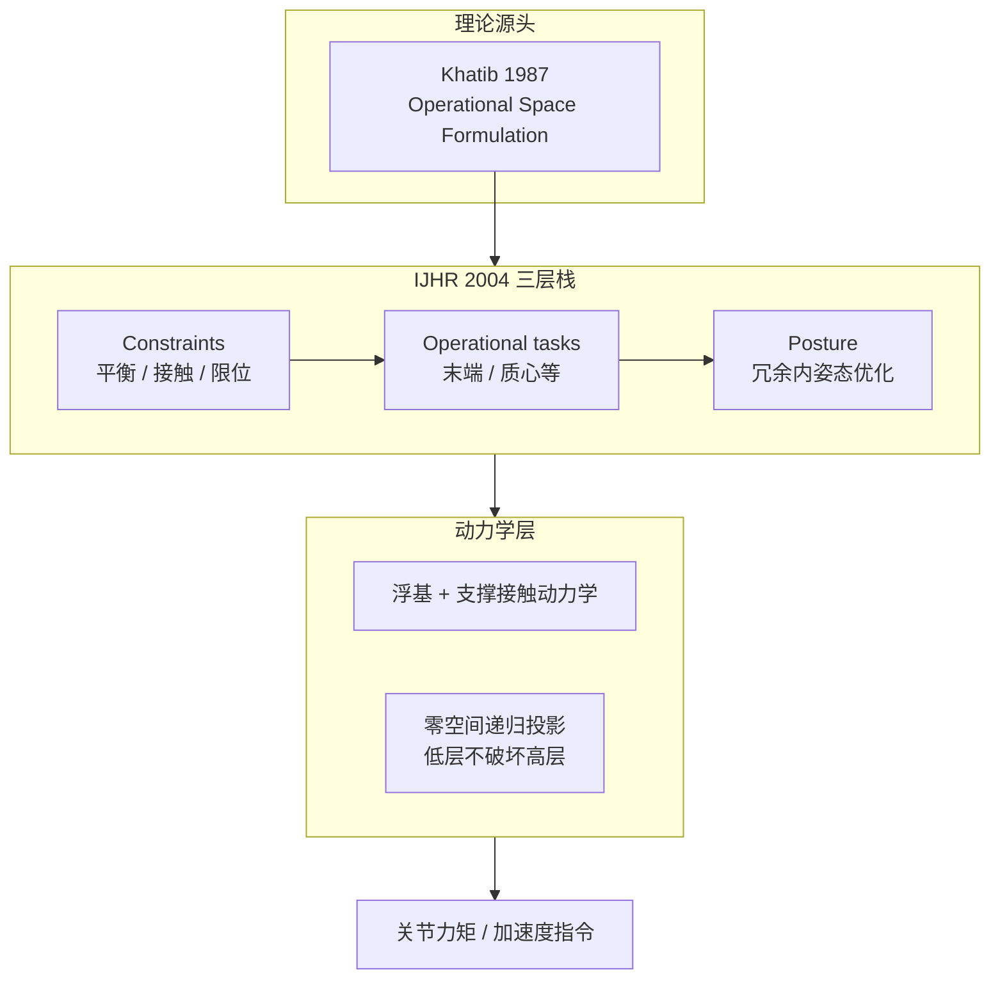

# Whole body dynamic behavior and control of human-like robots（IJHR 2004）

**Whole body dynamic behavior and control of human-like robots**（Khatib, Sentis, Park, Warren；*International Journal of Humanoid Robotics* 1(1):29–43, 2004；[DOI:10.1142/S0219843610000027](https://doi.org/10.1142/S0219843610000027)）是人形 **Whole-Body Control（WBC）** 的 **系统化理论起点**：在 [Khatib 1987 操作空间 formulation](./paper-operational-space-formulation.md) 之上，把 **浮基、多接触、平衡约束** 与 **任务/姿态分解** 写成可递归执行的优先级结构。

## 一句话定义

**把人形全身控制表述为「约束 > 操作任务 > 姿态」的递归优先级栈，在操作空间动力学一致投影下协调浮基与接触，而非逐关节独立控制。**

## 英文缩写速查

| 缩写 | 英文全称 | 简要说明 |
|------|----------|----------|
| WBC | Whole-Body Control | 全身多任务/多约束下的关节力矩或加速度分配 |
| OSF | Operational Space Formulation | Khatib 操作空间：在任务空间写动力学再映射关节 |
| CoM | Center of Mass | 质心/平衡相关任务与约束的核心状态 |
| IK | Inverse Kinematics | 速度层任务到关节的映射；本文强调动力学一致零空间 |
| DoF | Degrees of Freedom | 人形高冗余使优先级与零空间投影成为必需机制 |

## 为什么重要

- **WBC 谱系的「第一性原理」页：** 后续 Sentis–Khatib ICRA 2006 框架、[ControlIt!](./controlit.md) 软件、以及 TSID/HQP 等工程栈，都共享本文的 **三层语义**（约束 / 操作 / 姿态）。
- **把平衡与接触写进同一栈：** 动态约束（平衡、支撑接触）不是后处理滤波，而是 **最高优先级任务**。
- **与 1987 OSF 的分工：** OSF 解决「末端运动+力如何统一」；本文解决「全身冗余 + 浮基 + 多原语如何不互相破坏」。

## 流程总览

## 核心机制（归纳）

### 1）三层控制原语

| 层级 | 角色 | 典型内容 |
|------|------|----------|
| **Constraints** | 必须始终满足 | 动态平衡、接触支撑、关节限位、自碰避免 |
| **Operational tasks** | 主任务 | 手/脚末端轨迹、质心运动、接触力目标 |
| **Posture** | 冗余利用 | 仿人姿态、能耗、关节舒适位形 |

### 2）递归优先级与零空间

- 高优先级任务先求解；低优先级只在 **已满足高层的零空间** 内修正。
- **姿态任务** 可在操作任务零空间内优化，而不改变已完成的操作任务加速度。
- 与 [null-space-control](../concepts/null-space-control.md) 中动力学一致投影 $N=I-J^\top\bar J^\top$ 一脉相承；[HQP](../concepts/hqp.md) 是其不等式约束升级。

### 3）浮基与接触

- 人形建模为 **自由漂浮基座**；支撑脚接触力进入动力学方程。
- 「看懂地形/平衡」与「完成任务」在同一数学框架内耦合，而非上层规划与下层 PD 割裂。

## 工程实践

| 项 | 内容 |
|----|------|
| 开源 | **不适用**（2004 期刊论文，无官方现代训练/部署仓） |
| 阅读顺序 | 先 [OSF 1987](./paper-operational-space-formulation.md) → 本文 → [ICRA 2006 框架](./paper-sentis-khatib-icra-2006-whole-body-control-framework.md) |
| 现代实现对照 | [TSID](https://github.com/stack-of-tasks/tsid)、[Stack of Tasks](./paper-hmi-stack-of-tasks.md)、[ControlIt!](./controlit.md) |

## 源码运行时序图

**不适用**（经典期刊论文，无可运行官方仓库）。软件化实现见 [ControlIt!](./controlit.md) 与 TSID 生态。

## 局限与风险

- **论文年代较早：** 不含后续 HQP、CBF、学习策略等工程扩展；读时应与 [hub-wbc](../overview/hub-wbc.md) 现代链对照。
- **真机细节在后继工作：** Honda ASIMO 等实现细节主要在 ICRA 2006 与博士论文中展开，本文偏理论与数学结构。

## 结论

**人形 WBC 的「约束–任务–姿态」三层优先级与操作空间动力学投影，在 IJHR 2004 被第一次系统化为人形可读框架。**

1. **先读本文再读 ICRA 2006** — 前者定语义与数学结构，后者定人形环境与工程集成叙述。
2. **约束必须最高优先级** — 平衡/接触不是可选奖励项，而是控制栈顶层任务。
3. **冗余走零空间，不是加权凑** — 姿态与次要目标只能在不破坏操作任务的子空间里优化。
4. **浮基+接触是建模前提** — 跳过人形浮动基与支撑力，后续 WBC 公式都会读偏。
5. **与 OSF 1987 成对** — 操作空间是局部任务语法；本文是全身多任务语法。
6. **软件对照选 ControlIt!/TSID** — 理论到代码的间隙用开源栈补齐，勿只看公式。

## 与其他页面的关系

- 理论源头：[paper-operational-space-formulation.md](./paper-operational-space-formulation.md)
- 代表延伸：[paper-sentis-khatib-icra-2006-whole-body-control-framework.md](./paper-sentis-khatib-icra-2006-whole-body-control-framework.md)
- 概念：[whole-body-control.md](../concepts/whole-body-control.md)、[null-space-control.md](../concepts/null-space-control.md)
- 知识链入口：[hub-wbc.md](../overview/hub-wbc.md)

## 参考来源

- [khatib_sentis_ijhr_2004_whole_body_dynamic_behavior.md](../../sources/papers/khatib_sentis_ijhr_2004_whole_body_dynamic_behavior.md)
- Khatib 实验室 PDF：<https://khatib.stanford.edu/publications/pdfs/Sentis_2005_IJHR.pdf>

## 推荐继续阅读

- [DOI:10.1142/S0219843610000027](https://doi.org/10.1142/S0219843610000027) — 期刊原文
- [Sentis & Khatib, ICRA 2006](./paper-sentis-khatib-icra-2006-whole-body-control-framework.md) — 人形环境 WBC 框架
- [Khatib 1987 Operational Space](./paper-operational-space-formulation.md) — 操作空间理论源头
