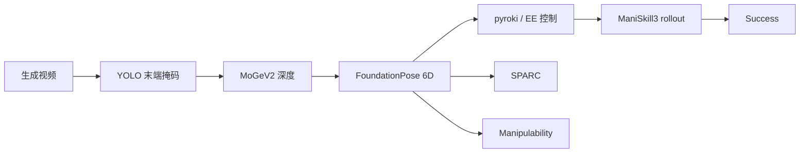
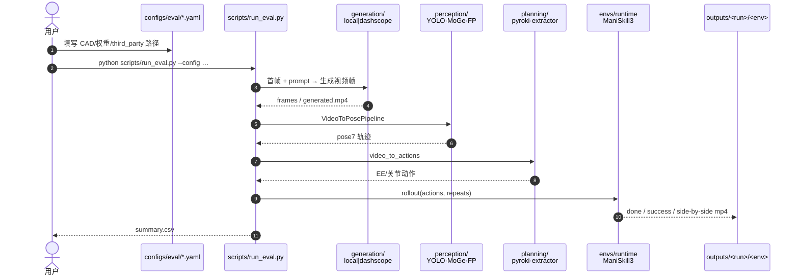

# KineBench（IDM-free 运动学接地的具身世界模型基准）

**KineBench**（*Benchmarking Embodied World Models via IDM-Free Kinematic Grounding*，[arXiv:2607.19876](https://arxiv.org/abs/2607.19876)，ECCV 2026，Zeyu Liu / Zhangzhe Zhu / Yang Zhang 等 · **中国电信人工智能研究院（TeleAI）** / NUS / 复旦 / 清华 / 西工大深圳研究院；[代码](https://github.com/minecraft-zzz/KineBench)）针对具身世界模型（EWM）闭环评测中 **IDM 抽动作脆弱** 导致的归因混淆：改为从生成视频 **显式提取 6D 末端位姿**，再在 **ManiSkill3** 中执行验证。

## 一句话定义

**不用脆弱的逆动力学模型猜动作，而是用级联视觉基础模型把生成视频落成 6D 末端轨迹，在物理仿真里闭环执行，并用平滑度 / 可操作度补强机器人视角诊断。**

## 英文缩写速查

| 缩写 | 英文全称 | 简要说明 |
|------|----------|----------|
| EWM | Embodied World Model | 面向机器人操纵的视频/世界模型 |
| IDM | Inverse Dynamics Model | 像素→动作；本文要避开的脆弱环节 |
| EEF | End-Effector | 6D 末端位姿接地对象 |
| SPARC | Spectral Arc Length | 轨迹平滑度（频域弧长） |
| MMI | Maruyama Manipulability Index | 运动学可操作度 / 可行性 |
| MoGe | Monocular Geometry（MoGeV2） | 度量深度估计 |
| FP | FoundationPose | Render-and-Compare 6D 位姿 |
| IK | Inverse Kinematics | pyroki 等规划后端 |

## 为什么重要

- **评测归因：** IDM 在 OOD 生成视频上失败时，无法区分「WM 幻觉」与「抽取器坏了」——对齐 [物理保真度输出轴](../overview/world-model-physics-fidelity-outputs.md) 的 **可执行性** 优先序。
- **机器人中心指标：** 不止任务成功；**SPARC** 与 **Maruyama Manipulability** 从 3D 轨迹刻画平滑与可行性，与 [运动学 vs 动力学](../concepts/kinematic-vs-dynamic-feasibility.md) 概念呼应（本基准主测运动学可执行落地）。
- **已开源可跑：** MIT 仓提供 `KineBenchEvaluator`、smoke 配置与 Wan/DashScope 生成路径，便于复现与扩模型。
- **缩放经验：** 任务复杂度升高后，数据/算力边际收益 **非线性**——对「大力出奇迹」叙事降温。

## 核心信息

| 项 | 内容 |
|----|------|
| 机构 | TeleAI、NUS、复旦、清华、西工大深圳研究院 |
| 会场 | ECCV 2026 Accept |
| 仿真 | **ManiSkill3**，`pd_ee_pose` 控制 |
| 任务 | **20** 操纵任务；四套件递进 |
| 代码 | [minecraft-zzz/KineBench](https://github.com/minecraft-zzz/KineBench) · **MIT** |
| 开源核查 | **已开源**（2026-07-27） |

## 核心原理（方法）

### IDM-free 运动学接地管线

1. **生成：** 条件视频 WM / 基础模型生成未来操纵视频（仓内支持 local npy 或 DashScope Wan I2V）。
2. **掩码：** 微调 YOLO 分割末端执行器（CAD 来自厂商，无需手工标）。
3. **深度：** 微调 **MoGeV2**（二阶段加重细粒度几何损失）得度量深度。
4. **6D 位姿：** **FoundationPose** Render-and-Compare；刚体约束吸收高频像素抖动，对 gripper 消失等幻觉敏感。
5. **执行：** 位姿序列经 planning（**pyroki** 等）转为控制，在 ManiSkill3 闭环 rollout。
6. **计分：** 任务成功；SPARC；Maruyama Manipulability；与成功的任务/模型依赖相关。

### 四套件

| Suite | 诊断问题 |
|-------|----------|
| **0 Basic Execution** | 生成动作能否在仿真执行成功 |
| **1 Task Transfer** | 跨任务迁移 |
| **2 Visual OOD** | 未见资产 / 外观偏移（如 OpenBoxHard **60%→30%** on Wan 2.2） |
| **3 Complexity Scaling** | 数据与算力随难度的边际收益 |

评测模型例：Wan 2.1 (1.3B)、Wan 2.2 (5B)、CogVideoX (2B) 及 LoRA 变体（四卡 A100 预算）。

### 流程总览

## 源码运行时序图

节点对齐 [`sources/repos/kinebench.md`](../../sources/repos/kinebench.md)。

- **最短冒烟：** 按 `examples/README.md` 写 `local_video.npy` → `configs/eval/local_smoke.yaml`。
- **完整评测：** `prepare_third_party.py` + `maniskill_wan26.yaml`（Wan2.6-i2v + 全感知）。

## 实验要点（索引级）

| 轴 | 报告口径（以论文为准） |
|----|------------------------|
| 接触丰富 | StackCube / PickFruits 等严重掉点 → 摩擦/碰撞仍是开放题 |
| 视觉 OOD | Wan 2.2 OpenBoxHard 未见资产 **60.0%→30.0%** |
| 规模 | 更大模型利复杂/长程，但对接触动力学不充分 |
| 指标相关 | SPARC / Manipulability 与成功呈 **任务·模型依赖** 关联 |
| 算力 | 文中主评约 **4×A100** |

## 工程实践

| 项 | 实践要点 |
|----|----------|
| 依赖 | ManiSkill3；FoundationPose / MoGe / YOLO 权重；可选 pyroki conda env |
| 控制 | 默认 `pd_ee_pose`；`action_repeat` 与 `action_length` 对齐生成帧率 |
| 负向提示 | 仓内默认抑制相机运动 / 形变伪影（见 `NEGATIVE_PROMPT`） |
| 对比 IDM 评测 | 报告时声明抽取器；本基准降低但非消除感知误差（YOLO/FP 仍可能失败） |
| 选型 | 需要 **闭环可执行性** 时优先；需要因果 VQA 见 [Thinking in Video](./paper-thinking-in-video.md)；需要 latent 动力学敏感见 [iKCE](./paper-imagined-rollouts-kinematic-not-dynamic.md) |

## 结论

**KineBench 把「视频好不好看」改写成「抽出来的末端轨迹在仿真里能不能干活」，并用平滑度/可操作度补机器人视角；开源管道使 IDM-free 闭环评测可复现。**

1. **归因更干净** — 显式 6D 接地替代脆弱 IDM，降低抽取器与 WM 错误混淆。
2. **刚体约束有益** — FoundationPose 吸收像素抖动，对物理幻觉仍敏感。
3. **成功 ≠ 唯一信号** — SPARC / Manipulability 提供互补诊断。
4. **四套件递进** — 基本执行 → 迁移 → 视觉 OOD → 复杂度缩放。
5. **缩放非线性** — 难度升高后数据/算力边际收益下降；接触任务仍难。
6. **工程可跑** — MIT；先 `local_smoke`，再填全感知路径做正式榜。

## 局限与风险

- **末端中心：** 主测 EEF 运动学执行，不直接审计物体内部可变形动力学（对照 [PhysCoRe](./paper-physcore.md)）。
- **感知仍可能失败：** YOLO 全失败会抛错；OOD 外观仍冲击掩码/位姿。
- **仿真域：** ManiSkill3 成功 ≠ 真机成功；策略相关性需另测。
- **README 极简：** 复现成本在 third_party 与权重路径，不在文档完整度。

## 与相邻工作的对比（分界）

| 对比轴 | KineBench | [EWMBench](./ewmbench.md) | [Masked Visual Actions](./paper-masked-visual-actions.md) |
|--------|-----------|---------------------------|----------------------------------------------------------|
| **闭环** | **是（ManiSkill3）** | 偏指标/守恒评测 | 规划/评估沙盒，逆设定用 IDM |
| **抽动作** | **6D EEF 显式** | 视具体协议 | IDM |
| **开源** | MIT 全管道 | 见实体页 | 部分开源 LoRA |

## 关联页面

- [世界模型物理保真度输出轴](../overview/world-model-physics-fidelity-outputs.md)
- [EWMBench](./ewmbench.md)
- [Generative World Models](../methods/generative-world-models.md)
- [运动学可行与动力学可行](../concepts/kinematic-vs-dynamic-feasibility.md)
- [Masked Visual Actions](./paper-masked-visual-actions.md)
- [Imagined Rollouts…](./paper-imagined-rollouts-kinematic-not-dynamic.md)
- [Thinking in Video](./paper-thinking-in-video.md)
- [具身评测基准选型闭环](../queries/embodied-eval-benchmark-selection-loop.md)

## 参考来源

- [KineBench 论文归档（arXiv:2607.19876）](../../sources/papers/kinebench_arxiv_2607_19876.md)
- [minecraft-zzz/KineBench 代码索引](../../sources/repos/kinebench.md)
- [具身智能研究室 · 世界模型物理保真度导读](../../sources/blogs/wechat_embodied_ai_lab_world_model_physics_fidelity.md)

## 推荐继续阅读

- [arXiv:2607.19876](https://arxiv.org/abs/2607.19876)
- [GitHub — minecraft-zzz/KineBench](https://github.com/minecraft-zzz/KineBench)
- [Thinking in Video](./paper-thinking-in-video.md) — 因果/感知侧诊断
