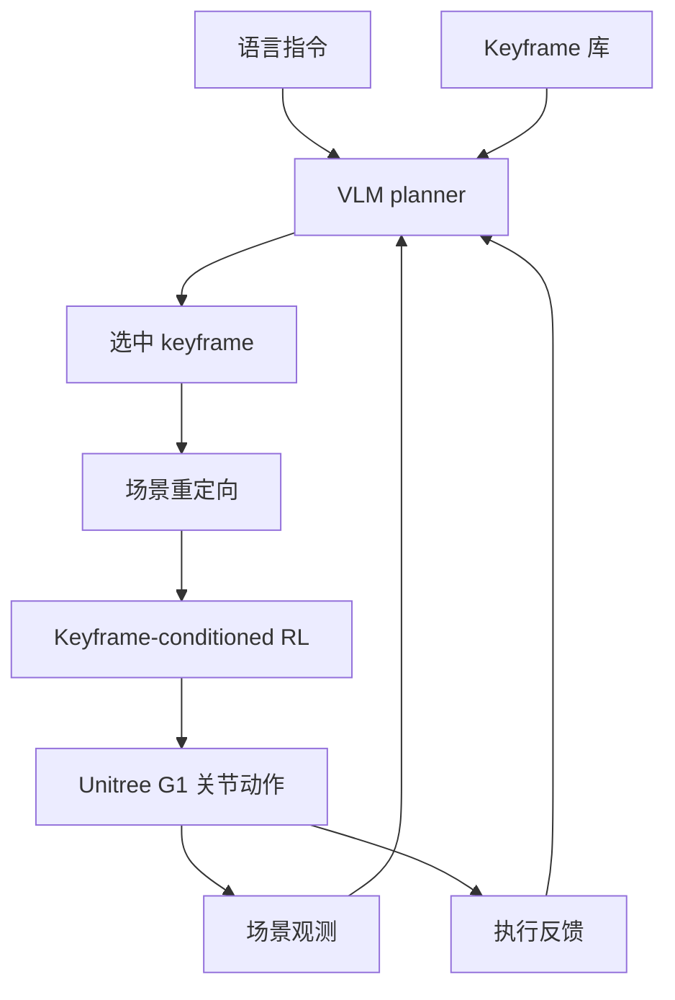

# KINO：关键帧接口连接 VLM 规划与人形全身控制

**KINO**（*A Keyframe Interface for VLM Planning and Whole-Body Control in Humanoid Loco-Manipulation*，[arXiv:2609.18869](https://arxiv.org/abs/2609.18869)，**苏黎世联邦理工（ETH Zürich）** Stelian Coros 组）用 **motion keyframes** 作 **VLM 规划** 与 **RL whole-body control** 之间的中间表示：VLM 从预定义库选 successive keyframes，重定向到当前场景后，低层策略跟踪全身/物体目标姿态。

## 一句话定义

**让人形 loco-manipulation 的高层语义走 VLM 选关键帧，低层动力学走 RL 跟踪——中间接口是 whole-body pose，不是 joint trajectory。**

## 英文缩写速查

| 缩写 | 英文全称 | 简要说明 |
|------|----------|----------|
| KINO | Keyframe Interface for VLM Planning and Whole-Body Control | 本文框架 |
| VLM | Vision-Language Model | 选 keyframe 序列的高层 planner |
| RL | Reinforcement Learning | 低层 keyframe-conditioned 全身策略 |
| WBC | Whole-Body Control | 协调 locomotion + manipulation 关节控制 |
| G1 | Unitree G1 | 论文真机平台 |
| DoF | Degrees of Freedom | 全身姿态维度 |

## 为什么重要

- **分层可解释：** 相对端到端 VLA，keyframe 库 + 重定向使「规划错误」与「跟踪失败」可分开诊断。
- **稀疏 VLM 输出可训：** **Saliency-based keyframe sampling** 把端到端成功率从 **44%** 提到 **92%**（稀疏 VLM keyframe 设定下）。
- **G1 真机 loco-manip：** pickup / transport / placement，单手与双手；placement 可超出训练参考位置。
- **方法谱系：** 与 Coros 组 [RobotKeyframing](https://arxiv.org/abs/2407.11562)（dense+sparse reward 跟踪 keyframe 序列）一脉，KINO 把 keyframe 来源换成 **VLM + 库检索**。

## 核心信息

| 项 | 内容 |
|----|------|
| **机构** | 苏黎世联邦理工（ETH Zürich） |
| **平台** | 仿真 + **Unitree G1** |
| **开源** | **截至 2026-09-18 arXiv v1 未列 GitHub/项目页** |

## 核心原理（方法）

1. **Keyframe 定义：** 目标 whole-body robot pose +（可选）object pose。
2. **VLM planner：** 输入语言、场景观测、执行 feedback → 从 **predefined library** 选下一 keyframe。
3. **Retargeting：** 按当前物体位姿与尺寸调整 keyframe。
4. **Low-level policy：** Keyframe-conditioned RL 输出 joint actions。

### 流程总览

## 工程实践

| 项 | 建议 |
|----|------|
| 库设计 | Keyframe 库覆盖 task grammar；VLM 只在离散候选中选 |
| 训练 | 必须 saliency sampling — 否则稀疏 VLM 信号下 ~44% |
| 对照 | 端到端 VLA loco-manip；[GPT-Policy](./paper-gpt-policy.md) tool-level VLM |
| 复现 | 代码未发布 — 先参考 RobotKeyframing 低层 keyframe tracking 思路 |

## 实验与评测

| 设定 | 数字 |
|------|------|
| 端到端 SR（稀疏 VLM keyframes） | **44% → 92%**（saliency sampling） |
| 任务 | Object pickup, transport, placement |
| 真机 | G1 单手/双手；placement OOD 位置 |

## 与其他工作对比

> 下表做**定位对照**：44% → 92% 是本文稀疏 VLM keyframe 设定下的消融数字，与下列各页不共享任务与评测协议。

| 对照 | 差异读法 |
|------|----------|
| **端到端 VLA loco-manip**（本文要替代的默认做法） | 同为语言到全身动作，差别在**中间有没有可检查的量**：端到端一步到关节，KINO 中间是 whole-body keyframe，于是「规划错」与「跟踪失败」可分开诊断。代价是能力上限被 keyframe 库覆盖卡住 |
| [GPT-Policy](./paper-gpt-policy.md) | 同为 VLM 当高层，接口粒度相反：GPT-Policy 让 VLM 自由发 tool request，KINO 把 VLM 限制在**离散候选**里选。自由度 vs 可控性 |
| [RobotKeyframing（ETH Coros 组）](https://arxiv.org/abs/2407.11562) | 同组前作、同一低层接口：那篇解决「怎么跟踪一串 keyframe」，KINO 换的是 keyframe 的**来源**（VLM + 库检索）。低层复现应先读前作 |
| [LLM 机器人控制接口](../concepts/llm-robotics-control-interfaces.md) | 该页归纳语言模型的输出形态；KINO 属「选离散动作原语」一支，与出连续目标一支的取舍是**可训性 vs 表达力** |
| [Unitree G1](./unitree-g1.md) | 真机边界：单手/双手 pickup / transport / placement，placement 可超出训练参考位置；任务族仍窄，勿按平台通用能力读 |

## 结论

**KINO 说明：VLM 不必直接输出关节或 EEF——whole-body keyframe 是可行中间语言，但低层必须用 saliency -aware 训练吃 sparse 规划信号。**

1. **Keyframe 库是产品边界** — 能力上限由库覆盖决定，不是 VLM 参数。
2. **44→92% 来自训练策略** — 不是换更大 VLM  alone。
3. **重定向层不可省** — 物体尺寸/位姿变化必须进 keyframe。
4. **G1 验证 loco-manip 一体** — 但任务族仍较窄。
5. **代码待发布** — 当前为架构参考。

## 局限与风险

- **预定义 keyframe 库** — 新任务需扩展库或 re-collect，非 open-vocabulary motion。
- **VLM 选型与 latency 未强调** — 真机闭环频率取决于 VLM 调用成本。
- **无开源实现** — 92% 数字暂无法复现。

## 关联页面

- [Loco-manipulation](../tasks/loco-manipulation.md)
- [Unitree G1](./unitree-g1.md)
- [LLM 机器人控制接口](../concepts/llm-robotics-control-interfaces.md)
- [GPT-Policy](./paper-gpt-policy.md) — 另一条 VLM 代理路径

## 参考来源

- [kino_arxiv_2609_18869](../../sources/papers/kino_arxiv_2609_18869.md)

## 推荐继续阅读

- [arXiv:2609.18869](https://arxiv.org/abs/2609.18869)
- [RobotKeyframing（ETH Coros）](https://arxiv.org/abs/2407.11562)
