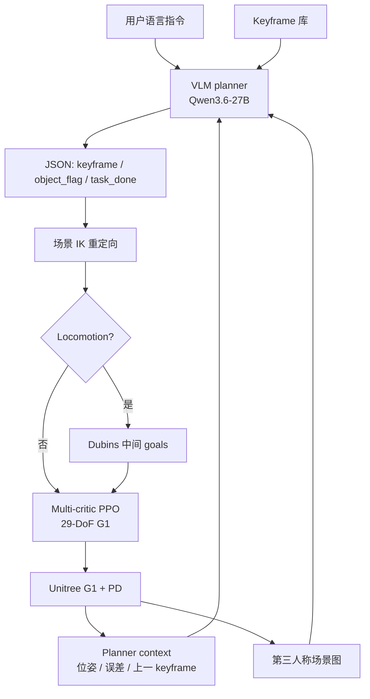

# KINO：关键帧接口连接 VLM 规划与人形全身控制

**KINO**（*A Keyframe Interface for VLM Planning and Whole-Body Control in Humanoid Loco-Manipulation*，[arXiv:2609.18869](https://arxiv.org/abs/2609.18869)，**苏黎世联邦理工学院（ETH Zürich）** Stelian Coros 组：Sitong Chen、Fatemeh Zargarbashi、Jin Cheng、Tianxu An）用 **motion keyframes** 作 **VLM 规划** 与 **RL whole-body control** 之间的中间表示：VLM 从预定义库选 successive keyframes，经 **场景重定向** 与可选 **路径中间 goals** 后，低层 **keyframe-conditioned multi-critic PPO** 输出 **Unitree G1** 29-DoF 关节目标。

## 一句话定义

**让人形 loco-manipulation 的高层语义走 VLM 选离散 whole-body keyframe，低层动力学走 saliency-aware RL 跟踪——中间接口是全身/物体目标姿态，不是 joint trajectory 或 end-to-end VLA 动作。**

## 英文缩写速查

| 缩写 | 英文全称 | 简要说明 |
|------|----------|----------|
| KINO | Keyframe Interface for VLM Planning and Whole-Body Control | 本文框架 |
| VLM | Vision-Language Model | 选 keyframe 序列的高层 planner（Qwen3.6-27B） |
| RL | Reinforcement Learning | 低层 keyframe-conditioned 全身策略（PPO） |
| WBC | Whole-Body Control | 协调 locomotion + manipulation 关节控制 |
| G1 | Unitree G1 | 论文真机平台（29-DoF 动作） |
| PPO | Proximal Policy Optimization | 低层策略优化算法 |
| IK | Inverse Kinematics | 场景重定向中的 damped least-squares IK |
| ROS | Robot Operating System | VLM / retargeter / controller 通信接口 |

## 为什么重要

- **分层可解释：** 相对端到端 VLA，keyframe 库 + 重定向使「VLM 规划错误」与「低层跟踪失败」可分开诊断；VLM 输出 constrained JSON 而非连续控制。
- **稀疏 VLM 输出可训：** **Saliency-based keyframe sampling** 把端到端成功率从 **44%** 提到 **92%**（uniform 1.5s 间隔 keyframe 基线）。
- **训练分布外泛化：** Placement grid 实验显示成功率可超出训练数据 red contour；locomotion 段用 **Dubins/圆弧** 中间 keyframes 连接 distant goals。
- **G1 真机闭环：** pickup / transport / placement；单手 bucket 与双手 box；VLM 可 **失败检测与重试**（Fig. 9）。
- **方法谱系：** 与 Coros 组 [RobotKeyframing](https://arxiv.org/abs/2407.11562)（dense+sparse reward 跟踪 keyframe）一脉；KINO 把 keyframe **来源** 换成 **VLM + 库检索**。

## 核心方法结构

| 模块 | 作用 |
|------|------|
| **Keyframe library** | 数据集代表性姿态 + 语义标签（approach / crouch / lift / carry / place 等） |
| **VLM planner** | 语言 + 第三人称视觉 + planner context → JSON 选下一 keyframe |
| **Retargeter** | 物体 frame 对齐 + 归一化坐标 IK → 适配当前物体位姿/尺寸 |
| **Path planner** | Locomotion keyframes 间插入 Dubins/圆弧中间 goals（曲率 ≤3 m⁻¹） |
| **Keyframe-conditioned policy** | Multi-critic PPO：DeepMimic tracking + keyframe goal + 正则 |
| **Closed-loop** | 机器人/物体 stationary 后才发下一 VLM 请求；失败可重发同一 keyframe |

### 流程总览



## 低层策略（归纳）

- **观测（actor，10 步历史）：** 本体速度/重力/关节态 + 物体局部位姿 + 上一动作 + keyframe goal \( \hat{p}_r, \hat{R}_r, \hat{q}_r, \hat{p}_o, \hat{Q}_o \)。
- **Critic 特权（3 步历史）：** reference motion、goal 相对误差 ΔK、剩余时间 τ。
- **奖励：** `r_track`（DeepMimic 根/关节/body/object 跟踪）+ `r_goal`（目标时刻 keyframe 到达）+ `r_reg`（力矩/动作率/滑移等）；**三组 value head** 减 reward interference。
- **动作：** \( a_t \in \mathbb{R}^{29} \) 目标关节角 → PD；训练含 domain randomisation（摩擦、质量、CoM、增益、延迟、推力等）。
- **参考数据：** 52 AMASS locomotion + 105 OmniRetarget 双手 box + 120 in-house 单手 bucket（含场景增强）。

### Saliency keyframe 采样（训练）

相对 **uniform 每 1.5s 采 keyframe**：
1. body 聚合加速度 \( \Gamma(t) \) 低通后取局部极大 → 候选；
2. 滤除左右腿周期性步态主导候选；
3. 与物体竖直加速度事件对齐（容差 δ）→ **语义阶段**（pick/place 等）过采样。

## VLM planner（归纳）

- **模型：** **Qwen3.6-27B**，单 **RTX 4090**；平均 keyframe 延迟 **<0.2s**，重定向 **~5ms**；经 **ROS service** 与 retargeter/controller 交互。
- **输出示例：**
  ```json
  { "keyframe": "crouch_to_pick_box", "object_to_manipulate": true, "task_complete": false }
  ```
- **Event-driven：** 仅当机器人/物体 stationary 且上一 goal 有足够执行时间后才 query VLM；失败时 VLM 可重发 recovery keyframe。

## 源码运行时序图

**不适用**（截至 2026-09-21）：arXiv 无 GitHub/项目页；官方实现未发布。待代码发布后应对齐 ROS service + PPO 部署入口补 `sequenceDiagram`。

## 主要结果

### 端到端消融（100 trials，VLM 选 keyframe）

| 采样策略 | Approach | Pick | Place | **End-to-end** |
|----------|----------|------|-------|----------------|
| Uniform 1.5s | 97% | 63% | 63% | **44%** |
| **Saliency（本文）** | 99% | **95%** | **93%** | **92%** |

### Goal-reaching error（Table II 摘要）

| 阶段 | Uniform root↓ | Saliency root↓ | 备注 |
|------|---------------|----------------|------|
| Approach | 0.125 m | **0.113 m** | — |
| Pick | 0.149 m | **0.119 m** | 物体误差 0.170→**0.043 m** |
| Place | 0.162 m | **0.067 m** | 物体误差 uniform 更优（reference keyframe 过近，policy 自行修正） |

- **Placement 泛化：** 目标 grid 上成功率可超出训练 red contour（成功判据：物体距目标 **<0.3 m**）。
- **真机：** G1 + 外部 mocap 物体相对位姿；box 双手 / bucket 单手均成功。

## 工程实践

| 项 | 内容 |
|----|------|
| **机构** | 苏黎世联邦理工（ETH Zürich） |
| **平台** | MuJoCo 仿真 + **Unitree G1** 真机 |
| **VLM** | Qwen3.6-27B @ 4090；第三人称 RGB 规划输入 |
| **感知依赖** | 真机物体 pose：**外部 motion capture**（非 onboard） |
| **中间层** | Keyframe 库需 **手工构建 + 语义标注** |
| **开源状态** | **未发布** — 见下节 |
| **复现邻接** | [RobotKeyframing](https://arxiv.org/abs/2407.11562) 低层 keyframe tracking；[OmniRetarget](https://arxiv.org/abs/2509.26633) 参考 motion 来源 |

## 局限与风险

### 开源状态（步骤 2.5，2026-09-21）

| 资源 | 状态 |
|------|------|
| arXiv / PDF | **已公开** |
| 项目页 | **无** |
| GitHub | **未发布** |

- **Keyframe 库 scalability：** 新任务需扩展库或自动 salient frame + VLM 标注（论文 future work）。
- **感知栈：** 规划依赖第三人称视觉 + mocap 物体位姿 — **in-the-wild** 需 egocentric RGB-D 等 onboard 感知替换。
- **VLM latency：** 虽 <0.2s/query，但 event-driven 闭环频率受 stationary 检测与 keyframe 执行时长约束。
- **任务族窄：** 主要为 box/bucket pick-transport-place；勿按通用 humanoid foundation policy 读。

## 与其他工作对比

| 对照 | 差异读法 |
|------|----------|
| **端到端 VLA loco-manip** | KINO 中间有可检查 keyframe；VLA 需大量 action-labelled 机器人数据 |
| [GPT-Policy](./paper-gpt-policy.md) | 同为 VLM 高层：GPT-Policy 发 tool request + IK/时序校验；KINO 限制在 **离散 keyframe 库** |
| [RobotKeyframing（ETH）](https://arxiv.org/abs/2407.11562) | 同组低层接口；KINO 换 **VLM 库检索** 为 keyframe 来源 |
| [ReKep](https://arxiv.org/abs/2409.01652) | relational keypoint 约束；聚焦 manipulation，非 dynamic whole-body humanoid |
| [FALCON](https://arxiv.org/abs/2512.04381) | VLM 协调 loco+manip **skills**；KINO 用 **whole-body pose keyframe** 作统一接口 |

## 结论

**KINO 证明 whole-body keyframe 是 VLM 语义规划与 RL WBC 之间的可行中间语言；92% 端到端成功率的关键是 saliency-aware 低层训练，而非仅换更大 VLM。**

1. **离散 keyframe 库** 把 VLM 约束在可 retarget 的结构化输出，避免 robot-specific VLA 数据税。
2. **44→92%** 几乎全部来自 **训练时 keyframe 分布** 对齐 VLM 稀疏输出 — uniform 采样不够。
3. **重定向 + Dubins 中间 goals** 是 OOD placement/locomotion 的工程必要件，不是可选后处理。
4. **Multi-critic PPO** 分离 tracking vs goal vs reg，适合 DeepMimic + 稀疏 keyframe goal 并存。
5. **失败恢复** 靠 VLM 读 planner context — 分层系统在真机可闭环 retry。
6. **部署前** 须规划 onboard 感知替换 mocap + 第三人称相机；代码截至入库日 **未发布**。

## 关联页面

- [Loco-manipulation](../tasks/loco-manipulation.md)
- [Whole-Body Control](../concepts/whole-body-control.md)
- [Unitree G1](./unitree-g1.md)
- [VLA](../methods/vla.md)
- [LLM 机器人控制接口](../concepts/llm-robotics-control-interfaces.md)
- [GPT-Policy](./paper-gpt-policy.md)

## 参考来源

- [kino_arxiv_2609_18869.md](../../sources/papers/kino_arxiv_2609_18869.md)
- [kino arXiv 核查归档](../../sources/sites/kino-arxiv.md)
- [wechat_senlanke_weekly_humanoid_quadruped_2026-09-14_18.md](../../sources/blogs/wechat_senlanke_weekly_humanoid_quadruped_2026-09-14_18.md)
- [arXiv:2609.18869](https://arxiv.org/abs/2609.18869)

## 推荐继续阅读

- [arXiv PDF](https://arxiv.org/pdf/2609.18869)
- [RobotKeyframing（Coros 组，CoRL 2025）](https://arxiv.org/abs/2407.11562)
- [OmniRetarget](https://arxiv.org/abs/2509.26633) — 参考 motion 与数据增强
- [ReKep](https://arxiv.org/abs/2409.01652) — keypoint 约束式 VLM 规划对照
