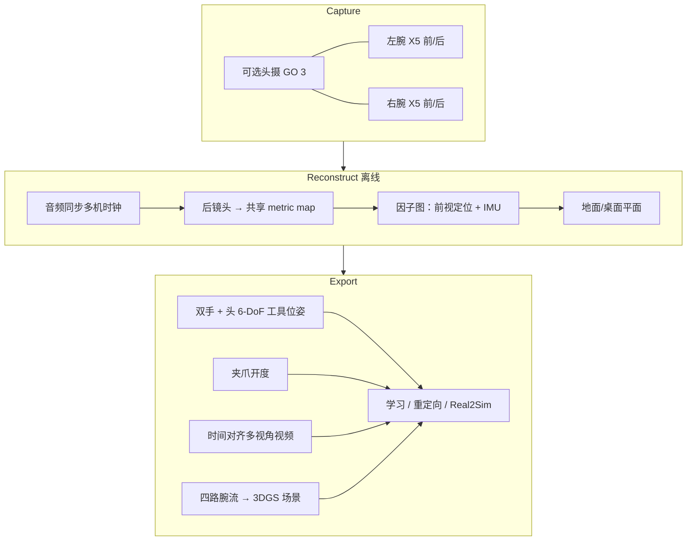

# KIWI（Kinematic Interface for the Wild）

**KIWI**（*Kinematic Interface for the Wild: Modular Bimanual Loco-Manipulation Capture from 360° Cameras Alone*，[arXiv:2609.22809](https://arxiv.org/abs/2609.22809)，[项目页](https://lingfeng.moe/KIWI/)）由 **Autel US** 提出：在 **工具端不携带额外算力** 的前提下，用 **消费级 360° 相机** 完成 **双臂 loco-manipulation 示教** 的 **全状态估计与场景重建**。核心是把 **定位** 与 **录操作** 拆到 Insta360 X5 **后/前双 fisheye**：后镜头从 demo 自身建 **房间级共享 metric map** 注册双手（与可选头摄）；前镜头录 manipulation；**离线因子图** 融合 IMU 与双镜头定位，并用 **音频同步**、**地面平面** 与 **夹爪开度视觉读取** 补齐学习所需字段。

## 一句话定义

**纯相机、无 VR/无 LiDAR 的双臂 UMI 升级版**：一次录制 → 双手 6-DoF + 3DGS 场景，面向野外与 room-scale 任务。

## 英文缩写速查

| 缩写 | 英文全称 | 简要说明 |
|------|----------|----------|
| KIWI | Kinematic Interface for the Wild | 本文采数套件与管线名 |
| UMI | Universal Manipulation Interface | 无机器人手持示教范式（Stanford 等） |
| 3DGS | 3D Gaussian Splatting | 高斯溅射场景表示，便于 real-to-sim |
| SLAM | Simultaneous Localization and Mapping | 本文采用离线优化式视觉–惯性定位 |
| IMU | Inertial Measurement Unit | X5 内置惯性，用于 bridging 前视丢失 |
| 6-DoF | Six Degrees of Freedom | 工具在 SE(3) 中的位姿 |

## 为什么重要

- **UMI 痛点对症：** 经典 UMI 靠 **工作区朝向** 的腕部相机 **在线 SLAM**，手与物体遮挡时易丢轨迹（exUMI 报告 vanilla UMI **<60%** 录制可处理）；KIWI 用 **后镜头 room map** 把双手锁进 **同一坐标系**，六条录制 query 帧仅 **0.1%** 无法定位（对照：仅前视跨手 **24.8%** 且无视觉支撑，且 **丢整条**）。
- **Real-to-sim 数据闭包：** 除轨迹外，**四路腕部视频** 可重建 **3DGS**，与 [Lucida](./paper-lucida-r2s.md) / LEGS 类管线同向——策略训练可同时消费 **几何场景 + 对齐动作**。
- **模块化部署：** 改版 **Arca-Swiss** 快装让 **同一标定相机模块** 在 **筷子夹爪 / 平行爪 / 腕带 / Franka·YAM·OpenArm 法兰** 间切换，降低「采数工具 ≠ 机器人末端」的标定摩擦。
- **与 HiFi-UMI / HandUMI 分工：** [HiFi-UMI](./paper-hifi-umi.md) 押 **毫米级 + 大规模数据引擎**；[HandUMI](./handumi.md) 押 **开源打印件 + 重定向**；KIWI 押 **360° 分割定位/操作 + 无额外电子 + 房间尺度**。

## 核心信息

| 项 | 内容 |
|----|------|
| **机构** | Autel US |
| **传感器** | Insta360 X5（双手腕）+ 可选 GO 3（头摄） |
| **定位误差** | 相对评测 fiducial **中位 ~4.5 mm** |
| **失败率** | 共享后视 map：**0.1%** query 帧无定位 |
| **开源（2026-09-28）** | 项目页 **Code coming soon**；论文承诺 **fully open-source** → **待发布** |

## 流程总览

## 与代表性 UMI 族对照（论文 Table 1 归纳）

| 维度 | KIWI | UMI | UMI-3D | iPhUMI | FastUMI |
|------|------|-----|--------|--------|---------|
| 额外机载算力 | **无** | 无 | LiDAR+相机 | 手机在线 AR | T265 等 |
| 腕部 6-DoF | **离线** map | 在线 SLAM | 在线 LiDAR | 在线 ARKit | 在线 T265 |
| 双手互注册 | **共享后视 map** | 共视特征 | N/A | ARKit | NR |
| 场景覆盖 | **360° 腕 + ego** | ~155° + 镜 | LiDAR+185° | 头+腕 | ~169° |
| 地面/高度 | **✓** | NR | NR | NR | NR |
| 开源设计 | **计划 ✓** | ✓ | ✓ | ✓ | ✓ |

## 工程实践（截至代码发布前）

| 步骤 | 说明 |
|------|------|
| 硬件 | 2× X5 + 打印件快装；筷子夹爪已展示，平行爪/腕带页标 **Soon** |
| 标定 | 每机 **一次** 标定：双 fisheye 内参、相机–IMU 外参与时延、Allan 噪声、音视频延迟 |
| 采集 | 无穿戴 VR、无基站；仅相机本地存储 |
| 复现 | **等待** 官网开源 HW/SW；入库日无 GitHub |
| 下游 | 工具轨迹 → IK /  replay；3DGS → sim 资产（动态 real-to-sim 页称 **foundation models 进展中**） |

## 源码运行时序图

**不适用**（截至 2026-09-28 项目页 **Code coming soon**，无可运行官方仓库；论文仅承诺后续在网站 **fully open-source**）。

## 局限与风险

- **离线管线延迟：** 相对 VR/在线 T265，**不能边录边给机器人反馈**；适合 **数据集** 而非实时 teleop。
- **消费相机依赖：** 固件、编解码与 IMU 标定质量绑定 Insta360 产品；换型号需重做标定链。
- **动态场景：** 项目页强调当前重建为 **静态场景**；可动对象/人的一致性仍依赖后续算法（页内欢迎贡献）。
- **开源空窗：** 在 HW/SW 发布前，**无法独立复现** 数字与 3DGS 导出，只能引用论文/项目页指标。

## 结论

KIWI 把 **UMI 式无机器人示教** 推到 **room-scale 双臂 + 3DGS**，关键杠杆是 **360° 后镜头共享 map**，而不是给工具加 tracker。

- 若你的瓶颈是 **UMI 在线 SLAM 在遮挡下丢轨迹**，优先评估 **后视建图 + 离线融合** 路线（0.1% vs 24.8% 失败帧）。
- **4.5 mm 级** 中位误差足以作 **操纵策略的 EE 监督**，但仍需自有场景做 **fiducial 或 replay** 回归。
- **Real-to-sim** 读者应把 **四路腕流 3DGS** 与 **对齐 gripper 轨迹** 当作 **同一 episode 产物**，避免「先扫场景再采 demo」双倍成本。
- 与 [HiFi-UMI](./paper-hifi-umi.md) 比：KIWI **不追求 6 视角微秒 GPIO**，而追求 **零额外电子 + 360 覆盖 + 地面参考**。
- **部署前** 确认官网是否已发布 **打印件 + 重建代码**；在 **Coming soon** 阶段仅宜 **论文级选型**，不宜写死复现 SOP。
- 机器人侧已展示 **Franka / YAM / OpenArm** 法兰适配；换平台只需 **新法兰 + 相机–尖端外参**，但需复用 **同一相机模块标定**。

## 关联页面

- [演示数据收集指南](../queries/demo-data-collection-guide.md) — IL 采数硬件选型
- [灵巧操作数据采集指南](../queries/dexterous-data-collection-guide.md) — 多模态/双手示教
- [人形训练数据管线](../queries/humanoid-training-data-pipeline.md) — 示教→训练闭环
- [HandUMI](./handumi.md) — 开源 UMI 硬件与重定向
- [HiFi-UMI](./paper-hifi-umi.md) — 高保真 UMI 与 2k 小时数据
- [Motion Retargeting Pipeline](../concepts/motion-retargeting-pipeline.md) — 人体/工具轨迹→机器人

## 推荐继续阅读

- 项目页：<https://lingfeng.moe/KIWI/>
- 论文：<https://arxiv.org/abs/2609.22809>

## 参考来源

- [KIWI 论文摘录（arXiv:2609.22809）](../../sources/papers/kiwi_arxiv_2609_22809.md)
- [KIWI 项目页归档](../../sources/sites/lingfeng-moe-kiwi.md)
