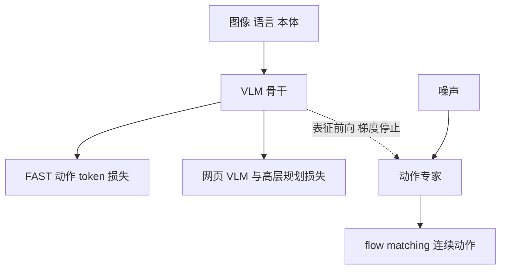

# Knowledge Insulation：隔离动作专家梯度

**Knowledge Insulation**（*Knowledge Insulating Vision-Language-Action Models: Train Fast, Run Fast, Generalize Better*，[arXiv:2505.23705](https://arxiv.org/abs/2505.23705)，[项目页](https://www.pi.website/research/knowledge_insulation)）由 **物理智能（Physical Intelligence）** 提出。它形式化 π₀.₅ 已经在用的训练方式，并给出单阶段配方：骨干学离散动作与网页知识，动作专家学连续控制，两边的梯度分开。

## 一句话定义

> **VLM 用离散动作 token 学会「和电机对话」，连续动作头的梯度不准改写这份预训练知识。**

## 英文缩写速查

| 缩写 | 英文全称 | 简要说明 |
|------|----------|----------|
| KI | Knowledge Insulation | 切断动作专家到 VLM 的梯度 |
| FAST | Frequency-space Action Sequence Tokenization | 骨干侧的离散动作目标 |
| FM | Flow Matching | 推理时动作专家的连续输出 |

## 为什么重要

第二代 VLA 用动作专家换来精细连续动作，但专家梯度会拖慢训练并削弱语言跟随。只冻结骨干又让视觉语言表征不适合控制。KI 试图同时留下三件事：FAST 那种训练速度、π₀ 那种推理速度、预训练 VLM 的语义泛化。后续 π₀.₆ / π₀.₇ 的模型卡也沿用「骨干预测 FAST、专家预测连续动作、梯度不回传」这一结构。

## 核心原理

推理时只走动作专家，离散 token 丢弃。博客强调：单独 stop-gradient 不够，因为骨干不再从机器人数据收到学习信号；FAST token 用来把控制表征写进骨干，又比连续损失更少破坏语言预训练。再加上 π₀.₅ 的数据混合物（网页视觉语言与高层机器人命令），语义泛化才一起回来。

## 评测

项目页把 π₀.₅+KI 对上联合训练、冻结骨干、π₀ 与 π₀-FAST。作者报告：衬衫折叠上冻结骨干不可用；通才 bussing 的训练步数约为 π₀ 的 1/7.5，推理仍由动作专家完成；单本体 bussing 上 π₀-FAST 完成时间约为 KI 的两倍。移动操作的物体泛化实验里，网页数据对分布外抓取帮助最大，没有网页数据时 stop-gradient 仍然有用。显著性标注以论文图为准。

## 结论

**要连续动作又要保住语言跟随，就把控制表征的学习信号放在离散 token 上，不要让未初始化的动作专家反向改写 VLM。**

- 推理路径与 π₀ 相同，是 flow matching，不是自回归 FAST
- 冻结整个骨干不是 KI 的替代品
- openpi 里的 π₀.₅ 权重来自 KI 预训练，微调脚本并没有实现 KI
- 和 [FAST 论文](./paper-rcl-2501-09747-fast-efficient-action-tokenization-for-vision-la.md) 的差别是：FAST token 在这里是训练目标，不是部署时的动作接口

## 源码运行时序图

**不适用**（KI 训练环）。openpi 可加载 KI 预训练的 π₀.₅ 并做 flow matching 推理与微调；[openpi#649](https://github.com/Physical-Intelligence/openpi/issues/649) 写明微调目前不会用 FAST 目标去更新骨干，动作专家梯度会进入 VLM。要复现本文的训练，不能直接跑仓库里的 `train.py`。

## 局限与风险

- 「训练快 7.5 倍」是相对 π₀ 的 bussing 曲线，不是所有任务的墙钟时间。
- 微调阶段作者自己也说，只冻骨干、不给 FAST 目标，效果往往更差；openpi 又还没提供这条微调路径。
- 语言跟随失败的例子（抓垃圾而不是按指令放勺子）是机制说明，不是统一基准分。

## 关联页面

- [π₀ 策略](../methods/π0-policy.md)
- [π₀.₅](./paper-pi05-open-world-vla.md)
- [FAST](./paper-rcl-2501-09747-fast-efficient-action-tokenization-for-vision-la.md)
- [VLA](../methods/vla.md)

## 参考来源

- [knowledge_insulation_arxiv_2505_23705](../../sources/papers/knowledge_insulation_arxiv_2505_23705.md)
- [PI 官网技术文章索引](../../sources/sites/pi-website-technical-articles.md)

## 推荐继续阅读

- [arXiv:2505.23705](https://arxiv.org/abs/2505.23705)
- [项目页](https://www.pi.website/research/knowledge_insulation)
