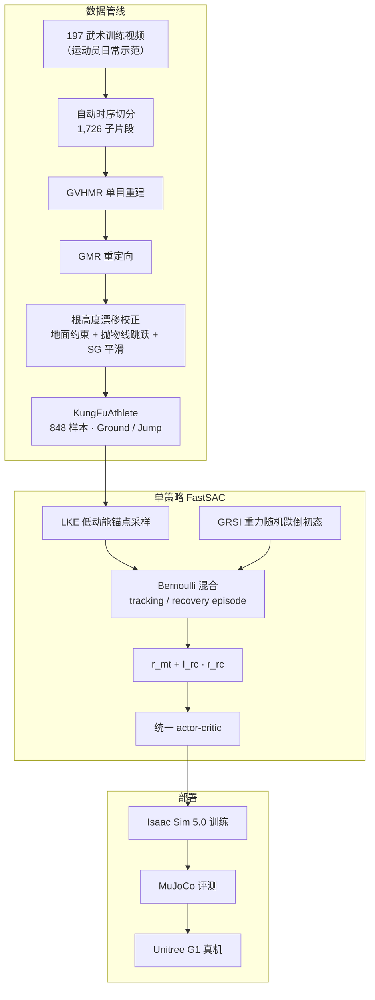

# KungFuAthleteBot（KungFuAthlete Dataset + Fall-Resilient Tracking）

**KungFuAthleteBot**（*A Kung Fu Athlete Bot That Can Do It All Day: Highly Dynamic, Balance-Challenging Motion Dataset and Autonomous Fall-Resilient Tracking*，arXiv:[2602.13656](https://arxiv.org/abs/2602.13656)，[项目页](https://kungfuathletebot.github.io/)，[GitHub](https://github.com/NPCLEI/KungFuAthleteBot)）由 **北京理工大学** 与 **启元实验室** 提出：从专业武术运动员日常训练视频构建 **KungFuAthlete** 高动态参考库，并训练 **单一 FastSAC 策略** 同时完成 **高动态 motion tracking** 与 **自主跌倒恢复**，把能力从「纯跟踪」扩展到 **recovery-enabled execution**。

## 一句话定义

KungFuAthleteBot 用国家级运动员视频经 GVHMR+GMR 构建 Jump/Ground 双档高动态武术数据集，以根高度抛物线校正清洗 noisy 参考，再用 FastSAC 单策略混合 tracking/recovery 奖励与 GRSI 跌倒初态采样，在 Unitree G1 上实现抗扰、可自主站回参考轨迹的长时程武术跟踪。

## 英文缩写速查

| 缩写 | 英文全称 | 简要说明 |
|------|----------|----------|
| GVHMR | Gravity-View Human Motion Recovery | 单目视频人体网格恢复（本文数据重建入口） |
| GMR | General Motion Retargeting | 人体运动重定向到人形关节参考 |
| GRSI | Gravity-based Randomized State Initialization | 零力矩重力释放采样多样跌倒初态 |
| LKE | Low Kinetic Energy Sampling | 参考轨迹低动能锚点 episode 初始化 |
| WBT | Whole-Body Tracking | 全身关节/根轨迹跟踪类 RL 任务 |
| FastSAC | Fast Soft Actor-Critic | 本文采用的 off-policy 并行 RL 算法 |
| CoM | Center of Mass | 质心；奖励中用于支撑足对齐 |
| G1 | Unitree G1 Humanoid | 论文真机平台（29 DoF，约 1.3 m） |
| RL | Reinforcement Learning | 策略学习范式；混合 tracking/recovery 目标 |

## 为什么重要

- **填补高动态数据空白：** Jump 子集关节/线/角速度统计 **显著高于** LAFAN1、PHUMA、AMASS——适合在 **硬件与算法边界** 压测 humanoid WBT，而非仅日常 locomotion。
- **unsafe 态统一建模：** 多数 tracking 假设全程安全；本文用 **单策略** 联合 $r_{\mathrm{mt}}$ 与条件 $r_{\mathrm{rc}}$，配合 GRSI，无需独立参考起身片段即可从任意跌倒态回到参考 motion。
- **视频→机器人工程管线可复用：** 针对 GVHMR 常见 **根高度漂移** 的分段地面约束 + **抛物线跳跃重建** + SG 平滑，对 monocular 大规模参考库清洗有直接借鉴价值。
- **与 KungfuBot 谱系互补：** 同域武术高动态 tracking，但强调 **运动员级数据集统计** + **tracking∪recovery** 训练范式（对照 [KungfuBot](./paper-notebook-kungfubot-physics-based-humanoid-whole-body-cont.md)、[KungfuBot 2](./paper-notebook-kungfubot-2.md)）。

## 核心信息

| 字段 | 内容 |
|------|------|
| 机构 | 北京理工大学（BIT）；启元实验室（QIYUAN Lab） |
| 平台 | Unitree G1（29 DoF）；Isaac Sim 5.0 训练，MuJoCo 评测 |
| 数据规模 | 197 视频 → 1,726 子片段 → **848** 最终样本 |
| 子集 | **Ground**（非跳跃，~84% 日常训练）；**Jump**（空翻、旋子等） |
| 项目状态 | Ground 子集 largely ready；Jump 与完整模型 **active development** |
| 论文/项目 | <https://kungfuathletebot.github.io/> |
| 代码 | <https://github.com/NPCLEI/KungFuAthleteBot> |

## 流程总览

## 核心机制（归纳）

### 1）KungFuAthlete 数据集

| 类别 | 数量 | 示例子类 |
|------|------|----------|
| Daily Training | 715 | — |
| Fist | 53 | 长拳 33、太极拳 14、南拳 6 |
| Staff | 30 | 棍术 |
| Skills | 28 | 后空翻 12、旋子 9 |
| Saber / Sword | 15 / 7 | 南刀、太极剑 |

**动力学对照（论文 Table 1）：** Jump 子集 body ang. vel. **0.180** vs AMASS **0.009**、LAFAN1 **0.011**；Ground 子集仍高于自然 motion 库，体现 **地面发力、快旋、器械** 的非平稳性。

### 2）根高度漂移校正

- 支撑相：$ \hat{p}_t^{(z)} = p_t^{(z)} - z_{\min}(\mathbf{q}_t) $ 强制最低体点贴地。
- 非锚点帧：速度阈值传播，抑制 GVHMR 垂直抖动。
- 跳跃段：take-off/landing 极值间 **抛物线** 重建 airborne 根轨迹。
- 后处理：Savitzky–Golay 滤波（窗口 ~T/10）保 apex 与接触相。

### 3）单策略 tracking + recovery

- **混合目标（Eq. 14）：** 以概率 $p$ 从参考低动能态做 tracking，$1-p$ 从 $\mathcal{D}_{\mathrm{GRSI}}$ 跌倒态做 recovery；recovery 奖励由肩高偏差指示 $\mathbb{I}_{\mathrm{rc}}$ 门控。
- **LKE 采样：** 在参考动能局部极小初始化，失败归因最近前锚增权——避免 BeyondMimic 式失败驱动采样在 **腾空不可恢复相** 的死循环。
- **GRSI：** 零力矩重力释放 + 随机摩擦 + 姿态旋转重组，扩覆盖跌倒初态。
- **$r_{\mathrm{mt}}$：** BeyondMimic 式相对体位/朝向/角速度 + HuB 式 CoM–支撑足 + 强 **feet slip**（接触力 >8 时罚脚滑）+ 膝/踝 action rate。
- **$r_{\mathrm{rc}}$：** 站起前罚肩高偏差、水平根移、动作突变——鼓励 **原地** 平滑恢复。
- **终止：** recovery 模式允许连续 bad tracking 达阈值才终止，给恢复留窗口。

### 4）仿真消融要点（1307 帧高难度序列）

| Method | Succ. (6 trials) |
|--------|------------------|
| BeyondMimic 基线 | **0/6** |
| + recovery task | **6/6** |
| + feet slip (w=5) | 6/6，$E_{\mathrm{mpboe}}$ 进一步下降 |

加 recovery 目标后，无扰 **单腿站** 场景 BeyondMimic 基线从全败变为可完成；feet slip + CoM + 膝踝 rate 改善交叉步 **抬脚质量**。

## 常见误区

1. **Jump 子集 ≠ 全部可用：** 项目页注明 Jump 因视频源仍有 minor imperfections，训练表现可能波动——应 **先试用 Ground 子集**。
2. **不是纯数据集论文：** 核心贡献含 **校正算法 + 单策略 training paradigm**；仅下载数据而不做 GRSI/LKE 混合训练无法复现 recovery 能力。
3. **与 KungfuBot 不同代：** KungfuBot 系列偏 physics-based tracking + curriculum；本文强调 **运动员视频统计上界** 与 **tracking∪recovery 统一 RL 目标**。
4. **recovery ≠ SafeFall 保护摔：** 本文目标是 **回到参考 motion**；[SafeFall](./paper-hrl-stack-41-safefall.md) 侧重 **损伤缓解** 双策略切换——问题设定不同。

## 实验与评测

- **仿真：** Isaac Sim 5.0 训练，MuJoCo 评测；Succ. / $E_{\mathrm{mpboe}}$ / Smooth（action rate）；FastSAC + FastSAC 域随机化。
- **真机：** Unitree G1；项目页含抗 torso 拉力、单脚支撑恢复、快速恢复等演示（详见论文 §5 与 [项目页](https://kungfuathletebot.github.io/)）。
- **量化以原文为准：** 本页为 ingest 编译摘要；完整 benchmark 与长时程（如连续太极）指标见 PDF / 项目页更新。

## 与其他页面的关系

- **数据集选型：** [humanoid-reference-motion-datasets](../comparisons/humanoid-reference-motion-datasets.md) — Jump 子集动力学上界对照
- **平衡恢复任务：** [balance-recovery](../tasks/balance-recovery.md) — 单策略 tracking+recovery 案例
- **重定向与清洗：** [motion-retargeting](../concepts/motion-retargeting.md) — GVHMR/GMR + 根高度校正
- **武术 tracking 姊妹：** [KungfuBot](./paper-notebook-kungfubot-physics-based-humanoid-whole-body-cont.md)、[KungfuBot 2](./paper-notebook-kungfubot-2.md)
- **跌倒安全对照：** [SafeFall](./paper-hrl-stack-41-safefall.md)、[HoST](./paper-host-humanoid-standingup.md)
- **预重定向 locomotion 库：** [PHUMA](./dataset-bfm-phuma.md) — 物理可信 G1 轨迹，动力学低于 KungFuAthlete Jump

## 参考来源

- [kung_fu_athlete_bot.md](../../sources/papers/kung_fu_athlete_bot.md) — 论文 / 项目页 / arXiv 编译摘录
- [kungfuathletebot.md](../../sources/repos/kungfuathletebot.md) — GitHub 仓库归档

## 推荐继续阅读

- 论文 PDF：<https://arxiv.org/pdf/2602.13656>
- 项目页与数据集说明：<https://kungfuathletebot.github.io/>
- 代码仓库：<https://github.com/NPCLEI/KungFuAthleteBot>
- 视频素材授权说明：谢远航 Bilibili 公开示范（广西武术队，中国武术六段）
