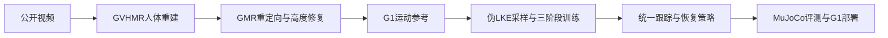
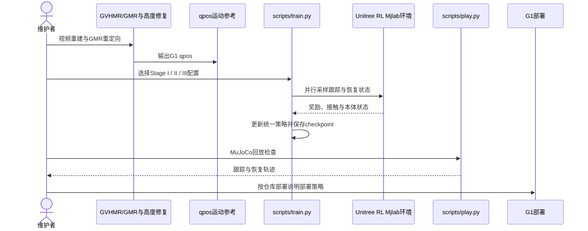

# KungfuAthleteBot：视频高动态动作学习与统一恢复

**KungfuAthleteBot（KAB）** 将武术公开视频变为人形机器人可学习的高动态运动，并用同一策略处理跟踪、扰动拒绝和跌倒恢复。

## 英文缩写速查

| 缩写 | 英文全称 | 简要说明 |
|------|----------|----------|
| KAB | KungfuAthleteBot | 从视频学武术高动态动作并统一恢复的框架 |
| LKE | Low-Kinetic-Energy | 以低动能状态作为训练初始化锚点 |
| GRSI | Gravity-based Randomized State Initialization | 用重力释放和随机姿态扩充跌倒状态 |
| G1 | Unitree G1 humanoid robot | 论文评测的 29 自由度人形机器人 |

## 为什么重要

武术视频比受控动捕容易获得，但单目重建的运动可能漂浮、穿地或抖动，且没有驱动力信息。直接把重定向结果当作机器人可执行轨迹，容易把策略初始化在动力学不可能状态。KAB 的价值不只是加大动作库，而是同时处理数据物理一致性、可学习初始化与跌倒后的任务连续性。

## 方法栈：从视频到统一策略

### 1. 运动重建与参考修复

197 段视频经时序切分得到 1,726 个子片段，再经 GVHMR 重建人体运动、GMR 重定向至 G1。对腾空段使用物理引导的抛物线根轨迹修正，修复根节点高度漂移；并处理着地穿透、高频噪声及关节抖动。该步骤仍涉及歧义局部极小值的人工标注，当前不是端到端视频到控制。

### 2. 伪低动能采样和三阶段课程

视频只给运动学，不给接触力、扭矩等动作可行性信息。误差驱动采样可能持续从不可能的腾空状态重新开始。伪 LKE 采样偏向动力学可行的低动能状态，让策略从可恢复处探索可行执行；三阶段课程逐步扩展跟踪与稳定要求。

### 3. 跟踪、抗扰与恢复合一

单一策略学习跟踪目标运动、抵抗外扰，并在任意跌倒姿态恢复后接续目标动作。GRSI 扩展训练跌倒状态；恢复不需要单独的人类起身参考数据，也不需运行时手动切换恢复模式。应区分「回到参考动作」与只优化防护/吸收冲击的跌倒安全策略。

```mermaid
flowchart LR
  V[公开视频] --> H[GVHMR人体重建]
  H --> R[GMR重定向与高度修复]
  R --> D[G1运动参考]
  D --> L[伪LKE采样与三阶段训练]
  L --> P[统一跟踪与恢复策略]
  P --> E[MuJoCo评测与G1部署]
```

## 工程实践：代码、数据与部署

官方仓库当前含 retarget/height-adjustment 脚本、Unitree RL Mjlab 训练代码、训练配置、1307 长时程恢复 checkpoint 和回放/部署说明。README 提供 `scripts/train.py` 的 Stage I–III 入口与 `scripts/play.py` 的 MuJoCo 回放，并接 Unitree RL Mjlab 部署路径。不要据此声称任一预训练权重都对应新论文所有实验。

```mermaid
sequenceDiagram
  actor U as 维护者
  participant D as GVHMR/GMR与高度修复
  participant Q as qpos运动参考
  participant T as scripts/train.py
  participant E as Unitree RL Mjlab环境
  participant P as scripts/play.py
  participant G as G1部署
  U->>D: 视频重建与GMR重定向
  D->>Q: 输出G1 qpos
  U->>T: 选择Stage I / II / III配置
  T->>E: 并行采样跟踪与恢复状态
  E-->>T: 奖励、接触与本体状态
  T->>T: 更新统一策略并保存checkpoint
  U->>P: MuJoCo回放检查
  P-->>U: 跟踪与恢复轨迹
  U->>G: 按仓库部署说明部署策略
```

## 实验与评测

- **任务与硬件：** Unitree G1 真机；长程例 Motion 1307 为约 5 分钟太极动作。
- **主要结果：** 论文在真实 G1 上展示从多类跌倒姿态起身并回到参考动作，报告恢复约 0.7 秒；此为论文测试条件下数字，不构成通用安全保证。
- **消融解读：** 去掉恢复奖励会失去起身能力；仅扩大随机跌倒状态而不联合训练与终止容忍度不足以学会「起身后继续跟踪」。完整方法收敛更慢，约 16k 对跟踪基线约 2.5k 迭代，表明鲁棒性有训练成本。
- **数据规模：** 新论文附录 C 与 Hugging Face 卡片为 992 条（Ground 822 / Jump 170）。项目页及仓库 README 上部仍保留 848 旧版描述，附录 E 又称释放的是 848 screened samples；两个版本的样本数应保留来源口径，不混写。

## 与其他工作对比

- **纯动作跟踪：** 高动态跟踪能覆盖动作执行，却未必能在扰动/摔倒后恢复；KAB 将 tracking 与 recovery 放到单一训练目标。
- **需要恢复参考的方法：** KAB 论文声称不需要恢复示范；相较依赖重定向起身动作的策略，数据需求更低，但并不意味着完全不需人类视频标注。
- **前序版本：** 本节点此前记录 arXiv:2602.13656《A Kung Fu Athlete Bot That Can Do It All Day》。本次以 arXiv:2610.03388 为主，保留旧来源用于版本沿革；此前的 FastSAC 对比数字不直接当作新版论文主结果。
- **数据许可：** 论文称完整 artifact 将在接收后按 MIT 发布，HF 当前卡标记 Apache-2.0；以实际下载资产和许可文件为准。运动员原视频不公开。

## 结论

**核心不是直接模仿更激烈的视频动作，而是先修复物理不一致参考、从可行状态学习，并把跌倒恢复纳入同一控制目标。**

1. **先修数据再调控制** — 腾空抛物线与着地修复针对视频运动重建的具体误差，不等于完整动力学辨识。
2. **LKE 是关键训练约束** — 它阻止 error-driven sampling 一直从不可执行的空中姿态启动。
3. **统一策略减少切换边界** — 跌倒后可以回到被跟踪的参考，而不依赖运行时人工切换控制器。
4. **看清训练成本** — 统一跟踪/恢复提高任务覆盖，但论文消融显示收敛较慢。
5. **先核对数据版本与许可** — HF 当前卡为 992 条，部分官网文案和论文附录 E 仍写 848；许可元数据也需按资产确认。

## 局限与风险

- 新论文写明高度修正仍依赖对歧义局部极小的人工标注，未实现端到端视频到可执行策略。
- Jump 样本存在源视频噪声；官方仓库提醒未经仿真验证不要直接真机训练或部署。
- 原始视频含可识别个人影像，不随衍生运动数据分发。
- 约 0.7 秒恢复时间来自指定硬件和论文协议，不能替代安全验证。
- 公开仓库文档对样本规模有旧版 848 与当前 992 两种口径；HF license 与论文未来授权表述不同。

## 关联页面

- [平衡与恢复](../tasks/balance-recovery.md) — 统一恢复案例；已有回链至本实体。
- [动作重定向](../concepts/motion-retargeting.md) — GVHMR/GMR 到人形参考运动。
- [Sim2Real](../concepts/sim2real.md) — 仿真训练与真机验证边界。
- [PHUMA](./dataset-bfm-phuma.md) — 人形参考运动数据对照。

## 参考来源

- [新论文来源](../../sources/papers/kungfuathletebot_arxiv_2610_03388.md)
- [项目页归档](../../sources/sites/kungfuathletebot.md)
- [代码仓库归档](../../sources/repos/kungfuathletebot.md)
- [Hugging Face 数据卡归档](../../sources/datasets/kungfuathletebot-hf.md)
- [前序论文归档](../../sources/papers/kung_fu_athlete_bot.md)

## 推荐继续阅读

- [arXiv:2610.03388](https://arxiv.org/abs/2610.03388)
- [KungfuAthleteBot 项目页](https://kungfuathletebot.github.io/)
- [官方代码](https://github.com/NPCLEI/KungFuAthleteBot)
- [Hugging Face 数据集](https://huggingface.co/datasets/LuluCao/KungfuAthleteBot)
