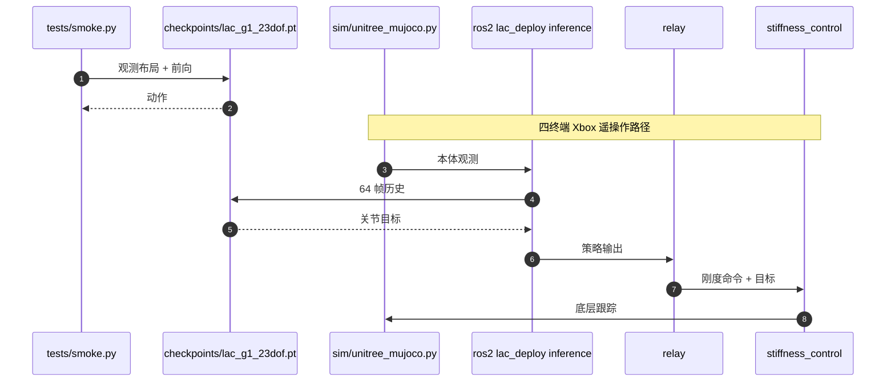

# LAC：人形全身线角柔顺

**LAC**（*Linear and Angular Compliance for Humanoid Whole-body Control*，[arXiv:2608.25405](https://arxiv.org/abs/2608.25405)，[项目页](https://lac-humanoid.github.io/)）由 **日本东北大学 Neuro-Robotics** Yang Liu、Zhongkai Gu、Wei Zhu、Mitsuhiro Hayashibe 提出：一个策略同时执行上身**线刚度与角刚度**命令，角通道用被动运动链虚拟力矩，而不是把肢体当自由刚体。

## 一句话定义

**拧把手要软转、托箱子要硬转：LAC 把左右臂的 \(K_L, K_\theta\) 和躯干线刚度写成五维命令，用导纳增强轨迹 + RMA teacher–student 让 G1 真机能单调调这两条通道。**

## 英文缩写速查

| 缩写 | 英文全称 | 简要说明 |
|------|----------|----------|
| LAC | Linear and Angular Compliance | 本文：同时命令线刚度与角刚度 |
| RMA | Rapid Motor Adaptation | Teacher 看特权扳手，Student 用历史估计 |
| IK | Inverse Kinematics | mink + MuJoCo 解全身姿态 |
| DoF | Degrees of Freedom | 真机 G1 部署 23 自由度 |
| PD | Proportional–Derivative | 关节刚度把扳手映成被动 Δq |
| OMOMO | Object Motion Manipulation mocap | 与 Inter-X 一起构成增强数据源 |

## 为什么重要

- **线柔顺已经有人做，角通道缺实验证据：** [GentleHumanoid](./paper-gentlehumanoid.md) / CHIP / SoftMimic 主要管线刚度；拧腕、托物掉落靠的是 **角刚度**。
- **命令可独立：** 五维 \((K_L, K_\theta)\) 左右臂 + 躯干仅线刚度；仿真里升线刚度降 CoM 位移、姿态几乎不变，升角刚度降姿态变化。
- **真机数字可读：** 拧腕 \(10\to 100\,\mathrm{N\cdot m/rad}\) 对应约 **84°→15°**；4 kg 托物低角刚度掉落、高角刚度稳住。

## 核心信息

| 项 | 内容 |
|----|------|
| **机构** | 日本东北大学（Tohoku University）Neuro-Robotics Laboratory |
| **平台** | Unitree G1，部署 23-DoF |
| **数据** | OMOMO + Inter-X 接触增强：**378,051** 条 / ~**1,050 h** |
| **训练** | Isaac Lab 四卡 × 8192 env；RMA teacher–student |
| **开源** | **部分开源**（MIT）：[lac-humanoid/lac-code](https://github.com/lac-humanoid/lac-code) 含 checkpoint / MuJoCo sim2sim / ROS 2；**无 Isaac Lab 训练与数据增强脚本** |

## 核心原理（方法）

接触帧来自重定向的 OMOMO / Inter-X。力事件沿接触法向采样，力偶独立采样。角通道：关节 PD 刚度把扳手映成 \(\Delta q\)，FK 得被动转角，再换成虚拟力矩驱动角导纳——**不是自由刚体的 \(\tau = K_\theta \Delta\theta\)**。mink + MuJoCo 解全身 IK，得到增强轨迹再给 RL 跟踪。

Teacher 特权编码器看外扳手与残差；部署只留 64 帧本体历史估计器（[特权训练](../concepts/privileged-training.md) / RMA 两阶段）。

## 源码运行时序图

最短路径：`python tests/smoke.py` 验证 ckpt；真机/sim2sim 再起 MuJoCo + 三个 ROS 2 节点。**不要指望这个仓能复现 Isaac Lab 四卡训练。**

## 工程实践

| 项 | 说明 |
|----|------|
| 开源边界 | 推理权重 52 MB、100 条 OMOMO 上身姿态、ROS 2 节点已放；训练管线待发布 |
| 项目页 | <https://lac-humanoid.github.io/> 含 in-browser demo |
| `sim/` 许可 | vendored `unitree_mujoco` 为 BSD-3-Clause，其余 MIT |
| 对照 | 线柔顺跟踪看 GentleHumanoid；接触力限幅看 CHIP；全身力控 loco-manip 看 [FALCON](./paper-loco-manip-161-109-falcon.md) |

## 实验与评测

- **仿真单调性：** 线刚度升 → CoM 位移降、姿态几乎不变；角刚度升 → 姿态变化降。
- **真机拧腕：** \(10\to 100\,\mathrm{N\cdot m/rad}\) ≈ **84°→15°**。
- **4 kg 托物：** 低角刚度掉落，高角刚度稳住。
- **对照 SoftMimic / GentleHumanoid / FALCON：** 作者报告仅 LAC 在手 / 肘 / 躯干三场景位移都随刚度单调。

## 结论

**LAC 的可迁移主张是「角刚度必须能独立命令」，不是「又一个更软的全身阻抗」——拧腕和托物读的是 \(K_\theta\)，不是把线刚度再调低一档。**

1. **五维命令里躯干没有角通道**，不要假设全身每个链都能拧。
2. **角导纳走被动运动链**，把肢体当自由刚体算虚拟力矩会错。
3. **真机 84°→15°** 是拧腕读数；托物 4 kg 是掉落/稳住的定性对照。
4. **对照「仅 LAC 单调」是作者实现**，GentleHumanoid 等并非同数据重训。
5. **能部署、不能复现训练：** smoke + ROS 2 推理可跑，Isaac Lab 增强脚本未发布。

## 与其他工作对比

| 对比轴 | LAC | [GentleHumanoid](./paper-gentlehumanoid.md) | [CHIP](./paper-hrl-stack-36-chip.md) | [FALCON](./paper-loco-manip-161-109-falcon.md) |
|--------|-----|-----------------------------------------------|----------------------------------------|------------------------------------------------|
| 命令 | 线 + 角刚度 | 上身阻抗参考动力学 + 安全力阈 | 接触力限幅 / 分层 | 力控全身 loco-manip |
| 角通道 | 被动链虚拟力矩 | 不以此为卖点 | 不强调 | 不强调独立 \(K_\theta\) |
| 开源 | **部分**（推理） | **已开源** 训练/推理 | 见实体页 | 见实体页 |

## 局限与风险

- **训练不可复现：** 378k 条增强数据与 Isaac Lab 配方未随仓发布。
- **23-DoF 部署切片：** 不要默认覆盖 G1 全身手指/腰的全部官方自由度。
- **对照不匹配：** SoftMimic 在本库多为计划占位；跨论文「单调性」不宜当硬榜。
- **遥操作依赖 Xbox + 四进程**，smoke 通过不等于真机柔顺已调好。

## 关联页面

- [阻抗控制](../concepts/impedance-control.md)
- [导纳控制](../methods/admittance-control.md)
- [Loco-manipulation](../tasks/loco-manipulation.md)
- [接触后如何稳住](../overview/loco-manip-contact-category-04-post-contact-stability.md)
- [GentleHumanoid](./paper-gentlehumanoid.md)
- [CHIP](./paper-hrl-stack-36-chip.md)
- [FALCON](./paper-loco-manip-161-109-falcon.md)
- [特权训练](../concepts/privileged-training.md)

## 参考来源

- [LAC 论文摘录](../../sources/papers/lac_arxiv_2608_25405.md)
- [LAC 项目页归档](../../sources/sites/lac-humanoid.md)
- [lac-code 仓归档](../../sources/repos/lac-code.md)

## 推荐继续阅读

- 项目页 — <https://lac-humanoid.github.io/>
- 论文 — <https://arxiv.org/abs/2608.25405>
- 代码 — <https://github.com/lac-humanoid/lac-code>
