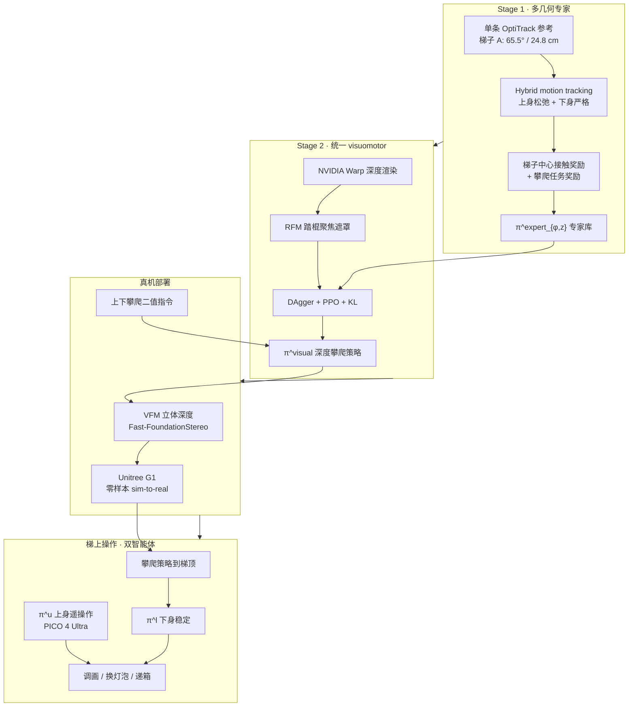

# LadderMan：人形感知梯子攀爬与梯上操作

**LadderMan**（*Learning Humanoid Perceptive Ladder Climbing*，Amazon FAR 等，arXiv:[2606.05873](https://arxiv.org/abs/2606.05873)，[项目页](https://ladderman-robot.github.io/)）提出 **统一 visuomotor 系统**：在 **稀疏窄踏棍** 上完成 **全身手–足多接触攀爬**，并进一步支持 **梯顶稳定遥操作**。攀爬策略经 **两阶段学习**——先用 **hybrid motion tracking** 从 **单条参考动作** 得到多梯子几何 **专家**，再以 **hybrid DAgger + RL** 蒸馏为 **深度统一策略**；真机部署用 **视觉基础模型（VFM）深度** 与 **rung-focused masking（RFM）** 实现 **零样本 sim-to-real**；梯上操作采用 **双智能体** 解耦下身稳定与上身跟踪。

## 一句话定义

**用一条梯子参考动作先「长出」多几何攀爬专家，再焊成只看深度、能双向爬多样梯子并在梯顶稳着干活的统一策略——稀疏踏棍上的感知全身协调，不靠改硬件。**

## 英文缩写速查

| 缩写 | 英文全称 | 简要说明 |
|------|----------|----------|
| LadderMan | Learning Humanoid Perceptive Ladder Climbing | 本文梯子攀爬 + 梯上操作系统 |
| VFM | Vision Foundation Model | 真机深度用 Fast-FoundationStereo 等预训练立体模型 |
| RFM | Rung-Focused Masking | 训练时遮非踏棍区，聚焦攀爬相关几何 |
| DAgger | Dataset Aggregation | 专家在策略诱导状态下纠偏的模仿蒸馏 |
| PPO | Proximal Policy Optimization | 专家与统一策略的 RL 优化算法 |
| RL | Reinforcement Learning | Stage 2 与专家训练中的策略优化 |
| Sim2Real | Simulation to Real | 深度 VFM + 轻量噪声实现零样本迁移 |
| WBC | Whole-Body Control | 手–足多接触全身协调控制 |
| G1 | Unitree G1 Humanoid | 宇树 1.3 m、29-DoF 实验平台 |

## 为什么重要

- 在 [运动小脑 64 篇技术地图](../overview/humanoid-motion-cerebellum-technology-map.md) 中归类为 **H 真实任务**（59/64）：任务：爬梯和梯上操作暴露手脚协同难题。
- **填补「梯子」空白：** 仓库内楼梯/跑酷文献多，但 **梯子稀疏踏棍 + 扶手** 对感知精度与全身协调要求更高；LadderMan 是 **端到端深度攀爬** 在 **人形真机** 上的系统案例。
- **单参考 → 多几何泛化：** **Hybrid motion tracking**（上身松弛、下身严格 + 梯子接触/攀爬奖励）避免为每种 $(\phi,z)$ 收集大动捕库——与 [RPL](./paper-rpl-robust-humanoid-perceptive-locomotion.md) 的 **分地形高程专家** 形成互补范式。
- **深度 sim-to-real 新配方：** 相对重度 depth randomization，**VFM 真机深度 + RFM + 极简噪声** 在 **细薄踏棍** 上更关键（真机消融：w/o VFM **3/10**，w/o RFM **0/10**）。
- **梯上 loco-manipulation：** **双智能体** 下身稳、上身跟 VR，相对 **TWIST2** 等现成全身遥操作在梯顶不易失稳——把「能爬上去」延伸到 **维护/搬运类任务**。

## 方法

| 模块 | 作用 |
|------|------|
| **Stage 1 专家** | 对每个目标梯子 $(\phi,z)$ 训 **状态专家** $\pi^{\text{expert}}_{\phi,z}$；**hybrid tracking** + **接触/攀爬奖励** + 梯子相对位姿观测 |
| **Stage 2 统一策略** | **DAgger + PPO + KL 到专家**；输入 **本体 + 深度 + 上下攀爬指令**；NVIDIA **Warp** 深度渲染 |
| **VFM 深度** | 真机 **Fast-FoundationStereo**；减轻原始 D435i 缺失像素与噪声 |
| **RFM** | 10% 概率遮非踏棍区，泛化不同扶手/支撑结构 |
| **梯上操作** | **双智能体** $\pi^l$ 稳定接触与骨盆，$\pi^u$ 跟踪 PICO 4 Ultra 上肢目标；训练上肢目标来自 **AMASS** |
| **部署** | G1 + **RealSense D435i** + **Jetson Orin**；**无硬件改装** |

### 流程总览

## 实验要点（归纳）

| 设置 | 要点 |
|------|------|
| 平台 | Unitree G1（1.3 m、29-DoF）；**IsaacSim** 训练 |
| 参考动作 | **仅 1 条** OptiTrack（梯子 A） |
| 仿真评估 | $\phi \in \{55°,60°,65°,70°\}$，$z \in \{20,\ldots,30\}$ cm；踏棍 24–28 cm、55–65° **>95%** 成功率 |
| 盲基线 | 无感知 BeyondMimic 式 tracking：近参考 **49%**，OOD **近零** |
| 真机梯子 | A/B/C 不同材料与几何；**双向攀爬 ~20 s** |
| 速度 | **~3.4 s/踏棍**（人类 ~3.2 s） |
| 真机消融（梯子 A, 10 次） | Ours **9/10**；w/o RL **2/10**；w/o VFM **3/10**；w/o RFM **0/10** |
| 代码 | 论文承诺开源；入库时 **无公开仓库** |

## 常见误区或局限

- **误区：「梯子 = 另一种楼梯」。** 踏棍 **细、稀、悬空**，高程图常难以精确表达；LadderMan 强调 **端到端深度** 与 **踏棍聚焦**，与 [FastStair](./paper-faststair-humanoid-stair-ascent.md) 的 **重复踢面 + DCM 监督上楼** 问题形态不同。
- **误区：「有 DAgger 就够」。** 动态接触-rich 任务中纯模仿误差会累积；论文真机 **w/o RL** 仅 **2/10**——**RL 恢复行为** 不可或缺。
- **误区：「深度 randomization 越多越好」。** 梯子场景用 **VFM + 轻量噪声** 替代重度 hand-tuned DR；RFM 针对 **结构化几何差距**（扶手/背景）。
- **局限：** 攀爬与操作 **分策略**；极端上肢遮挡仍可能影响深度；论文未强调 **负重攀爬**（对照 [RPL](./paper-rpl-robust-humanoid-perceptive-locomotion.md) 的 2 kg 载荷线）。

## 与其他工作对比

| 维度 | LadderMan | RPL | PHP | FastStair | PILOT |
|------|-----------|-----|-----|-----------|-------|
| 机构 | Amazon FAR | Amazon FAR | Amazon FAR | LimX 等 | 上海交大 |
| 任务 | **梯子攀爬 + 梯上操作** | 双向多地形 + 载荷 | 跑酷技能链 | 高速上楼梯 | loco-manipulation LLC |
| 感知 | **深度 + VFM** | 多视角深度 | 单深度 | 机载高程 | LiDAR 高程 |
| 专家来源 | **单参考 hybrid tracking** | 分地形高程专家 | MM 长程参考 | DCM 监督 | — |
| 蒸馏 | **DAgger + PPO + KL** | DAgger | DAgger + PPO | 分速专家 | 单阶段 MoE |
| 操作 | **梯上双智能体 VR** | 2 kg 载荷行走 | — | — | 全身 LLC |
| 平台 | **G1** | G1 | G1 | LimX Oli | G1 |

## 关联页面

- [楼梯与障碍 Locomotion 中心节点](../tasks/stair-obstacle-perceptive-locomotion.md) — 离散接触地形索引（含梯子）
- [Loco-Manipulation](../tasks/loco-manipulation.md) — 梯上操作与双智能体解耦
- [Humanoid Locomotion](../tasks/humanoid-locomotion.md) — 人形行走任务总览
- [Terrain Adaptation](../concepts/terrain-adaptation.md) — 深度感知闭环
- [Sim2Real](../concepts/sim2real.md) — VFM 深度迁移语境
- [Privileged Training](../concepts/privileged-training.md) — 专家 → 学生蒸馏范式
- [DAgger](../methods/dagger.md) — Stage 2 蒸馏算法
- [RPL](./paper-rpl-robust-humanoid-perceptive-locomotion.md) — 同系 Amazon FAR 多向深度行走
- [Unitree G1](./unitree-g1.md) — 实验平台

## 参考来源

- [LadderMan 论文摘录（arXiv:2606.05873）](../../sources/papers/ladderman_arxiv_2606_05873.md)
- [LadderMan 项目页归档](../../sources/sites/ladderman-robot-github-io.md)

## 推荐继续阅读

- 论文 HTML：<https://arxiv.org/html/2606.05873>
- 论文 PDF：<https://arxiv.org/pdf/2606.05873>
- 项目页（演示视频）：<https://ladderman-robot.github.io/>
- [RPL](./paper-rpl-robust-humanoid-perceptive-locomotion.md) — 同平台双向深度行走与载荷对照
- [PHP](./paper-hrl-stack-22-perceptive_humanoid_parkour.md) — 同系深度感知跑酷技能链
- [PILOT](./paper-pilot-perceptive-loco-manipulation.md) — 单阶段 LiDAR 感知全身 LLC 对照
