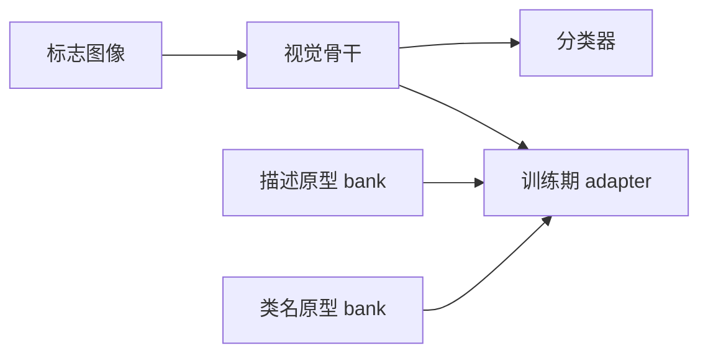

# LAMDA：把 VLM 语言原型蒸馏进车端标志识别

**LAMDA**（*Language-Anchored Model for Direction Alignment*；[arXiv:2608.08815](https://arxiv.org/abs/2608.08815)）由 **克莱姆森大学** 提出（IROS 2026）：交通标志识别在干净数据上很强，但阴影、自然光干扰和打印补丁等物理可实现攻击仍能打穿；已有防御常常只对一种攻击有效，还会伤干净精度。

## 一句话定义

**训练时用冻结文本原型把语言结构锚进视觉特征，推理丢掉 adapter——语言先验是训练约束，不是车端额外模块。**

## 英文缩写速查

| 缩写 | 英文全称 | 简要说明 |
|------|----------|----------|
| LAMDA | Language-Anchored Model for Direction Alignment | 本文训练框架 |
| TSR | Traffic Sign Recognition | 交通标志识别 |
| VLM | Vision-Language Model | 用来生成标志描述、不部署 |
| GTSRB | German Traffic Sign Recognition Benchmark | 43 类主榜 |
| RP2 | Robust Physical Perturbations | 打印补丁攻击 |

## 为什么重要

- 车端感知加防御头会占延迟；能把鲁棒性留在权重里更符合部署。
- 不吃对抗样本就能抬三种物理攻击，避免「为一种攻击过拟合」。
- 对机器人库的启发是：VLM 不必出现在推理图里，也能当教师。

## 核心信息

| 项 | 内容 |
|----|------|
| **机构** | 克莱姆森大学（Clemson） |
| **数据** | GTSRB（43 类）、LISA（16 类子集） |
| **开源** | **宣称开源、仓未上线**（`pedram-mohajer/LAMDA` 404） |

## 核心原理

### 方法栈

冻结 OpenCLIP 文本编码器，从 VLM 生成的标志描述和类别名建两个固定 prototype bank。视觉 backbone 经 adapter 对齐到这两个 bank：alignment 损失拉近样本与对应描述，prototype 损失整理类中心。推理删除 adapter 与 bank，只留标准分类器。\(\lambda=\mu=1\) 最稳；加到 2 会伤干净精度。

### 流程总览

## 源码运行时序图

**不适用。** 论文写 <https://github.com/pedram-mohajer/LAMDA>，截至 2026-08-17 GitHub API 返回 404；作者账号存在但无此仓。

## 工程实践

| 项 | 建议 |
|----|------|
| 源码运行时序图 | **不适用**（仓未上线） |
| 权重 | 先扫 \(\lambda,\mu\in\{0,1,2\}\)，默认 (1,1) |
| 负对照 | 用无关文本 bank 替换真实描述；文中阴影会掉 6.41 pp |
| 部署 | 确认导出图里没有 adapter |

## 实验与评测

四骨干（ResNet-18/34、Swin-T、ViT-B/16）× 三攻击。十种对照里 **唯一** 在全部组合上提升：

- GTSRB 阴影：ResNet-18 **+12.50 pp**（61.38% 起），ResNet-34 +9.28，ViT-B/16 +8.23，Swin-T +3.32。
- LISA 自然光：ResNet-34 **+13.20 pp**，Swin-T +11.30。
- 真机 RP2：37.5%→**75.0%**。
- 干净精度：八组里七组升或持平，仅 LISA ResNet-18 −0.23 pp。

两损失超加性：单用 prototype 或 alignment 远小于 (1,1)。

## 与其他工作对比

相对对抗训练：LAMDA 训练只吃干净数据。相对预处理防御（JPEG / bit-depth）：那些常伤阴影或干净精度。相对 [SG-WAM](./paper-sg-wam-semantic-guidance.md)：两边都用 VLM 当教师，但 LAMDA **推理完全丢掉语言通路**。相对 [DriveVLM](./paper-drivevlm.md)：DriveVLM 把 VLM 留在驾驶栈里，LAMDA 只蒸馏结构。

## 结论

**车端标志识别要抗物理攻击，优先把语言原型写成训练损失，而不是在推理时挂 VLM。**

1. **(1,1) 是默认甜点** — 再加大权重会伤干净精度。
2. **两损失互补** — 不要只留一个 bank。
3. **真描述才有用** — 无关文本 bank 会倒退。
4. **CNN 阴影增益更大** — 因为阴影基线更差。
5. **仓 404** — 目前不能按论文 URL 复现。

## 局限与风险

- 代码未上线，超参与数据预处理无法核对。
- 只覆盖 TSR，不自动迁移到一般检测。
- 物理攻击种类仍有限；新贴片样式需要再测。

## 关联页面

- [VLA](../methods/vla.md) — 语言在推理图里的对照
- [DriveVLM](./paper-drivevlm.md)
- [SG-WAM（语义引导）](./paper-sg-wam-semantic-guidance.md)

## 参考来源

- [LAMDA 论文摘录](../../sources/papers/lamda_tsr_arxiv_2608_08815.md)
- [具身智能小站 9 篇盘点（2026-08-17）](../../sources/blogs/wechat_embodied_station_9_papers_2026-08-17.md)
- [arXiv:2608.08815](https://arxiv.org/abs/2608.08815)

## 推荐继续阅读

- [arXiv HTML 全文](https://arxiv.org/html/2608.08815v1)
- 作者页：[MohajerAnsari et al. @ IROS 2026](https://mpese.com/publication/mohajeransari-2026-distilling/)
